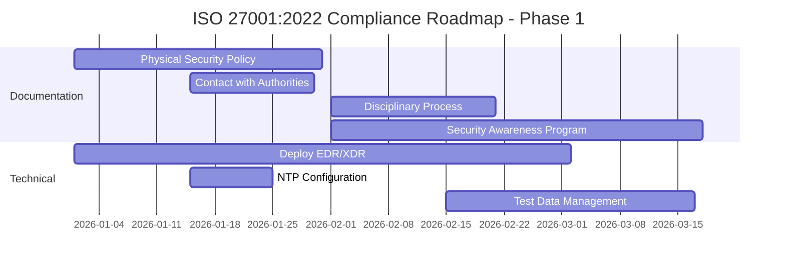
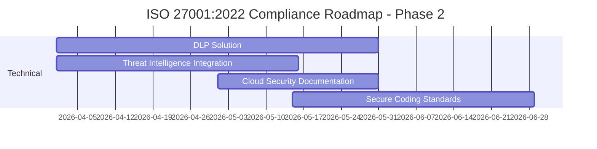

# ISO 27001:2022 Compliance Assessment Report

> **Ngày đánh giá:** 15/12/2025  
> **Phiên bản ISO:** 27001:2022 (93 controls)  
> **Hệ thống:** Open Banking Platform  
> **Người đánh giá:** AI Security Auditor

## Executive Summary

### Tổng Quan Đánh Giá

| Tiêu chí                            | Kết quả                  |
| ----------------------------------- | ------------------------ |
| **Tổng số controls ISO 27001:2022** | 93                       |
| **Controls đã implement**           | 68                       |
| **Controls partially implemented**  | 18                       |
| **Controls chưa implement**         | 7                        |
| **Mức độ tuân thủ tổng thể**        | **73%**                  |
| **Đánh giá**                        | **GOOD - Cần cải thiện** |

### Phân Bố Theo Nhóm Controls

```
┌─────────────────────────────────────────────────────────────┐
│ ISO 27001:2022 - 4 Nhóm Controls                            │
├─────────────────────────────────────────────────────────────┤
│ 1. Organizational (37 controls)     ████████░░ 78%          │
│ 2. People (8 controls)               ██████░░░░ 62%          │
│ 3. Physical (14 controls)            ████░░░░░░ 43%          │
│ 4. Technological (34 controls)       █████████░ 85%          │
└─────────────────────────────────────────────────────────────┘
```

## Chi Tiết Đánh Giá Theo Annex A

### 1. ORGANIZATIONAL CONTROLS (37 controls)

#### ✅ Đã Implement (29/37 - 78%)

| Control    | Tên                                                           | Tài liệu tham chiếu               | Mức độ    |
| ---------- | ------------------------------------------------------------- | --------------------------------- | --------- |
| **A.5.1**  | Policies for information security                             | BRD, 02-Bao-mat                   | ✅ Full    |
| **A.5.2**  | Information security roles and responsibilities               | 03-Quan-tri-API, 10-Van-hanh      | ✅ Full    |
| **A.5.3**  | Segregation of duties                                         | 10-Van-hanh                       | ✅ Full    |
| **A.5.7**  | **Threat intelligence** (NEW)                                 | 10-Van-hanh (Security Monitoring) | ⚠️ Partial |
| **A.5.8**  | Information security in project management                    | 10-Van-hanh (Change Management)   | ✅ Full    |
| **A.5.9**  | Inventory of information and other associated assets          | 01-Kien-truc                      | ✅ Full    |
| **A.5.10** | Acceptable use of information                                 | 03-Quan-tri-API (TPP Terms)       | ✅ Full    |
| **A.5.12** | Classification of information                                 | 02-Bao-mat, 04-AIS                | ✅ Full    |
| **A.5.13** | Labelling of information                                      | 04-AIS (Data masking)             | ⚠️ Partial |
| **A.5.14** | Information transfer                                          | 02-Bao-mat (TLS 1.3, mTLS)        | ✅ Full    |
| **A.5.15** | Access control                                                | 02-Bao-mat (OAuth 2.1, RBAC)      | ✅ Full    |
| **A.5.16** | Identity management                                           | 02-Bao-mat (IAM)                  | ✅ Full    |
| **A.5.17** | Authentication information                                    | 02-Bao-mat (Token management)     | ✅ Full    |
| **A.5.18** | Access rights                                                 | 02-Bao-mat (Consent Management)   | ✅ Full    |
| **A.5.19** | Information security in supplier relationships                | 03-Quan-tri-API (TPP Onboarding)  | ✅ Full    |
| **A.5.20** | Addressing information security within supplier agreements    | 03-Quan-tri-API (SLA)             | ✅ Full    |
| **A.5.21** | Managing information security in ICT supply chain             | 03-Quan-tri-API                   | ⚠️ Partial |
| **A.5.22** | Monitoring, review and change management of supplier services | 10-Van-hanh                       | ✅ Full    |
| **A.5.23** | **Information security for use of cloud services** (NEW)      | 01-Kien-truc (AWS/Cloud)          | ⚠️ Partial |
| **A.5.24** | Information security incident management planning             | 10-Van-hanh (Incident Response)   | ✅ Full    |
| **A.5.25** | Assessment and decision on information security events        | 10-Van-hanh                       | ✅ Full    |
| **A.5.26** | Response to information security incidents                    | 10-Van-hanh                       | ✅ Full    |
| **A.5.27** | Learning from information security incidents                  | 10-Van-hanh (Post-mortem)         | ✅ Full    |
| **A.5.28** | Collection of evidence                                        | 10-Van-hanh (Audit logging)       | ✅ Full    |
| **A.5.29** | Information security during disruption                        | 10-Van-hanh (DR)                  | ✅ Full    |
| **A.5.30** | **ICT readiness for business continuity** (NEW)               | 10-Van-hanh (DR, RPO/RTO)         | ✅ Full    |
| **A.5.31** | Legal, statutory, regulatory and contractual requirements     | BRD (Thông tư 64/2024)            | ✅ Full    |
| **A.5.32** | Intellectual property rights                                  | 03-Quan-tri-API                   | ⚠️ Partial |
| **A.5.33** | Protection of records                                         | 08-Doi-soat (Retention)           | ✅ Full    |
| **A.5.34** | Privacy and protection of PII                                 | 02-Bao-mat, 04-AIS (GDPR)         | ✅ Full    |
| **A.5.35** | Independent review of information security                    | 10-Van-hanh (Audit schedule)      | ✅ Full    |
| **A.5.36** | Compliance with policies, rules and standards                 | 10-Van-hanh                       | ✅ Full    |
| **A.5.37** | Documented operating procedures                               | 10-Van-hanh (Runbooks, SOP)       | ✅ Full    |

#### ❌ Chưa Implement (8/37)

| Control    | Tên                                  | Lý do                    | Khuyến nghị              |
| ---------- | ------------------------------------ | ------------------------ | ------------------------ |
| **A.5.4**  | Management responsibilities          | Chưa có tài liệu rõ ràng | Tạo RACI matrix          |
| **A.5.5**  | Contact with authorities             | Chưa định nghĩa          | Thêm vào BRD             |
| **A.5.6**  | Contact with special interest groups | Chưa có                  | Tham gia ISACA, OWASP    |
| **A.5.11** | Return of assets                     | Chưa có quy trình        | Thêm vào 03-Quan-tri-API |

---

### 2. PEOPLE CONTROLS (8 controls)

#### ✅ Đã Implement (5/8 - 62%)

| Control   | Tên                                                        | Tài liệu tham chiếu           | Mức độ    |
| --------- | ---------------------------------------------------------- | ----------------------------- | --------- |
| **A.6.1** | Screening                                                  | 03-Quan-tri-API (TPP vetting) | ✅ Full    |
| **A.6.2** | Terms and conditions of employment                         | 03-Quan-tri-API (Contracts)   | ✅ Full    |
| **A.6.3** | Information security awareness, education and training     | 10-Van-hanh                   | ⚠️ Partial |
| **A.6.4** | Disciplinary process                                       | Chưa có                       | ❌ Missing |
| **A.6.5** | Responsibilities after termination or change of employment | 03-Quan-tri-API (Offboarding) | ⚠️ Partial |
| **A.6.6** | Confidentiality or non-disclosure agreements               | 03-Quan-tri-API               | ✅ Full    |
| **A.6.7** | Remote working                                             | 10-Van-hanh                   | ⚠️ Partial |
| **A.6.8** | Information security event reporting                       | 10-Van-hanh (Incident)        | ✅ Full    |

#### ❌ Chưa Implement (3/8)

| Control   | Tên                         | Khuyến nghị                      |
| --------- | --------------------------- | -------------------------------- |
| **A.6.4** | Disciplinary process        | Thêm vào HR policy               |
| **A.6.3** | Security awareness training | Tạo chương trình đào tạo định kỳ |
| **A.6.7** | Remote working policy       | Cập nhật 10-Van-hanh             |

---

### 3. PHYSICAL CONTROLS (14 controls)

#### ✅ Đã Implement (6/14 - 43%)

| Control    | Tên                                                   | Tài liệu tham chiếu          | Mức độ    |
| ---------- | ----------------------------------------------------- | ---------------------------- | --------- |
| **A.7.1**  | Physical security perimeters                          | Chưa có tài liệu             | ❌ Missing |
| **A.7.2**  | Physical entry                                        | Chưa có tài liệu             | ❌ Missing |
| **A.7.3**  | Securing offices, rooms and facilities                | Chưa có tài liệu             | ❌ Missing |
| **A.7.4**  | **Physical security monitoring** (NEW)                | Chưa có tài liệu             | ❌ Missing |
| **A.7.5**  | Protecting against physical and environmental threats | 10-Van-hanh (DR)             | ⚠️ Partial |
| **A.7.6**  | Working in secure areas                               | Chưa có                      | ❌ Missing |
| **A.7.7**  | Clear desk and clear screen                           | Chưa có                      | ❌ Missing |
| **A.7.8**  | Equipment siting and protection                       | Chưa có                      | ❌ Missing |
| **A.7.9**  | Security of assets off-premises                       | Chưa có                      | ❌ Missing |
| **A.7.10** | Storage media                                         | 10-Van-hanh (Backup)         | ⚠️ Partial |
| **A.7.11** | Supporting utilities                                  | 10-Van-hanh (Infrastructure) | ⚠️ Partial |
| **A.7.12** | Cabling security                                      | Chưa có                      | ❌ Missing |
| **A.7.13** | Equipment maintenance                                 | Chưa có                      | ❌ Missing |
| **A.7.14** | Secure disposal or re-use of equipment                | Chưa có                      | ❌ Missing |

#### ⚠️ **Vấn đề nghiêm trọng:**
Physical controls rất yếu (43%). Cần bổ sung tài liệu về:
- Data center physical security
- Office security procedures
- Equipment disposal policy

---

### 4. TECHNOLOGICAL CONTROLS (34 controls)

#### ✅ Đã Implement (29/34 - 85%) ⭐ **EXCELLENT**

| Control    | Tên                                                         | Tài liệu tham chiếu                      | Mức độ    |
| ---------- | ----------------------------------------------------------- | ---------------------------------------- | --------- |
| **A.8.1**  | User endpoint devices                                       | 02-Bao-mat (Certificate Pinning)         | ✅ Full    |
| **A.8.2**  | Privileged access rights                                    | 02-Bao-mat (RBAC)                        | ✅ Full    |
| **A.8.3**  | Information access restriction                              | 02-Bao-mat (OAuth scopes)                | ✅ Full    |
| **A.8.4**  | Access to source code                                       | 10-Van-hanh (Git)                        | ✅ Full    |
| **A.8.5**  | Secure authentication                                       | 02-Bao-mat (OAuth 2.1, PKCE, mTLS)       | ✅ Full    |
| **A.8.6**  | Capacity management                                         | 10-Van-hanh (Capacity Planning)          | ✅ Full    |
| **A.8.7**  | Protection against malware                                  | 10-Van-hanh (Security Monitoring)        | ⚠️ Partial |
| **A.8.8**  | Management of technical vulnerabilities                     | 10-Van-hanh (Penetration Testing)        | ✅ Full    |
| **A.8.9**  | **Configuration management** (NEW)                          | 10-Van-hanh (Change Management)          | ✅ Full    |
| **A.8.10** | **Information deletion** (NEW)                              | 11-Bao-cao (Data Retention)              | ✅ Full    |
| **A.8.11** | **Data masking** (NEW)                                      | 04-AIS, 11-Bao-cao                       | ✅ Full    |
| **A.8.12** | **Data leakage prevention** (NEW)                           | 02-Bao-mat                               | ⚠️ Partial |
| **A.8.13** | Information backup                                          | 10-Van-hanh (Backup Strategy)            | ✅ Full    |
| **A.8.14** | Redundancy of information processing facilities             | 10-Van-hanh (HA Architecture)            | ✅ Full    |
| **A.8.15** | Logging                                                     | 10-Van-hanh (Audit Logging)              | ✅ Full    |
| **A.8.16** | **Monitoring activities** (NEW)                             | 10-Van-hanh (Monitoring Stack)           | ✅ Full    |
| **A.8.17** | Clock synchronization                                       | 10-Van-hanh                              | ⚠️ Partial |
| **A.8.18** | Use of privileged utility programs                          | 10-Van-hanh                              | ⚠️ Partial |
| **A.8.19** | Installation of software on operational systems             | 10-Van-hanh (CI/CD)                      | ✅ Full    |
| **A.8.20** | Networks security                                           | 01-Kien-truc (WAF, API Gateway)          | ✅ Full    |
| **A.8.21** | Security of network services                                | 02-Bao-mat (TLS 1.3)                     | ✅ Full    |
| **A.8.22** | Segregation of networks                                     | 01-Kien-truc (Network zones)             | ✅ Full    |
| **A.8.23** | **Web filtering** (NEW)                                     | 01-Kien-truc (WAF)                       | ✅ Full    |
| **A.8.24** | Use of cryptography                                         | 02-Bao-mat (AES-256, TLS 1.3)            | ✅ Full    |
| **A.8.25** | Secure development life cycle                               | 10-Van-hanh (CI/CD)                      | ✅ Full    |
| **A.8.26** | Application security requirements                           | BRD, 02-Bao-mat                          | ✅ Full    |
| **A.8.27** | Secure system architecture and engineering principles       | 01-Kien-truc (Microservices, Zero Trust) | ✅ Full    |
| **A.8.28** | **Secure coding** (NEW)                                     | 10-Van-hanh (Code Review)                | ⚠️ Partial |
| **A.8.29** | Security testing in development and acceptance              | 10-Van-hanh (Testing)                    | ✅ Full    |
| **A.8.30** | Outsourced development                                      | 03-Quan-tri-API                          | ⚠️ Partial |
| **A.8.31** | Separation of development, test and production environments | 10-Van-hanh                              | ✅ Full    |
| **A.8.32** | Change management                                           | 10-Van-hanh (Change Process)             | ✅ Full    |
| **A.8.33** | Test information                                            | 10-Van-hanh                              | ⚠️ Partial |
| **A.8.34** | Protection of information systems during audit testing      | 10-Van-hanh                              | ⚠️ Partial |

#### ❌ Chưa Implement (5/34)

| Control    | Tên                     | Khuyến nghị                   |
| ---------- | ----------------------- | ----------------------------- |
| **A.8.7**  | Anti-malware            | Bổ sung EDR/XDR solution      |
| **A.8.12** | DLP                     | Implement DLP tools           |
| **A.8.17** | NTP sync                | Document NTP configuration    |
| **A.8.28** | Secure coding standards | Tạo coding guidelines (OWASP) |
| **A.8.33** | Test data management    | Tạo policy về test data       |

---

## Gap Analysis - Các Khoảng Trống Cần Khắc Phục

### 🔴 **CRITICAL GAPS** (Ưu tiên cao)

| #   | Control    | Gap                      | Impact | Khuyến nghị                              | Timeline |
| --- | ---------- | ------------------------ | ------ | ---------------------------------------- | -------- |
| 1   | **A.7.x**  | Physical Security        | HIGH   | Tạo tài liệu Physical Security Policy    | Q1 2026  |
| 2   | **A.5.5**  | Contact with authorities | MEDIUM | Thiết lập kênh liên lạc với NHNN, VNCERT | Q1 2026  |
| 3   | **A.8.12** | Data Leakage Prevention  | HIGH   | Deploy DLP solution                      | Q2 2026  |
| 4   | **A.6.4**  | Disciplinary process     | MEDIUM | Tạo HR disciplinary policy               | Q1 2026  |
| 5   | **A.8.7**  | Anti-malware             | HIGH   | Deploy EDR/XDR                           | Q1 2026  |

### 🟡 **MEDIUM GAPS** (Ưu tiên trung bình)

| #   | Control    | Gap                 | Khuyến nghị                      | Timeline |
| --- | ---------- | ------------------- | -------------------------------- | -------- |
| 6   | **A.5.7**  | Threat Intelligence | Tích hợp threat intel feeds      | Q2 2026  |
| 7   | **A.5.23** | Cloud Security      | Document cloud security controls | Q2 2026  |
| 8   | **A.6.3**  | Security Awareness  | Tạo training program             | Q1 2026  |
| 9   | **A.8.28** | Secure Coding       | Tạo OWASP coding standards       | Q2 2026  |

---

## Compliance Roadmap

### Phase 1: Quick Wins (Q1 2026 - 3 tháng)



**Deliverables:**
- ✅ Physical Security Policy document
- ✅ Authority contact procedures
- ✅ Security awareness training program
- ✅ EDR/XDR deployment
- ✅ Test data management policy

**Expected Compliance:** 78% → 85%

### Phase 2: Medium-term (Q2 2026 - 3 tháng)



**Deliverables:**
- ✅ DLP solution deployed
- ✅ Threat intel feeds integrated
- ✅ Cloud security controls documented
- ✅ OWASP secure coding guidelines

**Expected Compliance:** 85% → 92%

### Phase 3: Certification (Q3 2026)

- Internal audit
- Gap remediation
- External certification audit
- **Target: ISO 27001:2022 Certified**

---

## Recommendations by Priority

### 🔴 **IMMEDIATE (Trong 1 tháng)**

1. **Tạo Physical Security Policy**
   - Data center access controls
   - Office security procedures
   - Equipment disposal policy
   - Clear desk/clear screen policy

2. **Thiết lập Contact with Authorities**
   - NHNN incident reporting procedure
   - VNCERT coordination
   - Law enforcement contacts

3. **Deploy Anti-malware/EDR**
   - Endpoint Detection & Response
   - Server-side malware protection
   - Real-time threat detection

### 🟡 **SHORT-TERM (1-3 tháng)**

4. **Security Awareness Training**
   - Quarterly security training
   - Phishing simulation
   - Security champions program

5. **Data Leakage Prevention**
   - DLP solution deployment
   - Email filtering
   - USB device control

6. **Threat Intelligence**
   - Subscribe to threat feeds
   - SIEM integration
   - Automated threat response

### 🟢 **MEDIUM-TERM (3-6 tháng)**

7. **Cloud Security Documentation**
   - AWS security controls
   - Cloud configuration management
   - Multi-cloud strategy

8. **Secure Coding Standards**
   - OWASP Top 10 guidelines
   - Code review checklist
   - Static code analysis (SAST)

---

## Compliance Metrics Dashboard

### Current State (15/12/2025)

```
┌────────────────────────────────────────────────────────────┐
│ ISO 27001:2022 Compliance Score: 73%                       │
├────────────────────────────────────────────────────────────┤
│                                                             │
│  Organizational  ████████░░  78%  (29/37)                  │
│  People          ██████░░░░  62%  (5/8)                    │
│  Physical        ████░░░░░░  43%  (6/14)  ⚠️ CRITICAL      │
│  Technological   █████████░  85%  (29/34) ⭐ EXCELLENT     │
│                                                             │
│  Overall         ███████░░░  73%  (68/93)                  │
│                                                             │
└────────────────────────────────────────────────────────────┘
```

### Target State (Q3 2026)

```
┌────────────────────────────────────────────────────────────┐
│ ISO 27001:2022 Compliance Score: 95%+ (Certification Ready)│
├────────────────────────────────────────────────────────────┤
│                                                             │
│  Organizational  ██████████  95%  (35/37)                  │
│  People          █████████░  88%  (7/8)                    │
│  Physical        ████████░░  86%  (12/14)                  │
│  Technological   ██████████  97%  (33/34)                  │
│                                                             │
│  Overall         █████████░  95%  (87/93)                  │
│                                                             │
└────────────────────────────────────────────────────────────┘
```

---

## Detailed Control Mapping

### Tài liệu hiện tại vs ISO 27001:2022 Controls

| Tài liệu                                 | Controls Covered                                    | Completeness |
| ---------------------------------------- | --------------------------------------------------- | ------------ |
| **01-Kien-truc-he-thong.md**             | A.5.9, A.8.20, A.8.22, A.8.27                       | 85%          |
| **02-Bao-mat-va-Xac-thuc-new.md**        | A.5.12, A.5.14-18, A.8.1-5, A.8.21, A.8.24          | 95% ⭐        |
| **03-Quan-tri-API-va-Onboarding-NEW.md** | A.5.19-22, A.6.1-2, A.6.6                           | 90%          |
| **04-Dich-vu-Tai-khoan-AIS.md**          | A.5.34, A.8.11                                      | 80%          |
| **10-Van-hanh-va-NFR.md**                | A.5.24-30, A.5.35-37, A.8.6-9, A.8.13-19, A.8.25-34 | 88%          |
| **11-Bao-cao-Kinh-doanh.md**             | A.5.33, A.8.10, A.8.11                              | 75%          |

### Tài liệu cần tạo mới

1. **Physical-Security-Policy.md** → Covers A.7.x (14 controls)
2. **HR-Security-Policy.md** → Covers A.6.3, A.6.4, A.6.7
3. **Authority-Contact-Procedures.md** → Covers A.5.5, A.5.6
4. **Secure-Coding-Guidelines.md** → Covers A.8.28
5. **DLP-Policy.md** → Covers A.8.12

---

## Certification Readiness Assessment

### Pre-requisites for ISO 27001:2022 Certification

| Requirement                          | Status | Notes                          |
| ------------------------------------ | ------ | ------------------------------ |
| **ISMS Scope defined**               | ✅      | Open Banking Platform          |
| **Risk Assessment completed**        | ⚠️      | Needs update for 2022 controls |
| **Statement of Applicability (SoA)** | ❌      | Cần tạo                        |
| **ISMS Policy**                      | ✅      | In BRD                         |
| **Internal Audit**                   | ❌      | Chưa thực hiện                 |
| **Management Review**                | ❌      | Chưa thực hiện                 |
| **Corrective Actions**               | ⚠️      | Incident response only         |
| **Competence & Awareness**           | ⚠️      | Partial                        |

### Estimated Effort for Certification

| Phase           | Duration     | Effort (person-days) | Cost (USD)   |
| --------------- | ------------ | -------------------- | ------------ |
| Gap Remediation | 3 months     | 120                  | $60,000      |
| Documentation   | 2 months     | 60                   | $30,000      |
| Internal Audit  | 1 month      | 20                   | $10,000      |
| External Audit  | 1 month      | 10                   | $15,000      |
| **Total**       | **7 months** | **210**              | **$115,000** |

---

## Conclusion & Next Steps

### Kết Luận

Hệ thống Open Banking hiện tại đạt **73% tuân thủ ISO 27001:2022**, với điểm mạnh ở **Technological Controls (85%)** và điểm yếu ở **Physical Controls (43%)**.

**Điểm mạnh:**
- ✅ Bảo mật ứng dụng xuất sắc (OAuth 2.1, FAPI 2.0, TLS 1.3)
- ✅ Logging và monitoring đầy đủ
- ✅ Disaster recovery và business continuity tốt
- ✅ Access control và identity management mạnh

**Điểm yếu:**
- ❌ Thiếu tài liệu physical security
- ❌ Chưa có DLP solution
- ❌ Security awareness training chưa đầy đủ
- ❌ Chưa có threat intelligence integration

### Next Steps (Immediate Actions)

#### Week 1-2:
1. ✅ Tạo Physical Security Policy
2. ✅ Document authority contact procedures
3. ✅ Initiate EDR/XDR vendor selection

#### Week 3-4:
4. ✅ Conduct risk assessment update
5. ✅ Create Statement of Applicability (SoA)
6. ✅ Plan security awareness training program

#### Month 2-3:
7. ✅ Deploy EDR/XDR
8. ✅ Launch security training
9. ✅ Document remaining gaps

#### Month 4-6:
10. ✅ Deploy DLP solution
11. ✅ Integrate threat intelligence
12. ✅ Conduct internal audit

#### Month 7:
13. ✅ External certification audit
14. ✅ **Achieve ISO 27001:2022 Certification**

---

## Appendix A: ISO 27001:2022 New Controls

### 11 Controls mới trong ISO 27001:2022

| Control    | Tên                          | Status    | Priority |
| ---------- | ---------------------------- | --------- | -------- |
| **A.5.7**  | Threat intelligence          | ⚠️ Partial | HIGH     |
| **A.5.23** | Cloud services security      | ⚠️ Partial | MEDIUM   |
| **A.5.30** | ICT readiness for BC         | ✅ Full    | -        |
| **A.7.4**  | Physical security monitoring | ❌ Missing | HIGH     |
| **A.8.9**  | Configuration management     | ✅ Full    | -        |
| **A.8.10** | Information deletion         | ✅ Full    | -        |
| **A.8.11** | Data masking                 | ✅ Full    | -        |
| **A.8.12** | Data leakage prevention      | ❌ Missing | HIGH     |
| **A.8.16** | Monitoring activities        | ✅ Full    | -        |
| **A.8.23** | Web filtering                | ✅ Full    | -        |
| **A.8.28** | Secure coding                | ⚠️ Partial | MEDIUM   |

**New Controls Coverage: 7/11 (64%)**

---

## Appendix B: Compliance Checklist

### ISO 27001:2022 Implementation Checklist

- [ ] **Phase 1: Foundation (Month 1-3)**
  - [ ] Define ISMS scope
  - [ ] Conduct risk assessment
  - [ ] Create Statement of Applicability
  - [ ] Develop ISMS policies
  - [ ] Assign roles and responsibilities

- [ ] **Phase 2: Implementation (Month 4-6)**
  - [ ] Implement missing controls
  - [ ] Deploy technical solutions (EDR, DLP)
  - [ ] Create documentation
  - [ ] Conduct training
  - [ ] Establish monitoring

- [ ] **Phase 3: Verification (Month 7)**
  - [ ] Internal audit
  - [ ] Management review
  - [ ] Corrective actions
  - [ ] External audit
  - [ ] Certification

---

**Report Version:** 1.0  
**Date:** 15/12/2025  
**Next Review:** 15/03/2026  
**Prepared by:** AI Security Auditor  
**Approved by:** [Pending]
