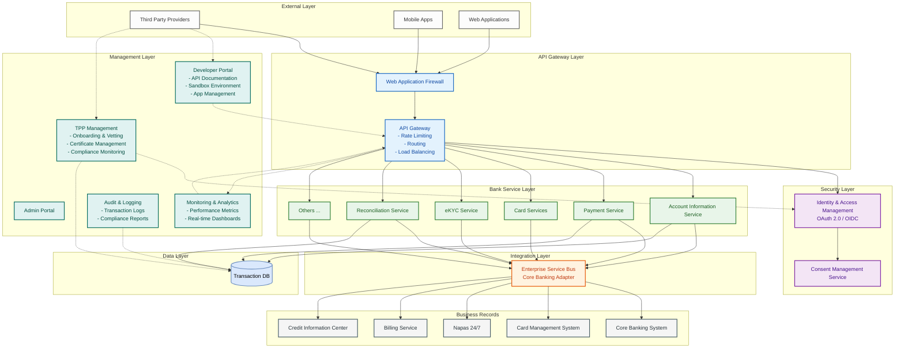
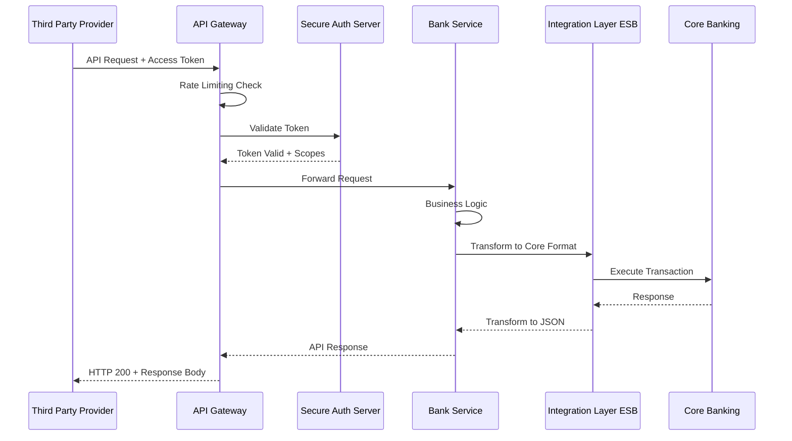

# Kiến Trúc Hệ Thống Open Banking

## Tổng Quan

Hệ thống Open Banking được thiết kế theo mô hình **Microservices** với API Gateway làm điểm truy cập duy nhất (Single Entry Point) cho tất cả các Third Party Providers (TPP).

## Sơ Đồ Kiến Trúc Tổng Thể

## Các Thành Phần Chính

### 1. API Gateway Layer
- **Chức năng**: 
  - Điểm truy cập duy nhất cho tất cả API requests
  - Rate limiting và quota management
  - Request/Response transformation
  - Load balancing và routing
- **Công nghệ**: Kong, AWS API Gateway, hoặc Apigee

### 2. Security Layer
- **IAM Server**: Quản lý OAuth 2.0/OIDC flows
- **Consent Management**: Lưu trữ và quản lý sự đồng ý của khách hàng

### 3. Service Layer
- **AIS**: Dịch vụ thông tin tài khoản
- **PIS**: Dịch vụ khởi tạo thanh toán
- **Card Services**: Quản lý thẻ và tokenization
- **eKYC**: Định danh điện tử
- **Reconciliation**: Đối soát và tra soát

### 4. Integration Layer
- **ESB**: Chuyển đổi message format (JSON ↔ ISO 8583/SOAP)

### 5. Data Layer
- **Transaction DB**: PostgreSQL/Oracle cho dữ liệu giao dịch và audit logs

### 6. Management Layer
- **Developer Portal**:
  - Cung cấp tài liệu API (API Documentation) và SDKs
  - Môi trường Sandbox để TPP thử nghiệm tích hợp
  - Quản lý ứng dụng (Application Management) và cung cấp Client ID/Secret
  - Support ticket system cho developer
- **TPP Management**:
  - Quy trình đăng ký và phê duyệt (Onboarding & Vetting) đối tác TPP
  - Quản lý vòng đời và trạng thái hoạt động của TPP
  - Quản lý chứng chỉ số (Digital Certificates) và xác thực eIDAS (nếu có)
  - Giám sát tuân thủ (Compliance Monitoring) và báo cáo định kỳ
  - Dispute management và xử lý khiếu nại
- **Monitoring & Analytics**:
  - Giám sát hiệu năng hệ thống real-time (API latency, throughput, error rates)
  - Dashboard phân tích xu hướng sử dụng API
  - Alert và notification khi có sự cố
  - Capacity planning và resource optimization
- **Audit & Logging**:
  - Ghi nhận toàn bộ API calls và transactions
  - Compliance audit trails theo yêu cầu NHNN
  - Forensic analysis và investigation support
  - Retention policy management cho log data

## Sơ Đồ Luồng Dữ Liệu

## Tài Liệu Tham Khảo
- Thông tư 64/2024/TT-NHNN
- ISO 20022 Message Standards
