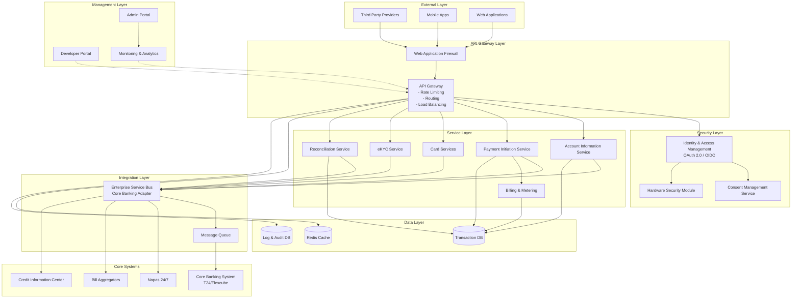
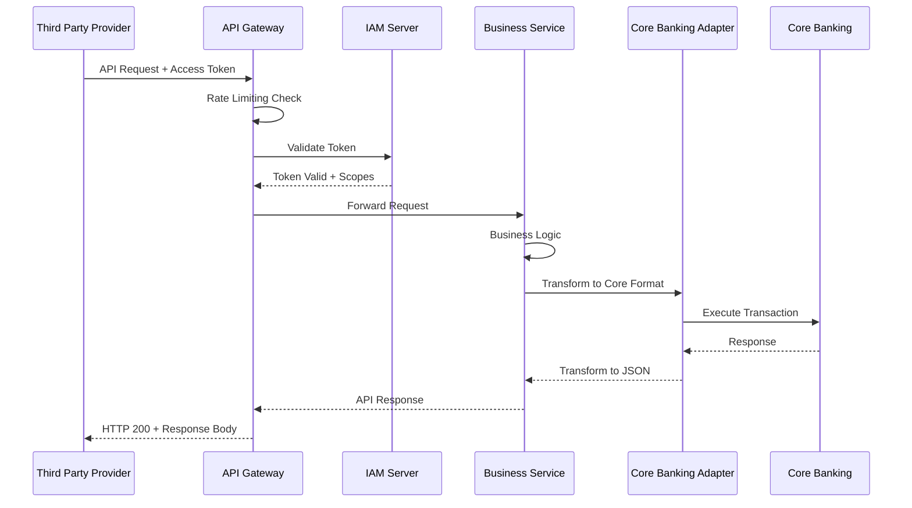

# Kiến Trúc Hệ Thống Open Banking

## Tổng Quan

Hệ thống Open Banking được thiết kế theo mô hình **Microservices** với API Gateway làm điểm truy cập duy nhất (Single Entry Point) cho tất cả các Third Party Providers (TPP).

## Sơ Đồ Kiến Trúc Tổng Thể

## Các Thành Phần Chính

### 1. API Gateway Layer
- **Chức năng**: 
  - Điểm truy cập duy nhất cho tất cả API requests
  - Rate limiting và quota management
  - Request/Response transformation
  - Load balancing và routing
- **Công nghệ**: Kong, AWS API Gateway, hoặc Apigee

### 2. Security Layer
- **IAM Server**: Quản lý OAuth 2.0/OIDC flows
- **Consent Management**: Lưu trữ và quản lý sự đồng ý của khách hàng
- **HSM**: Bảo vệ các private keys và sensitive data

### 3. Service Layer
- **AIS**: Dịch vụ thông tin tài khoản
- **PIS**: Dịch vụ khởi tạo thanh toán
- **Card Services**: Quản lý thẻ và tokenization
- **eKYC**: Định danh điện tử
- **Reconciliation**: Đối soát và tra soát

### 4. Integration Layer
- **ESB**: Chuyển đổi message format (JSON ↔ ISO 8583/SOAP)
- **Message Queue**: Đảm bảo reliable messaging

### 5. Data Layer
- **Transaction DB**: PostgreSQL/Oracle cho dữ liệu giao dịch
- **Cache**: Redis cho performance optimization
- **Log DB**: Elasticsearch cho audit logs

## Sơ Đồ Luồng Dữ Liệu

## Yêu Cầu Kỹ Thuật

### Scalability
- Auto-scaling dựa trên CPU/Memory metrics
- Horizontal scaling cho tất cả microservices
- Database sharding cho high-volume data

### High Availability
- Multi-AZ deployment
- Active-Active configuration cho critical services
- Disaster Recovery site với RPO < 15 phút, RTO < 1 giờ

### Performance
- API Response Time: < 200ms (query), < 1s (transaction)
- Throughput: > 1,000 TPS
- Cache hit ratio: > 80%

### Security
- TLS 1.3 cho tất cả connections
- mTLS cho service-to-service communication
- Zero-trust network architecture

## Tài Liệu Tham Khảo
- Thông tư 64/2024/TT-NHNN
- Open Banking UK Architecture Guidelines
- ISO 20022 Message Standards
