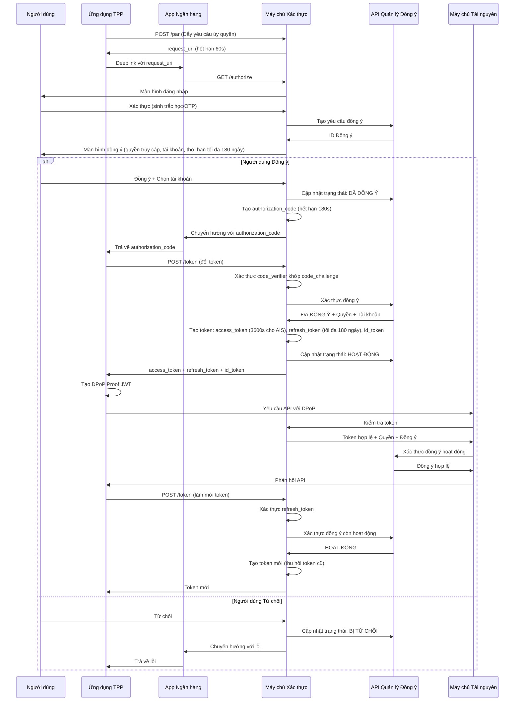
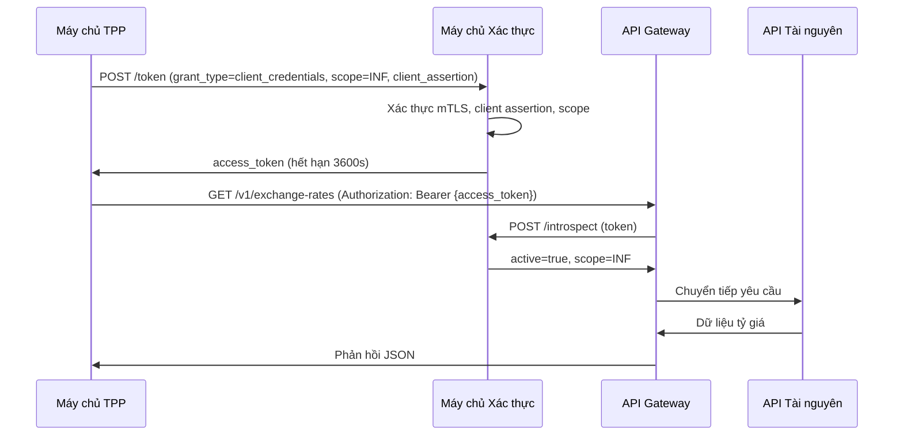
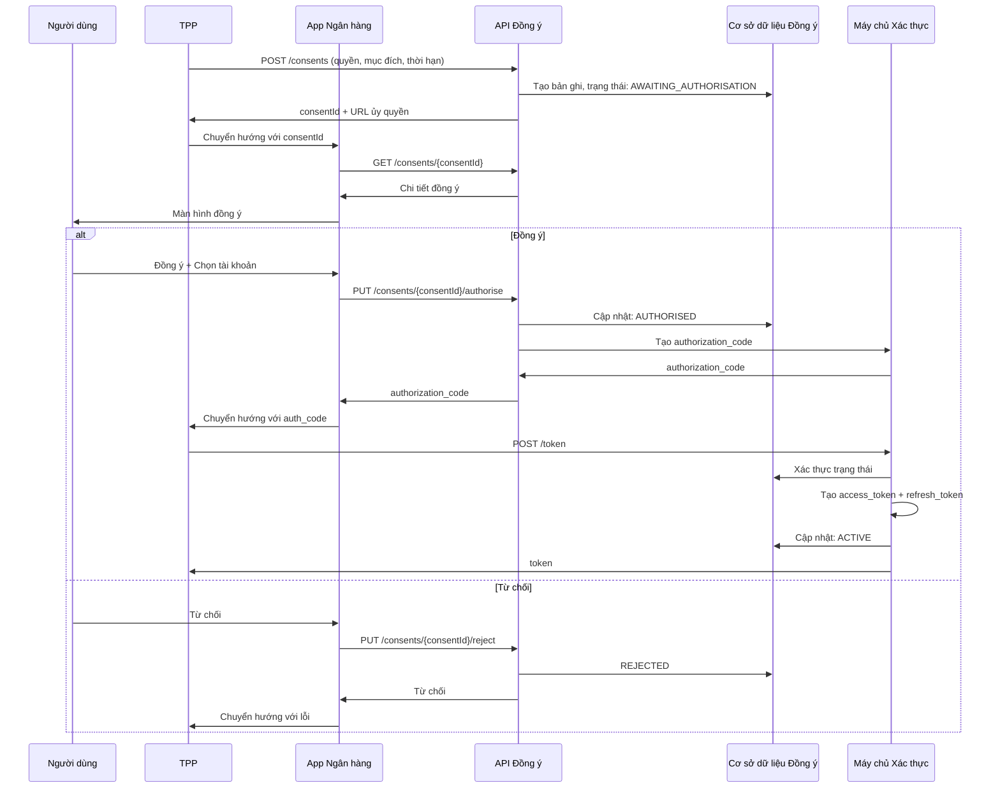
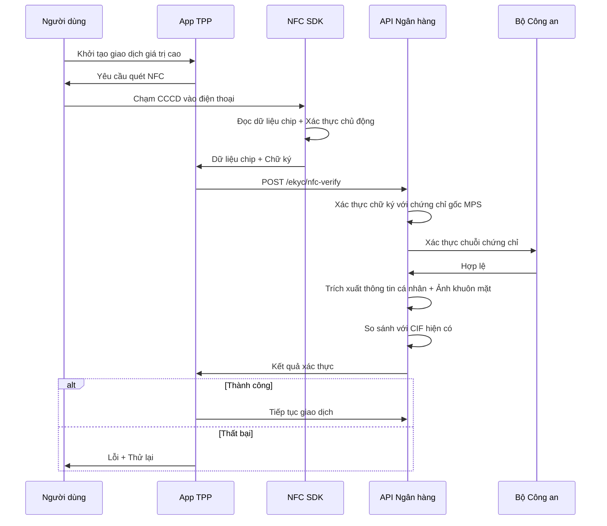

# Bảo Mật & Xác Thực

## Tổng Quan

Tài liệu này mô tả cơ chế bảo mật và xác thực trong hệ thống Open Banking, tuân thủ Thông tư 64/2024/TT-NHNN và các tiêu chuẩn quốc tế.

### Khung Pháp Lý & Tiêu Chuẩn

**Quy định Việt Nam:**
- Thông tư 64/2024/TT-NHNN: Quy định Open API, bảo mật và quản lý consent.
- Circular 45/2025/TT-NHNN: Xác thực sinh trắc học bắt buộc.
- Circular 50/2024/TT-NHNN: Strong Customer Authentication (SCA) và Multi-Factor Authentication (MFA).
- Nghị định 13/2023/NĐ-CP: Bảo vệ dữ liệu cá nhân.

**Tiêu chuẩn quốc tế:**
- OAuth 2.1: Cải tiến OAuth 2.0 với PKCE bắt buộc.
- FAPI 2.0: Bảo mật cấp tài chính.
- OpenID Connect (OIDC): Xác thực danh tính.
- ISO/IEC 27001:2022: Quản lý bảo mật thông tin.
- PCI DSS 4.0: Bảo mật dữ liệu thẻ.

### Mục Tiêu Bảo Mật

1. Tuân thủ pháp luật đầy đủ.
2. Bảo vệ dữ liệu khách hàng (tính bảo mật, toàn vẹn, khả dụng).
3. Ngăn chối bỏ giao dịch bằng chữ ký số JWS.
4. Áp dụng kiến trúc Zero Trust.
5. Đảm bảo khả năng phục hồi trước tấn công.

## OAuth 2.1 Authorization Code Flow với PKCE & FAPI 2.0

### Tổng Quan

Hệ thống sử dụng OAuth 2.1 kết hợp FAPI 2.0 để bảo mật cấp tài chính. Các cải tiến chính:
- PKCE bắt buộc.
- Loại bỏ Implicit Grant và Password Grant.
- Refresh Token Rotation bắt buộc.
- Ưu tiên xác thực bất đối xứng (JWT, mTLS).

### Luồng Xác Thực với PAR (Pushed Authorization Request)



### Quản Lý Token theo Thông tư 64/2024

| Loại Token             | Thời Hạn            | Sử Dụng                     | Áp Dụng                       |
| ---------------------- | ------------------- | --------------------------- | ----------------------------- |
| Authorization Code     | 180 giây            | Một lần                     | Tất cả flows                  |
| Access Token (INF)     | 3600 giây (1 giờ)   | Nhiều lần                   | Client Credentials Grant      |
| Access Token (AIS)     | 3600 giây (1 giờ)   | Nhiều lần                   | Authorization Code Grant      |
| Access Token (PIS)     | 300 giây (5 phút)   | Một lần                     | Authorization Code Grant      |
| Refresh Token          | Tối đa 180 ngày     | Nhiều lần (với rotation)    | Chỉ AIS                       |
| ConsentId (PIS)        | 300 giây            | Một lần                     | Payment flows                 |
| request_uri (PAR)      | 60 giây             | Một lần                     | PAR flow                      |

**Lưu ý:** Refresh Token không áp dụng cho PIS. Thời hạn đồng ý tối đa 180 ngày.

## Transport Layer Security (TLS)

### TLS 1.3 - Bắt Buộc

Theo Phụ lục 02, bắt buộc sử dụng TLS 1.2 trở lên, khuyến nghị TLS 1.3.

**Lợi ích TLS 1.3:**
- Handshake nhanh hơn.
- Forward Secrecy mặc định.
- Loại bỏ cipher suites yếu.
- Handshake được mã hóa.

### Cipher Suites Được Phép

**TLS 1.3 (Khuyến nghị):**
- TLS_AES_256_GCM_SHA384
- TLS_AES_128_GCM_SHA256
- TLS_CHACHA20_POLY1305_SHA256

**TLS 1.2 (Dự phòng):**
- TLS_ECDHE_RSA_WITH_AES_256_GCM_SHA384
- TLS_ECDHE_RSA_WITH_AES_128_GCM_SHA256

**Cấm:** Cipher suites sử dụng RC4, 3DES, MD5, SHA-1, hoặc không có Forward Secrecy.

### Mutual TLS (mTLS) - Khuyến Nghị

Áp dụng cho Client Credentials Flow và giao tiếp nội bộ.

### Quản Lý Chứng Chỉ

**Yêu cầu:**
- Thuật toán: RSA 2048-bit tối thiểu.
- Chữ ký: SHA-256 tối thiểu.
- Thời hạn: Tối đa 398 ngày.
- Key Usage: Digital Signature, Key Encipherment.

**Vòng đời chứng chỉ:**
- Tạo CSR → Nộp → Xác thực → Phát hành → Hoạt động → Gia hạn (30 ngày trước hết hạn) → Thu hồi nếu cần.

**Certificate Pinning cho Mobile Apps:** Khuyến nghị để ngăn chặn tấn công man-in-the-middle.

### HSTS (HTTP Strict Transport Security)

Bắt buộc cho tất cả endpoints:
```
Strict-Transport-Security: max-age=31536000; includeSubDomains; preload
```

## Client Credentials Flow (Server-to-Server)

Áp dụng cho truy vấn thông tin công khai (INF APIs), health check, batch processing.

**Yêu cầu bảo mật:**
- mTLS bắt buộc.
- Client Assertion JWT khuyến nghị.
- IP Whitelisting bắt buộc cho Production.
- Rate Limiting: 100 req/min per client.



## JWS (JSON Web Signature) cho Non-Repudiation

Sử dụng JWS để ký yêu cầu, ngăn chối bỏ.

**Cấu trúc:**
- Header: alg=RS256, kid, typ=JOSE, jti, iat
- Payload: Dữ liệu giao dịch
- Signature: Ký bằng private key TPP

## Consent Management - Quản Lý Sự Đồng Ý

Consent bảo vệ quyền riêng tư, yêu cầu đồng ý rõ ràng từ người dùng.

### Quy Trình Tạo Consent



### Trạng Thái Consent

- AWAITING_AUTHORISATION → AUTHORISED → ACTIVE → EXPIRED/REVOKED

### API Endpoints Chính

- POST /v1/consents: Tạo consent
- GET /v1/consents/{consentId}: Lấy chi tiết
- DELETE /v1/consents/{consentId}: Thu hồi

### Bảo Mật Consent

- Mã hóa dữ liệu nhạy cảm.
- Lưu hash token, không lưu token gốc.
- Audit trail đầy đủ.

## Các Cấp Độ Xác Thực theo QĐ 2345

- Level 1: Username + Password
- Level 2: Password + SMS OTP
- Level 3: Sinh trắc học (Fingerprint/Face ID)
- Level 4: Sinh trắc học nâng cao (NFC CCCD + Face Matching)

**Áp dụng:**
- Truy vấn thông tin: Level 2
- Chuyển tiền < 10 triệu: Level 3
- Chuyển tiền ≥ 10 triệu: Level 4

## NFC CCCD Verification Flow

Sử dụng chip NFC trên CCCD để xác thực danh tính cho giao dịch giá trị cao.



## Token Management

### Vòng Đời Access Token

Phát hành → Hoạt động (15 phút) → Hết hạn hoặc Thu hồi

### Token Scopes

- accounts.read: Đọc tài khoản (180 ngày)
- accounts.balance.read: Đọc số dư (180 ngày)
- transactions.read: Đọc giao dịch (180 ngày)
- payments.write: Khởi tạo thanh toán (1 lần)
- cards.read: Đọc thẻ (180 ngày)
- cards.write: Quản lý thẻ (90 ngày)

## Security Best Practices

### Transport Security
- TLS 1.3 bắt buộc.
- Certificate Pinning cho mobile.
- HSTS enabled.

### API Security
- Rate Limiting: 100 req/min.
- IP Whitelisting.
- Request Signing (JWS) cho mutation.

### Data Protection
- Mã hóa dữ liệu nghỉ: AES-256.
- Mã hóa truyền tải: TLS 1.3.
- Che PII trong logs.
- Lưu trữ dữ liệu: Logs giao dịch 5 năm, access logs 3 tháng online + 1 năm offline.

### Incident Response
- Giám sát thời gian thực.
- Cảnh báo tự động.
- Thông báo vi phạm trong 72 giờ.

## Compliance Checklist

- [ ] OAuth 2.0 + PKCE
- [ ] FAPI Security Profile
- [ ] JWS signing
- [ ] Consent management
- [ ] NFC CCCD verification
- [ ] Token expiry (180 ngày max)
- [ ] Audit logging
- [ ] mTLS
- [ ] Penetration testing hàng quý

## Tài Liệu Tham Khảo
- RFC 6749: OAuth 2.0
- RFC 7636: PKCE
- RFC 7515: JWS
- FAPI Security Profile 1.0
- QĐ 2345/QĐ-NHNN
- TT 64/2024/TT-NHNN