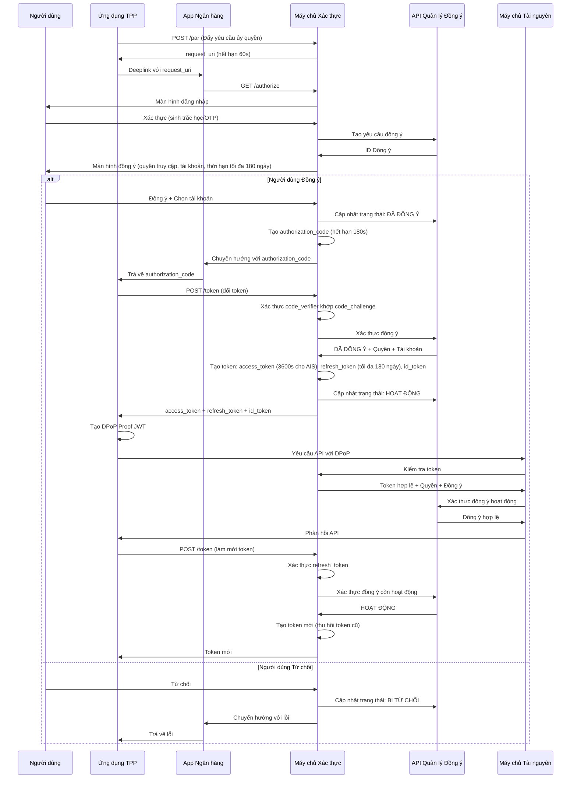
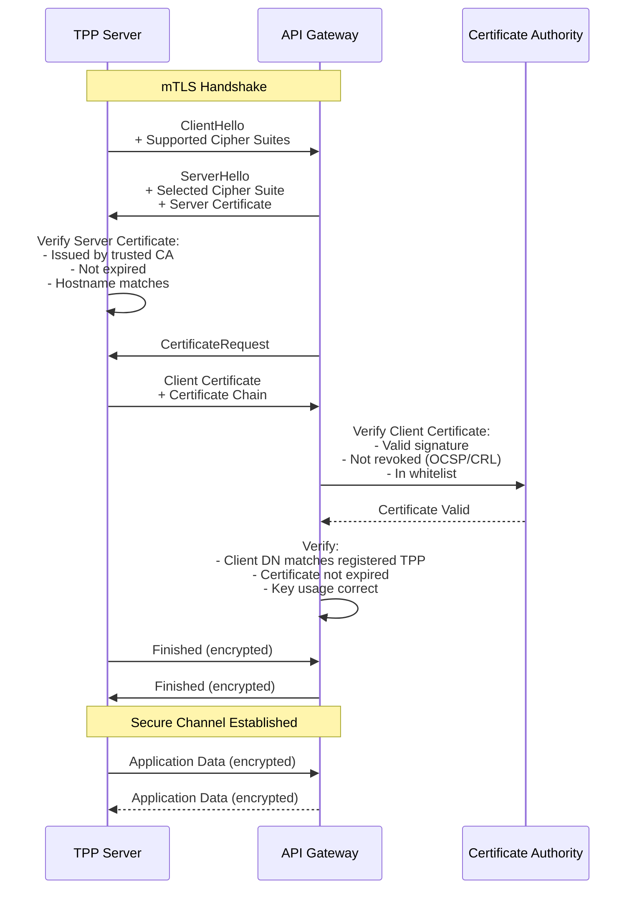
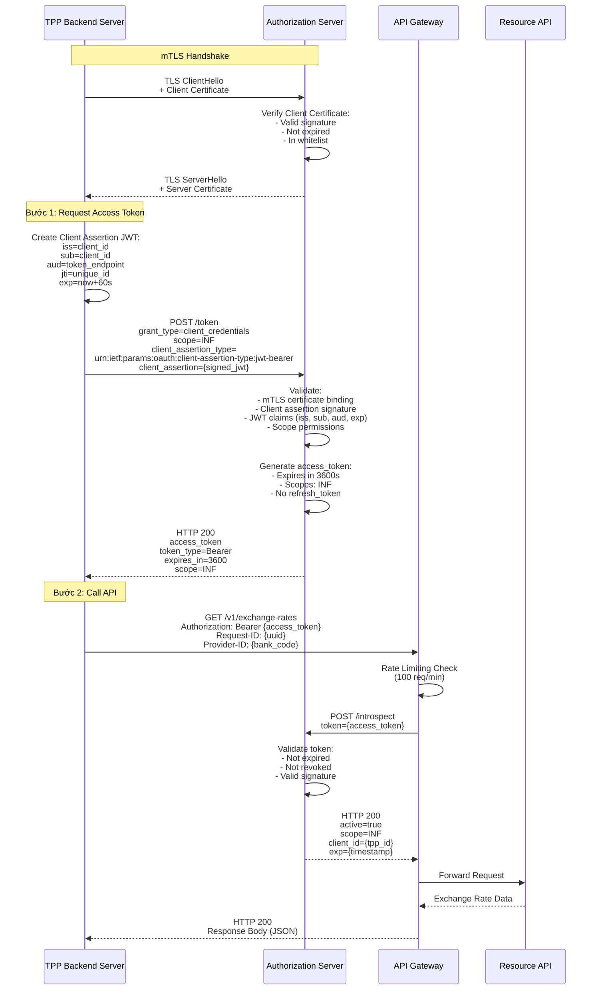
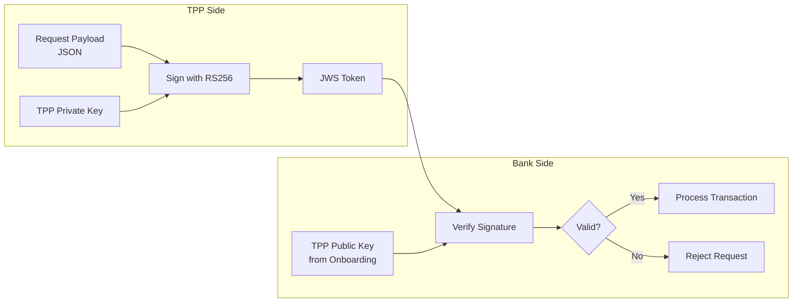
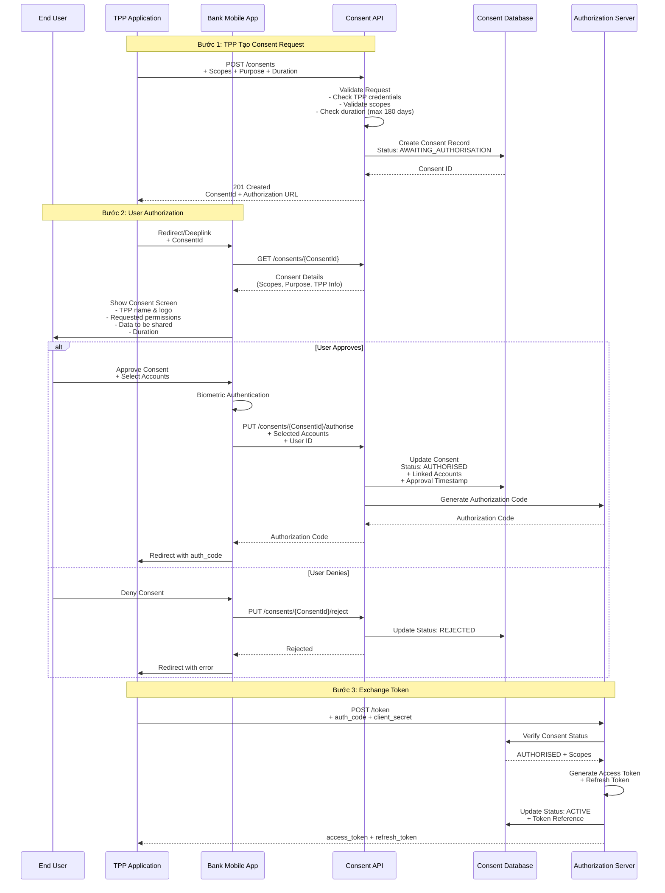
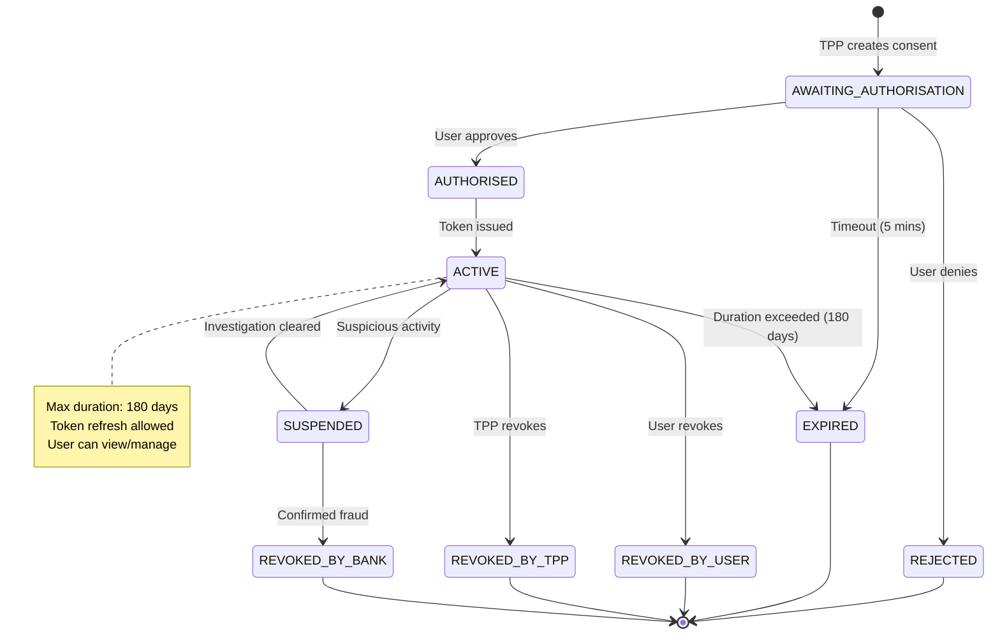
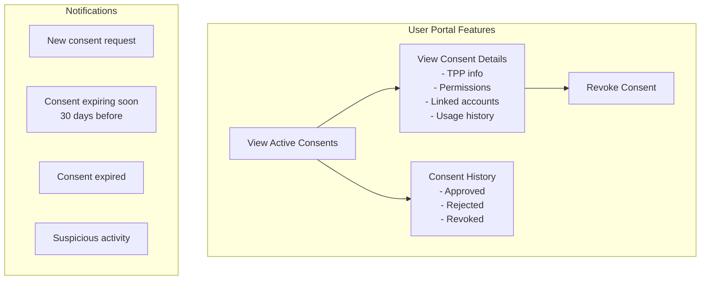
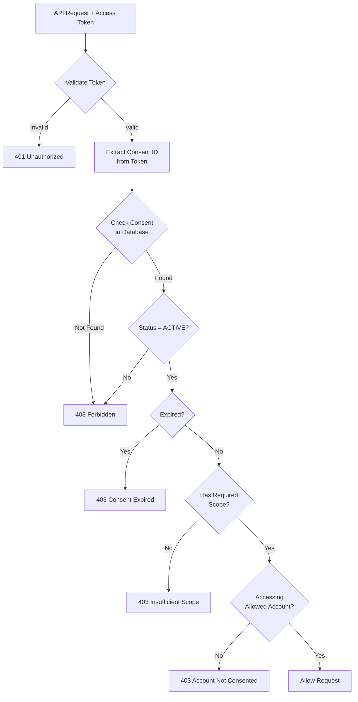

# Bảo Mật & Xác Thực

## Tổng Quan

Tài liệu này mô tả cơ chế bảo mật và xác thực trong hệ thống Open Banking, tuân thủ Thông tư 64/2024/TT-NHNN và các tiêu chuẩn quốc tế.

### Khung Pháp Lý & Tiêu Chuẩn

**Quy định Việt Nam:**
- Thông tư 64/2024/TT-NHNN: Quy định Open API, bảo mật và quản lý consent.
- Circular 45/2025/TT-NHNN: Xác thực sinh trắc học bắt buộc.
- Circular 50/2024/TT-NHNN: Strong Customer Authentication (SCA) và Multi-Factor Authentication (MFA).
- Nghị định 13/2023/NĐ-CP: Bảo vệ dữ liệu cá nhân.

**Tiêu chuẩn quốc tế:**
- OAuth 2.1: Cải tiến OAuth 2.0 với PKCE bắt buộc.
- FAPI 2.0: Bảo mật cấp tài chính.
- OpenID Connect (OIDC): Xác thực danh tính.
- ISO/IEC 27001:2022: Quản lý bảo mật thông tin.
- PCI DSS 4.0: Bảo mật dữ liệu thẻ.

### Mục Tiêu Bảo Mật

1. Tuân thủ pháp luật đầy đủ.
2. Bảo vệ dữ liệu khách hàng (tính bảo mật, toàn vẹn, khả dụng).
3. Ngăn chối bỏ giao dịch bằng chữ ký số JWS.
4. Áp dụng kiến trúc Zero Trust.
5. Đảm bảo khả năng phục hồi trước tấn công.

## OAuth 2.1 Authorization Code Flow với PKCE & FAPI 2.0

### Tổng Quan

Hệ thống sử dụng OAuth 2.1 kết hợp FAPI 2.0 để bảo mật cấp tài chính. Các cải tiến chính:
- PKCE bắt buộc.
- Loại bỏ Implicit Grant và Password Grant.
- Refresh Token Rotation bắt buộc.
- Ưu tiên xác thực bất đối xứng (JWT, mTLS).

### Luồng Xác Thực với PAR (Pushed Authorization Request)

### Quản Lý Token theo Thông tư 64/2024

| Loại Token             | Thời Hạn            | Sử Dụng                     | Áp Dụng                       |
| ---------------------- | ------------------- | --------------------------- | ----------------------------- |
| Authorization Code     | 180 giây            | Một lần                     | Tất cả flows                  |
| Access Token (INF)     | 3600 giây (1 giờ)   | Nhiều lần                   | Client Credentials Grant      |
| Access Token (AIS)     | 3600 giây (1 giờ)   | Nhiều lần                   | Authorization Code Grant      |
| Access Token (PIS)     | 300 giây (5 phút)   | Một lần                     | Authorization Code Grant      |
| Refresh Token          | Tối đa 180 ngày     | Nhiều lần (với rotation)    | Chỉ AIS                       |
| ConsentId (PIS)        | 300 giây            | Một lần                     | Payment flows                 |
| request_uri (PAR)      | 60 giây             | Một lần                     | PAR flow                      |

**Lưu ý:** Refresh Token không áp dụng cho PIS. Thời hạn đồng ý tối đa 180 ngày.

## Transport Layer Security (TLS)

### TLS 1.3 - Bắt Buộc theo Phụ lục 02

Theo **Phụ lục 02** Thông tư 64/2024, hệ thống **BẮT BUỘC** sử dụng:
- **TLS 1.2 trở lên** (minimum requirement)
- **TLS 1.3** (strongly recommended)

**Lợi ích TLS 1.3:**
- ⚡ **Faster Handshake**: 1-RTT (Round Trip Time) thay vì 2-RTT
- 🔒 **Forward Secrecy**: Mặc định cho tất cả cipher suites
- 🚫 **Loại bỏ cipher suites yếu**: RC4, 3DES, MD5, SHA-1
- 🔐 **Perfect Forward Secrecy (PFS)**: Ephemeral key exchange
- 🛡️ **Encrypted Handshake**: Bảo vệ metadata

### Mutual TLS (mTLS) - Khuyến Nghị

**Áp dụng cho:**
- ✅ Client Credentials Flow (Server-to-Server)
- ✅ Internal microservices communication
- ✅ High-value transactions (optional for Authorization Code Flow)

## Client Credentials Flow (Server-to-Server)

### Tổng Quan

Áp dụng cho giao tiếp **Server-to-Server** không liên quan đến dữ liệu người dùng cụ thể. Theo **Phụ lục 01** Thông tư 64/2024, flow này được sử dụng cho:

**Use Cases:**
- ✅ Truy vấn thông tin công khai (INF APIs): Lãi suất, Tỷ giá, ATM locations
- ✅ API health check và monitoring
- ✅ Batch processing và system integration
- ✅ Khởi tạo payment request (PIS) - bước đầu tiên

**Enhanced Security Requirements:**
- 🔒 **Mutual TLS (mTLS)** - Bắt buộc theo Phụ lục 02
- 🔒 **Client Assertion using JWT** (RFC 7523) - Khuyến nghị
- 🔒 **IP Whitelisting** - Bắt buộc cho Production
- 🔒 **Rate Limiting** - Nghiêm ngặt (100 req/min per client)

| Control                    | Requirement                    | Enforcement            |
| -------------------------- | ------------------------------ | ---------------------- |
| **mTLS**                   | Bắt buộc                       | API Gateway            |
| **Certificate Validation** | X.509 v3, RSA 2048-bit minimum | Authorization Server   |
| **IP Whitelisting**        | Bắt buộc Production            | Firewall + API Gateway |
| **Rate Limiting**          | 100 req/min per client_id      | API Gateway            |
| **Token Expiry**           | 3600s (1 hour)                 | Authorization Server   |
| **Scope Validation**       | Chỉ INF scope                  | Authorization Server   |
| **Audit Logging**          | 100% requests                  | SIEM System            |

## JWS (JSON Web Signature) cho Non-Repudiation

### Tổng Quan

Consent (Sự đồng ý) là cơ chế bảo vệ quyền riêng tư của khách hàng, đảm bảo TPP chỉ được truy cập dữ liệu khi có sự cho phép rõ ràng từ người dùng. Tuân thủ Thông tư 64/2024 và Nghị định 13/2023 về bảo vệ dữ liệu cá nhân.

### Quy Trình Tạo Consent

### Compliance & Best Practices

**Thông tư 64/2024 Requirements:**
- ✅ Thời hạn tối đa: 180 ngày
- ✅ Sự đồng ý rõ ràng (Explicit consent)
- ✅ Quyền rút lại bất cứ lúc nào
- ✅ Thông báo khi consent sắp hết hạn

**Nghị định 13/2023 (GDPR-like):**
- ✅ Purpose limitation (Mục đích cụ thể)
- ✅ Data minimization (Chỉ thu thập dữ liệu cần thiết)
- ✅ Transparency (Minh bạch về việc sử dụng dữ liệu)
- ✅ Right to withdraw (Quyền rút lại đồng ý)

**Security Best Practices:**
- Consent ID phải random và không đoán được
- Lưu audit trail đầy đủ
- Encrypt sensitive data
- Rate limiting cho consent creation
- Monitor suspicious patterns

### 1. Transport Security
- **TLS 1.3** bắt buộc cho tất cả connections
- **Certificate Pinning** cho mobile apps
- **HSTS** (HTTP Strict Transport Security) enabled

### 2. API Security
- **Rate Limiting**: 100 req/min per client
- **IP Whitelisting** cho production environment
- **Request Signing** (JWS) cho tất cả mutation operations

### 3. Data Protection
- **Encryption at Rest**: AES-256
- **Encryption in Transit**: TLS 1.3
- **PII Masking** trong logs và responses
- **Data Retention**: 
  - Transaction logs: 5 năm
  - Access logs: 3 tháng online, 1 năm offline

### 4. Incident Response
- **Real-time Monitoring** cho suspicious activities
- **Automated Alerts** cho failed authentication attempts
- **Breach Notification** trong vòng 72 giờ

## Compliance Checklist

- [ ] OAuth 2.0 + PKCE implementation
- [ ] FAPI Security Profile compliance
- [ ] JWS signing cho financial transactions
- [ ] Consent management system
- [ ] Token expiry enforcement (180 days max)
- [ ] Audit logging (3 months + 1 year backup)
- [ ] mTLS cho internal services
- [ ] Penetration testing quarterly

## Tài Liệu Tham Khảo
- RFC 6749: OAuth 2.0 Authorization Framework
- RFC 7636: PKCE for OAuth 2.0
- RFC 7515: JSON Web Signature (JWS)
- FAPI Security Profile 1.0
- Quyết định 2345/QĐ-NHNN
- Thông tư 64/2024/TT-NHNN
