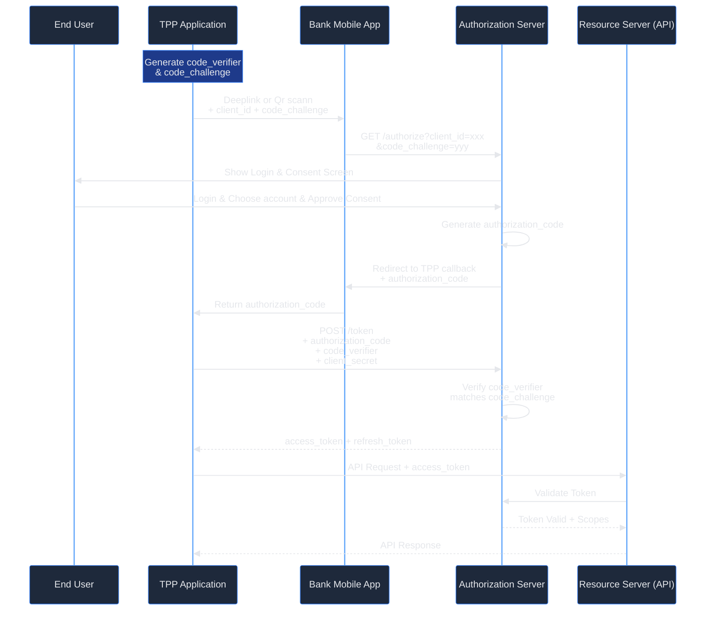
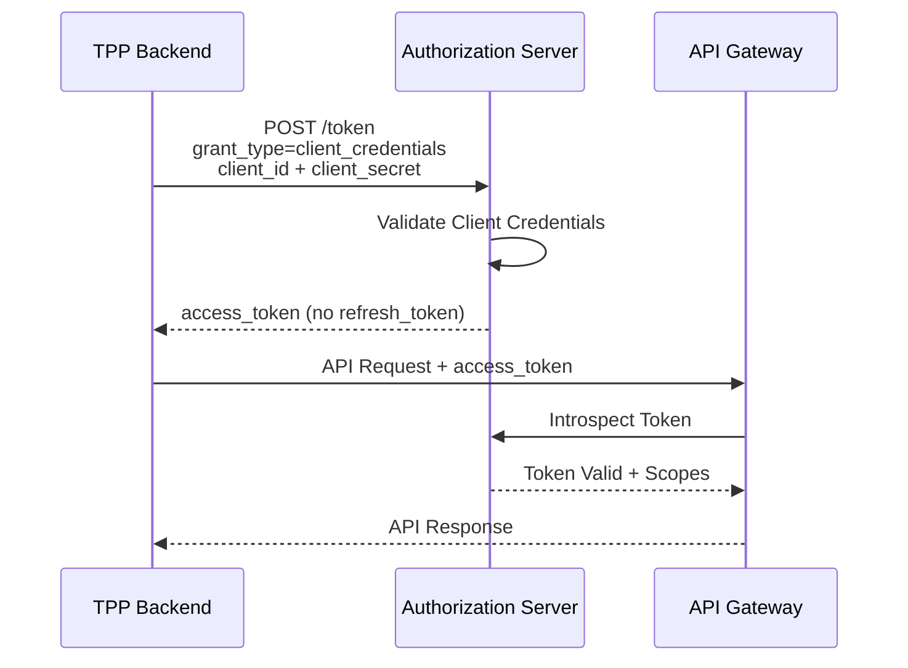
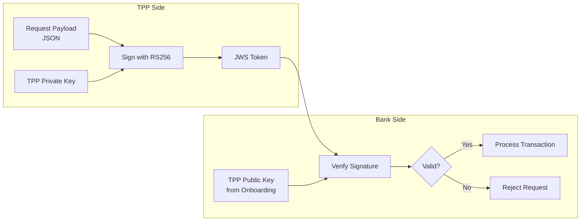
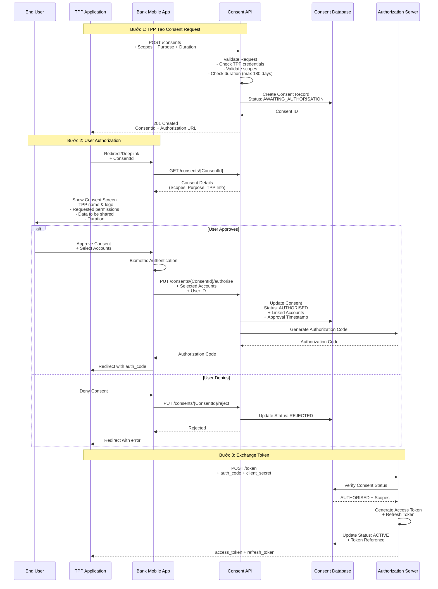
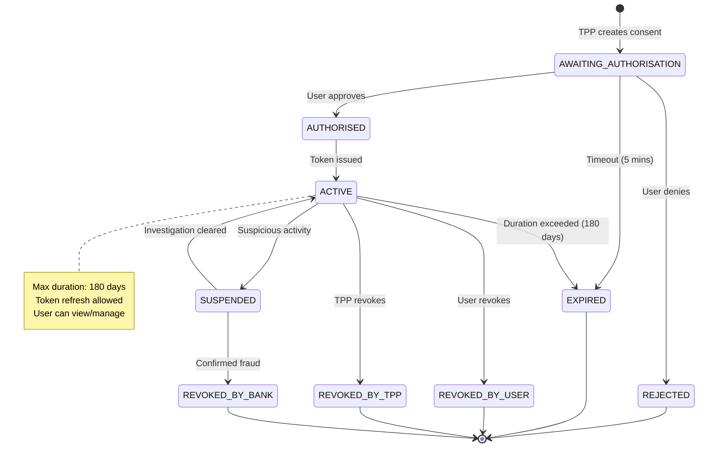
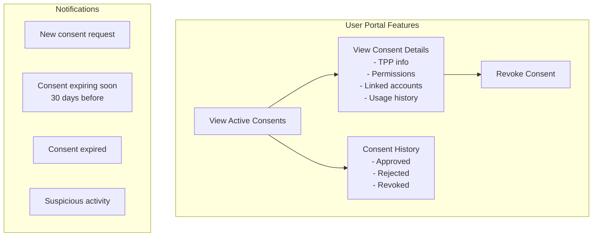
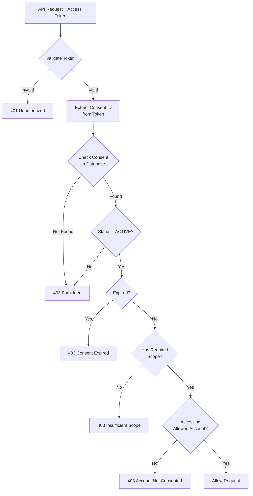
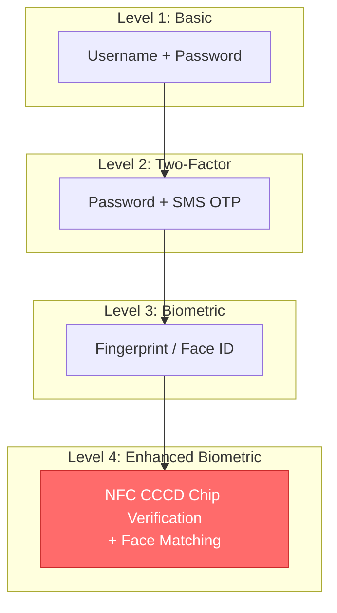
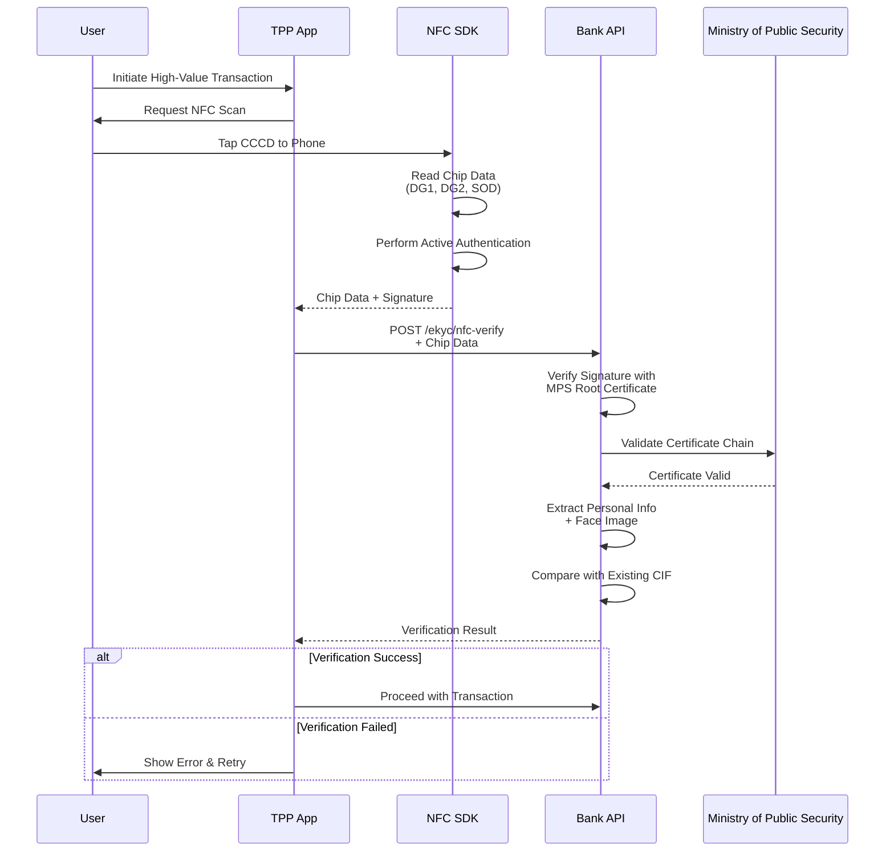
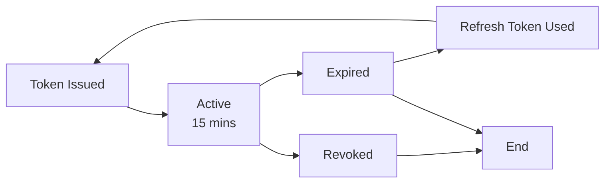

# Bảo Mật & Xác Thực

## Tổng Quan

Hệ thống Open Banking tuân thủ các tiêu chuẩn bảo mật cao nhất bao gồm OAuth 2.0, FAPI (Financial-grade API), và các yêu cầu của Thông tư 64/2024/TT-NHNN.

## OAuth 2.0 Authorization Code Flow with PKCE



## Client Credentials Flow (Server-to-Server)



## JWS (JSON Web Signature) cho Non-Repudiation



### Cấu Trúc JWS Header

```json
{
  "alg": "RS256",
  "kid": "tpp-key-2024-001",
  "typ": "JOSE",
  "jti": "unique-request-id-12345",
  "iat": 1702345678
}
```

### Payload Example

```json
{
  "InstructionIdentification": "TXN-20241210-001",
  "EndToEndIdentification": "E2E-12345",
  "InstructedAmount": {
    "Amount": "1000000.00",
    "Currency": "VND"
  },
  "DebtorAccount": {
    "Identification": "1234567890"
  },
  "CreditorAccount": {
    "Identification": "0987654321",
    "Name": "NGUYEN VAN A"
  }
}
```

## Consent Management - Quản Lý Sự Đồng Ý

### Tổng Quan

Consent (Sự đồng ý) là cơ chế bảo vệ quyền riêng tư của khách hàng, đảm bảo TPP chỉ được truy cập dữ liệu khi có sự cho phép rõ ràng từ người dùng. Tuân thủ Thông tư 64/2024 và Nghị định 13/2023 về bảo vệ dữ liệu cá nhân.

### Quy Trình Tạo Consent



### Cấu Trúc Consent Record

```json
{
  "consentId": "consent-abc123xyz",
  "status": "ACTIVE",
  "createdDateTime": "2024-12-11T09:00:00+07:00",
  "statusUpdateDateTime": "2024-12-11T09:05:00+07:00",
  "expirationDateTime": "2025-06-09T09:05:00+07:00",
  
  "tppInfo": {
    "clientId": "tpp-12345",
    "clientName": "Example Fintech",
    "logoUrl": "https://example.com/logo.png"
  },
  
  "permissions": [
    "accounts.read",
    "accounts.balance.read",
    "transactions.read"
  ],
  
  "purpose": "Cung cấp dịch vụ quản lý tài chính cá nhân",
  
  "authorisation": {
    "userId": "user-67890",
    "authorisedDateTime": "2024-12-11T09:05:00+07:00",
    "authenticationMethod": "BIOMETRIC",
    "selectedAccounts": [
      {
        "accountId": "acc-111",
        "accountType": "CURRENT",
        "permissions": ["balance.read", "transactions.read"]
      },
      {
        "accountId": "acc-222",
        "accountType": "SAVINGS",
        "permissions": ["balance.read"]
      }
    ]
  },
  
  "tokenInfo": {
    "accessTokenHash": "sha256_hash_of_token",
    "refreshTokenHash": "sha256_hash_of_refresh_token",
    "tokenIssuedAt": "2024-12-11T09:05:30+07:00",
    "tokenExpiresAt": "2024-12-11T09:20:30+07:00"
  },
  
  "auditTrail": [
    {
      "timestamp": "2024-12-11T09:00:00+07:00",
      "action": "CONSENT_CREATED",
      "actor": "TPP",
      "details": "Consent request initiated"
    },
    {
      "timestamp": "2024-12-11T09:05:00+07:00",
      "action": "CONSENT_AUTHORISED",
      "actor": "USER",
      "details": "User approved via biometric"
    },
    {
      "timestamp": "2024-12-11T09:05:30+07:00",
      "action": "TOKEN_ISSUED",
      "actor": "SYSTEM",
      "details": "Access token generated"
    }
  ]
}
```

### Consent Lifecycle States



### Consent Storage & Security

**Database Schema:**

```sql
CREATE TABLE consents (
    consent_id VARCHAR(50) PRIMARY KEY,
    tpp_client_id VARCHAR(50) NOT NULL,
    user_id VARCHAR(50),
    status VARCHAR(30) NOT NULL,
    
    -- Permissions
    permissions JSON NOT NULL,
    purpose TEXT NOT NULL,
    
    -- Timestamps
    created_at TIMESTAMP NOT NULL,
    authorised_at TIMESTAMP,
    expires_at TIMESTAMP NOT NULL,
    revoked_at TIMESTAMP,
    
    -- Linked accounts (encrypted)
    selected_accounts JSON,
    
    -- Token references (hashed)
    access_token_hash VARCHAR(64),
    refresh_token_hash VARCHAR(64),
    
    -- Audit
    audit_trail JSON,
    
    INDEX idx_user_id (user_id),
    INDEX idx_tpp_client_id (tpp_client_id),
    INDEX idx_status (status),
    INDEX idx_expires_at (expires_at)
);
```

**Security Measures:**
- Consent ID: Cryptographically random (UUID v4)
- Account data: Encrypted at rest (AES-256)
- Token hashes: SHA-256 (không lưu token gốc)
- Audit trail: Immutable log
- Access control: Row-level security

### User Consent Management Portal



### API Endpoints

#### 1. Create Consent (TPP)

**POST /v1/consents**

```json
{
  "permissions": [
    "accounts.read",
    "accounts.balance.read",
    "transactions.read"
  ],
  "expirationDateTime": "2025-06-09T09:00:00+07:00",
  "purpose": "Cung cấp dịch vụ quản lý tài chính cá nhân"
}
```

**Response:**
```json
{
  "consentId": "consent-abc123xyz",
  "status": "AWAITING_AUTHORISATION",
  "createdDateTime": "2024-12-11T09:00:00+07:00",
  "expirationDateTime": "2025-06-09T09:00:00+07:00",
  "authorisationUrl": "https://bank.vn/authorize?consent_id=consent-abc123xyz"
}
```

#### 2. Get Consent Details

**GET /v1/consents/{consentId}**

```json
{
  "consentId": "consent-abc123xyz",
  "status": "ACTIVE",
  "permissions": ["accounts.read", "accounts.balance.read"],
  "tppInfo": {
    "clientId": "tpp-12345",
    "clientName": "Example Fintech"
  },
  "authorisation": {
    "authorisedDateTime": "2024-12-11T09:05:00+07:00",
    "accountsCount": 2
  },
  "expirationDateTime": "2025-06-09T09:05:00+07:00"
}
```

#### 3. Revoke Consent (User or TPP)

**DELETE /v1/consents/{consentId}**

```json
{
  "revocationReason": "USER_REQUESTED",
  "revokedBy": "user-67890",
  "revokedAt": "2024-12-11T10:00:00+07:00"
}
```

### Consent Validation Flow



### Compliance & Best Practices

**Thông tư 64/2024 Requirements:**
- ✅ Thời hạn tối đa: 180 ngày
- ✅ Sự đồng ý rõ ràng (Explicit consent)
- ✅ Quyền rút lại bất cứ lúc nào
- ✅ Thông báo khi consent sắp hết hạn

**Nghị định 13/2023 (GDPR-like):**
- ✅ Purpose limitation (Mục đích cụ thể)
- ✅ Data minimization (Chỉ thu thập dữ liệu cần thiết)
- ✅ Transparency (Minh bạch về việc sử dụng dữ liệu)
- ✅ Right to withdraw (Quyền rút lại đồng ý)

**Security Best Practices:**
- Consent ID phải random và không đoán được
- Lưu audit trail đầy đủ
- Encrypt sensitive data
- Rate limiting cho consent creation
- Monitor suspicious patterns


## Các Cấp Độ Xác Thực theo QĐ 2345



### Quy Định Áp Dụng

| Loại Giao Dịch     | Giá Trị        | Cấp Độ Bắt Buộc |
| ------------------ | -------------- | --------------- |
| Truy vấn thông tin | Bất kỳ         | Level 2         |
| Chuyển tiền        | < 10 triệu VND | Level 3         |
| Chuyển tiền        | ≥ 10 triệu VND | Level 4         |
| Mở thẻ tín dụng    | Bất kỳ         | Level 4         |
| Thay đổi hạn mức   | Bất kỳ         | Level 4         |

## NFC CCCD Verification Flow



## Token Management

### Access Token Lifecycle



### Token Scopes

| Scope                   | Mô Tả                   | Thời Hạn Tối Đa |
| ----------------------- | ----------------------- | --------------- |
| `accounts.read`         | Đọc danh sách tài khoản | 180 ngày        |
| `accounts.balance.read` | Đọc số dư               | 180 ngày        |
| `transactions.read`     | Đọc lịch sử giao dịch   | 180 ngày        |
| `payments.write`        | Khởi tạo thanh toán     | 1 lần sử dụng   |
| `cards.read`            | Đọc thông tin thẻ       | 180 ngày        |
| `cards.write`           | Quản lý thẻ             | 90 ngày         |

## Security Best Practices

### 1. Transport Security
- **TLS 1.3** bắt buộc cho tất cả connections
- **Certificate Pinning** cho mobile apps
- **HSTS** (HTTP Strict Transport Security) enabled

### 2. API Security
- **Rate Limiting**: 100 req/min per client
- **IP Whitelisting** cho production environment
- **Request Signing** (JWS) cho tất cả mutation operations

### 3. Data Protection
- **Encryption at Rest**: AES-256
- **Encryption in Transit**: TLS 1.3
- **PII Masking** trong logs và responses
- **Data Retention**: 
  - Transaction logs: 5 năm
  - Access logs: 3 tháng online, 1 năm offline

### 4. Incident Response
- **Real-time Monitoring** cho suspicious activities
- **Automated Alerts** cho failed authentication attempts
- **Breach Notification** trong vòng 72 giờ

## Compliance Checklist

- [ ] OAuth 2.0 + PKCE implementation
- [ ] FAPI Security Profile compliance
- [ ] JWS signing cho financial transactions
- [ ] Consent management system
- [ ] NFC CCCD verification (QĐ 2345)
- [ ] Token expiry enforcement (180 days max)
- [ ] Audit logging (3 months + 1 year backup)
- [ ] HSM integration cho key management
- [ ] mTLS cho internal services
- [ ] Penetration testing quarterly

## Tài Liệu Tham Khảo
- RFC 6749: OAuth 2.0 Authorization Framework
- RFC 7636: PKCE for OAuth 2.0
- RFC 7515: JSON Web Signature (JWS)
- FAPI Security Profile 1.0
- Quyết định 2345/QĐ-NHNN
- Thông tư 64/2024/TT-NHNN
