# Bảo Mật & Xác Thực

## Tổng Quan

Tài liệu này mô tả chi tiết các cơ chế bảo mật và xác thực của hệ thống Open Banking, tuân thủ nghiêm ngặt **Thông tư 64/2024/TT-NHNN** (Công báo 301+302/2025, hiệu lực từ 01/03/2025) và các tiêu chuẩn quốc tế mới nhất năm 2025.

### Khung Pháp Lý & Tiêu Chuẩn Áp Dụng

**Quy định pháp luật Việt Nam:**
- **Thông tư 64/2024/TT-NHNN**: Quy định về triển khai giao diện lập trình ứng dụng mở (Open API) trong ngành Ngân hàng
  - Phụ lục 01: Đặc tả kỹ thuật API bắt buộc (INF, AIS, PIS, EWLTS)
  - Phụ lục 02: Tiêu chuẩn kỹ thuật và bảo mật
  - Điều 11: Yêu cầu về bảo vệ dữ liệu và quản lý consent
- **Circular 45/2025/TT-NHNN**: Xác thực sinh trắc học bắt buộc (hiệu lực 05/01/2026)
- **Circular 50/2024/TT-NHNN**: Strong Customer Authentication (SCA) và Multi-Factor Authentication (MFA)
- **Quyết định 2345/QĐ-NHNN**: Tiêu chuẩn xác thực sinh trắc học cho giao dịch trực tuyến
- **Nghị định 13/2023/NĐ-CP**: Bảo vệ dữ liệu cá nhân

**Tiêu chuẩn quốc tế 2025:**
- **OAuth 2.1** (Draft): Cải tiến từ OAuth 2.0 với PKCE bắt buộc
- **FAPI 2.0** (Financial-grade API): Baseline Security Profile
- **OpenID Connect (OIDC)**: Identity layer trên OAuth 2.0
- **ISO/IEC 27001:2022**: Information Security Management System
- **ISO 20022**: Financial Services Messages
- **PCI DSS 4.0**: Payment Card Industry Data Security Standard
- **OWASP API Security Top 10 (2023)**: API Security Best Practices

### Mục Tiêu Bảo Mật

1. **Tuân thủ pháp luật**: Đáp ứng 100% yêu cầu Thông tư 64/2024 và các quy định liên quan
2. **Bảo vệ dữ liệu**: Đảm bảo tính bảo mật, toàn vẹn và khả dụng của dữ liệu khách hàng
3. **Non-repudiation**: Chống chối bỏ giao dịch thông qua chữ ký số JWS
4. **Zero Trust**: Áp dụng kiến trúc "Never trust, always verify"
5. **Resilience**: Khả năng phục hồi và chống chịu tấn công

## OAuth 2.1 Authorization Code Flow with PKCE & FAPI 2.0

### Tổng Quan

Hệ thống triển khai **OAuth 2.1** (cải tiến từ OAuth 2.0) kết hợp **FAPI 2.0 Baseline Security Profile** để đảm bảo bảo mật cấp độ tài chính (financial-grade security). Các cải tiến chính:

**OAuth 2.1 Enhancements:**
- ✅ **PKCE bắt buộc** (RFC 7636) - không còn optional
- ✅ **Loại bỏ Implicit Grant** - không an toàn
- ✅ **Loại bỏ Password Grant** - Resource Owner Password Credentials
- ✅ **Refresh Token Rotation** - bắt buộc
- ✅ **Ưu tiên asymmetric authentication** - JWT, mTLS

**FAPI 2.0 Security Features:**
- ✅ **Pushed Authorization Requests (PAR)** - RFC 9126
- ✅ **Rich Authorization Requests (RAR)** - Fine-grained consent
- ✅ **JWT-secured Authorization Response Mode (JARM)** - RFC 9101
- ✅ **Proof-of-Possession (PoP) Tokens** - DPoP (RFC 9449)
- ✅ **Attacker Model Framework** - Comprehensive threat modeling

### Luồng Xác Thực với PAR (Pushed Authorization Request)

```mermaid
%%{init: {'theme':'base', 'themeVariables': {
  'actorBkg':'#1e293b',
  'actorBorder':'#3b82f6',
  'actorTextColor':'#e5e7eb',
  'actorLineColor':'#60a5fa',
  'signalColor':'#e5e7eb',
  'signalTextColor':'#e5e7eb',
  'labelBoxBkgColor':'#334155',
  'labelBoxBorderColor':'#475569',
  'labelTextColor':'#e5e7eb',
  'loopTextColor':'#e5e7eb',
  'noteBkgColor':'#1e3a8a',
  'noteBorderColor':'#3b82f6',
  'noteTextColor':'#e5e7eb',
  'activationBkgColor':'#3b82f6',
  'activationBorderColor':'#60a5fa',
  'sequenceNumberColor':'#0f172a'
}}}%%
sequenceDiagram
    participant User as End User
    participant TPP as TPP Application
    participant App as Bank Mobile App
    participant AuthServer as Authorization Server<br/>(IAM Server)
    participant ConsentAPI as Consent Management
    participant ResourceServer as Resource Server (API)
    
    Note over TPP: Bước 1: PAR - Push Authorization Request
    Note over TPP: Generate code_verifier (random)<br/>code_challenge = SHA256(code_verifier)
    
    TPP->>AuthServer: POST /par<br/>+ client_id + client_secret<br/>+ code_challenge + scope<br/>+ redirect_uri + state
    AuthServer->>AuthServer: Validate client credentials<br/>Store authorization parameters
    AuthServer-->>TPP: request_uri (expires in 60s)<br/>+ expires_in
    
    Note over TPP,App: Bước 2: User Authorization
    
    TPP->>App: Deeplink/QR Code<br/>+ request_uri
    App->>AuthServer: GET /authorize?<br/>client_id=xxx&request_uri=yyy
    AuthServer->>AuthServer: Retrieve stored parameters<br/>from request_uri
    AuthServer->>User: Show Login Screen
    User->>AuthServer: Authenticate (Biometric/OTP)
    
    AuthServer->>ConsentAPI: Create Consent Request
    ConsentAPI-->>AuthServer: Consent ID
    
    AuthServer->>User: Show Consent Screen<br/>- TPP info & logo<br/>- Requested scopes<br/>- Account selection<br/>- Duration (max 180 days)
    
    alt User Approves
        User->>AuthServer: Approve + Select Accounts
        AuthServer->>ConsentAPI: Update Consent Status: AUTHORISED
        AuthServer->>AuthServer: Generate authorization_code<br/>(one-time use, 180s expiry)
        AuthServer->>App: Redirect to TPP callback<br/>+ authorization_code + state
        App->>TPP: Return authorization_code
        
        Note over TPP: Bước 3: Token Exchange
        
        TPP->>AuthServer: POST /token<br/>+ grant_type=authorization_code<br/>+ code + code_verifier<br/>+ client_id + client_secret<br/>+ redirect_uri
        AuthServer->>AuthServer: Verify:<br/>- code_verifier matches code_challenge<br/>- client credentials<br/>- authorization_code validity
        AuthServer->>ConsentAPI: Verify Consent Status
        ConsentAPI-->>AuthServer: AUTHORISED + Scopes + Accounts
        
        AuthServer->>AuthServer: Generate Tokens:<br/>- access_token (3600s for AIS)<br/>- refresh_token (max 180 days)<br/>- id_token (OIDC)
        AuthServer->>ConsentAPI: Update Status: ACTIVE<br/>+ Token Reference (hashed)
        AuthServer-->>TPP: access_token + refresh_token<br/>+ id_token + expires_in<br/>+ token_type=DPoP
        
        Note over TPP: Bước 4: API Access with DPoP
        
        TPP->>TPP: Create DPoP Proof JWT:<br/>- Sign with TPP private key<br/>- Include jti, htm, htu, iat
        TPP->>ResourceServer: API Request<br/>+ Authorization: DPoP {access_token}<br/>+ DPoP: {proof_jwt}
        ResourceServer->>AuthServer: Introspect Token<br/>+ Validate DPoP binding
        AuthServer-->>ResourceServer: Token Valid + Scopes + Consent
        ResourceServer->>ConsentAPI: Verify Consent Active<br/>+ Check Account Access
        ConsentAPI-->>ResourceServer: Consent Valid
        ResourceServer-->>TPP: API Response (JSON)
        
        Note over TPP: Bước 5: Refresh Token Rotation
        
        TPP->>AuthServer: POST /token<br/>+ grant_type=refresh_token<br/>+ refresh_token<br/>+ client_id + client_secret
        AuthServer->>AuthServer: Validate refresh_token<br/>Check not expired/revoked
        AuthServer->>ConsentAPI: Verify Consent Still Active
        ConsentAPI-->>AuthServer: ACTIVE + Not Expired
        
        AuthServer->>AuthServer: Generate NEW tokens:<br/>- new access_token<br/>- new refresh_token<br/>REVOKE old refresh_token
        AuthServer->>ConsentAPI: Update Token Reference
        AuthServer-->>TPP: new access_token<br/>+ new refresh_token
        
        Note over AuthServer: Token Reuse Detection:<br/>If old refresh_token used again<br/>→ REVOKE entire token family
        
    else User Denies
        User->>AuthServer: Deny Consent
        AuthServer->>ConsentAPI: Update Status: REJECTED
        AuthServer->>App: Redirect with error<br/>+ error=access_denied
        App->>TPP: Return error
    end
```

### Token Management theo Thông tư 64/2024

Theo **Phụ lục 01 Mục 1** của Thông tư 64/2024/TT-NHNN:

| Token Type             | Thời Hạn            | Sử Dụng                     | Áp Dụng                       |
| ---------------------- | ------------------- | --------------------------- | ----------------------------- |
| **Authorization Code** | 180 giây            | Một lần (one-time use)      | Tất cả flows                  |
| **Access Token (INF)** | 3600 giây (1 giờ)   | Multiple use                | Client Credentials Grant      |
| **Access Token (AIS)** | 3600 giây (1 giờ)   | Multiple use                | Authorization Code Grant      |
| **Access Token (PIS)** | 300 giây (5 phút)   | **Một lần**                 | Authorization Code Grant      |
| **Refresh Token**      | **Tối đa 180 ngày** | Multiple use (với rotation) | **Chỉ AIS** (Điều 11 Khoản 6) |
| **ConsentId (PIS)**    | 300 giây            | Một lần                     | Payment flows                 |
| **request_uri (PAR)**  | 60 giây             | Một lần                     | PAR flow                      |

**Lưu ý quan trọng:**
- Refresh Token **KHÔNG áp dụng** cho PIS (Payment Initiation Services)
- Thời hạn consent tối đa: **180 ngày** (Điều 11 Khoản 6)
- Sau 180 ngày, TPP phải yêu cầu khách hàng tái xác thực (re-authentication)

## Transport Layer Security (TLS)

### TLS 1.3 - Bắt Buộc theo Phụ lục 02

Theo **Phụ lục 02** Thông tư 64/2024, hệ thống **BẮT BUỘC** sử dụng:
- **TLS 1.2 trở lên** (minimum requirement)
- **TLS 1.3** (strongly recommended)

**Lợi ích TLS 1.3:**
- ⚡ **Faster Handshake**: 1-RTT (Round Trip Time) thay vì 2-RTT
- 🔒 **Forward Secrecy**: Mặc định cho tất cả cipher suites
- 🚫 **Loại bỏ cipher suites yếu**: RC4, 3DES, MD5, SHA-1
- 🔐 **Perfect Forward Secrecy (PFS)**: Ephemeral key exchange
- 🛡️ **Encrypted Handshake**: Bảo vệ metadata

### Cipher Suites được Phép

**TLS 1.3 (Recommended):**
```
TLS_AES_256_GCM_SHA384
TLS_AES_128_GCM_SHA256
TLS_CHACHA20_POLY1305_SHA256
```

**TLS 1.2 (Fallback):**
```
TLS_ECDHE_RSA_WITH_AES_256_GCM_SHA384
TLS_ECDHE_RSA_WITH_AES_128_GCM_SHA256
TLS_ECDHE_ECDSA_WITH_AES_256_GCM_SHA384
TLS_ECDHE_ECDSA_WITH_AES_128_GCM_SHA256
```

**❌ Cipher Suites BỊ CẤM:**
- Tất cả cipher suites sử dụng: RC4, 3DES, DES, MD5, SHA-1
- Cipher suites không có Forward Secrecy (non-ECDHE, non-DHE)
- Export-grade cipher suites
- NULL cipher suites

### Mutual TLS (mTLS) - Khuyến Nghị

**Áp dụng cho:**
- ✅ Client Credentials Flow (Server-to-Server)
- ✅ Internal microservices communication
- ✅ High-value transactions (optional for Authorization Code Flow)

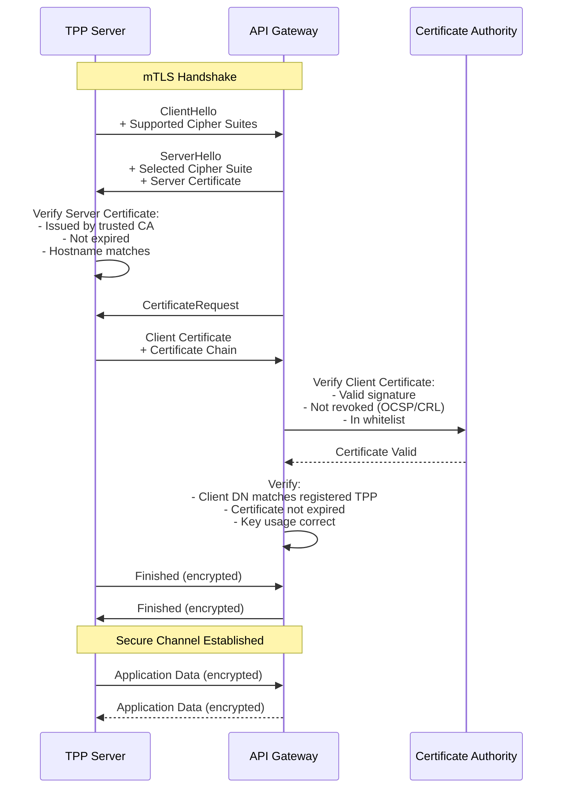

### Certificate Management

**Certificate Requirements:**

| Attribute                          | Requirement                                                                           |
| ---------------------------------- | ------------------------------------------------------------------------------------- |
| **Algorithm**                      | RSA 2048-bit minimum, RSA 4096-bit recommended<br/>ECDSA P-256 or P-384 (alternative) |
| **Signature**                      | SHA-256 minimum (SHA-384/SHA-512 recommended)                                         |
| **Validity**                       | Maximum 398 days (13 months)                                                          |
| **Key Usage**                      | Digital Signature, Key Encipherment                                                   |
| **Extended Key Usage**             | TLS Web Client Authentication, TLS Web Server Authentication                          |
| **Subject Alternative Name (SAN)** | Required for server certificates                                                      |

**Certificate Lifecycle:**

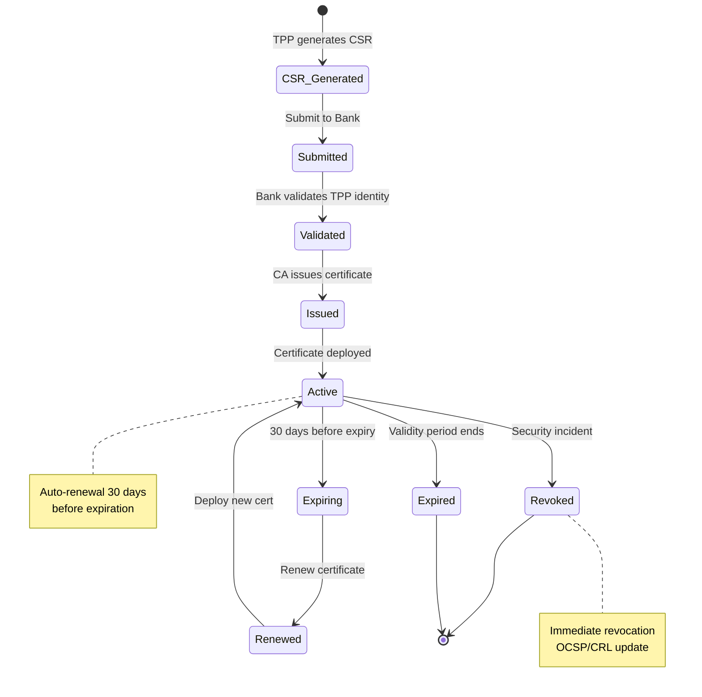

**Certificate Pinning (Mobile Apps):**

Theo **Phụ lục 02**, khuyến nghị áp dụng Certificate Pinning cho mobile applications:

```kotlin
// Android Example - OkHttp Certificate Pinner
val certificatePinner = CertificatePinner.Builder()
    .add("api.bank.vn", "sha256/AAAAAAAAAAAAAAAAAAAAAAAAAAAAAAAAAAAAAAAAAAA=")
    .add("api.bank.vn", "sha256/BBBBBBBBBBBBBBBBBBBBBBBBBBBBBBBBBBBBBBBBBBB=") // Backup pin
    .build()

val client = OkHttpClient.Builder()
    .certificatePinner(certificatePinner)
    .build()
```

```swift
// iOS Example - URLSession Pinning
func urlSession(_ session: URLSession, 
                didReceive challenge: URLAuthenticationChallenge,
                completionHandler: @escaping (URLSession.AuthChallengeDisposition, URLCredential?) -> Void) {
    
    guard let serverTrust = challenge.protectionSpace.serverTrust else {
        completionHandler(.cancelAuthenticationChallenge, nil)
        return
    }
    
    let certificate = SecTrustGetCertificateAtIndex(serverTrust, 0)
    let policy = SecPolicyCreateSSL(true, challenge.protectionSpace.host as CFString)
    
    // Pin validation logic
    if validateCertificatePinning(certificate) {
        let credential = URLCredential(trust: serverTrust)
        completionHandler(.useCredential, credential)
    } else {
        completionHandler(.cancelAuthenticationChallenge, nil)
    }
}
```

### HSTS (HTTP Strict Transport Security)

**Bắt buộc** cho tất cả API endpoints:

```http
Strict-Transport-Security: max-age=31536000; includeSubDomains; preload
```

**Configuration:**
- `max-age`: 31536000 seconds (1 year)
- `includeSubDomains`: Apply to all subdomains
- `preload`: Submit to HSTS preload list
## Client Credentials Flow (Server-to-Server)

### Tổng Quan

Áp dụng cho giao tiếp **Server-to-Server** không liên quan đến dữ liệu người dùng cụ thể. Theo **Phụ lục 01** Thông tư 64/2024, flow này được sử dụng cho:

**Use Cases:**
- ✅ Truy vấn thông tin công khai (INF APIs): Lãi suất, Tỷ giá, ATM locations
- ✅ API health check và monitoring
- ✅ Batch processing và system integration
- ✅ Khởi tạo payment request (PIS) - bước đầu tiên

**Enhanced Security Requirements:**
- 🔒 **Mutual TLS (mTLS)** - Bắt buộc theo Phụ lục 02
- 🔒 **Client Assertion using JWT** (RFC 7523) - Khuyến nghị
- 🔒 **IP Whitelisting** - Bắt buộc cho Production
- 🔒 **Rate Limiting** - Nghiêm ngặt (100 req/min per client)

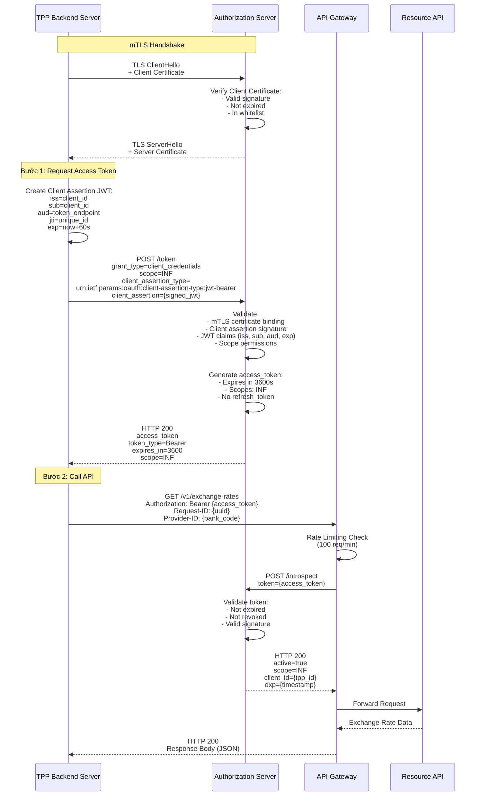

### Client Assertion JWT Structure

**Header:**
```json
{
  "alg": "RS256",
  "typ": "JWT",
  "kid": "tpp-signing-key-2025-001"
}
```

**Payload:**
```json
{
  "iss": "tpp-client-id-12345",
  "sub": "tpp-client-id-12345",
  "aud": "https://bank.vn/oauth2/token",
  "jti": "550e8400-e29b-41d4-a716-446655440000",
  "exp": 1702345738,
  "iat": 1702345678
}
```

**Signature:** RS256 using TPP's private key

### Security Controls

| Control                    | Requirement                    | Enforcement            |
| -------------------------- | ------------------------------ | ---------------------- |
| **mTLS**                   | Bắt buộc                       | API Gateway            |
| **Certificate Validation** | X.509 v3, RSA 2048-bit minimum | Authorization Server   |
| **IP Whitelisting**        | Bắt buộc Production            | Firewall + API Gateway |
| **Rate Limiting**          | 100 req/min per client_id      | API Gateway            |
| **Token Expiry**           | 3600s (1 hour)                 | Authorization Server   |
| **Scope Validation**       | Chỉ INF scope                  | Authorization Server   |
| **Audit Logging**          | 100% requests                  | SIEM System            |

## JWS (JSON Web Signature) cho Non-Repudiation

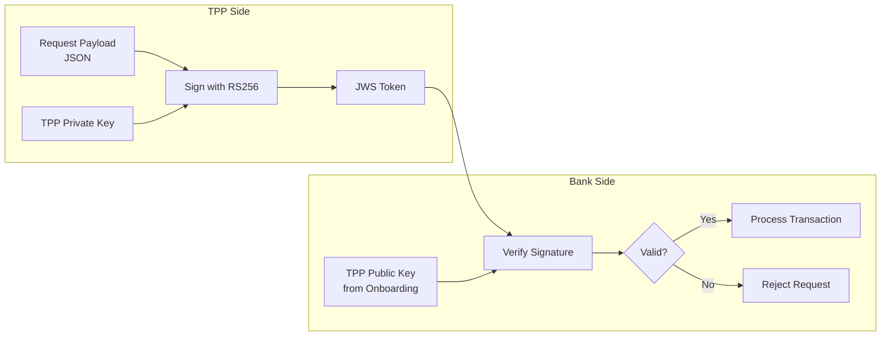

### Cấu Trúc JWS Header

```json
{
  "alg": "RS256",
  "kid": "tpp-key-2024-001",
  "typ": "JOSE",
  "jti": "unique-request-id-12345",
  "iat": 1702345678
}
```

### Payload Example

```json
{
  "InstructionIdentification": "TXN-20241210-001",
  "EndToEndIdentification": "E2E-12345",
  "InstructedAmount": {
    "Amount": "1000000.00",
    "Currency": "VND"
  },
  "DebtorAccount": {
    "Identification": "1234567890"
  },
  "CreditorAccount": {
    "Identification": "0987654321",
    "Name": "NGUYEN VAN A"
  }
}
```

## Consent Management - Quản Lý Sự Đồng Ý

### Tổng Quan

Consent (Sự đồng ý) là cơ chế bảo vệ quyền riêng tư của khách hàng, đảm bảo TPP chỉ được truy cập dữ liệu khi có sự cho phép rõ ràng từ người dùng. Tuân thủ Thông tư 64/2024 và Nghị định 13/2023 về bảo vệ dữ liệu cá nhân.

### Quy Trình Tạo Consent

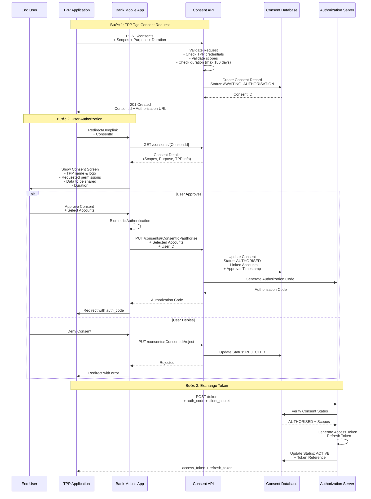

### Cấu Trúc Consent Record

```json
{
  "consentId": "consent-abc123xyz",
  "status": "ACTIVE",
  "createdDateTime": "2024-12-11T09:00:00+07:00",
  "statusUpdateDateTime": "2024-12-11T09:05:00+07:00",
  "expirationDateTime": "2025-06-09T09:05:00+07:00",
  
  "tppInfo": {
    "clientId": "tpp-12345",
    "clientName": "Example Fintech",
    "logoUrl": "https://example.com/logo.png"
  },
  
  "permissions": [
    "accounts.read",
    "accounts.balance.read",
    "transactions.read"
  ],
  
  "purpose": "Cung cấp dịch vụ quản lý tài chính cá nhân",
  
  "authorisation": {
    "userId": "user-67890",
    "authorisedDateTime": "2024-12-11T09:05:00+07:00",
    "authenticationMethod": "BIOMETRIC",
    "selectedAccounts": [
      {
        "accountId": "acc-111",
        "accountType": "CURRENT",
        "permissions": ["balance.read", "transactions.read"]
      },
      {
        "accountId": "acc-222",
        "accountType": "SAVINGS",
        "permissions": ["balance.read"]
      }
    ]
  },
  
  "tokenInfo": {
    "accessTokenHash": "sha256_hash_of_token",
    "refreshTokenHash": "sha256_hash_of_refresh_token",
    "tokenIssuedAt": "2024-12-11T09:05:30+07:00",
    "tokenExpiresAt": "2024-12-11T09:20:30+07:00"
  },
  
  "auditTrail": [
    {
      "timestamp": "2024-12-11T09:00:00+07:00",
      "action": "CONSENT_CREATED",
      "actor": "TPP",
      "details": "Consent request initiated"
    },
    {
      "timestamp": "2024-12-11T09:05:00+07:00",
      "action": "CONSENT_AUTHORISED",
      "actor": "USER",
      "details": "User approved via biometric"
    },
    {
      "timestamp": "2024-12-11T09:05:30+07:00",
      "action": "TOKEN_ISSUED",
      "actor": "SYSTEM",
      "details": "Access token generated"
    }
  ]
}
```

### Consent Lifecycle States

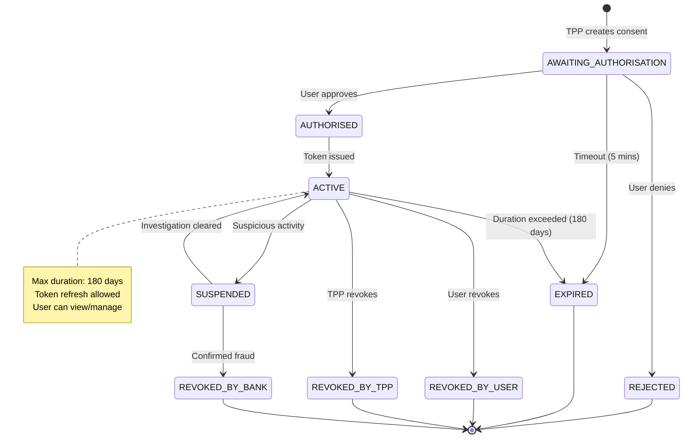

### Consent Storage & Security

**Database Schema:**

```sql
CREATE TABLE consents (
    consent_id VARCHAR(50) PRIMARY KEY,
    tpp_client_id VARCHAR(50) NOT NULL,
    user_id VARCHAR(50),
    status VARCHAR(30) NOT NULL,
    
    -- Permissions
    permissions JSON NOT NULL,
    purpose TEXT NOT NULL,
    
    -- Timestamps
    created_at TIMESTAMP NOT NULL,
    authorised_at TIMESTAMP,
    expires_at TIMESTAMP NOT NULL,
    revoked_at TIMESTAMP,
    
    -- Linked accounts (encrypted)
    selected_accounts JSON,
    
    -- Token references (hashed)
    access_token_hash VARCHAR(64),
    refresh_token_hash VARCHAR(64),
    
    -- Audit
    audit_trail JSON,
    
    INDEX idx_user_id (user_id),
    INDEX idx_tpp_client_id (tpp_client_id),
    INDEX idx_status (status),
    INDEX idx_expires_at (expires_at)
);
```

**Security Measures:**
- Consent ID: Cryptographically random (UUID v4)
- Account data: Encrypted at rest (AES-256)
- Token hashes: SHA-256 (không lưu token gốc)
- Audit trail: Immutable log
- Access control: Row-level security

### User Consent Management Portal

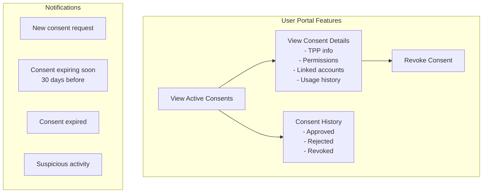

### API Endpoints

#### 1. Create Consent (TPP)

**POST /v1/consents**

```json
{
  "permissions": [
    "accounts.read",
    "accounts.balance.read",
    "transactions.read"
  ],
  "expirationDateTime": "2025-06-09T09:00:00+07:00",
  "purpose": "Cung cấp dịch vụ quản lý tài chính cá nhân"
}
```

**Response:**
```json
{
  "consentId": "consent-abc123xyz",
  "status": "AWAITING_AUTHORISATION",
  "createdDateTime": "2024-12-11T09:00:00+07:00",
  "expirationDateTime": "2025-06-09T09:00:00+07:00",
  "authorisationUrl": "https://bank.vn/authorize?consent_id=consent-abc123xyz"
}
```

#### 2. Get Consent Details

**GET /v1/consents/{consentId}**

```json
{
  "consentId": "consent-abc123xyz",
  "status": "ACTIVE",
  "permissions": ["accounts.read", "accounts.balance.read"],
  "tppInfo": {
    "clientId": "tpp-12345",
    "clientName": "Example Fintech"
  },
  "authorisation": {
    "authorisedDateTime": "2024-12-11T09:05:00+07:00",
    "accountsCount": 2
  },
  "expirationDateTime": "2025-06-09T09:05:00+07:00"
}
```

#### 3. Revoke Consent (User or TPP)

**DELETE /v1/consents/{consentId}**

```json
{
  "revocationReason": "USER_REQUESTED",
  "revokedBy": "user-67890",
  "revokedAt": "2024-12-11T10:00:00+07:00"
}
```

### Consent Validation Flow

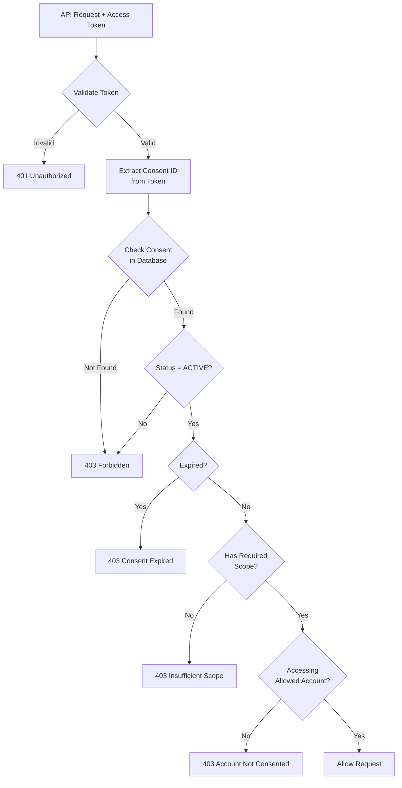

### Compliance & Best Practices

**Thông tư 64/2024 Requirements:**
- ✅ Thời hạn tối đa: 180 ngày
- ✅ Sự đồng ý rõ ràng (Explicit consent)
- ✅ Quyền rút lại bất cứ lúc nào
- ✅ Thông báo khi consent sắp hết hạn

**Nghị định 13/2023 (GDPR-like):**
- ✅ Purpose limitation (Mục đích cụ thể)
- ✅ Data minimization (Chỉ thu thập dữ liệu cần thiết)
- ✅ Transparency (Minh bạch về việc sử dụng dữ liệu)
- ✅ Right to withdraw (Quyền rút lại đồng ý)

**Security Best Practices:**
- Consent ID phải random và không đoán được
- Lưu audit trail đầy đủ
- Encrypt sensitive data
- Rate limiting cho consent creation
- Monitor suspicious patterns


## Các Cấp Độ Xác Thực theo QĐ 2345

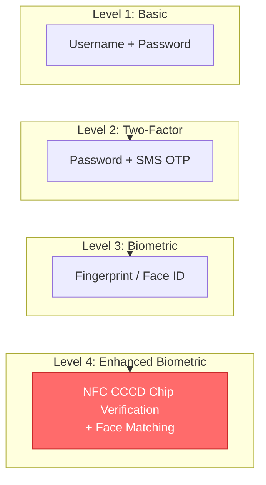

### Quy Định Áp Dụng

| Loại Giao Dịch     | Giá Trị        | Cấp Độ Bắt Buộc |
| ------------------ | -------------- | --------------- |
| Truy vấn thông tin | Bất kỳ         | Level 2         |
| Chuyển tiền        | < 10 triệu VND | Level 3         |
| Chuyển tiền        | ≥ 10 triệu VND | Level 4         |
| Mở thẻ tín dụng    | Bất kỳ         | Level 4         |
| Thay đổi hạn mức   | Bất kỳ         | Level 4         |

## NFC CCCD Verification Flow

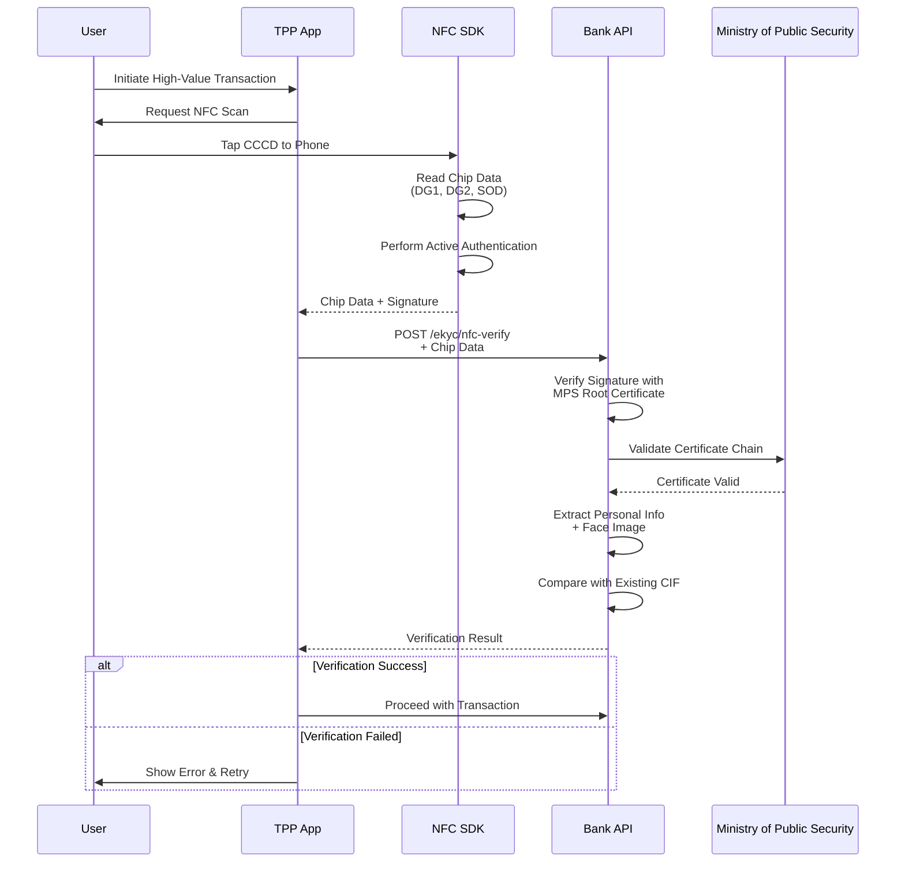

## Token Management

### Access Token Lifecycle

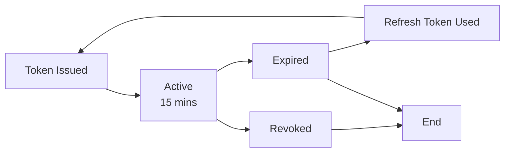

### Token Scopes

| Scope                   | Mô Tả                   | Thời Hạn Tối Đa |
| ----------------------- | ----------------------- | --------------- |
| `accounts.read`         | Đọc danh sách tài khoản | 180 ngày        |
| `accounts.balance.read` | Đọc số dư               | 180 ngày        |
| `transactions.read`     | Đọc lịch sử giao dịch   | 180 ngày        |
| `payments.write`        | Khởi tạo thanh toán     | 1 lần sử dụng   |
| `cards.read`            | Đọc thông tin thẻ       | 180 ngày        |
| `cards.write`           | Quản lý thẻ             | 90 ngày         |

## Security Best Practices

### 1. Transport Security
- **TLS 1.3** bắt buộc cho tất cả connections
- **Certificate Pinning** cho mobile apps
- **HSTS** (HTTP Strict Transport Security) enabled

### 2. API Security
- **Rate Limiting**: 100 req/min per client
- **IP Whitelisting** cho production environment
- **Request Signing** (JWS) cho tất cả mutation operations

### 3. Data Protection
- **Encryption at Rest**: AES-256
- **Encryption in Transit**: TLS 1.3
- **PII Masking** trong logs và responses
- **Data Retention**: 
  - Transaction logs: 5 năm
  - Access logs: 3 tháng online, 1 năm offline

### 4. Incident Response
- **Real-time Monitoring** cho suspicious activities
- **Automated Alerts** cho failed authentication attempts
- **Breach Notification** trong vòng 72 giờ

## Compliance Checklist

- [ ] OAuth 2.0 + PKCE implementation
- [ ] FAPI Security Profile compliance
- [ ] JWS signing cho financial transactions
- [ ] Consent management system
- [ ] NFC CCCD verification (QĐ 2345)
- [ ] Token expiry enforcement (180 days max)
- [ ] Audit logging (3 months + 1 year backup)
- [ ] HSM integration cho key management
- [ ] mTLS cho internal services
- [ ] Penetration testing quarterly

## Tài Liệu Tham Khảo
- RFC 6749: OAuth 2.0 Authorization Framework
- RFC 7636: PKCE for OAuth 2.0
- RFC 7515: JSON Web Signature (JWS)
- FAPI Security Profile 1.0
- Quyết định 2345/QĐ-NHNN
- Thông tư 64/2024/TT-NHNN
