# Quản Trị API & Onboarding TPP

> **Tuân thủ:** Thông tư 64/2024/TT-NHNN - Điều 8, 9, 10 | Open Banking UK Standards | FAPI 2.0 | ISO 27001:2022

## Tổng Quan

Quy trình onboarding TPP (Third Party Provider) từ môi trường Sandbox đến Production, bao gồm quản lý vòng đời API và Developer Portal, tuân thủ đầy đủ Thông tư 64/2024/TT-NHNN.

### Mục Tiêu

1. **Tuân thủ pháp lý**: Đáp ứng yêu cầu Điều 8, 9, 10 của Thông tư 64/2024/TT-NHNN
2. **Quản lý TPP hiệu quả**: Từ đăng ký, KYB, testing đến production deployment
3. **API Lifecycle Management**: Quản lý vòng đời API theo chuẩn quốc tế
4. **Developer Experience**: Cung cấp Developer Portal hiện đại với đầy đủ tài liệu và công cụ

## Quy Trình Onboarding TPP

### Tổng Quan Quy Trình (4 Giai Đoạn)

```mermaid
%%{init: {'theme':'base', 'themeVariables': { 'fontSize':'14px'}}}%%
flowchart TB
    subgraph Phase1["🔰 GIAI ĐOẠN 1: ĐĂNG KÝ & XÁC THỰC (3-5 ngày)"]
        direction TB
        Start([⭐ BẮT ĐẦU]) --> Register["📝 TPP Đăng Ký<br/>---<br/>• Thông tin doanh nghiệp<br/>• Giấy ĐKKD<br/>• Giấy phép TGTT"]
        Register --> Submit["📤 Nộp Hồ Sơ KYB<br/>---<br/>• Giấy ủy quyền<br/>• Thông tin đại diện<br/>• Chứng chỉ kỹ thuật"]
        Submit --> Review{"🔍 Thẩm Định KYB<br/>---<br/>Ngân hàng xét duyệt"}
        
        Review -->|"❌ Không đạt"| Reject1["⛔ TỪ CHỐI<br/>---<br/>• Thông báo lý do<br/>• Hướng dẫn bổ sung"]
        Review -->|"✅ Đạt yêu cầu"| Approve1["✅ PHÊ DUYỆT<br/>---<br/>Cấp tài khoản Sandbox"]
    end

    subgraph Phase2["🧪 GIAI ĐOẠN 2: KIỂM THỬ SANDBOX (2-4 tuần)"]
        direction TB
        Approve1 --> GetAccess["🔑 Cấp Quyền Truy Cập<br/>---<br/>• Client ID/Secret UAT<br/>• API Documentation<br/>• Mock Data & Test Suite"]
        GetAccess --> DevTest["💻 Phát Triển & Kiểm Thử<br/>---<br/>• Tích hợp API<br/>• Functional Tests<br/>• Security Tests"]
        DevTest --> RunTest["🧪 Chạy Test Suite<br/>---<br/>• 100+ test cases<br/>• Security validation<br/>• Performance tests"]
        RunTest --> CheckResult{"📊 Đánh Giá Kết Quả<br/>---<br/>Phải đạt 100%"}
        
        CheckResult -->|"❌ Chưa đạt"| FixBug["🔧 Sửa Lỗi<br/>---<br/>• Xem test reports<br/>• Debug & fix<br/>• Retest"]
        FixBug --> RunTest
        CheckResult -->|"✅ Pass 100%"| RequestProd["🚀 Yêu Cầu Go-Live<br/>---<br/>• Báo cáo test đầy đủ<br/>• Cam kết SLA"]
    end

    subgraph Phase3["🏭 GIAI ĐOẠN 3: TRIỂN KHAI PRODUCTION (1-2 tuần)"]
        direction TB
        RequestProd --> Legal["📋 Ký Kết Hợp Đồng<br/>---<br/>• Hợp đồng dịch vụ<br/>• SLA Agreement<br/>• Pricing model"]
        Legal --> Security["🔐 Cấu Hình Bảo Mật<br/>---<br/>• Public Key (JWS)<br/>• mTLS Certificate<br/>• IP Whitelisting"]
        Security --> FinalApproval{"✓ Phê Duyệt Cuối<br/>---<br/>Ban Giám Đốc"}
        
        FinalApproval -->|"❌ Từ chối"| Reject2["⛔ KHÔNG PHÊ DUYỆT<br/>---<br/>Yêu cầu bổ sung"]
        FinalApproval -->|"✅ Chấp thuận"| Deploy["🎯 Kích Hoạt Production<br/>---<br/>• Production Credentials<br/>• Real environment<br/>• Go Live"]
    end

    subgraph Phase4["📈 GIAI ĐOẠN 4: VẬN HÀNH (Liên tục)"]
        direction TB
        Deploy --> Live["🟢 HOẠT ĐỘNG<br/>---<br/>• Xử lý giao dịch<br/>• Real-time monitoring<br/>• Reporting"]
        Live --> Monitor{"📊 Giám Sát SLA<br/>---<br/>• Uptime ≥ 99.9%<br/>• Response < 1s<br/>• Error rate < 1%"}
        
        Monitor -->|"✅ Đạt SLA"| Live
        Monitor -->|"⚠️ Vi phạm"| Suspend["⏸️ TẠM NGƯNG<br/>---<br/>• Warning<br/>• Yêu cầu khắc phục<br/>• Deadline 30 ngày"]
        Monitor -->|"🚨 Nghiêm trọng"| Revoke["🔴 THU HỒI<br/>---<br/>• Ngừng dịch vụ<br/>• Thanh lý hợp đồng"]
        
        Suspend --> Recovery{"🔄 Khắc Phục?"}
        Recovery -->|"✅ Thành công"| Live
        Recovery -->|"❌ Thất bại"| Revoke
    end

    Reject1 -.->|"Có thể đăng ký lại"| Start
    Reject2 -.->|"Bổ sung hồ sơ"| Legal

    classDef startStyle fill:#90EE90,stroke:#2E7D32,stroke-width:3px,color:#000
    classDef successStyle fill:#4CAF50,stroke:#1B5E20,stroke-width:2px,color:#fff
    classDef warningStyle fill:#FFD54F,stroke:#F57F17,stroke-width:2px,color:#000
    classDef errorStyle fill:#EF5350,stroke:#C62828,stroke-width:2px,color:#fff
    classDef processStyle fill:#64B5F6,stroke:#1565C0,stroke-width:2px,color:#000
    classDef decisionStyle fill:#FFB74D,stroke:#E65100,stroke-width:2px,color:#000
    classDef infoStyle fill:#81C784,stroke:#2E7D32,stroke-width:2px,color:#000

    class Start startStyle
    class Live successStyle
    class Suspend warningStyle
    class Reject1,Reject2,Revoke errorStyle
    class Register,Submit,GetAccess,DevTest,Legal,Security,Deploy processStyle
    class Review,CheckResult,FinalApproval,Monitor,Recovery decisionStyle
    class Approve1,RequestProd infoStyle
```

## Chi Tiết Các Giai Đoạn Onboarding

### Giai Đoạn 1: Đăng Ký & KYB (Know Your Business)

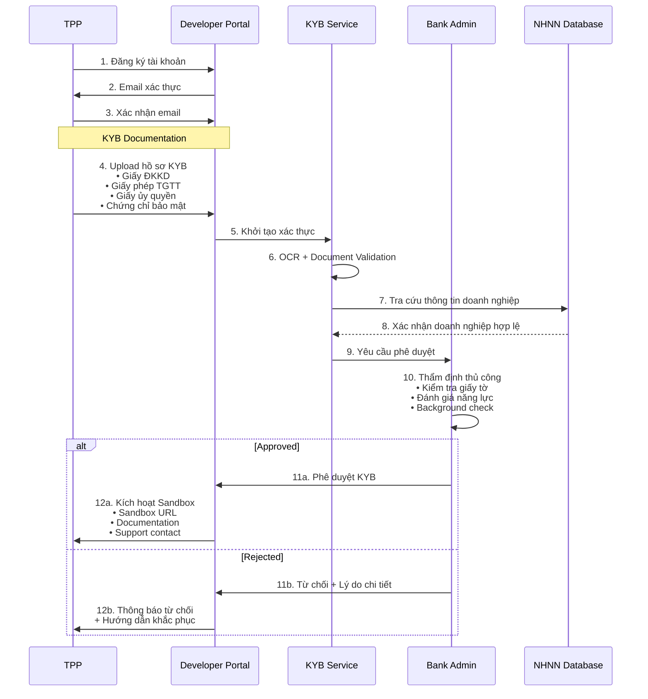

**Yêu Cầu Hồ Sơ KYB:**

| Loại Hồ Sơ | Nội Dung | Định Dạng | Yêu Cầu |
|-------------|----------|-----------|---------|
| **Giấy ĐKKD** | Giấy đăng ký kinh doanh | PDF, JPG | Còn hiệu lực, rõ ràng |
| **Giấy phép TGTT** | Giấy phép cung cấp dịch vụ TGTT | PDF | Theo NĐ 101/2012/NĐ-CP |
| **Giấy ủy quyền** | Ủy quyền cho người đại diện | PDF | Có chữ ký, con dấu |
| **Chứng chỉ bảo mật** | ISO 27001 hoặc tương đương | PDF | Khuyến nghị |
| **Thông tin kỹ thuật** | Team size, experience, infrastructure | JSON/PDF | Bắt buộc |

### Giai Đoạn 2: Sandbox Testing

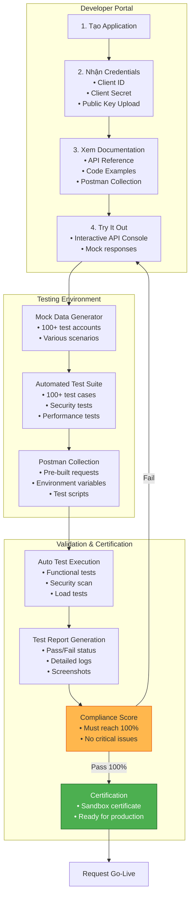

**Test Suite Coverage:**

| Test Category | Test Cases | Pass Criteria |
|---------------|-----------|---------------|
| **Authentication** | OAuth 2.1 + PKCE flow | 100% |
| **Authorization** | Consent management | 100% |
| **Account APIs** | GET /accounts, /balances | 100% |
| **Transaction APIs** | GET /transactions | 100% |
| **Payment APIs** | POST /payments | 100% |
| **Security** | JWS, mTLS, encryption | 100% |
| **Error Handling** | All error scenarios | 100% |
| **Performance** | Response time < SLA | 100% |
| **Idempotency** | Duplicate requests | 100% |
| **Rate Limiting** | Throttling behavior | 100% |

### Giai Đoạn 3: Production Deployment

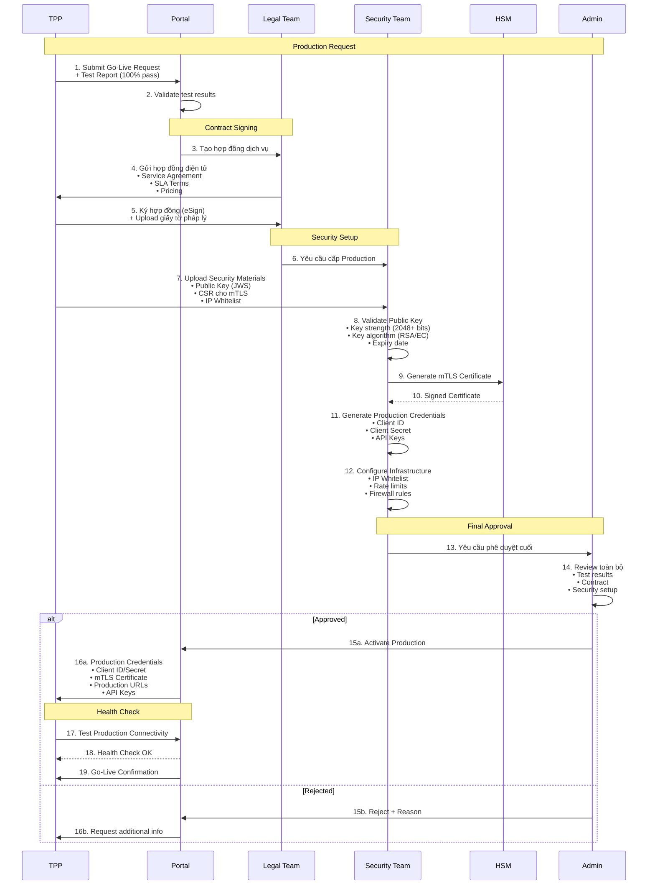

**Production Checklist:**

- [ ] Test Report: 100% pass all test cases
- [ ] Security Audit: Passed security scan
- [ ] Contract: Signed service agreement
- [ ] Public Key: Uploaded and validated (≥2048 bits)
- [ ] mTLS CSR: Certificate signing request submitted
- [ ] IP Whitelist: Production IPs provided
- [ ] SLA Commitment: Agreed to 99.9% uptime
- [ ] Support Contact: 24/7 contact details
- [ ] Incident Response: Procedures documented
- [ ] Data Protection: GDPR/PDPA compliance confirmed

### Giai Đoạn 4: Vận Hành & Monitoring

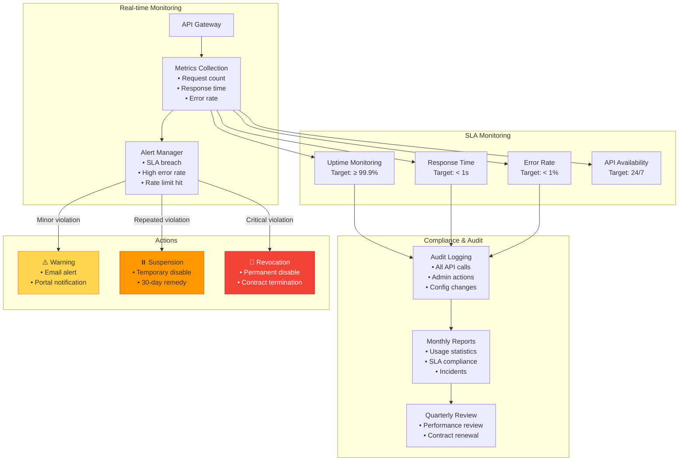

**SLA Metrics:**

| Metric | Target | Measurement | Action if Breach |
|--------|--------|-------------|------------------|
| **Uptime** | ≥ 99.9% | Monthly | Warning after 2 breaches |
| **Response Time** | < 1s (P95) | Per API call | Investigation if > 1.5s |
| **Error Rate** | < 1% | Per hour | Alert if > 5% |
| **Availability** | 24/7 | Continuous | Immediate alert |
| **Data Accuracy** | 100% | Per transaction | Immediate investigation |
| **Security Incidents** | 0 | Per month | Immediate suspension |

## API Lifecycle Management

### Vòng Đời API

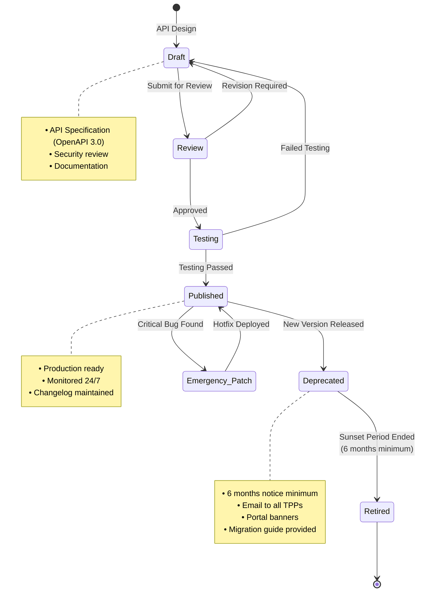

### API Versioning Strategy

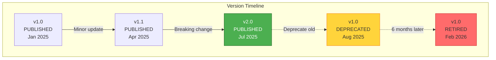

**Versioning Rules:**

1. **Major Version** (v1 → v2): Breaking changes
   - URL changes from `/v1/` to `/v2/`
   - Backward incompatible
   - Minimum 6-month deprecation period for old version

2. **Minor Version** (v1.0 → v1.1): New features, backward compatible
   - No URL change
   - Old clients continue to work
   - New optional parameters

3. **Patch Version** (v1.0.1): Bug fixes
   - No impact on clients
   - Security patches applied immediately

**Sunset Policy:**

| Phase | Duration | Actions |
|-------|----------|---------|
| **Announcement** | T-6 months | Email to all TPPs, Portal banner |
| **Warning** | T-3 months | Weekly emails, API response headers |
| **Final Notice** | T-1 month | Daily emails, Dashboard warnings |
| **Retirement** | T-day | API returns 410 Gone |

## Developer Portal

### Portal Architecture

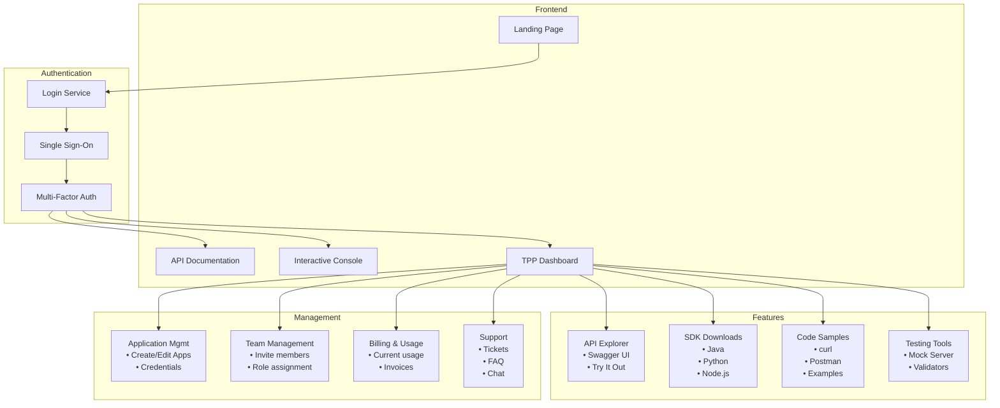

### TPP Dashboard Features

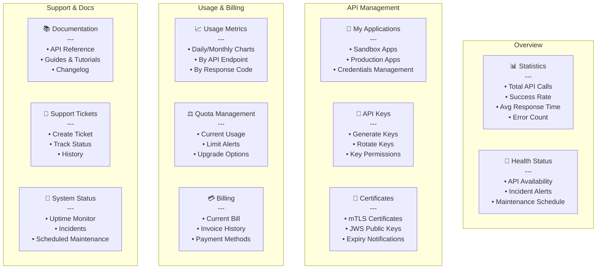

### API Documentation Structure

**OpenAPI 3.0 Specification** được cung cấp đầy đủ cho tất cả API:

```yaml
# Example OpenAPI Structure
openapi: 3.0.0
info:
  title: Open Banking API
  version: 1.0.0
  description: |
    Tuân thủ Thông tư 64/2024/TT-NHNN
    
servers:
  - url: https://api.sandbox.bank.vn/v1
    description: Sandbox Environment
  - url: https://api.bank.vn/v1
    description: Production Environment

security:
  - OAuth2:
      - accounts:read
      - payments:write
  - mTLS: []

paths:
  /accounts:
    get:
      summary: Get account list
      security:
        - OAuth2: [accounts:read]
      responses:
        '200':
          description: Success
          content:
            application/json:
              schema:
                $ref: '#/components/schemas/AccountList'
```

**Documentation Includes:**

- 📖 **API Reference**: Complete endpoint documentation
- 💡 **Getting Started Guide**: Step-by-step tutorial
- 🔐 **Authentication Guide**: OAuth 2.1 + PKCE setup
- 📝 **Code Examples**: curl, JavaScript, Python, Java
- 🧪 **Testing Guide**: How to use Sandbox
- ⚠️ **Error Handling**: Error codes and solutions
- 📊 **Best Practices**: Performance, security tips
- 🔄 **Changelog**: Version history
- 📞 **Support**: Contact information

## Security Controls

### Access Control Matrix

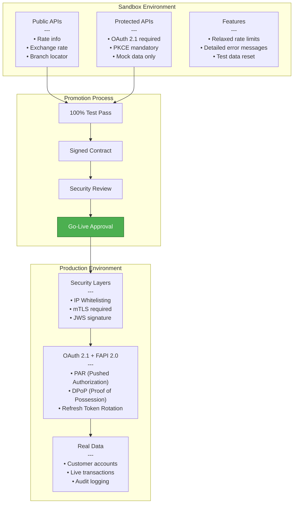

### Authentication Methods

**Sandbox:**
- OAuth 2.1 với PKCE
- Client credentials flow cho machine-to-machine
- Test certificates provided
- Mock mTLS (không bắt buộc)

**Production:**
- OAuth 2.1 + PKCE (bắt buộc)
- mTLS (mutual TLS) - bắt buộc
- JWS (JSON Web Signature) - bắt buộc cho PIS
- DPoP (Demonstrating Proof of Possession)
- IP Whitelisting

### Key Management

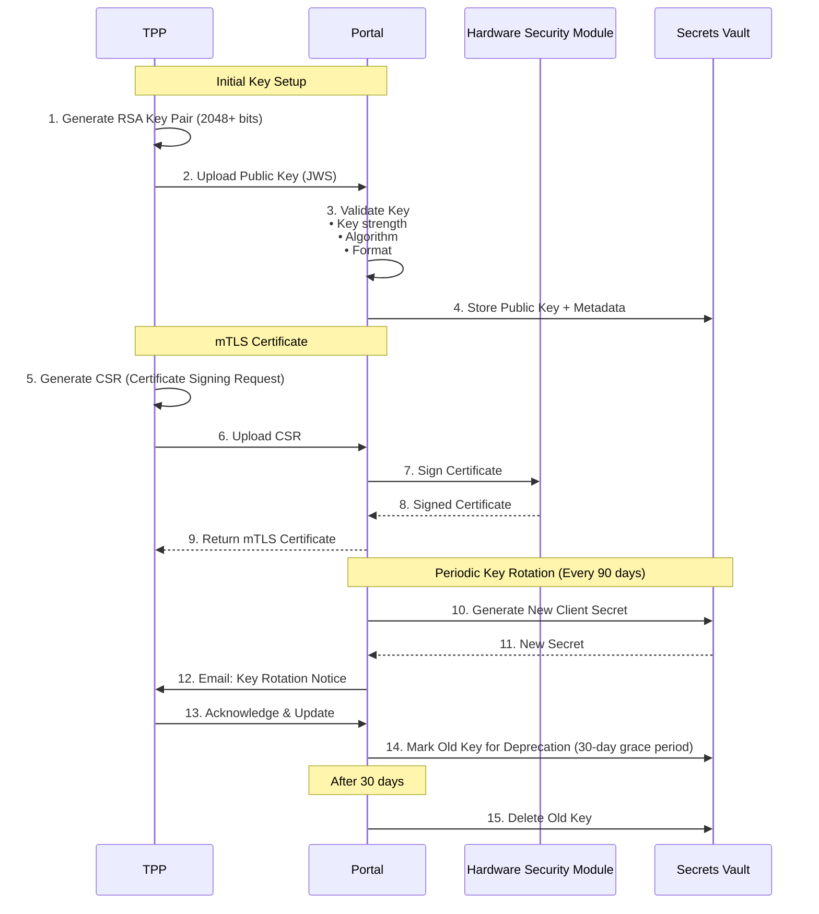

**Key Requirements:**

| Key Type | Algorithm | Min Strength | Max Age | Rotation |
|----------|-----------|--------------|---------|----------|
| **JWS Signing** | RSA, EC | 2048 bits | 2 years | Manual |
| **mTLS Client Cert** | RSA | 2048 bits | 1 year | Manual before expiry |
| **Client Secret** | Random | 256 bits | 90 days | Automatic |
| **API Keys** | Random | 256 bits | No limit | On demand |

## Rate Limiting & Quota Management

### Rate Limiting Strategy

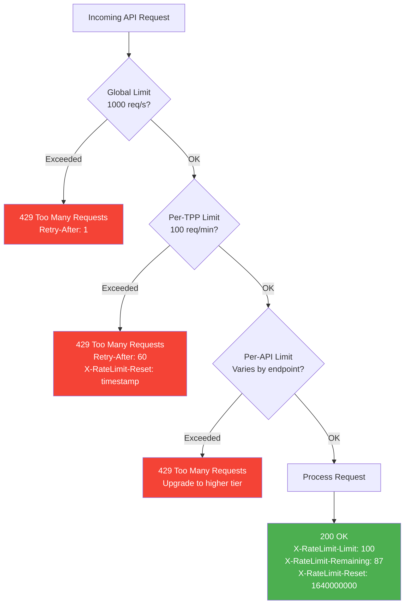

### Quota Tiers

| Tier | Monthly Quota | Rate Limit (req/min) | Price (VND/month) | Support |
|------|---------------|----------------------|-------------------|---------|
| **Sandbox** | Unlimited | 10 | Free | Community |
| **Basic** | 100,000 | 50 | 5,000,000 | Email |
| **Professional** | 1,000,000 | 100 | 30,000,000 | Email + Phone |
| **Enterprise** | Unlimited | Custom | Custom | 24/7 Dedicated |

**Rate Limit Headers:**

```http
X-RateLimit-Limit: 100
X-RateLimit-Remaining: 87
X-RateLimit-Reset: 1640000000
X-RateLimit-Tier: Professional
Retry-After: 60
```

## Monitoring & Analytics

### Real-time Metrics Dashboard

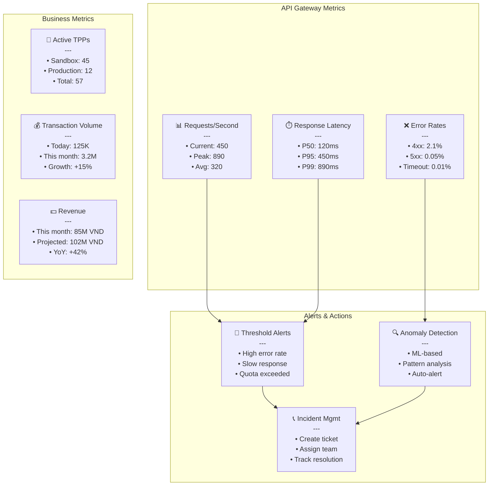

### SLA Monitoring & Reporting

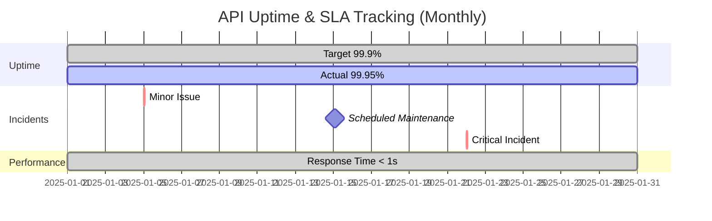

**SLA Reports Include:**

- ✅ Uptime percentage
- ⏱️ Average response time (P50, P95, P99)
- ❌ Error rate breakdown
- 📊 API call volume
- 🔧 Incident summary
- 💰 SLA credits (if applicable)
- 📈 Trend analysis

## Compliance & Audit

### Audit Logging

**Tuân thủ ISO 27001:2022 và Thông tư 64/2024/TT-NHNN**

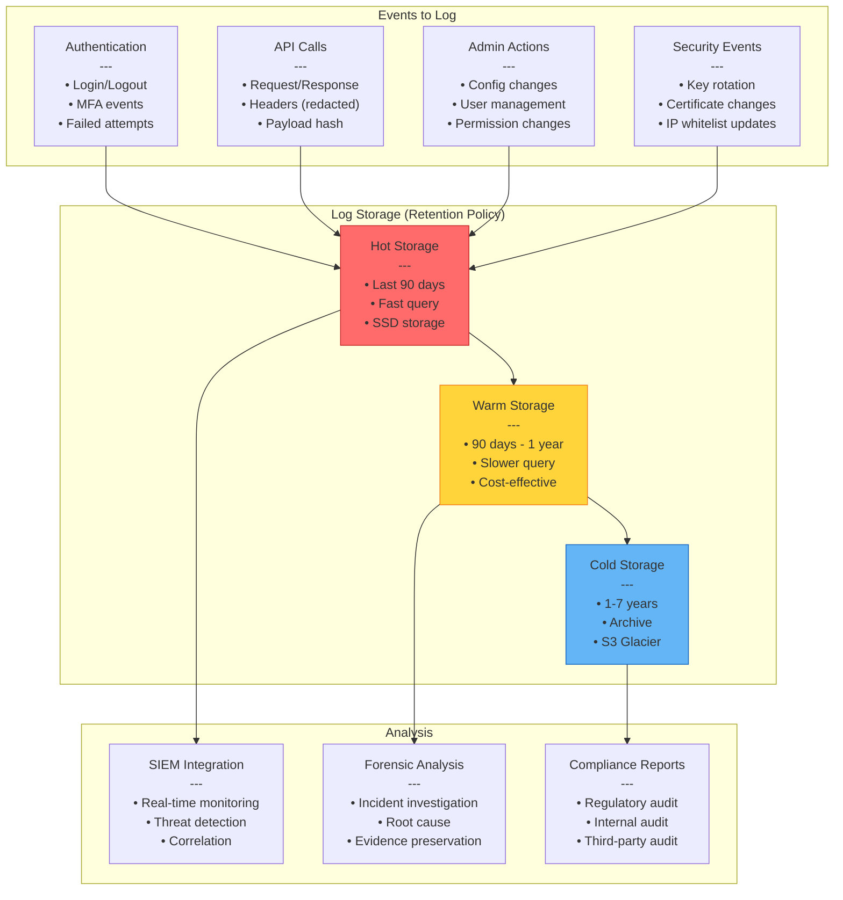

**Audit Log Fields:**

```json
{
  "event_id": "evt_20251215_103045_abc123",
  "timestamp": "2025-12-15T10:30:45.123Z",
  "event_type": "api.call",
  "actor": {
    "tpp_id": "TPP-12345",
    "tpp_name": "FinTech Solutions Ltd",
    "ip": "203.162.4.190"
  },
  "action": "GET /v1/accounts",
  "resource": {
    "type": "account",
    "id": "acc_xyz789"
  },
  "result": "success",
  "status_code": 200,
  "response_time_ms": 245,
  "request_id": "req-uuid-1234-5678"
}
```

## Incident Management

### Incident Response Process

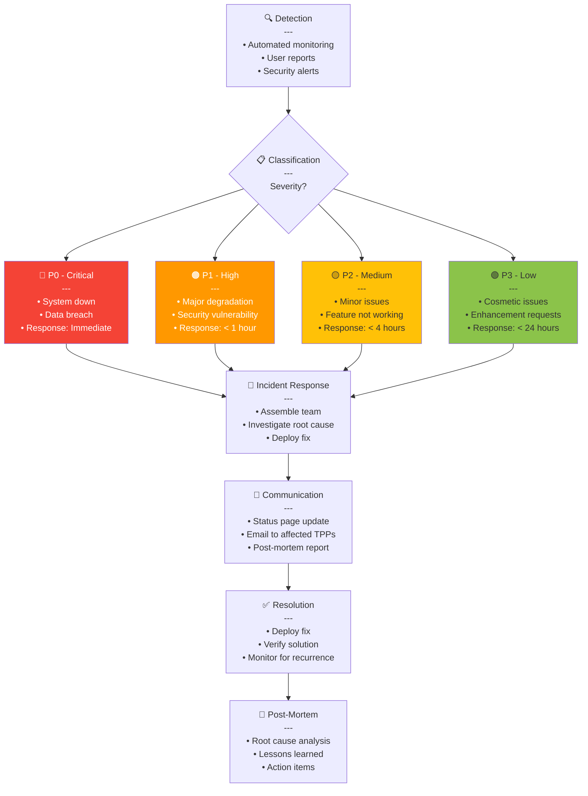

### Status Page

**Public Status Page** (https://status.bank.vn):

- 🟢 All Systems Operational
- 🟡 Partial Outage
- 🔴 Major Outage
- 🔵 Scheduled Maintenance

**Components Monitored:**

- API Gateway
- OAuth Server
- Account Information APIs
- Payment Initiation APIs
- Developer Portal
- Sandbox Environment

**90-Day Uptime History** displayed with incidents.

## Tài Liệu Tham Khảo

### Quy Định Việt Nam
- **Thông tư 64/2024/TT-NHNN** - Quy định Open API trong hoạt động ngân hàng
  - Điều 8: Quản lý cấp quyền truy cập
  - Điều 9: Quy trình onboarding TPP
  - Điều 10: Quản lý vòng đời API
- **Nghị định 13/2023/NĐ-CP** - Bảo vệ dữ liệu cá nhân
- **Circular 45/2025/TT-NHNN** - Xác thực sinh trắc học
- **Circular 50/2024/TT-NHNN** - Strong Customer Authentication

### Tiêu Chuẩn Quốc Tế
- **Open Banking UK** - TPP Onboarding Guidelines v4.0
- **FAPI 2.0** - Financial-grade API Security Profile
- **OAuth 2.1** - Authorization Framework
- **ISO/IEC 27001:2022** - Information Security Management
- **PCI DSS 4.0** - Payment Card Industry Data Security
- **OWASP API Security Top 10 (2023)**

---

**Phiên bản:** 1.0  
**Ngày cập nhật:** 15/12/2025  
**Trạng thái:** Final Draft
