# Quản Trị API & Onboarding TPP

## Tổng Quan

Quy trình onboarding TPP (Third Party Provider) từ môi trường Sandbox đến Production, bao gồm quản lý vòng đời API và Developer Portal.

## Quy Trình Onboarding TPP

```mermaid
%%{init: {'theme':'base', 'themeVariables': { 'fontSize':'14px'}}}%%
flowchart TB
    subgraph Phase1["🔰 PHASE 1: ĐĂNG KÝ & XÁC THỰC (3-5 ngày làm việc)"]
        direction TB
        Start([⭐ BẮT ĐẦU]) --> Register["📝 TPP Đăng Ký<br/>---<br/>• Thông tin công ty<br/>• Email liên hệ<br/>• Số điện thoại"]
        Register --> Submit["📤 Nộp Hồ Sơ<br/>---<br/>• Giấy ĐKKD<br/>• Giấy phép TGTT<br/>• Giấy ủy quyền"]
        Submit --> Review{"🔍 Xét Duyệt KYB<br/>---<br/>Ngân hàng thẩm định"}
        
        Review -->|"❌ Không đạt"| Reject1["⛔ TỪ CHỐI<br/>---<br/>• Thông báo lý do<br/>• Hướng dẫn bổ sung"]
        Review -->|"✅ Đạt yêu cầu"| Approve1["✅ PHÊ DUYỆT<br/>---<br/>Tạo tài khoản Sandbox"]
    end

    subgraph Phase2["🧪 PHASE 2: KIỂM THỬ SANDBOX (2-4 tuần)"]
        direction TB
        Approve1 --> GetAccess["🔑 Cấp Quyền Truy Cập<br/>---<br/>• Client ID/Secret UAT<br/>• API Documentation<br/>• Mock Data"]
        GetAccess --> DevTest["💻 Phát Triển & Kiểm Thử<br/>---<br/>• Tích hợp API<br/>• Test với Mock Data<br/>• Xử lý lỗi"]
        DevTest --> RunTest["🧪 Chạy Test Suite<br/>---<br/>• Functional Tests<br/>• Security Tests<br/>• Performance Tests"]
        RunTest --> CheckResult{"📊 Đánh Giá Kết Quả<br/>---<br/>Phải đạt 100%"}
        
        CheckResult -->|"❌ Chưa đạt"| FixBug["🔧 Sửa Lỗi & Thử Lại<br/>---<br/>• Xem logs<br/>• Debug<br/>• Retest"]
        FixBug --> RunTest
        CheckResult -->|"✅ Pass 100%"| RequestProd["🚀 Yêu Cầu Go-Live<br/>---<br/>• Submit báo cáo test<br/>• Cam kết SLA"]
    end

    subgraph Phase3["🏭 PHASE 3: TRIỂN KHAI PRODUCTION (1-2 tuần)"]
        direction TB
        RequestProd --> Legal["📋 Ký Kết Hợp Đồng<br/>---<br/>• Hợp đồng dịch vụ<br/>• Điều khoản SLA<br/>• Bảng giá"]
        Legal --> Security["🔐 Cấu Hình Bảo Mật<br/>---<br/>• Upload Public Key<br/>• Cấp mTLS Certificate<br/>• IP Whitelisting"]
        Security --> FinalApproval{"✓ Phê Duyệt Cuối<br/>---<br/>Ban Giám Đốc"}
        
        FinalApproval -->|"❌ Từ chối"| Reject2["⛔ KHÔNG PHÊ DUYỆT<br/>---<br/>Yêu cầu bổ sung"]
        FinalApproval -->|"✅ Chấp thuận"| Deploy["🎯 Kích Hoạt Production<br/>---<br/>• Production Credentials<br/>• Môi trường thật<br/>• Dữ liệu thật"]
    end

    subgraph Phase4["📈 PHASE 4: VẬN HÀNH (Liên tục)"]
        direction TB
        Deploy --> Live["🟢 HOẠT ĐỘNG<br/>---<br/>• Xử lý giao dịch<br/>• Giám sát real-time<br/>• Báo cáo định kỳ"]
        Live --> Monitor{"📊 Giám Sát SLA<br/>---<br/>• Uptime ≥ 99.9%<br/>• Response time<br/>• Error rate"}
        
        Monitor -->|"✅ Đạt SLA"| Live
        Monitor -->|"⚠️ Vi phạm thường xuyên"| Suspend["⏸️ TẠM NGƯNG<br/>---<br/>• Cảnh báo<br/>• Yêu cầu khắc phục<br/>• Thời hạn 30 ngày"]
        Monitor -->|"🚨 Vi phạm nghiêm trọng"| Revoke["🔴 THU HỒI<br/>---<br/>• Ngừng dịch vụ<br/>• Thanh lý hợp đồng"]
        
        Suspend --> Recovery{"🔄 Khắc Phục?"}
        Recovery -->|"✅ Thành công"| Live
        Recovery -->|"❌ Không khắc phục"| Revoke
    end

    Reject1 -.->|"Có thể đăng ký lại"| Start
    Reject2 -.->|"Bổ sung hồ sơ"| Legal

    classDef startStyle fill:#90EE90,stroke:#2E7D32,stroke-width:3px,color:#000
    classDef successStyle fill:#4CAF50,stroke:#1B5E20,stroke-width:2px,color:#fff
    classDef warningStyle fill:#FFD54F,stroke:#F57F17,stroke-width:2px,color:#000
    classDef errorStyle fill:#EF5350,stroke:#C62828,stroke-width:2px,color:#fff
    classDef processStyle fill:#64B5F6,stroke:#1565C0,stroke-width:2px,color:#000
    classDef decisionStyle fill:#FFB74D,stroke:#E65100,stroke-width:2px,color:#000
    classDef infoStyle fill:#81C784,stroke:#2E7D32,stroke-width:2px,color:#000

    class Start startStyle
    class Live successStyle
    class Suspend warningStyle
    class Reject1,Reject2,Revoke errorStyle
    class Register,Submit,GetAccess,DevTest,Legal,Security,Deploy processStyle
    class Review,CheckResult,FinalApproval,Monitor,Recovery decisionStyle
    class Approve1,RequestProd infoStyle
```

## Chi Tiết Các Giai Đoạn Onboarding

### Giai Đoạn 1: Đăng Ký & KYB

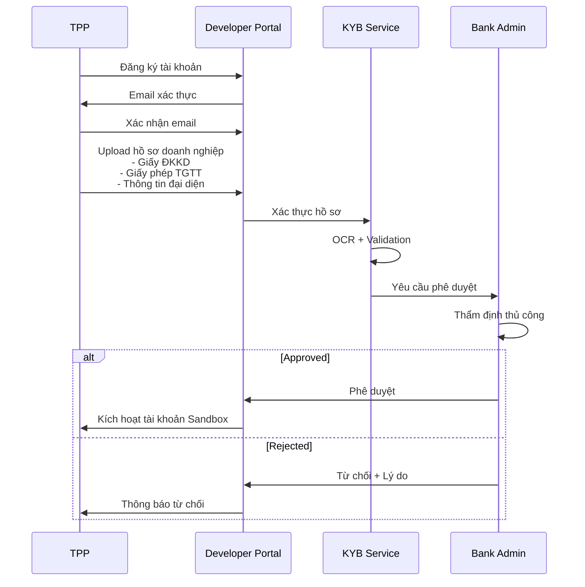

### Giai Đoạn 2: Sandbox Testing

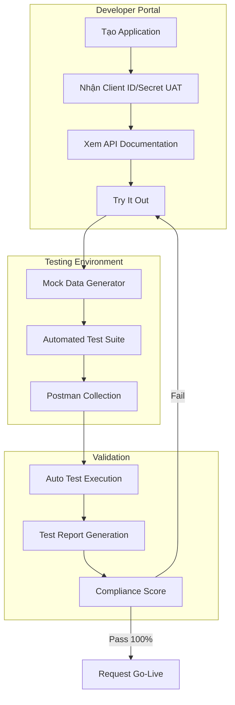

### Giai Đoạn 3: Production Deployment

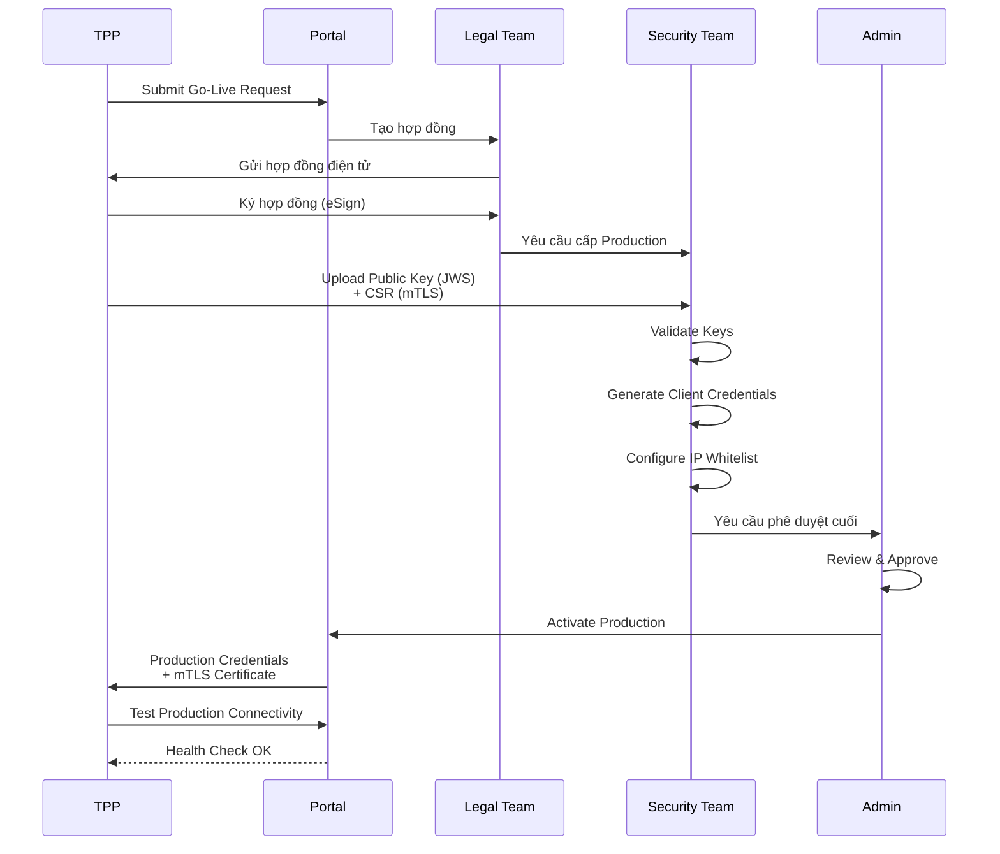

## API Lifecycle Management

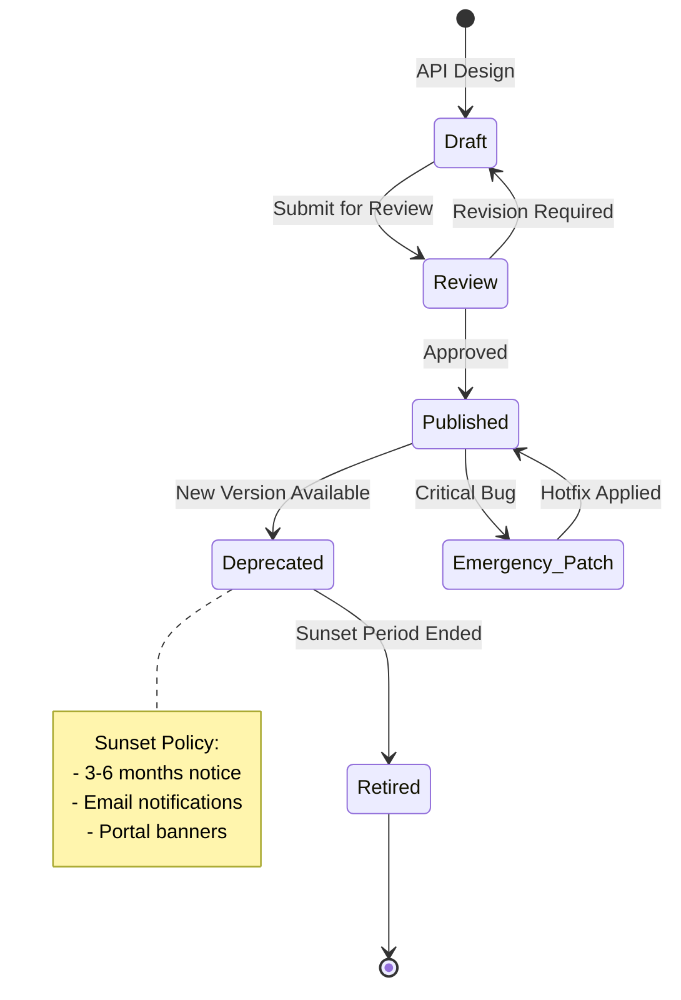

### Versioning Strategy

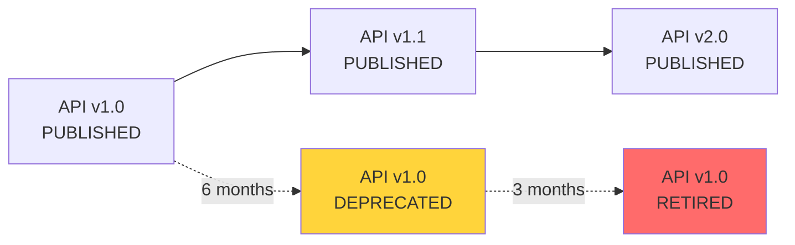

## Developer Portal Features

### Dashboard Overview

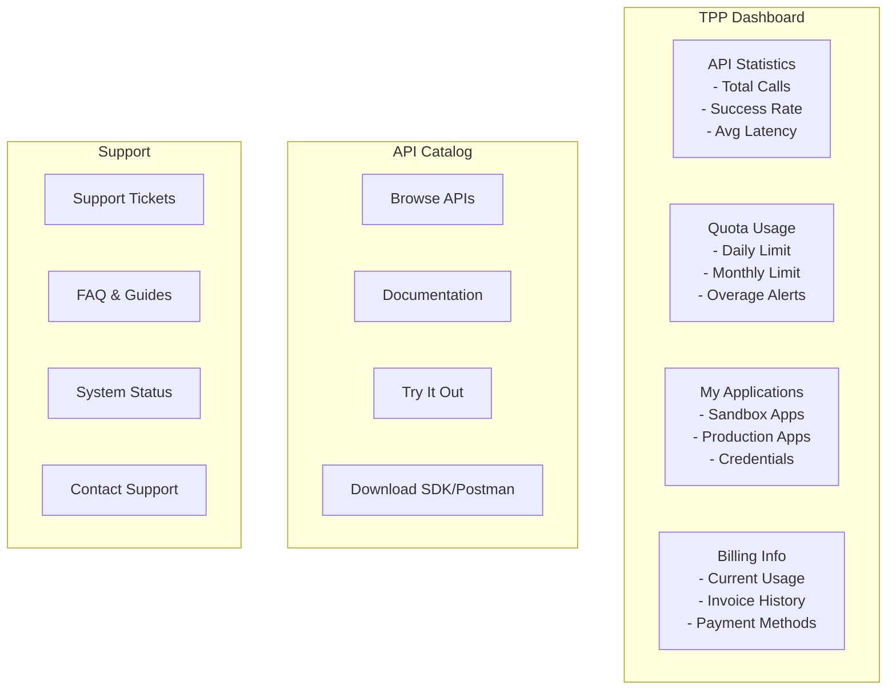

### API Documentation Structure

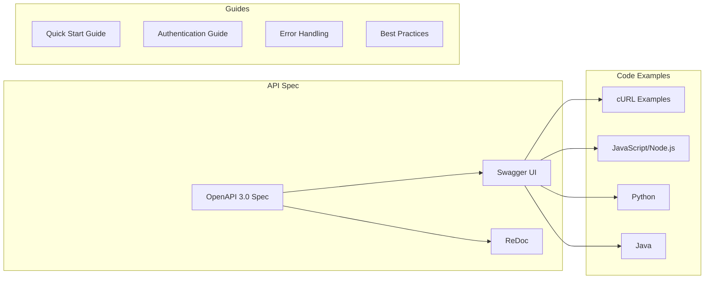

## Monitoring & Analytics

### Real-time Metrics

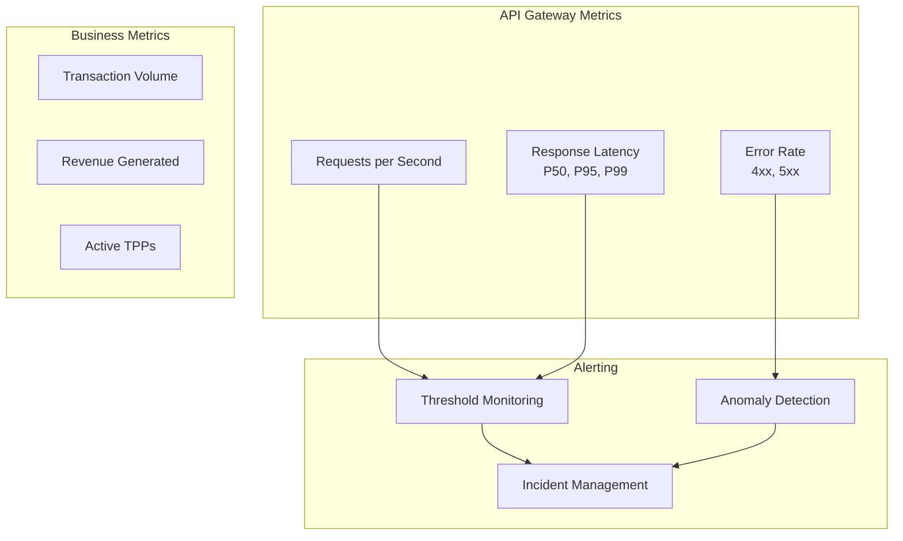

### SLA Monitoring

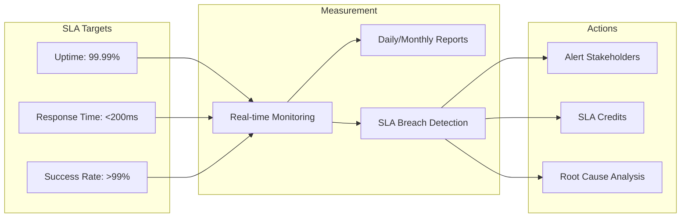

## Rate Limiting & Quota Management

### Rate Limiting Strategy

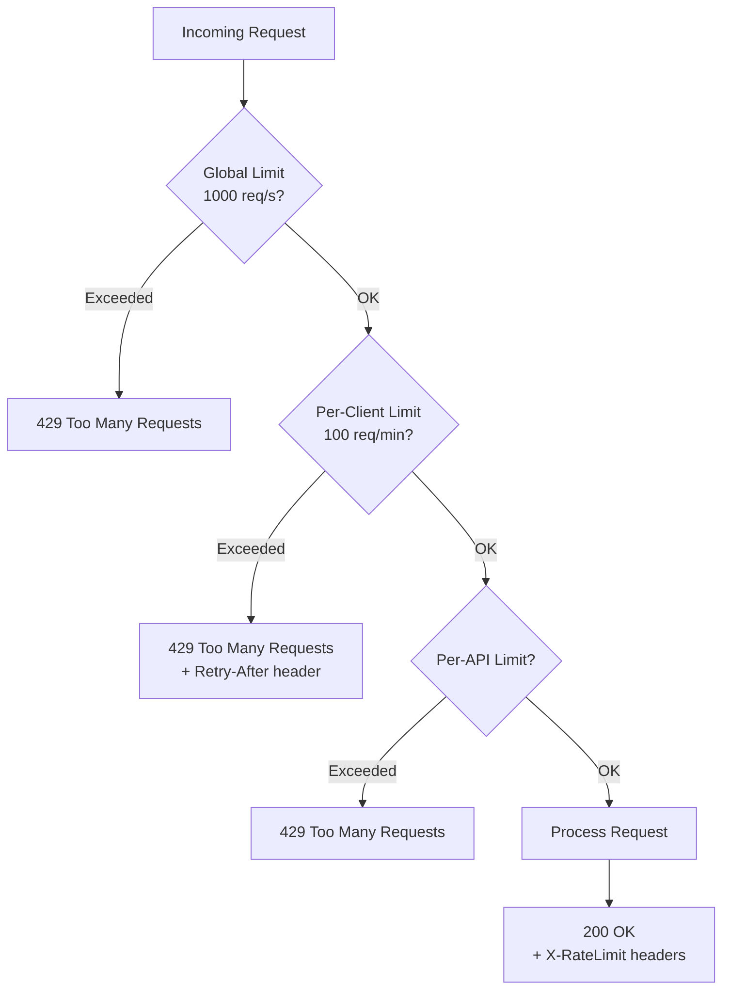

### Quota Tiers

| Tier | Monthly Quota | Rate Limit | Price |
|------|---------------|------------|-------|
| Free | 10,000 calls | 10 req/min | 0 VND |
| Basic | 100,000 calls | 50 req/min | 5,000,000 VND |
| Professional | 1,000,000 calls | 100 req/min | 30,000,000 VND |
| Enterprise | Unlimited | Custom | Custom |

## Security Controls

### Access Control Matrix

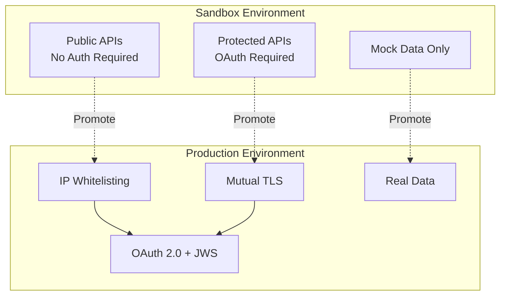

### Key Management

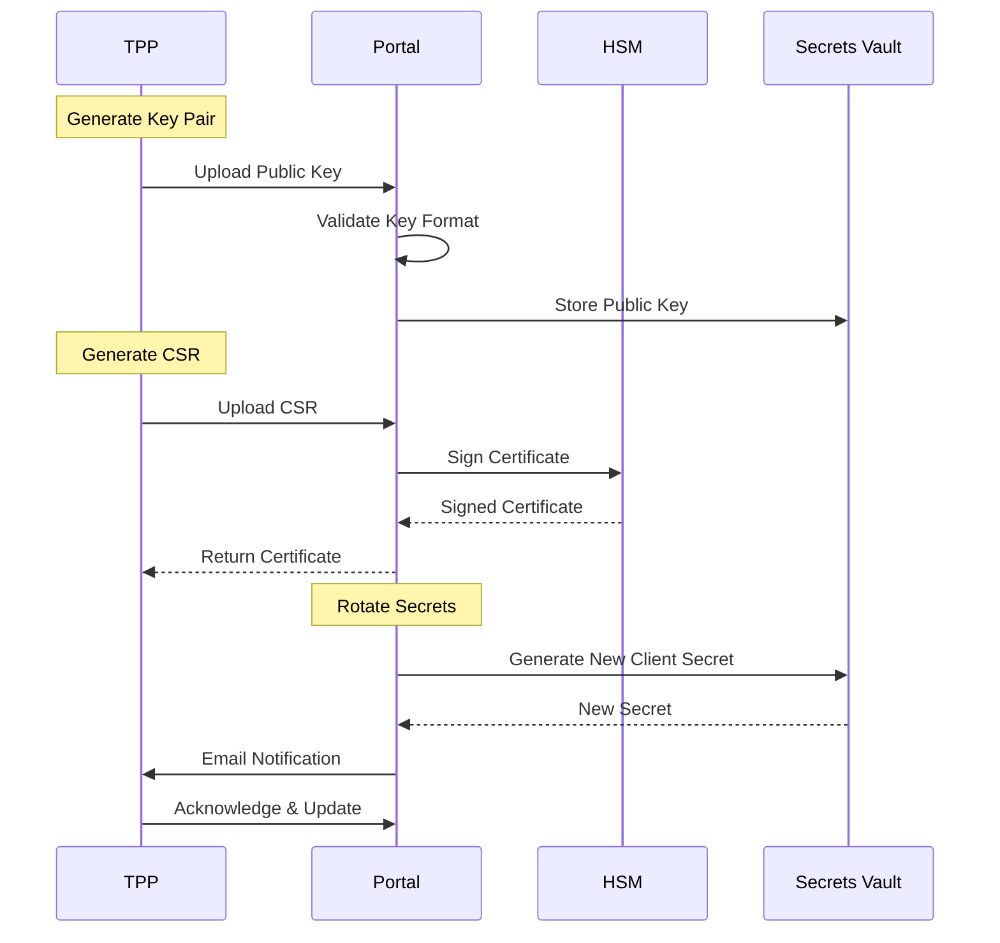

## Compliance & Audit

### Audit Trail

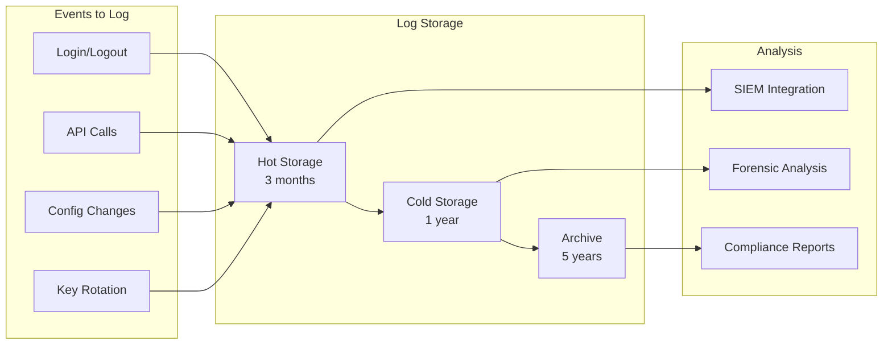

## Tài Liệu Tham Khảo
- Thông tư 64/2024/TT-NHNN - Điều 8, 9, 10 (Onboarding)
- Open Banking UK - TPP Onboarding Guidelines
- ISO/IEC 27001 - Access Control
- OWASP API Security Top 10
