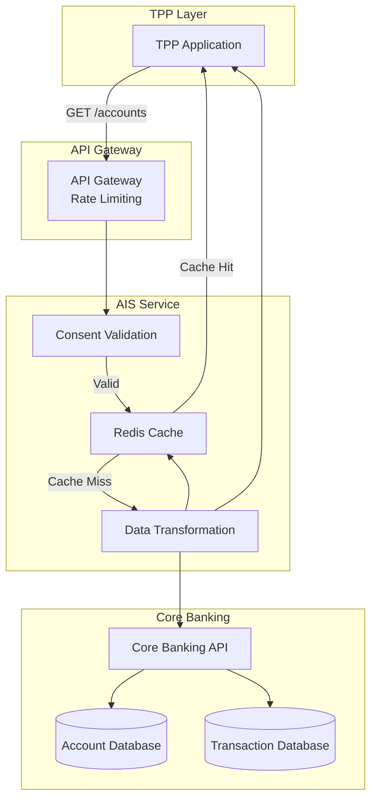
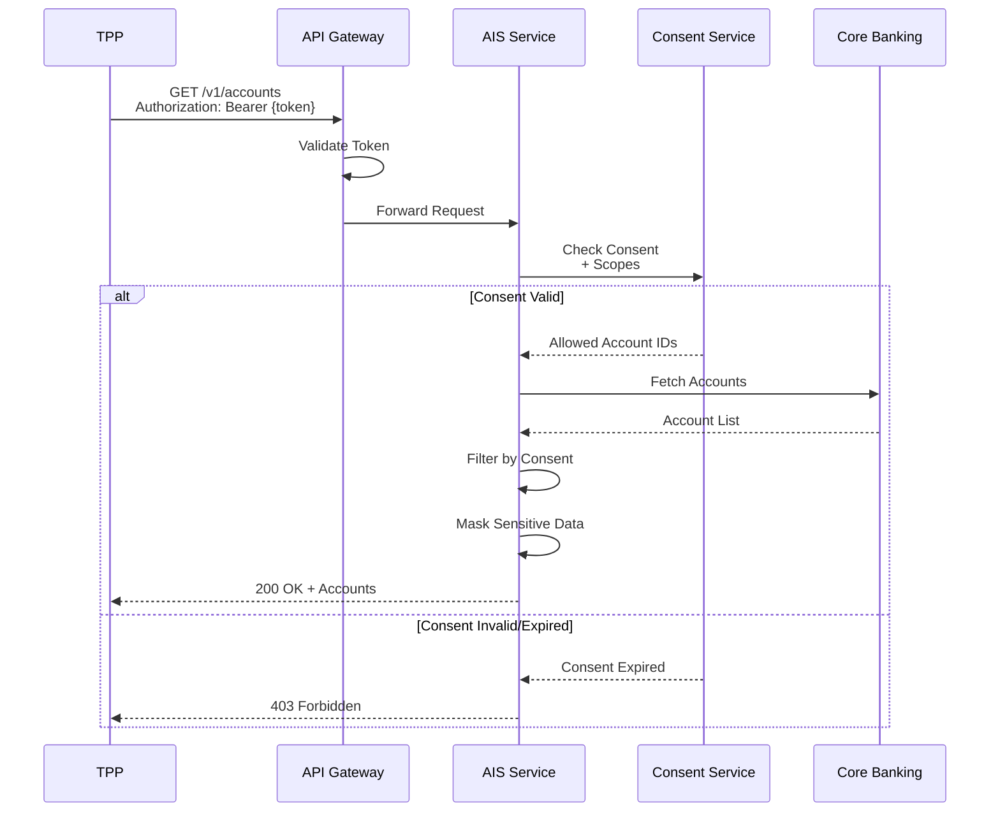
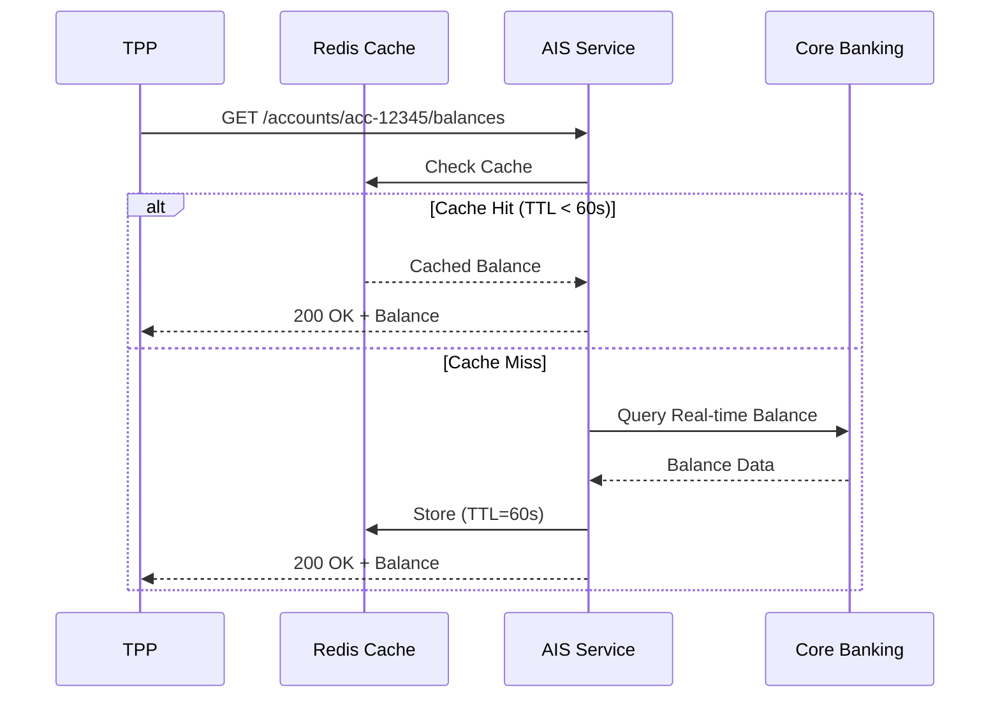
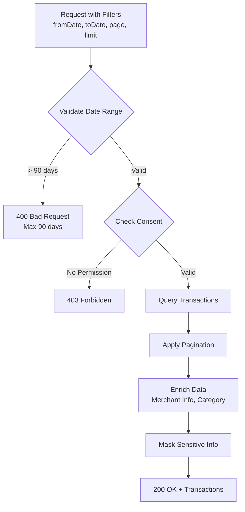
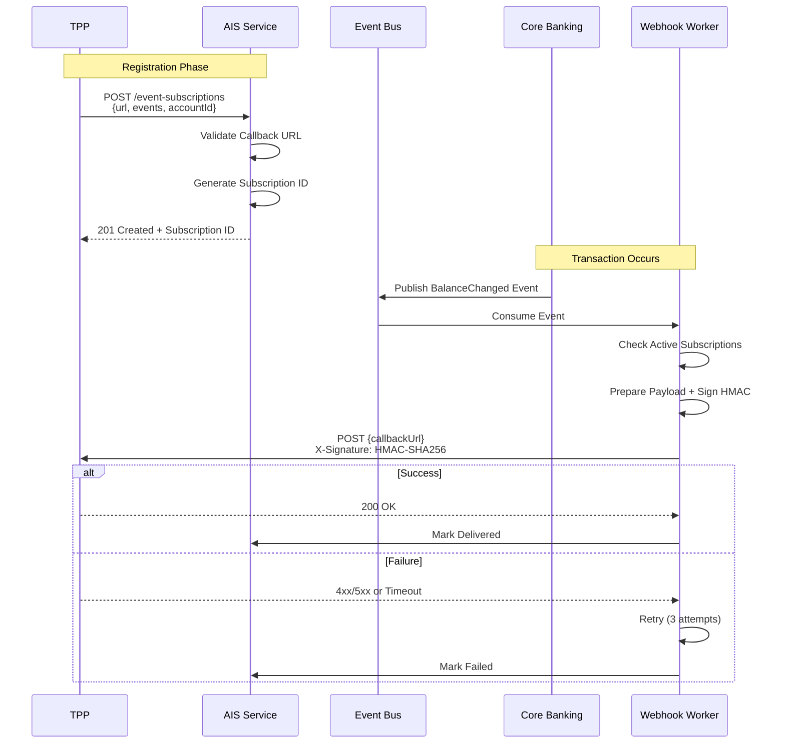
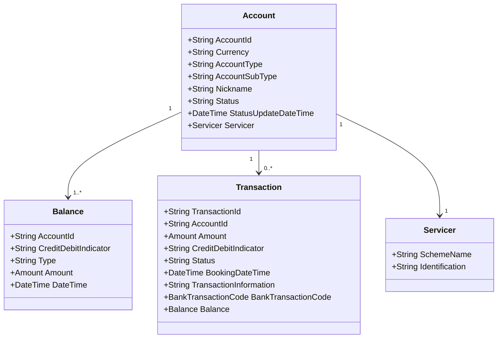
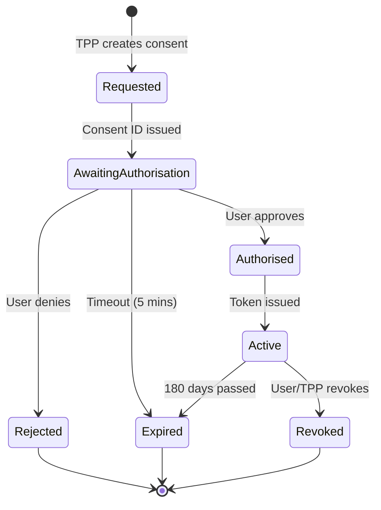
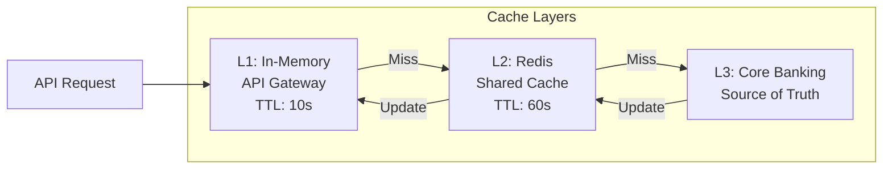
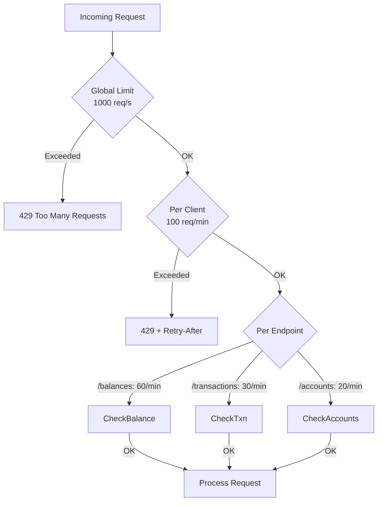
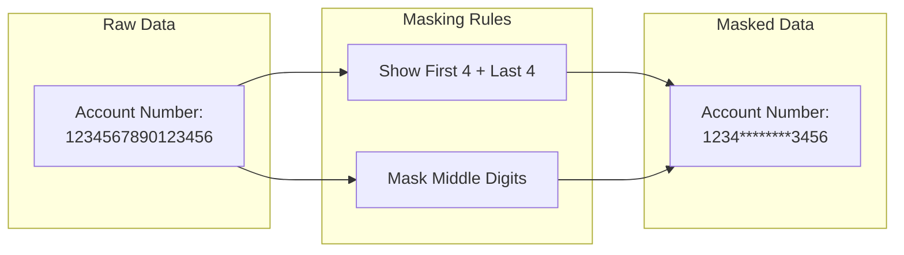

# Dịch Vụ Thông Tin Tài Khoản (AIS - Account Information Services)

## Tổng Quan

Nhóm API cho phép TPP truy cập thông tin tài chính của khách hàng dưới sự đồng ý rõ ràng, tuân thủ Thông tư 64/2024/TT-NHNN.

## Kiến Trúc AIS



## API Endpoints

### 1. Account Discovery

#### GET /v1/accounts

Lấy danh sách tài khoản mà khách hàng đã đồng ý chia sẻ.



**Response Example:**
```json
{
  "Data": {
    "Account": [
      {
        "AccountId": "acc-12345",
        "Currency": "VND",
        "AccountType": "CurrentAccount",
        "AccountSubType": "Checking",
        "Nickname": "Tài khoản chính",
        "Status": "Active",
        "StatusUpdateDateTime": "2024-12-10T10:30:00+07:00"
      },
      {
        "AccountId": "acc-67890",
        "Currency": "VND",
        "AccountType": "Savings",
        "AccountSubType": "TermDeposit",
        "Nickname": "Tiết kiệm 12 tháng",
        "Status": "Active"
      }
    ]
  },
  "Links": {
    "Self": "https://api.bank.vn/v1/accounts"
  },
  "Meta": {
    "TotalPages": 1
  }
}
```

### 2. Balance Inquiry

#### GET /v1/accounts/{AccountId}/balances



**Response Example:**
```json
{
  "Data": {
    "Balance": [
      {
        "AccountId": "acc-12345",
        "CreditDebitIndicator": "Credit",
        "Type": "InterimAvailable",
        "Amount": {
          "Amount": "15750000.00",
          "Currency": "VND"
        },
        "DateTime": "2024-12-10T14:25:30+07:00"
      },
      {
        "AccountId": "acc-12345",
        "CreditDebitIndicator": "Credit",
        "Type": "InterimBooked",
        "Amount": {
          "Amount": "16000000.00",
          "Currency": "VND"
        },
        "DateTime": "2024-12-10T14:25:30+07:00"
      }
    ]
  }
}
```

### 3. Transaction History

#### GET /v1/accounts/{AccountId}/transactions



**Request Parameters:**
- `fromBookingDateTime`: ISO 8601 format
- `toBookingDateTime`: ISO 8601 format (max 90 days from `fromBookingDateTime`)
- `page`: Page number (default: 1)
- `limit`: Items per page (default: 25, max: 100)

**Response Example:**
```json
{
  "Data": {
    "Transaction": [
      {
        "TransactionId": "txn-001",
        "AccountId": "acc-12345",
        "Amount": {
          "Amount": "250000.00",
          "Currency": "VND"
        },
        "CreditDebitIndicator": "Debit",
        "Status": "Booked",
        "BookingDateTime": "2024-12-09T15:30:00+07:00",
        "ValueDateTime": "2024-12-09T15:30:00+07:00",
        "TransactionInformation": "Chuyển tiền đến NGUYEN VAN A",
        "BankTransactionCode": {
          "Code": "Transfer",
          "SubCode": "InterbankTransfer"
        },
        "ProprietaryBankTransactionCode": {
          "Code": "NAPAS247"
        },
        "Balance": {
          "Amount": {
            "Amount": "15750000.00",
            "Currency": "VND"
          },
          "CreditDebitIndicator": "Credit",
          "Type": "InterimAvailable"
        }
      }
    ]
  },
  "Links": {
    "Self": "https://api.bank.vn/v1/accounts/acc-12345/transactions?page=1",
    "Next": "https://api.bank.vn/v1/accounts/acc-12345/transactions?page=2"
  },
  "Meta": {
    "TotalPages": 5,
    "FirstAvailableDateTime": "2024-09-10T00:00:00+07:00",
    "LastAvailableDateTime": "2024-12-10T23:59:59+07:00"
  }
}
```

### 4. Balance Change Notification (Webhook)

#### POST /v1/event-subscriptions

TPP đăng ký webhook để nhận thông báo khi có biến động số dư.



**Webhook Payload Example:**
```json
{
  "EventType": "BalanceChanged",
  "EventId": "evt-12345",
  "Timestamp": "2024-12-10T16:45:00+07:00",
  "Data": {
    "AccountId": "acc-12345",
    "NewBalance": {
      "Amount": "15500000.00",
      "Currency": "VND"
    },
    "ChangeAmount": {
      "Amount": "250000.00",
      "Currency": "VND"
    },
    "CreditDebitIndicator": "Debit",
    "TransactionId": "txn-002"
  }
}
```

**HMAC Signature Verification:**
```javascript
const crypto = require('crypto');

function verifySignature(payload, signature, secret) {
  const hmac = crypto.createHmac('sha256', secret);
  hmac.update(JSON.stringify(payload));
  const expectedSignature = hmac.digest('hex');
  return signature === expectedSignature;
}
```

## Data Model

### Account Object



## Consent Management

### Consent Lifecycle



### Consent Scopes

| Scope | Quyền Truy Cập | Thời Hạn Tối Đa |
|-------|----------------|------------------|
| `accounts.read` | Danh sách tài khoản | 180 ngày |
| `accounts.balance.read` | Số dư tài khoản | 180 ngày |
| `accounts.transactions.read` | Lịch sử giao dịch | 180 ngày |
| `accounts.details.read` | Chi tiết tài khoản (số TK đầy đủ) | 180 ngày |

## Performance Optimization

### Caching Strategy



**Cache TTL by Data Type:**
- Account List: 300s (5 minutes)
- Balance: 60s (1 minute)
- Transactions: 3600s (1 hour) - immutable data
- Account Details: 600s (10 minutes)

### Rate Limiting



## Security Controls

### Data Masking



**Masking Rules:**
- **Account Number**: Show first 4 + last 4 digits
- **Card Number**: Show last 4 digits only
- **Phone Number**: Show last 4 digits only
- **Email**: Mask username (show first 2 chars)

### Audit Logging

```json
{
  "timestamp": "2024-12-10T16:45:00+07:00",
  "eventType": "AccountAccess",
  "tppId": "tpp-12345",
  "userId": "user-67890",
  "accountId": "acc-***3456",
  "endpoint": "/v1/accounts/acc-12345/balances",
  "method": "GET",
  "statusCode": 200,
  "responseTime": 125,
  "ipAddress": "203.162.xxx.xxx",
  "userAgent": "TPP-App/1.0",
  "consentId": "consent-abc123"
}
```

## Error Handling

### Common Error Codes

| HTTP Code | Error Code | Mô Tả | Hành Động |
|-----------|------------|-------|-----------|
| 400 | `INVALID_DATE_RANGE` | Khoảng thời gian > 90 ngày | Giảm khoảng thời gian |
| 401 | `INVALID_TOKEN` | Access token không hợp lệ | Refresh token |
| 403 | `CONSENT_EXPIRED` | Consent đã hết hạn | Yêu cầu consent mới |
| 403 | `INSUFFICIENT_SCOPE` | Thiếu scope cần thiết | Yêu cầu scope đúng |
| 404 | `ACCOUNT_NOT_FOUND` | Tài khoản không tồn tại | Kiểm tra AccountId |
| 429 | `RATE_LIMIT_EXCEEDED` | Vượt quá giới hạn | Retry sau `Retry-After` |
| 500 | `CORE_BANKING_ERROR` | Lỗi hệ thống Core Banking | Retry hoặc liên hệ support |

**Error Response Format:**
```json
{
  "Code": "CONSENT_EXPIRED",
  "Message": "The consent has expired. Please request a new consent from the user.",
  "Errors": [
    {
      "ErrorCode": "CONSENT_EXPIRED",
      "Message": "Consent ID 'consent-abc123' expired on 2024-12-01",
      "Path": "ConsentId"
    }
  ]
}
```

## Compliance Checklist

- [ ] Consent validation trước mỗi API call
- [ ] Token expiry enforcement (max 180 days)
- [ ] Data masking cho sensitive fields
- [ ] Audit logging đầy đủ (3 months + 1 year backup)
- [ ] Rate limiting theo quy định
- [ ] Cache invalidation khi có thay đổi
- [ ] Webhook retry mechanism (3 attempts)
- [ ] HMAC signature cho webhooks
- [ ] TLS 1.3 cho tất cả connections
- [ ] PII data không xuất hiện trong logs

## Tài Liệu Tham Khảo
- Thông tư 64/2024/TT-NHNN - Phụ lục 01
- Open Banking UK - Account and Transaction API v4.0
- ISO 20022 - Account Management Messages
- GDPR/Nghị định 13/2023 - Data Protection
