# Dịch Vụ Thông Tin Tài Khoản (AIS - Account Information Services)

> **Tuân thủ:** Thông tư 64/2024/TT-NHNN - Điều 6 Khoản 1b | Open Banking UK v4.0 | ISO 20022 | FAPI 2.0

## Tổng Quan

Dịch vụ AIS cho phép TPP (Third Party Provider) truy cập thông tin tài chính của khách hàng thông qua API, dưới sự đồng ý rõ ràng và có thời hạn, tuân thủ Thông tư 64/2024/TT-NHNN Phụ lục 01.

### Phạm Vi Dịch Vụ

**Theo Thông tư 64/2024 - Điều 6 Khoản 1b (Open API Cơ Bản):**

| API | Mô Tả | Consent Required |
|-----|-------|------------------|
| `GET /accounts` | Lấy danh sách tài khoản | ✅ |
| `GET /accounts/{id}` | Lấy thông tin chi tiết tài khoản | ✅ |
| `GET /accounts/{id}/balances` | Lấy số dư tài khoản | ✅ |
| `GET /accounts/{id}/transactions` | Lấy lịch sử giao dịch | ✅ |
| `GET /accounts/{id}/statements` | Lấy sao kê tài khoản | ✅ |
| `POST /event-subscriptions` | Đăng ký thông báo biến động | ✅ |

### Mục Tiêu

1. **Cung cấp thông tin chính xác**: Real-time balance và transaction history
2. **Bảo mật tuyệt đối**: OAuth 2.1 + mTLS + Consent management
3. **Hiệu năng cao**: Response time < 500ms (P95)
4. **Tuân thủ pháp lý**: Đầy đủ theo Thông tư 64/2024/TT-NHNN

## Kiến Trúc AIS Service

### Kiến Trúc Tổng Thể

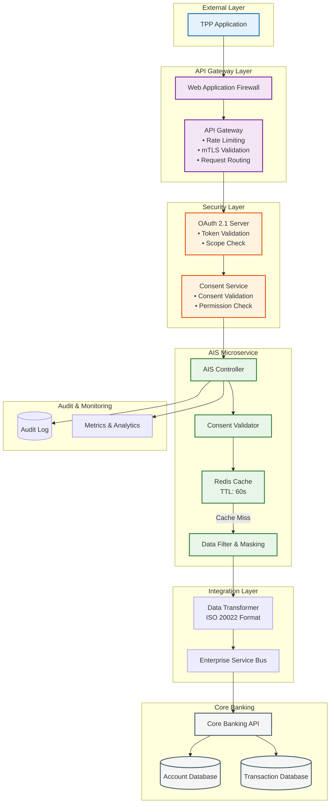

### Luồng Xử Lý Request

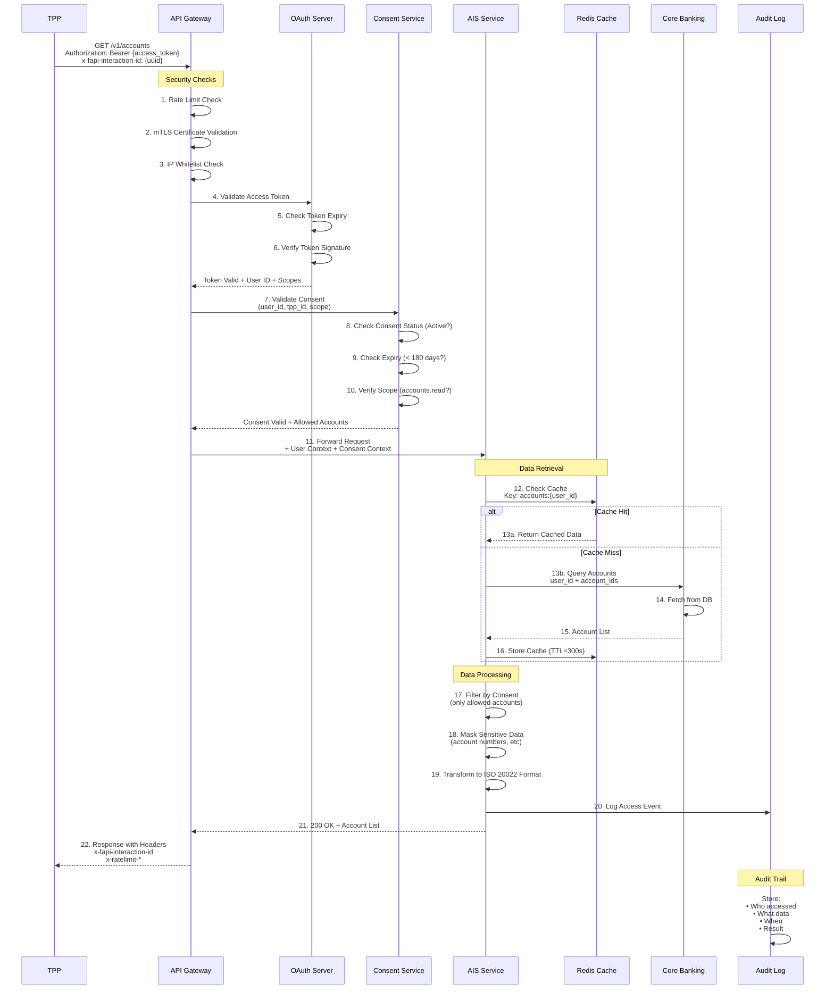

## API Endpoints Chi Tiết

### 1. Lấy Danh Sách Tài Khoản

#### `GET /v1/accounts`

Trả về danh sách tài khoản mà khách hàng đã đồng ý chia sẻ với TPP.

**Request Headers:**
```http
GET /v1/accounts HTTP/1.1
Host: api.bank.vn
Authorization: Bearer {access_token}
x-fapi-interaction-id: 93bac548-d2de-4546-b106-880a5018460d
x-fapi-auth-date: Mon, 15 Dec 2025 08:40:01 GMT
x-fapi-customer-ip-address: 104.25.212.99
x-customer-user-agent: Mozilla/5.0 (iPhone; CPU iPhone OS 17_0)
```

**Response:**
```json
{
  "Data": {
    "Account": [
      {
        "AccountId": "acc-a1b2c3d4e5",
        "Currency": "VND",
        "AccountType": "CurrentAccount",
        "AccountSubType": "Checking",
        "Nickname": "Tài khoản lương",
        "Status": "Enabled",
        "StatusUpdateDateTime": "2025-12-10T10:30:00+07:00",
        "OpeningDate": "2020-01-15",
        "MaturityDate": null,
        "Servicer": {
          "SchemeName": "VN.BANK.BIC",
          "Identification": "BIDVVNVX"
        }
      },
      {
        "AccountId": "acc-f6g7h8i9j0",
        "Currency": "VND",
        "AccountType": "Savings",
        "AccountSubType": "TermDeposit",
        "Nickname": "Tiết kiệm 12 tháng",
        "Status": "Enabled",
        "StatusUpdateDateTime": "2025-11-01T14:20:00+07:00",
        "OpeningDate": "2025-11-01",
        "MaturityDate": "2026-11-01",
        "InterestRate": 5.5,
        "Term": {
          "Value": 12,
          "Unit": "Month"
        }
      }
    ]
  },
  "Links": {
    "Self": "https://api.bank.vn/v1/accounts",
    "First": "https://api.bank.vn/v1/accounts?page=1",
    "Last": "https://api.bank.vn/v1/accounts?page=1"
  },
  "Meta": {
    "TotalPages": 1,
    "TotalRecords": 2
  }
}
```

**Response Headers:**
```http
HTTP/1.1 200 OK
Content-Type: application/json; charset=utf-8
x-fapi-interaction-id: 93bac548-d2de-4546-b106-880a5018460d
x-ratelimit-limit: 60
x-ratelimit-remaining: 57
x-ratelimit-reset: 1702638000
```

### 2. Lấy Chi Tiết Tài Khoản

#### `GET /v1/accounts/{AccountId}`

**Request:**
```http
GET /v1/accounts/acc-a1b2c3d4e5 HTTP/1.1
Authorization: Bearer {access_token}
```

**Response:**
```json
{
  "Data": {
    "Account": {
      "AccountId": "acc-a1b2c3d4e5",
      "Currency": "VND",
      "AccountType": "CurrentAccount",
      "AccountSubType": "Checking",
      "Nickname": "Tài khoản lương",
      "Status": "Enabled",
      "Account": [
        {
          "SchemeName": "VN.BANK.AccountNumber",
          "Identification": "1234567890",
          "Name": "NGUYEN VAN A"
        }
      ],
      "Servicer": {
        "SchemeName": "VN.BANK.BIC",
        "Identification": "BIDVVNVX"
      }
    }
  },
  "Links": {
    "Self": "https://api.bank.vn/v1/accounts/acc-a1b2c3d4e5"
  },
  "Meta": {}
}
```

### 3. Lấy Số Dư Tài Khoản

#### `GET /v1/accounts/{AccountId}/balances`

**Caching Strategy:**
- **Cache Key**: `balance:{account_id}`
- **TTL**: 60 seconds
- **Invalidation**: On transaction completion

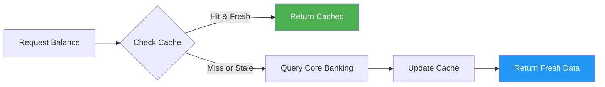

**Response:**
```json
{
  "Data": {
    "Balance": [
      {
        "AccountId": "acc-a1b2c3d4e5",
        "CreditDebitIndicator": "Credit",
        "Type": "InterimAvailable",
        "DateTime": "2025-12-15T10:45:30+07:00",
        "Amount": {
          "Amount": "15750000.00",
          "Currency": "VND"
        },
        "CreditLine": [
          {
            "Included": true,
            "Type": "PreAgreed",
            "Amount": {
              "Amount": "5000000.00",
              "Currency": "VND"
            }
          }
        ]
      },
      {
        "AccountId": "acc-a1b2c3d4e5",
        "CreditDebitIndicator": "Credit",
        "Type": "InterimBooked",
        "DateTime": "2025-12-15T10:45:30+07:00",
        "Amount": {
          "Amount": "16000000.00",
          "Currency": "VND"
        }
      },
      {
        "AccountId": "acc-a1b2c3d4e5",
        "CreditDebitIndicator": "Credit",
        "Type": "Expected",
        "DateTime": "2025-12-15T10:45:30+07:00",
        "Amount": {
          "Amount": "16250000.00",
          "Currency": "VND"
        }
      }
    ]
  },
  "Links": {
    "Self": "https://api.bank.vn/v1/accounts/acc-a1b2c3d4e5/balances"
  },
  "Meta": {}
}
```

**Balance Types:**
- **InterimAvailable**: Số dư khả dụng (có thể sử dụng ngay)
- **InterimBooked**: Số dư ghi sổ (bao gồm cả giao dịch chờ xử lý)
- **Expected**: Số dư dự kiến (bao gồm giao dịch tương lai)

### 4. Lấy Lịch Sử Giao Dịch

#### `GET /v1/accounts/{AccountId}/transactions`

**Query Parameters:**

| Parameter | Type | Required | Description | Example |
|-----------|------|----------|-------------|---------|
| `fromBookingDateTime` | DateTime | No | Từ ngày (ISO 8601) | `2025-11-15T00:00:00+07:00` |
| `toBookingDateTime` | DateTime | No | Đến ngày (Max 90 days) | `2025-12-15T23:59:59+07:00` |
| `page` | Integer | No | Trang (default: 1) | `1` |
| `limit` | Integer | No | Số record/trang (max: 100) | `25` |

**Validation Rules:**
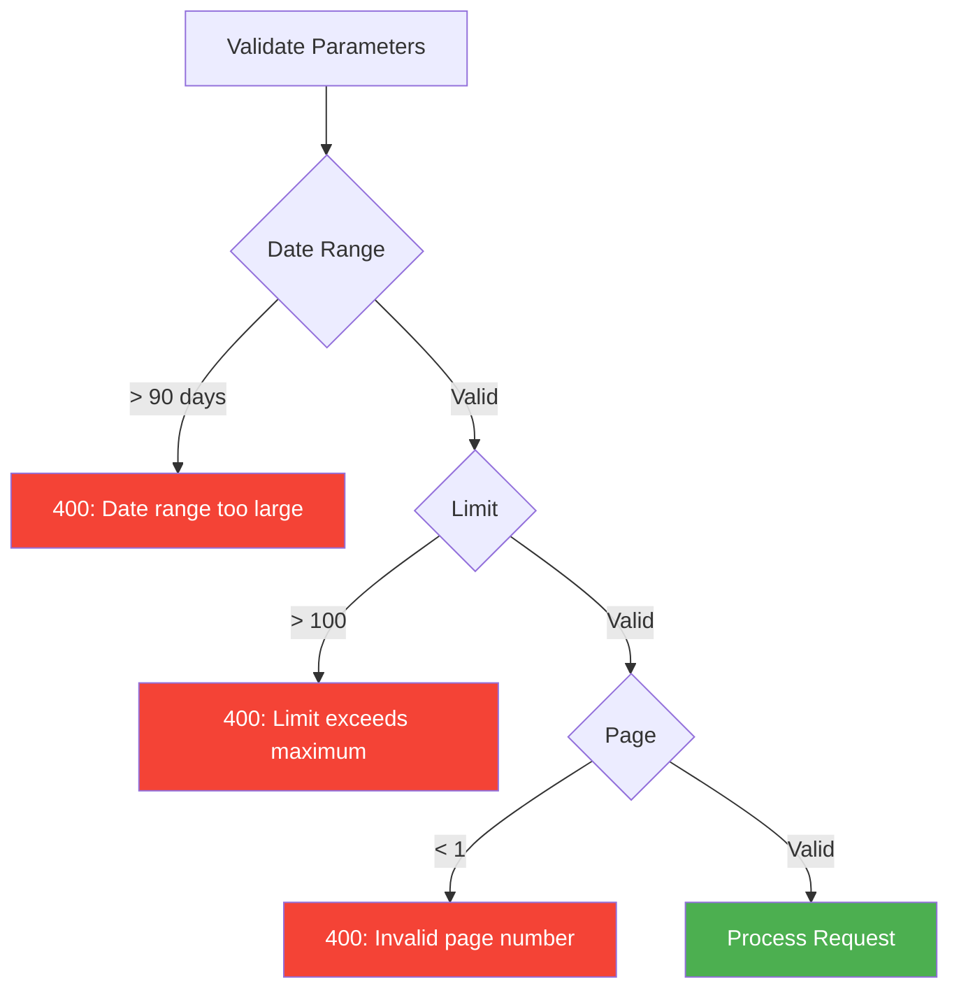

**Response:**
```json
{
  "Data": {
    "Transaction": [
      {
        "AccountId": "acc-a1b2c3d4e5",
        "TransactionId": "txn-20251215-001",
        "TransactionReference": "REF-2025121500001",
        "Amount": {
          "Amount": "250000.00",
          "Currency": "VND"
        },
        "CreditDebitIndicator": "Debit",
        "Status": "Booked",
        "BookingDateTime": "2025-12-15T09:30:15+07:00",
        "ValueDateTime": "2025-12-15T09:30:15+07:00",
        "TransactionInformation": "Chuyển tiền đến NGUYEN VAN A",
        "AddressLine": "BIDV CN Ha Noi",
        "BankTransactionCode": {
          "Code": "Transfer",
          "SubCode": "InterbankTransfer"
        },
        "ProprietaryBankTransactionCode": {
          "Code": "NAPAS247",
          "Issuer": "NAPAS"
        },
        "Balance": {
          "Amount": {
            "Amount": "15750000.00",
            "Currency": "VND"
          },
          "CreditDebitIndicator": "Credit",
          "Type": "InterimBooked"
        },
        "MerchantDetails": {
          "MerchantName": "NGUYEN VAN A",
          "MerchantCategoryCode": "6011"
        },
        "CreditorAccount": {
          "SchemeName": "VN.BANK.AccountNumber",
          "Identification": "9876543210",
          "Name": "NGUYEN VAN A"
        }
      },
      {
        "AccountId": "acc-a1b2c3d4e5",
        "TransactionId": "txn-20251214-045",
        "Amount": {
          "Amount": "500000.00",
          "Currency": "VND"
        },
        "CreditDebitIndicator": "Credit",
        "Status": "Booked",
        "BookingDateTime": "2025-12-14T15:20:30+07:00",
        "ValueDateTime": "2025-12-14T15:20:30+07:00",
        "TransactionInformation": "Nhan tien tu TRAN THI B",
        "BankTransactionCode": {
          "Code": "Transfer",
          "SubCode": "IntrabankTransfer"
        },
        "Balance": {
          "Amount": {
            "Amount": "16000000.00",
            "Currency": "VND"
          },
          "CreditDebitIndicator": "Credit",
          "Type": "InterimBooked"
        },
        "DebtorAccount": {
          "SchemeName": "VN.BANK.AccountNumber",
          "Identification": "1111222233",
          "Name": "TRAN THI B"
        }
      }
    ]
  },
  "Links": {
    "Self": "https://api.bank.vn/v1/accounts/acc-a1b2c3d4e5/transactions?page=1&limit=25",
    "First": "https://api.bank.vn/v1/accounts/acc-a1b2c3d4e5/transactions?page=1&limit=25",
    "Next": "https://api.bank.vn/v1/accounts/acc-a1b2c3d4e5/transactions?page=2&limit=25",
    "Last": "https://api.bank.vn/v1/accounts/acc-a1b2c3d4e5/transactions?page=5&limit=25"
  },
  "Meta": {
    "TotalPages": 5,
    "TotalRecords": 113,
    "FirstAvailableDateTime": "2025-09-15T00:00:00+07:00",
    "LastAvailableDateTime": "2025-12-15T23:59:59+07:00"
  }
}
```

### 5. Lấy Sao Kê Tài Khoản

#### `GET /v1/accounts/{AccountId}/statements`

**Response:**
```json
{
  "Data": {
    "Statement": [
      {
        "StatementId": "stmt-202512",
        "AccountId": "acc-a1b2c3d4e5",
        "Type": "MonthlyStatement",
        "StatementDateTime": "2025-12-01T00:00:00+07:00",
        "CreationDateTime": "2025-12-01T08:00:00+07:00",
        "StartDateTime": "2025-12-01T00:00:00+07:00",
        "EndDateTime": "2025-12-31T23:59:59+07:00",
        "StatementDescription": ["Sao ke thang 12/2025"],
        "StatementAmount": [
          {
            "CreditDebitIndicator": "Credit",
            "Type": "OpeningBalance",
            "Amount": {
              "Amount": "14500000.00",
              "Currency": "VND"
            }
          },
          {
            "CreditDebitIndicator": "Credit",
            "Type": "ClosingBalance",
            "Amount": {
              "Amount": "15750000.00",
              "Currency": "VND"
            }
          }
        ],
        "StatementValue": [
          {
            "Type": "TotalCreditTurnover",
            "Value": {
              "Amount": "5250000.00",
              "Currency": "VND"
            }
          },
          {
            "Type": "TotalDebitTurnover",
            "Value": {
              "Amount": "4000000.00",
              "Currency": "VND"
            }
          },
          {
            "Type": "TotalCreditEntryCount",
            "Value": "15"
          },
          {
            "Type": "TotalDebitEntryCount",
            "Value": "8"
          }
        ]
      }
    ]
  },
  "Links": {
    "Self": "https://api.bank.vn/v1/accounts/acc-a1b2c3d4e5/statements"
  },
  "Meta": {}
}
```

### 6. Đăng Ký Thông Báo Biến Động (Webhook)

#### `POST /v1/event-subscriptions`

Cho phép TPP đăng ký nhận thông báo real-time khi có biến động số dư.

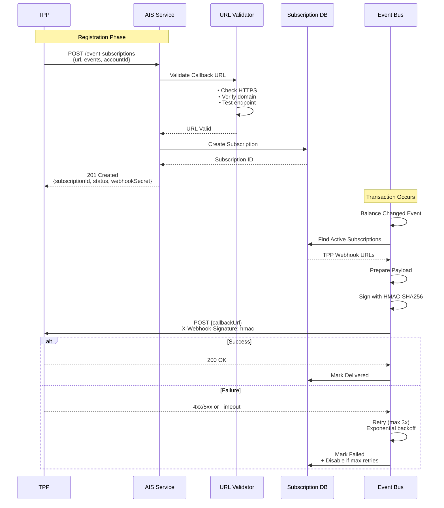

**Request:**
```json
{
  "Data": {
    "CallbackUrl": "https://tpp.example.com/webhooks/balance-changed",
    "Version": "1.0",
    "EventTypes": [
      "balance-changed",
      "transaction-completed"
    ],
    "AccountIds": [
      "acc-a1b2c3d4e5"
    ]
  }
}
```

**Response:**
```json
{
  "Data": {
    "EventSubscriptionId": "sub-abc123def456",
    "CallbackUrl": "https://tpp.example.com/webhooks/balance-changed",
    "Version": "1.0",
    "EventTypes": [
      "balance-changed",
      "transaction-completed"
    ],
    "Status": "Active",
    "WebhookSecret": "whsec_abc123def456ghi789jkl"
  },
  "Links": {
    "Self": "https://api.bank.vn/v1/event-subscriptions/sub-abc123def456"
  },
  "Meta": {
    "CreatedAt": "2025-12-15T10:30:00+07:00"
  }
}
```

**Webhook Payload Example:**
```json
{
  "EventType": "balance-changed",
  "EventId": "evt-xyz789abc123",
  "EventDateTime": "2025-12-15T14:25:30+07:00",
  "SubscriptionId": "sub-abc123def456",
  "Data": {
    "AccountId": "acc-a1b2c3d4e5",
    "NewBalance": {
      "Amount": "15500000.00",
      "Currency": "VND"
    },
    "ChangeAmount": {
      "Amount": "250000.00",
      "Currency": "VND"
    },
    "CreditDebitIndicator": "Debit",
    "TransactionId": "txn-20251215-045",
    "TransactionDateTime": "2025-12-15T14:25:28+07:00"
  }
}
```

**Webhook Headers:**
```http
POST /webhooks/balance-changed HTTP/1.1
Host: tpp.example.com
Content-Type: application/json
X-Webhook-Signature: sha256=a1b2c3d4e5f6...
X-Webhook-Id: evt-xyz789abc123
X-Webhook-Timestamp: 1702627530
```

**Signature Verification (Node.js):**
```javascript
const crypto = require('crypto');

function verifyWebhookSignature(payload, signature, secret) {
  const expectedSignature = crypto
    .createHmac('sha256', secret)
    .update(JSON.stringify(payload))
    .digest('hex');
  
  return crypto.timingSafeEqual(
    Buffer.from(signature),
    Buffer.from(`sha256=${expectedSignature}`)
  );
}
```

## Data Model & Standards

### ISO 20022 Compliance

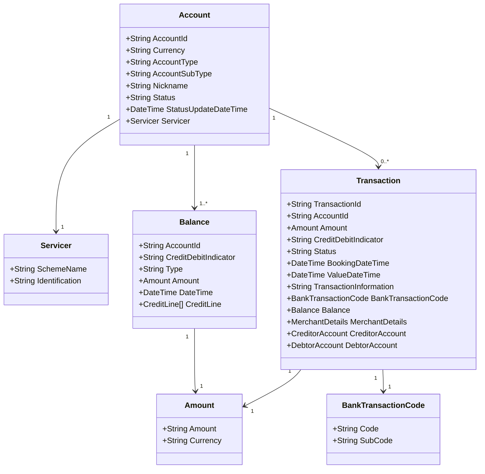

### Account Types (ISO 20022)

| AccountType | AccountSubType | Mô Tả |
|-------------|----------------|-------|
| `CurrentAccount` | `Checking` | Tài khoản thanh toán |
| `CurrentAccount` | `Salary` | Tài khoản lương |
| `Savings` | `TermDeposit` | Tiết kiệm có kỳ hạn |
| `Savings` | `CallDeposit` | Tiết kiệm không kỳ hạn |
| `Loan` | `PersonalLoan` | Vay tiêu dùng |
| `Loan` | `Mortgage` | Vay thế chấp |
| `CreditCard` | `CreditCard` | Thẻ tín dụng |

### Transaction Codes (ISO 20022)

| Code | SubCode | Mô Tả |
|------|---------|-------|
| `Transfer` | `InterbankTransfer` | Chuyển tiền liên ngân hàng |
| `Transfer` | `IntrabankTransfer` | Chuyển tiền nội bộ |
| `Transfer` | `NAPAS247` | Chuyển tiền Napas 24/7 |
| `Transfer` | `CITAD` | Chuyển tiền CITAD |
| `Payment` | `BillPayment` | Thanh toán hóa đơn |
| `Payment` | `CardPayment` | Thanh toán thẻ |
| `Cash` | `CashWithdrawal` | Rút tiền ATM |
| `Cash` | `CashDeposit` | Nộp tiền mặt |
| `Interest` | `InterestPayment` | Lãi tiết kiệm |
| `Fee` | `ServiceCharge` | Phí dịch vụ |

## Consent Management

### Consent Lifecycle

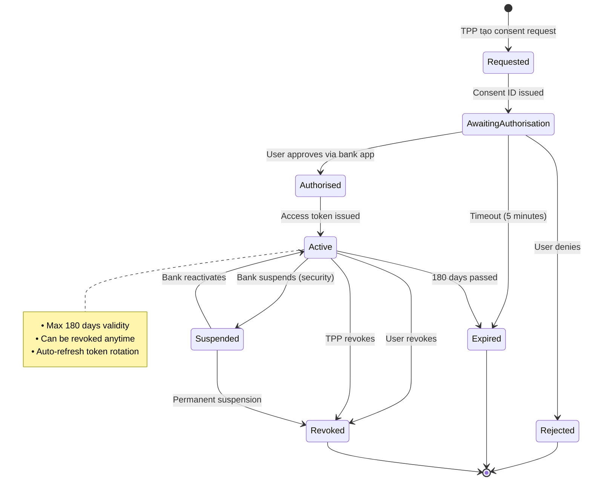

### Consent Scopes & Permissions

| Scope | Permission | Data Access | Max Duration |
|-------|-----------|-------------|--------------|
| `accounts.read` | Đọc danh sách TK | Account list only | 180 days |
| `accounts.basic.read` | Đọc thông tin cơ bản | Account details (masked) | 180 days |
| `accounts.detail.read` | Đọc chi tiết đầy đủ | Full account number | 180 days |
| `balances.read` | Đọc số dư | Real-time balance | 180 days |
| `transactions.read` | Đọc giao dịch | Transaction history | 180 days |
| `statements.read` | Đọc sao kê | Monthly statements | 180 days |
| `webhooks.register` | Đăng ký webhook | Event notifications | 180 days |

### Consent Request Flow

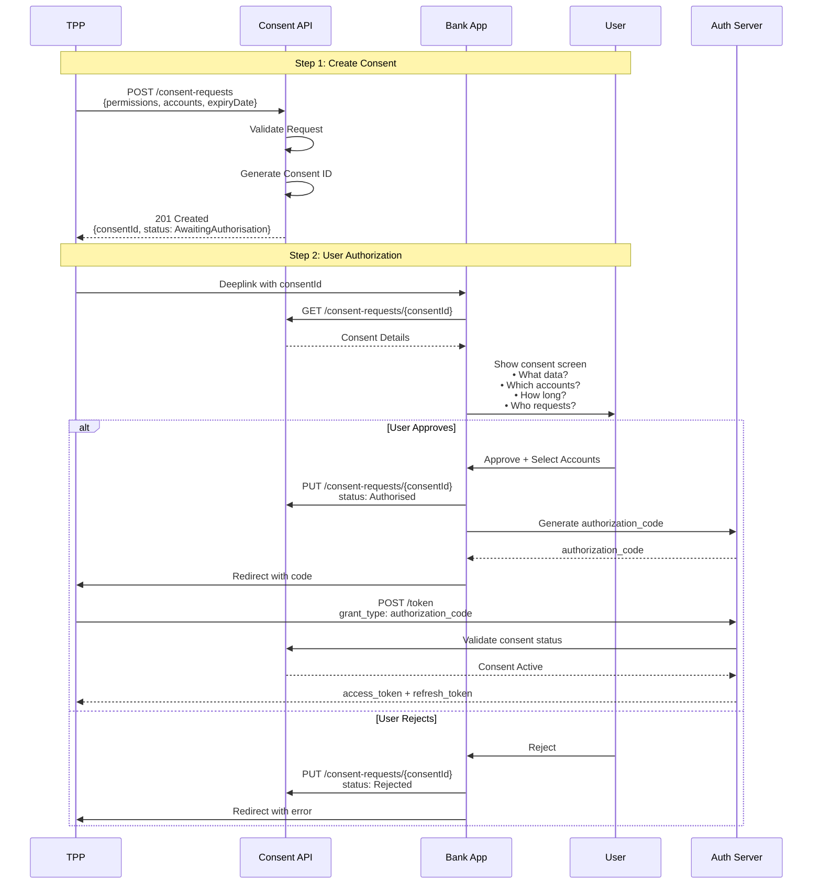

## Security & Compliance

### Data Masking Strategy

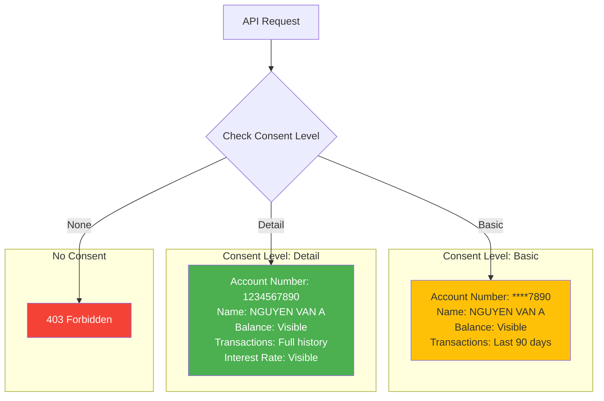

**Masking Rules:**

| Field | Rule | Example |
|-------|------|---------|
| Account Number | First 4 + Last 4 (Basic) | `1234********7890` |
| Account Number | Full (Detail) | `1234567890123456` |
| Card Number | Last 4 only | `**** **** **** 3456` |
| Phone Number | Last 4 only | `****567890` |
| Email | Mask username | `ng******@gmail.com` |
| Full Name | No masking | `NGUYEN VAN A` |
| Balance | No masking | `15,750,000 VND` |
| Transaction Amount | No masking | `250,000 VND` |

### Rate Limiting

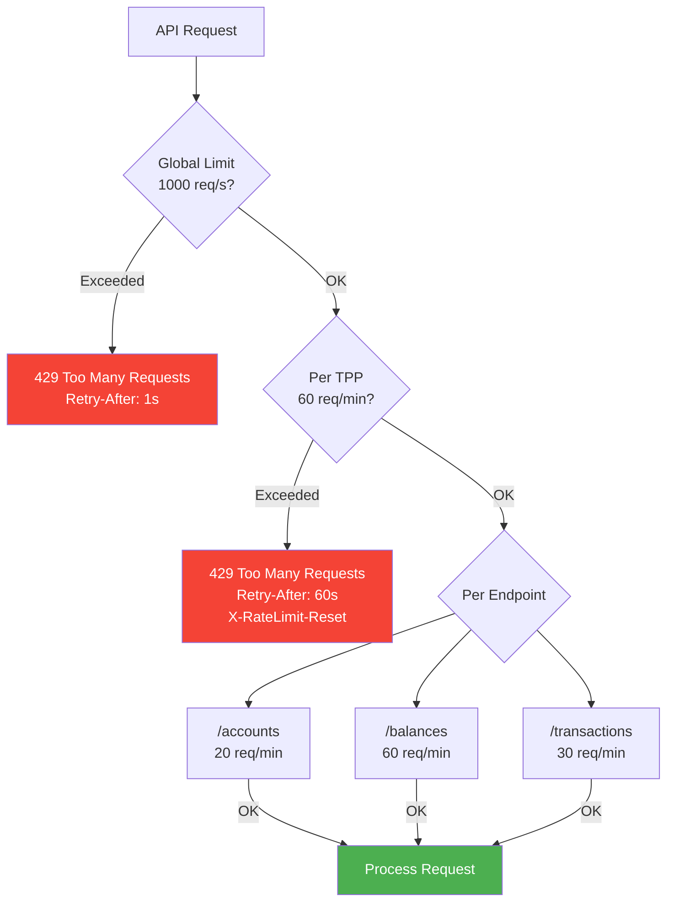

**Rate Limit Headers:**
```http
X-RateLimit-Limit: 60
X-RateLimit-Remaining: 45
X-RateLimit-Reset: 1702638000
X-RateLimit-Resource: balances
X-RateLimit-Used: 15
```

### Audit Logging

**Tuân thủ ISO 27001 & Thông tư 64/2024**

```json
{
  "timestamp": "2025-12-15T14:25:30+07:00",
  "eventId": "audit-evt-abc123",
  "eventType": "AccountAccess",
  "severity": "INFO",
  "actor": {
    "tppId": "tpp-12345",
    "tppName": "FinTech Solutions Ltd",
    "userId": "user-67890",
    "ipAddress": "203.162.4.190",
    "userAgent": "TPP-App/2.1.0"
  },
  "action": "GET",
  "resource": {
    "type": "account",
    "endpoint": "/v1/accounts/acc-a1b2c3d4e5/balances",
    "accountId": "acc-***c3d4e5"
  },
  "consent": {
    "consentId": "consent-xyz789",
    "scope": "balances.read",
    "expiresAt": "2026-06-15T10:30:00+07:00",
    "status": "Active"
  },
  "result": {
    "statusCode": 200,
    "success": true,
    "responseTime": 125,
    "dataReturned": true
  },
  "compliance": {
    "gdpr": true,
    "dataClassification": "confidential",
    "retentionPeriod": "7 years"
  }
}
```

### Performance Monitoring

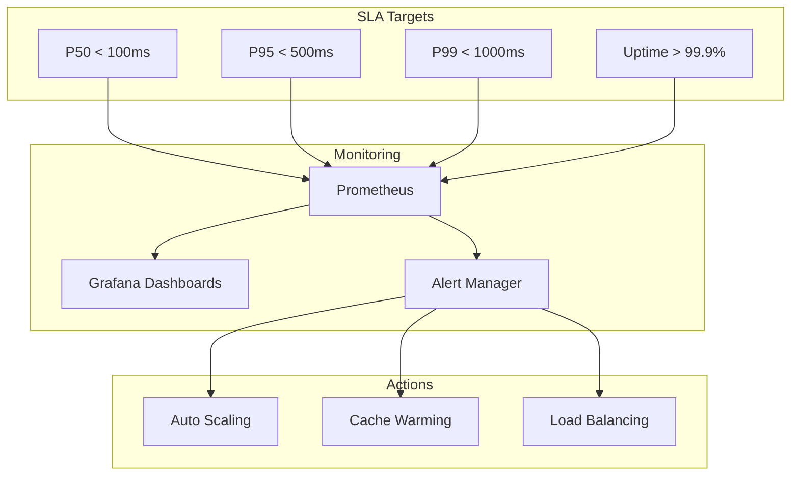

**Performance Metrics:**

| Metric | Target | Current | Status |
|--------|--------|---------|--------|
| **GET /accounts** | < 200ms (P95) | 150ms | ✅ |
| **GET /balances** | < 300ms (P95) | 180ms | ✅ |
| **GET /transactions** | < 500ms (P95) | 420ms | ✅ |
| **Uptime** | > 99.9% | 99.95% | ✅ |
| **Error Rate** | < 1% | 0.05% | ✅ |
| **Cache Hit Rate** | > 80% | 87% | ✅ |

## Error Handling

### Error Response Format (ISO 20022)

```json
{
  "Code": "CONSENT_EXPIRED",
  "Message": "The consent has expired. Please request a new consent from the user.",
  "Errors": [
    {
      "ErrorCode": "CONSENT_EXPIRED",
      "Message": "Consent ID 'consent-abc123' expired on 2025-12-01T10:30:00+07:00",
      "Path": "ConsentId",
      "Url": "https://docs.bank.vn/errors/consent-expired"
    }
  ]
}
```

### Common Error Codes

| HTTP | Error Code | Mô Tả | Giải Pháp |
|------|-----------|-------|-----------|
| 400 | `INVALID_REQUEST` | Request không hợp lệ | Kiểm tra request body/params |
| 400 | `INVALID_DATE_RANGE` | Khoảng thời gian > 90 ngày | Giảm khoảng thời gian query |
| 401 | `INVALID_TOKEN` | Access token không hợp lệ hoặc hết hạn | Refresh token hoặc re-authenticate |
| 403 | `CONSENT_EXPIRED` | Consent đã hết hạn | Yêu cầu user cấp consent mới |
| 403 | `INSUFFICIENT_SCOPE` | Thiếu scope cần thiết | Request với scope đúng |
| 403 | `CONSENT_REVOKED` | Consent đã bị thu hồi | Thông báo user và yêu cầu consent mới |
| 404 | `ACCOUNT_NOT_FOUND` | Tài khoản không tồn tại | Kiểm tra AccountId |
| 404 | `RESOURCE_NOT_FOUND` | Resource không tìm thấy | Kiểm tra URL và ID |
| 429 | `RATE_LIMIT_EXCEEDED` | Vượt quá rate limit | Chờ theo `Retry-After` header |
| 500 | `INTERNAL_SERVER_ERROR` | Lỗi hệ thống | Retry hoặc liên hệ support |
| 503 | `SERVICE_UNAVAILABLE` | Dịch vụ tạm ngưng (maintenance) | Retry sau hoặc check status page |

### Error Handling Best Practices

```javascript
// Example: Retry with Exponential Backoff
async function getAccountBalance(accountId, maxRetries = 3) {
  let retryCount = 0;
  let delay = 1000; // Start with 1 second
  
  while (retryCount < maxRetries) {
    try {
      const response = await fetch(`/v1/accounts/${accountId}/balances`, {
        headers: {
          'Authorization': `Bearer ${accessToken}`,
          'x-fapi-interaction-id': generateUUID()
        }
      });
      
      if (response.ok) {
        return await response.json();
      }
      
      // Handle specific error codes
      if (response.status === 401) {
        // Token expired, refresh and retry
        await refreshAccessToken();
        continue;
      }
      
      if (response.status === 429) {
        // Rate limited, wait and retry
        const retryAfter = response.headers.get('Retry-After');
        await sleep(retryAfter * 1000 || delay);
        retryCount++;
        delay *= 2; // Exponential backoff
        continue;
      }
      
      if (response.status === 403) {
        const error = await response.json();
        if (error.Code === 'CONSENT_EXPIRED') {
          // Need new consent, cannot retry
          throw new ConsentExpiredError(error.Message);
        }
      }
      
      // Other errors
      throw new APIError(response.status, await response.json());
      
    } catch (error) {
      if (retryCount === maxRetries - 1) {
        throw error; // Max retries reached
      }
      retryCount++;
      await sleep(delay);
      delay *= 2;
    }
  }
}
```

## Testing & Sandbox

### Mock Data

**Sandbox environment cung cấp:**
- 100+ test accounts với các scenarios khác nhau
- Transaction history với 90 days data
- Real-time balance updates
- Webhook testing tools

**Test Accounts:**

| Account ID | Type | Balance | Scenario |
|-----------|------|---------|----------|
| `acc-test-001` | CurrentAccount | 10,000,000 VND | Normal account |
| `acc-test-002` | Savings | 50,000,000 VND | High balance |
| `acc-test-003` | CurrentAccount | 500,000 VND | Low balance |
| `acc-test-004` | CurrentAccount | 0 VND | Empty account |
| `acc-test-005` | CurrentAccount | -1,000,000 VND | Overdraft |
| `acc-test-999` | CurrentAccount | Error | Simulates 500 error |

### Test Scenarios

```yaml
scenarios:
  - name: "Get account list - Success"
    method: GET
    url: /v1/accounts
    expected_status: 200
    expected_fields:
      - Data.Account[]
      - Links.Self
    
  - name: "Get balance - Consent expired"
    method: GET
    url: /v1/accounts/acc-test-expired/balances
    expected_status: 403
    expected_error: CONSENT_EXPIRED
    
  - name: "Get transactions - Rate limited"
    method: GET
    url: /v1/accounts/acc-test-001/transactions
    repeat: 61
    expected_status: 429
    expected_header: Retry-After
    
  - name: "Webhook delivery - Success"
    method: POST
    trigger: balance_change
    expected_webhook_call: true
    expected_signature: valid_hmac
```

## Tài Liệu Tham Khảo

### Quy Định Việt Nam
- **Thông tư 64/2024/TT-NHNN** - Phụ lục 01: Open API Cơ Bản
  - Điều 6 Khoản 1b: Open API truy vấn thông tin khách hàng (AIS)
- **Nghị định 13/2023/NĐ-CP** - Bảo vệ dữ liệu cá nhân
- **Circular 50/2024/TT-NHNN** - Strong Customer Authentication

### Tiêu Chuẩn Quốc Tế
- **Open Banking UK** - Account and Transaction API Specification v4.0
- **ISO 20022** - Financial Services Message Standards
  - acmt: Account Management
  - camt: Cash Management
- **FAPI 2.0** - Financial-grade API Security Profile
- **OAuth 2.1** - Authorization Framework
- **RFC 7519** - JSON Web Token (JWT)
- **RFC 7515** - JSON Web Signature (JWS)

### Best Practices
- **OWASP API Security Top 10 (2023)**
- **GDPR** - General Data Protection Regulation
- **PCI DSS 4.0** - Payment Card Industry Data Security Standard

---

**Phiên bản:** 1.0  
**Ngày cập nhật:** 15/12/2025  
**Trạng thái:** Final Draft
