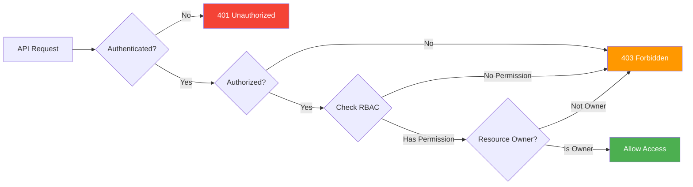
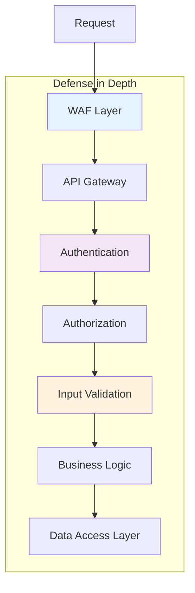
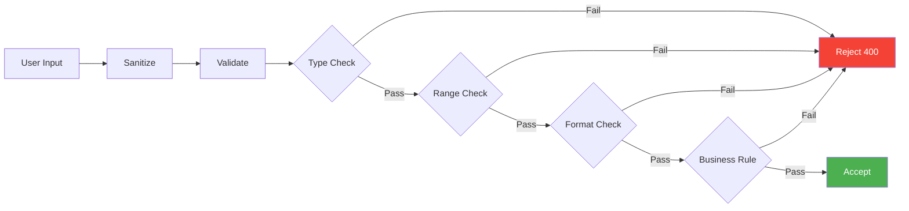

# Secure Coding Standards & Conventions

> **ISO 27001:2022 Control:** A.8.28 - Secure coding  
> **Tuân thủ:** OWASP Top 10 2021 | CWE Top 25 | SANS Top 25  
> **Áp dụng:** All development teams (Backend, Frontend, Mobile)

## Tổng Quan

Tài liệu này định nghĩa các tiêu chuẩn và quy ước lập trình bảo mật bắt buộc cho tất cả các dự án Open Banking Platform.

### Mục Tiêu

1. **Ngăn chặn lỗ hổng bảo mật** từ giai đoạn development
2. **Tuân thủ ISO 27001:2022** control A.8.28
3. **Giảm thiểu rủi ro** theo OWASP Top 10
4. **Chuẩn hóa code quality** across teams
5. **Tăng maintainability** và security posture

---

## 1. OWASP Top 10 2021 - Mitigation Strategies

### A01:2021 – Broken Access Control



**✅ DO:**
```java
// Backend - Spring Security với OAuth 2.1
@PreAuthorize("hasAuthority('SCOPE_AIS') and #accountId == authentication.principal.customerId")
@GetMapping("/accounts/{accountId}/balances")
public ResponseEntity<Balance> getBalance(@PathVariable String accountId) {
    // Verify ownership at service layer as well (defense in depth)
    if (!accountService.isOwner(getCurrentUser(), accountId)) {
        throw new ForbiddenException("Access denied");
    }
    return ResponseEntity.ok(accountService.getBalance(accountId));
}

// Always validate resource ownership
public boolean isOwner(User user, String resourceId) {
    Resource resource = resourceRepository.findById(resourceId)
        .orElseThrow(() -> new NotFoundException("Resource not found"));
    return resource.getOwnerId().equals(user.getId());
}
```

**❌ DON'T:**
```java
// INSECURE: No authorization check
@GetMapping("/accounts/{accountId}/balances")
public ResponseEntity<Balance> getBalance(@PathVariable String accountId) {
    return ResponseEntity.ok(accountService.getBalance(accountId));
}

// INSECURE: Trusting client-provided user ID
@GetMapping("/accounts/{accountId}")
public ResponseEntity<Account> getAccount(
    @PathVariable String accountId,
    @RequestParam String userId  // ❌ Never trust client input for authorization
) {
    return accountService.getAccountByUser(userId, accountId);
}
```

---

### A02:2021 – Cryptographic Failures

**✅ DO:**
```java
// Use strong encryption (AES-256-GCM)
import javax.crypto.Cipher;
import javax.crypto.spec.GCMParameterSpec;
import javax.crypto.spec.SecretKeySpec;

public class SecureEncryption {
    private static final String ALGORITHM = "AES/GCM/NoPadding";
    private static final int GCM_TAG_LENGTH = 128;
    private static final int GCM_IV_LENGTH = 12;
    
    public byte[] encrypt(byte[] plaintext, SecretKey key) throws Exception {
        Cipher cipher = Cipher.getInstance(ALGORITHM);
        byte[] iv = generateRandomIV(GCM_IV_LENGTH);
        GCMParameterSpec spec = new GCMParameterSpec(GCM_TAG_LENGTH, iv);
        cipher.init(Cipher.ENCRYPT_MODE, key, spec);
        
        byte[] ciphertext = cipher.doFinal(plaintext);
        
        // Prepend IV to ciphertext
        return ByteBuffer.allocate(iv.length + ciphertext.length)
            .put(iv)
            .put(ciphertext)
            .array();
    }
    
    // Always use SecureRandom for IV/salt generation
    private byte[] generateRandomIV(int length) {
        byte[] iv = new byte[length];
        SecureRandom.getInstanceStrong().nextBytes(iv);
        return iv;
    }
}

// Password hashing with Argon2id (OWASP recommended)
import org.springframework.security.crypto.argon2.Argon2PasswordEncoder;

public class PasswordService {
    private final Argon2PasswordEncoder encoder = new Argon2PasswordEncoder(
        16,    // saltLength
        32,    // hashLength
        1,     // parallelism
        65536, // memory (64 MB)
        3      // iterations
    );
    
    public String hashPassword(String password) {
        return encoder.encode(password);
    }
}
```

**❌ DON'T:**
```java
// INSECURE: Weak algorithms
Cipher cipher = Cipher.getInstance("DES");  // ❌ DES is broken
MessageDigest md = MessageDigest.getInstance("MD5");  // ❌ MD5 is broken
MessageDigest sha1 = MessageDigest.getInstance("SHA-1");  // ❌ SHA-1 is deprecated

// INSECURE: Hardcoded secrets
String apiKey = "sk_live_12345abcde";  // ❌ Never hardcode secrets
String dbPassword = "admin123";  // ❌ Use environment variables

// INSECURE: Weak password hashing
String hashedPassword = DigestUtils.md5Hex(password);  // ❌ MD5 is not suitable for passwords
```

---

### A03:2021 – Injection

**SQL Injection Prevention:**

**✅ DO:**
```java
// Use Parameterized Queries (JPA/Hibernate)
@Repository
public interface AccountRepository extends JpaRepository<Account, String> {
    @Query("SELECT a FROM Account a WHERE a.customerId = :customerId AND a.status = :status")
    List<Account> findByCustomerIdAndStatus(
        @Param("customerId") String customerId,
        @Param("status") AccountStatus status
    );
}

// Use Criteria API for dynamic queries
public List<Account> searchAccounts(AccountSearchCriteria criteria) {
    CriteriaBuilder cb = entityManager.getCriteriaBuilder();
    CriteriaQuery<Account> query = cb.createQuery(Account.class);
    Root<Account> account = query.from(Account.class);
    
    List<Predicate> predicates = new ArrayList<>();
    
    if (criteria.getCustomerId() != null) {
        predicates.add(cb.equal(account.get("customerId"), criteria.getCustomerId()));
    }
    
    if (criteria.getStatus() != null) {
        predicates.add(cb.equal(account.get("status"), criteria.getStatus()));
    }
    
    query.where(predicates.toArray(new Predicate[0]));
    return entityManager.createQuery(query).getResultList();
}
```

**❌ DON'T:**
```java
// INSECURE: String concatenation
String query = "SELECT * FROM accounts WHERE customer_id = '" + customerId + "'";
jdbcTemplate.query(query, rowMapper);  // ❌ SQL Injection vulnerability

// INSECURE: Dynamic query building
String sql = "SELECT * FROM users WHERE username = '" + username + "' AND password = '" + password + "'";
```

**NoSQL Injection Prevention:**

**✅ DO:**
```javascript
// MongoDB - Use parameterized queries
const account = await Account.findOne({
    customerId: customerId,  // ✅ Safe
    status: 'ACTIVE'
});

// Validate and sanitize input
const sanitizedCustomerId = validator.escape(customerId);
```

**❌ DON'T:**
```javascript
// INSECURE: Direct object injection
const query = JSON.parse(req.body.query);  // ❌ NoSQL Injection
const accounts = await Account.find(query);

// INSECURE: Regex injection
const accounts = await Account.find({
    name: { $regex: req.query.name }  // ❌ ReDoS vulnerability
});
```

**Command Injection Prevention:**

**✅ DO:**
```java
// Use safe APIs, avoid Runtime.exec()
ProcessBuilder pb = new ProcessBuilder("ls", "-la", sanitizedPath);
pb.redirectErrorStream(true);
Process process = pb.start();

// Whitelist allowed commands
private static final Set<String> ALLOWED_COMMANDS = Set.of("ls", "cat", "grep");

public void executeCommand(String command, List<String> args) {
    if (!ALLOWED_COMMANDS.contains(command)) {
        throw new SecurityException("Command not allowed");
    }
    // Execute with ProcessBuilder
}
```

**❌ DON'T:**
```java
// INSECURE: Runtime.exec with user input
Runtime.getRuntime().exec("ls " + userInput);  // ❌ Command Injection

// INSECURE: Shell execution
Runtime.getRuntime().exec(new String[]{"sh", "-c", userCommand});  // ❌ Very dangerous
```

---

### A04:2021 – Insecure Design

**Secure Design Patterns:**



**✅ DO:**
```java
// Implement rate limiting
@RateLimiter(name = "payment", fallbackMethod = "paymentFallback")
@PostMapping("/payments")
public ResponseEntity<Payment> createPayment(@RequestBody PaymentRequest request) {
    // Rate limit: 10 requests per minute per user
    return paymentService.createPayment(request);
}

// Implement idempotency for critical operations
@PostMapping("/payments")
public ResponseEntity<Payment> createPayment(
    @RequestHeader("Idempotency-Key") String idempotencyKey,
    @RequestBody PaymentRequest request
) {
    // Check if payment with this idempotency key already exists
    Optional<Payment> existing = paymentService.findByIdempotencyKey(idempotencyKey);
    if (existing.isPresent()) {
        return ResponseEntity.ok(existing.get());  // Return existing payment
    }
    
    Payment payment = paymentService.createPayment(request, idempotencyKey);
    return ResponseEntity.status(HttpStatus.CREATED).body(payment);
}

// Implement circuit breaker for external dependencies
@CircuitBreaker(name = "napas", fallbackMethod = "napasFallback")
public PaymentResponse callNapas(PaymentRequest request) {
    return napasClient.processPayment(request);
}

private PaymentResponse napasFallback(PaymentRequest request, Exception ex) {
    log.error("Napas circuit breaker triggered", ex);
    return PaymentResponse.builder()
        .status("PENDING")
        .message("Payment queued for retry")
        .build();
}
```

---

### A05:2021 – Security Misconfiguration

**✅ DO:**
```yaml
# application.yml - Production configuration
spring:
  security:
    # Disable default security headers exposure
    headers:
      content-security-policy: "default-src 'self'"
      x-frame-options: DENY
      x-content-type-options: nosniff
      x-xss-protection: "1; mode=block"
      strict-transport-security: "max-age=31536000; includeSubDomains"
  
  # Disable unnecessary features
  autoconfigure:
    exclude:
      - org.springframework.boot.autoconfigure.web.servlet.error.ErrorMvcAutoConfiguration
  
  # Secure session management
  session:
    timeout: 15m
    cookie:
      secure: true
      http-only: true
      same-site: strict

# Disable debug/trace logging in production
logging:
  level:
    root: INFO
    com.bank: INFO
    org.springframework.security: WARN

# Disable actuator endpoints in production
management:
  endpoints:
    web:
      exposure:
        include: health,metrics
  endpoint:
    health:
      show-details: when-authorized
```

**❌ DON'T:**
```yaml
# INSECURE configuration
spring:
  security:
    enabled: false  # ❌ Never disable security
  
debug: true  # ❌ Never enable debug in production

management:
  endpoints:
    web:
      exposure:
        include: "*"  # ❌ Exposes all actuator endpoints

logging:
  level:
    root: DEBUG  # ❌ Too verbose, may leak sensitive data
```

---

### A06:2021 – Vulnerable and Outdated Components

**Dependency Management:**

```xml
<!-- pom.xml - Use dependency management -->
<dependencyManagement>
    <dependencies>
        <!-- Use Spring Boot BOM for version management -->
        <dependency>
            <groupId>org.springframework.boot</groupId>
            <artifactId>spring-boot-dependencies</artifactId>
            <version>3.2.0</version>
            <type>pom</type>
            <scope>import</scope>
        </dependency>
    </dependencies>
</dependencyManagement>

<!-- OWASP Dependency Check Plugin -->
<plugin>
    <groupId>org.owasp</groupId>
    <artifactId>dependency-check-maven</artifactId>
    <version>9.0.0</version>
    <configuration>
        <failBuildOnCVSS>7</failBuildOnCVSS>
        <suppressionFile>dependency-check-suppressions.xml</suppressionFile>
    </configuration>
    <executions>
        <execution>
            <goals>
                <goal>check</goal>
            </goals>
        </execution>
    </executions>
</plugin>
```

**✅ DO:**
- Run `mvn dependency:tree` regularly
- Use OWASP Dependency Check in CI/CD
- Update dependencies monthly
- Subscribe to security advisories
- Use Snyk/Dependabot for automated scanning

**❌ DON'T:**
- Use outdated dependencies
- Ignore security warnings
- Copy-paste code from untrusted sources

---

### A07:2021 – Identification and Authentication Failures

**✅ DO:**
```java
// Implement account lockout
@Service
public class AuthenticationService {
    private static final int MAX_ATTEMPTS = 5;
    private static final Duration LOCKOUT_DURATION = Duration.ofMinutes(30);
    
    public void handleFailedLogin(String username) {
        LoginAttempt attempt = attemptRepository.findByUsername(username)
            .orElse(new LoginAttempt(username));
        
        attempt.incrementFailedAttempts();
        
        if (attempt.getFailedAttempts() >= MAX_ATTEMPTS) {
            attempt.lock(LOCKOUT_DURATION);
            log.warn("Account locked due to multiple failed attempts: {}", username);
            auditService.logSecurityEvent("ACCOUNT_LOCKED", username);
        }
        
        attemptRepository.save(attempt);
    }
    
    public void handleSuccessfulLogin(String username) {
        attemptRepository.findByUsername(username)
            .ifPresent(attempt -> {
                attempt.reset();
                attemptRepository.save(attempt);
            });
    }
}

// Implement MFA
@PostMapping("/auth/verify-mfa")
public ResponseEntity<TokenResponse> verifyMFA(
    @RequestBody MFARequest request
) {
    // Verify TOTP code
    boolean valid = totpService.verifyCode(
        request.getUsername(),
        request.getCode()
    );
    
    if (!valid) {
        throw new InvalidMFACodeException();
    }
    
    // Issue access token only after MFA verification
    return ResponseEntity.ok(tokenService.issueToken(request.getUsername()));
}
```

---

### A08:2021 – Software and Data Integrity Failures

**✅ DO:**
```java
// Verify JWT signatures
@Component
public class JwtValidator {
    private final JwtDecoder jwtDecoder;
    
    public Jwt validateToken(String token) {
        try {
            // Automatically verifies signature
            return jwtDecoder.decode(token);
        } catch (JwtException e) {
            log.error("Invalid JWT token", e);
            throw new UnauthorizedException("Invalid token");
        }
    }
}

// Implement request signing (JWS)
@Component
public class RequestSigner {
    private final PrivateKey privateKey;
    
    public String signRequest(String payload) {
        JWSHeader header = new JWSHeader.Builder(JWSAlgorithm.RS256)
            .keyID(keyId)
            .type(JOSEObjectType.JOSE)
            .build();
        
        JWSObject jwsObject = new JWSObject(header, new Payload(payload));
        jwsObject.sign(new RSASSASigner(privateKey));
        
        return jwsObject.serialize();
    }
}

// Verify file integrity
public boolean verifyFileIntegrity(File file, String expectedHash) {
    String actualHash = calculateSHA256(file);
    return MessageDigest.isEqual(
        expectedHash.getBytes(),
        actualHash.getBytes()
    );
}
```

---

### A09:2021 – Security Logging and Monitoring Failures

**✅ DO:**
```java
// Comprehensive audit logging
@Aspect
@Component
public class AuditLoggingAspect {
    private final AuditService auditService;
    
    @AfterReturning(
        pointcut = "@annotation(Audited)",
        returning = "result"
    )
    public void logAuditEvent(JoinPoint joinPoint, Object result) {
        MethodSignature signature = (MethodSignature) joinPoint.getSignature();
        Audited audited = signature.getMethod().getAnnotation(Audited.class);
        
        AuditEvent event = AuditEvent.builder()
            .eventType(audited.eventType())
            .userId(SecurityContextHolder.getContext().getAuthentication().getName())
            .action(signature.getName())
            .resource(extractResource(joinPoint.getArgs()))
            .timestamp(Instant.now())
            .ipAddress(getClientIP())
            .userAgent(getUserAgent())
            .result("SUCCESS")
            .build();
        
        auditService.log(event);
    }
    
    @AfterThrowing(
        pointcut = "@annotation(Audited)",
        throwing = "ex"
    )
    public void logFailedAuditEvent(JoinPoint joinPoint, Exception ex) {
        // Log failed attempts
        auditService.logFailure(joinPoint, ex);
    }
}

// Security event monitoring
@Component
public class SecurityMonitor {
    @EventListener
    public void handleAuthenticationFailure(AuthenticationFailureBadCredentialsEvent event) {
        String username = event.getAuthentication().getName();
        String ip = getClientIP();
        
        log.warn("Authentication failure: username={}, ip={}", username, ip);
        
        // Alert on suspicious patterns
        if (isSuspiciousActivity(username, ip)) {
            alertService.sendSecurityAlert(
                "Multiple failed login attempts detected",
                Map.of("username", username, "ip", ip)
            );
        }
    }
}
```

**Security Events to Log:**
- ✅ Authentication attempts (success/failure)
- ✅ Authorization failures
- ✅ Input validation failures
- ✅ Sensitive data access
- ✅ Configuration changes
- ✅ Privilege escalation attempts
- ✅ Account lockouts
- ✅ Password changes
- ✅ MFA events

---

### A10:2021 – Server-Side Request Forgery (SSRF)

**✅ DO:**
```java
// Whitelist allowed domains
@Service
public class HttpClientService {
    private static final Set<String> ALLOWED_DOMAINS = Set.of(
        "api.napas.com.vn",
        "api.bank.vn",
        "cic.org.vn"
    );
    
    public String makeRequest(String url) {
        URI uri = URI.create(url);
        
        // Validate domain
        if (!ALLOWED_DOMAINS.contains(uri.getHost())) {
            throw new SecurityException("Domain not allowed: " + uri.getHost());
        }
        
        // Prevent private IP access
        if (isPrivateIP(uri.getHost())) {
            throw new SecurityException("Private IP access denied");
        }
        
        // Make request
        return restTemplate.getForObject(url, String.class);
    }
    
    private boolean isPrivateIP(String host) {
        try {
            InetAddress addr = InetAddress.getByName(host);
            return addr.isSiteLocalAddress() || 
                   addr.isLoopbackAddress() ||
                   addr.isLinkLocalAddress();
        } catch (UnknownHostException e) {
            return true;  // Deny by default
        }
    }
}
```

---

## 2. Input Validation

### Validation Strategy



**✅ DO:**
```java
// Use Bean Validation (JSR-380)
public class PaymentRequest {
    @NotNull(message = "Amount is required")
    @DecimalMin(value = "1000", message = "Minimum amount is 1,000 VND")
    @DecimalMax(value = "500000000", message = "Maximum amount is 500,000,000 VND")
    private BigDecimal amount;
    
    @NotBlank(message = "Debtor account is required")
    @Pattern(regexp = "^[0-9]{10,16}$", message = "Invalid account number format")
    private String debtorAccount;
    
    @NotBlank(message = "Creditor account is required")
    @Pattern(regexp = "^[0-9]{10,16}$", message = "Invalid account number format")
    private String creditorAccount;
    
    @Size(max = 500, message = "Description too long")
    @Pattern(regexp = "^[a-zA-Z0-9\\s.,()-]*$", message = "Invalid characters in description")
    private String description;
}

// Custom validator
@Component
public class PaymentValidator {
    public void validate(PaymentRequest request) {
        // Business rule validation
        if (request.getDebtorAccount().equals(request.getCreditorAccount())) {
            throw new ValidationException("Cannot transfer to same account");
        }
        
        // Check account exists and active
        if (!accountService.isActive(request.getDebtorAccount())) {
            throw new ValidationException("Debtor account is not active");
        }
        
        // Check sufficient balance
        if (!accountService.hasSufficientBalance(request.getDebtorAccount(), request.getAmount())) {
            throw new ValidationException("Insufficient balance");
        }
    }
}
```

**Input Sanitization:**
```java
import org.owasp.encoder.Encode;

public class InputSanitizer {
    // HTML encoding for output
    public String sanitizeForHTML(String input) {
        return Encode.forHtml(input);
    }
    
    // JavaScript encoding
    public String sanitizeForJavaScript(String input) {
        return Encode.forJavaScript(input);
    }
    
    // SQL encoding (prefer parameterized queries)
    public String sanitizeForSQL(String input) {
        return input.replaceAll("['\"\\\\]", "");
    }
    
    // Remove dangerous characters
    public String removeSpecialCharacters(String input) {
        return input.replaceAll("[^a-zA-Z0-9\\s]", "");
    }
}
```

---

## 3. Error Handling & Logging

**✅ DO:**
```java
@RestControllerAdvice
public class GlobalExceptionHandler {
    private static final Logger log = LoggerFactory.getLogger(GlobalExceptionHandler.class);
    
    @ExceptionHandler(Exception.class)
    public ResponseEntity<ErrorResponse> handleGenericException(Exception ex) {
        // Log full stack trace
        log.error("Unexpected error occurred", ex);
        
        // Return generic error to client (don't leak implementation details)
        ErrorResponse error = ErrorResponse.builder()
            .code("INTERNAL_ERROR")
            .message("An internal error occurred. Please contact support.")
            .timestamp(Instant.now())
            .build();
        
        return ResponseEntity.status(HttpStatus.INTERNAL_SERVER_ERROR).body(error);
    }
    
    @ExceptionHandler(ValidationException.class)
    public ResponseEntity<ErrorResponse> handleValidationException(ValidationException ex) {
        // Log validation errors (INFO level)
        log.info("Validation error: {}", ex.getMessage());
        
        ErrorResponse error = ErrorResponse.builder()
            .code("VALIDATION_ERROR")
            .message(ex.getMessage())  // Safe to expose validation errors
            .timestamp(Instant.now())
            .build();
        
        return ResponseEntity.status(HttpStatus.BAD_REQUEST).body(error);
    }
}

// Secure logging - mask sensitive data
public class SecureLogger {
    public void logPayment(Payment payment) {
        log.info("Payment created: id={}, amount={}, debtorAccount={}, creditorAccount={}",
            payment.getId(),
            payment.getAmount(),
            maskAccount(payment.getDebtorAccount()),  // Mask account numbers
            maskAccount(payment.getCreditorAccount())
        );
    }
    
    private String maskAccount(String account) {
        if (account == null || account.length() < 8) {
            return "****";
        }
        return account.substring(0, 4) + "****" + account.substring(account.length() - 4);
    }
}
```

**❌ DON'T:**
```java
// INSECURE: Exposing stack traces
catch (Exception e) {
    return ResponseEntity.status(500).body(e.getMessage());  // ❌ Leaks implementation details
}

// INSECURE: Logging sensitive data
log.info("User password: {}", password);  // ❌ Never log passwords
log.info("Credit card: {}", creditCard);  // ❌ Never log PII
log.info("API key: {}", apiKey);  // ❌ Never log secrets
```

---

## 4. Code Review Checklist

### Security Review Checklist

- [ ] **Authentication & Authorization**
  - [ ] All endpoints require authentication
  - [ ] Authorization checks at method level
  - [ ] Resource ownership validated
  - [ ] No hardcoded credentials

- [ ] **Input Validation**
  - [ ] All inputs validated (type, range, format)
  - [ ] Whitelist validation used
  - [ ] Special characters sanitized
  - [ ] File upload restrictions enforced

- [ ] **Cryptography**
  - [ ] Strong algorithms used (AES-256, RSA-2048+)
  - [ ] Secrets stored in environment variables
  - [ ] TLS 1.3 for all communications
  - [ ] Proper key management

- [ ] **Data Protection**
  - [ ] Sensitive data encrypted at rest
  - [ ] PII masked in logs
  - [ ] Secure session management
  - [ ] HTTPS enforced

- [ ] **Error Handling**
  - [ ] Generic error messages to clients
  - [ ] Detailed logging server-side
  - [ ] No stack traces exposed
  - [ ] Proper exception handling

- [ ] **Dependencies**
  - [ ] No known vulnerabilities (OWASP check)
  - [ ] Latest stable versions used
  - [ ] Minimal dependencies
  - [ ] License compliance

---

## 5. Static Code Analysis Tools

### Required Tools

| Tool                       | Purpose                 | Frequency    |
| -------------------------- | ----------------------- | ------------ |
| **SonarQube**              | Code quality & security | Every commit |
| **OWASP Dependency Check** | Vulnerable dependencies | Daily        |
| **SpotBugs**               | Bug detection           | Every build  |
| **Checkstyle**             | Code style              | Every commit |
| **PMD**                    | Code quality            | Every build  |
| **ESLint**                 | JavaScript linting      | Every commit |

### SonarQube Quality Gates

```yaml
# sonar-project.properties
sonar.projectKey=open-banking-platform
sonar.projectName=Open Banking Platform
sonar.sources=src/main
sonar.tests=src/test
sonar.java.binaries=target/classes

# Quality gate thresholds
sonar.qualitygate.wait=true
sonar.coverage.minimum=80
sonar.duplicated_lines_density.maximum=3
sonar.security_rating.minimum=A
sonar.reliability_rating.minimum=A
```

---

## 6. Secure Coding Training

### Mandatory Training

- **OWASP Top 10** - Annual
- **Secure Coding Practices** - Quarterly
- **Security Champions Program** - Monthly
- **Incident Response** - Bi-annual

### Resources

- [OWASP Cheat Sheet Series](https://cheatsheetseries.owasp.org/)
- [CWE Top 25](https://cwe.mitre.org/top25/)
- [SANS Top 25](https://www.sans.org/top25-software-errors/)
- [Java Secure Coding Guidelines](https://www.oracle.com/java/technologies/javase/seccodeguide.html)

---

## 7. Enforcement

### Pre-commit Hooks

```bash
#!/bin/bash
# .git/hooks/pre-commit

echo "Running security checks..."

# Run OWASP Dependency Check
mvn dependency-check:check

# Run SonarQube analysis
mvn sonar:sonar

# Run unit tests
mvn test

if [ $? -ne 0 ]; then
    echo "❌ Security checks failed. Commit aborted."
    exit 1
fi

echo "✅ Security checks passed."
```

### CI/CD Pipeline

```yaml
# .github/workflows/security.yml
name: Security Scan

on: [push, pull_request]

jobs:
  security-scan:
    runs-on: ubuntu-latest
    steps:
      - uses: actions/checkout@v3
      
      - name: OWASP Dependency Check
        run: mvn dependency-check:check
      
      - name: SonarQube Scan
        run: mvn sonar:sonar
      
      - name: Snyk Security Scan
        uses: snyk/actions/maven@master
        env:
          SNYK_TOKEN: ${{ secrets.SNYK_TOKEN }}
      
      - name: Fail on vulnerabilities
        run: |
          if [ -f dependency-check-report.html ]; then
            echo "❌ Vulnerabilities found"
            exit 1
          fi
```

---

## Tài Liệu Tham Khảo

- **OWASP Top 10 2021**: https://owasp.org/Top10/
- **CWE Top 25**: https://cwe.mitre.org/top25/
- **ISO 27001:2022 A.8.28**: Secure coding
- **NIST Secure Software Development Framework**: https://csrc.nist.gov/projects/ssdf
- **Java Secure Coding Guidelines**: Oracle documentation

---

**Version:** 1.0  
**Last Updated:** 15/12/2025  
**Next Review:** 15/03/2026  
**Owner:** Security Team  
**Status:** APPROVED
