# Dịch Vụ Khởi Tạo Thanh Toán (PIS - Payment Initiation Services)

## Tổng Quan

Nhóm API cho phép TPP khởi tạo các giao dịch thanh toán thay mặt khách hàng, tuân thủ ISO 20022 và Thông tư 64/2024/TT-NHNN.

## Kiến Trúc PIS

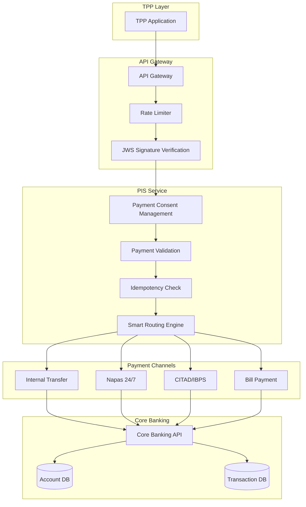

## Payment Flow - 2 Bước (Two-Step Process)

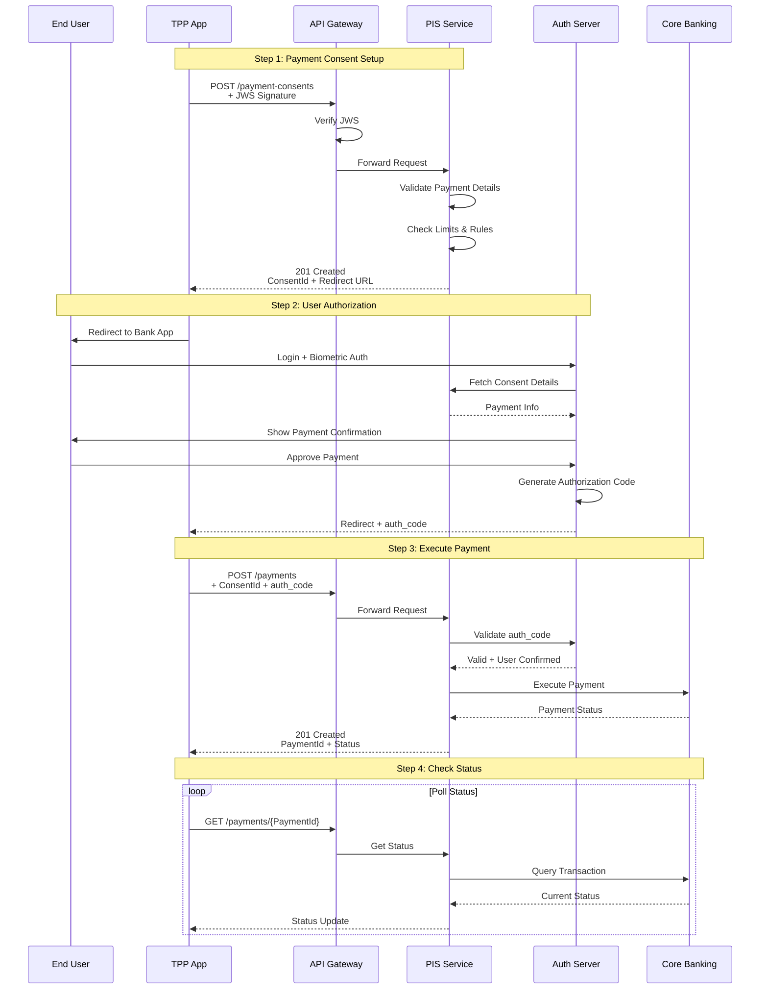

## API Endpoints

### 1. Payment Consent Setup

#### POST /v1/payment-consents

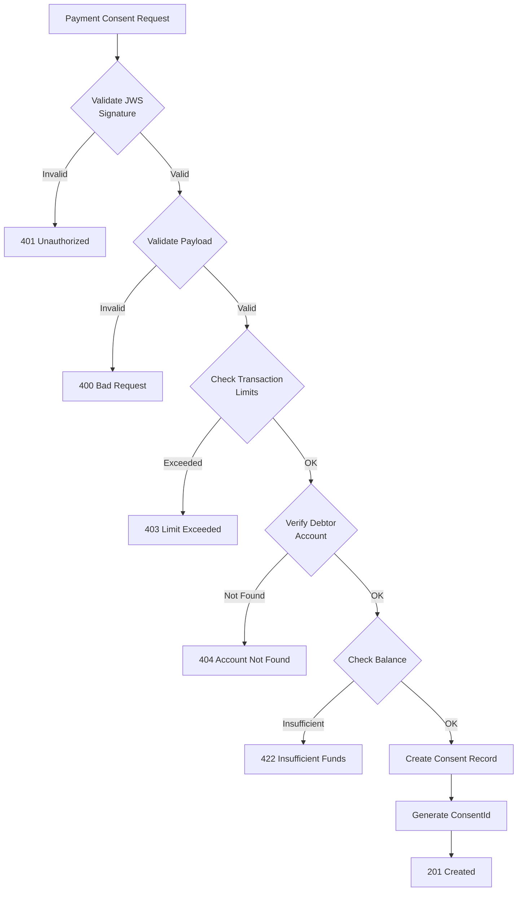

**Request Example:**
```json
{
  "Data": {
    "Initiation": {
      "InstructionIdentification": "TXN-20241210-001",
      "EndToEndIdentification": "E2E-12345",
      "InstructedAmount": {
        "Amount": "1000000.00",
        "Currency": "VND"
      },
      "DebtorAccount": {
        "SchemeName": "VN.ACCOUNT",
        "Identification": "1234567890",
        "Name": "NGUYEN VAN A"
      },
      "CreditorAccount": {
        "SchemeName": "VN.ACCOUNT",
        "Identification": "0987654321",
        "Name": "TRAN THI B"
      },
      "RemittanceInformation": {
        "Unstructured": "Chuyen tien tra no"
      }
    }
  },
  "Risk": {
    "PaymentContextCode": "PersonToPerson",
    "MerchantCategoryCode": "0000",
    "DeliveryAddress": {
      "CountryCode": "VN"
    }
  }
}
```

**Response Example:**
```json
{
  "Data": {
    "ConsentId": "consent-pay-12345",
    "Status": "AwaitingAuthorisation",
    "CreationDateTime": "2024-12-10T17:30:00+07:00",
    "StatusUpdateDateTime": "2024-12-10T17:30:00+07:00",
    "Initiation": {
      "InstructionIdentification": "TXN-20241210-001",
      "EndToEndIdentification": "E2E-12345",
      "InstructedAmount": {
        "Amount": "1000000.00",
        "Currency": "VND"
      }
    }
  },
  "Links": {
    "Self": "https://api.bank.vn/v1/payment-consents/consent-pay-12345",
    "Authorise": "https://auth.bank.vn/authorize?consent_id=consent-pay-12345"
  }
}
```

### 2. Execute Payment

#### POST /v1/payments

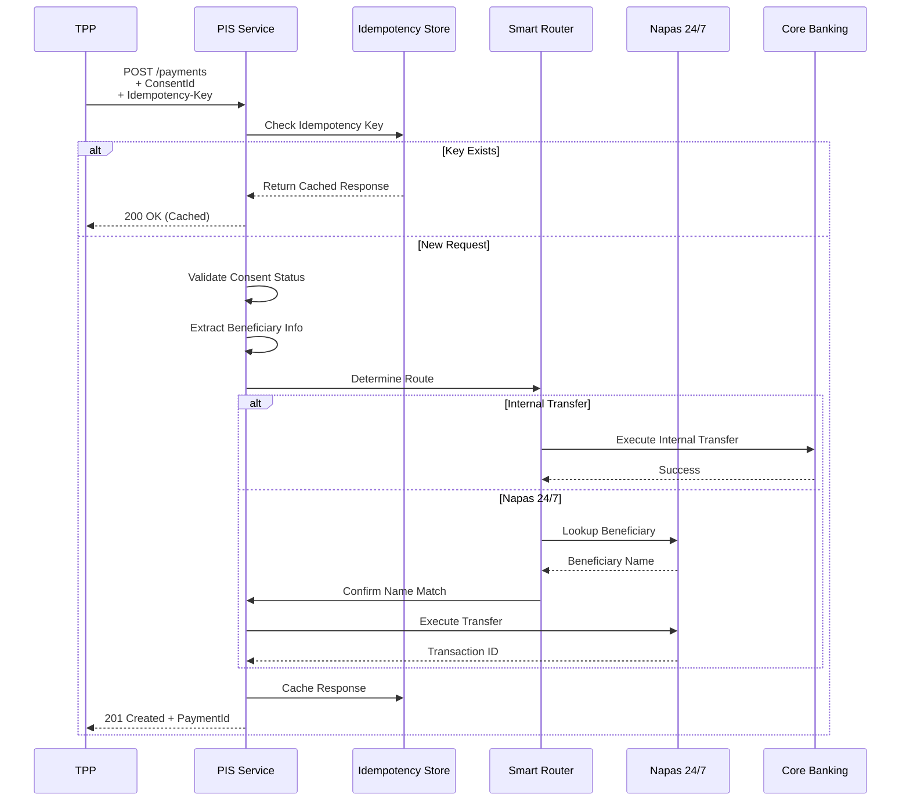

**Request Headers:**
```
Authorization: Bearer {access_token}
x-idempotency-key: unique-key-12345
x-jws-signature: eyJhbGc...
Content-Type: application/json
```

**Request Body:**
```json
{
  "Data": {
    "ConsentId": "consent-pay-12345",
    "Initiation": {
      "InstructionIdentification": "TXN-20241210-001",
      "EndToEndIdentification": "E2E-12345",
      "InstructedAmount": {
        "Amount": "1000000.00",
        "Currency": "VND"
      },
      "DebtorAccount": {
        "Identification": "1234567890"
      },
      "CreditorAccount": {
        "Identification": "0987654321"
      }
    }
  }
}
```

**Response:**
```json
{
  "Data": {
    "PaymentId": "pay-67890",
    "ConsentId": "consent-pay-12345",
    "Status": "Pending",
    "CreationDateTime": "2024-12-10T17:35:00+07:00",
    "StatusUpdateDateTime": "2024-12-10T17:35:00+07:00",
    "Initiation": {
      "InstructionIdentification": "TXN-20241210-001",
      "EndToEndIdentification": "E2E-12345",
      "InstructedAmount": {
        "Amount": "1000000.00",
        "Currency": "VND"
      }
    }
  },
  "Links": {
    "Self": "https://api.bank.vn/v1/payments/pay-67890"
  }
}
```

## Smart Routing Engine

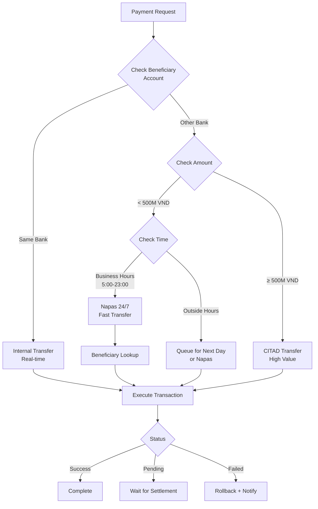

### Routing Rules

| Điều Kiện | Kênh | Thời Gian Xử Lý | Phí |
|-----------|------|------------------|-----|
| Cùng ngân hàng | Internal | Real-time | Miễn phí |
| Khác ngân hàng, < 500M, 5h-23h | Napas 24/7 | < 10 giây | 1,100 - 5,500 VND |
| Khác ngân hàng, ≥ 500M | CITAD | T+1 | Theo thỏa thuận |
| Ngoài giờ | Napas hoặc Queue | T+1 | Theo kênh |

## Napas 24/7 Integration

### Beneficiary Lookup

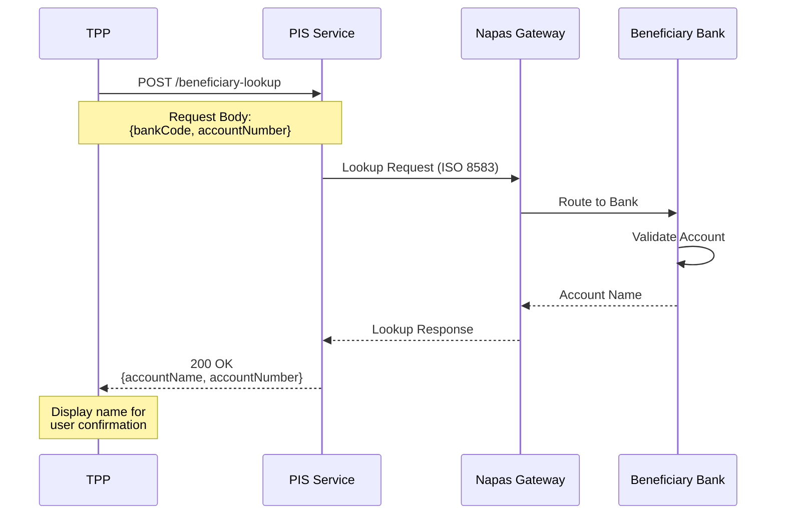

**API Endpoint:** `POST /v1/beneficiary-lookup`

**Request:**
```json
{
  "BeneficiaryBankCode": "970422",
  "AccountNumber": "0987654321"
}
```

**Response:**
```json
{
  "Data": {
    "BeneficiaryBankCode": "970422",
    "BeneficiaryBankName": "MB Bank",
    "AccountNumber": "0987654321",
    "AccountName": "TRAN THI B",
    "Status": "Active"
  }
}
```

### Transfer Execution

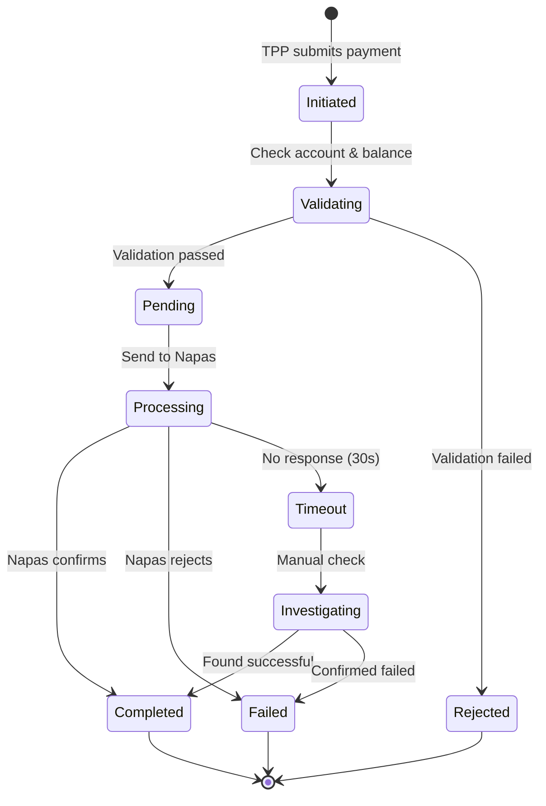

## Bill Payment Integration

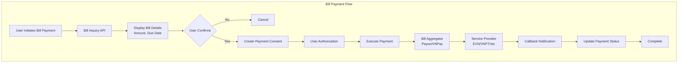

### Bill Inquiry API

**Endpoint:** `GET /v1/bills/inquiry`

**Request:**
```json
{
  "ServiceCode": "EVN_HCMC",
  "CustomerCode": "PE12345678"
}
```

**Response:**
```json
{
  "Data": {
    "ServiceCode": "EVN_HCMC",
    "ServiceName": "Điện lực TP.HCM",
    "CustomerCode": "PE12345678",
    "CustomerName": "NGUYEN VAN A",
    "BillPeriod": "11/2024",
    "DueDate": "2024-12-15",
    "Amount": {
      "Amount": "450000.00",
      "Currency": "VND"
    },
    "Status": "Unpaid"
  }
}
```

### Bill Payment API

**Endpoint:** `POST /v1/bill-payments`

```json
{
  "Data": {
    "ServiceCode": "EVN_HCMC",
    "CustomerCode": "PE12345678",
    "Amount": {
      "Amount": "450000.00",
      "Currency": "VND"
    },
    "DebtorAccount": {
      "Identification": "1234567890"
    }
  }
}
```

## Beneficiary Management

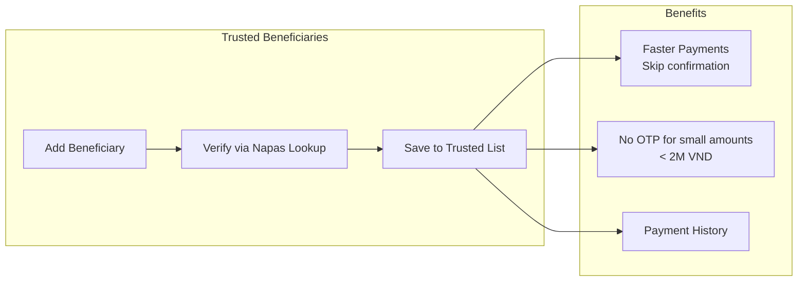

**Endpoint:** `POST /v1/beneficiaries`

```json
{
  "Data": {
    "BeneficiaryName": "TRAN THI B",
    "BeneficiaryAccount": {
      "SchemeName": "VN.ACCOUNT",
      "Identification": "0987654321",
      "BankCode": "970422"
    },
    "Nickname": "Chi B - Em gai"
  }
}
```

## Payment Status Lifecycle

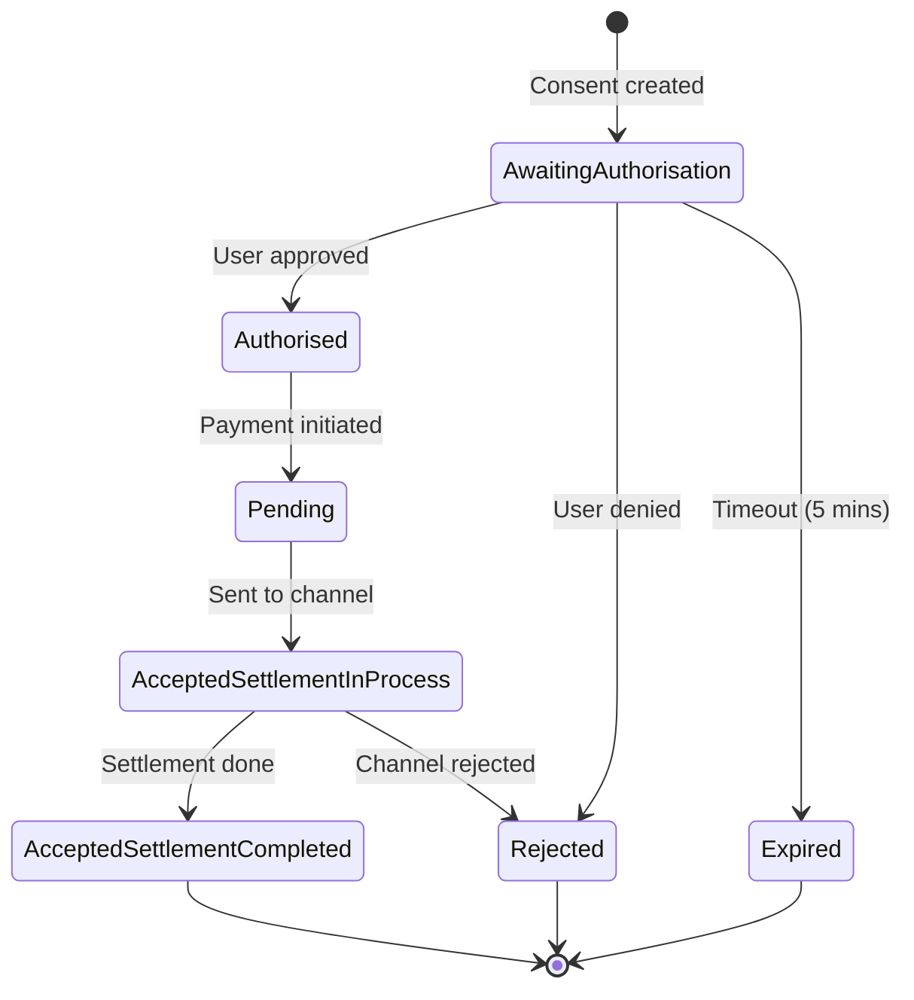

## Transaction Limits & Controls

### Daily Limits

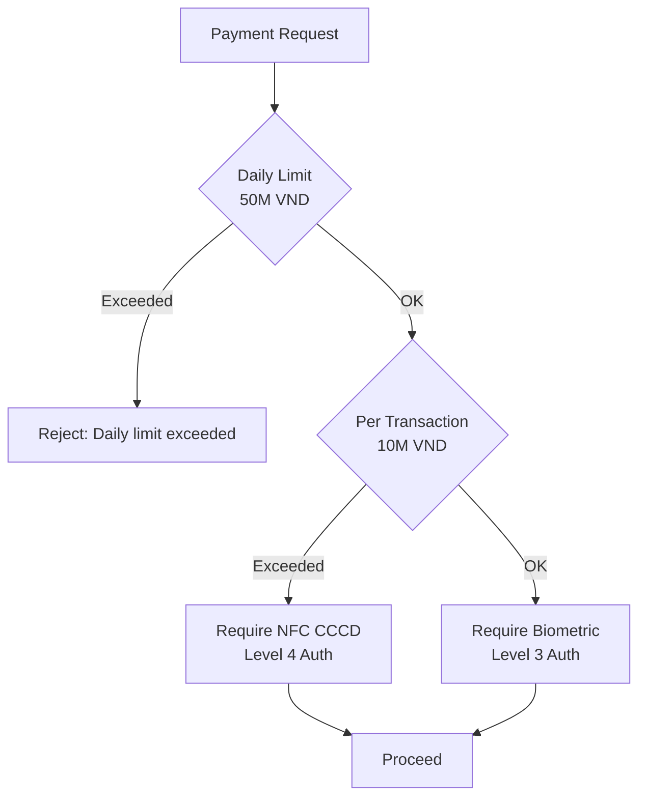

### Limit Configuration

| Loại Giao Dịch | Hạn Mức/Giao Dịch | Hạn Mức/Ngày | Xác Thực |
|----------------|-------------------|--------------|----------|
| Chuyển tiền nội bộ | 50M VND | 200M VND | Level 3 |
| Napas 24/7 | 10M VND | 50M VND | Level 3 (< 10M)<br/>Level 4 (≥ 10M) |
| CITAD | 500M VND | 2B VND | Level 4 |
| Bill Payment | 5M VND | 20M VND | Level 2 |

## Idempotency

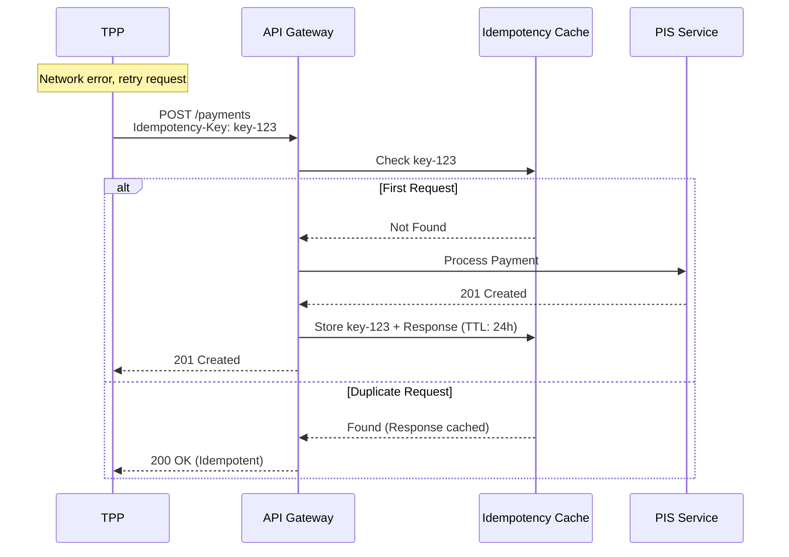

**Idempotency Rules:**
- Header: `x-idempotency-key: {unique-key}`
- TTL: 24 giờ
- Scope: Per client + per endpoint
- Response: 201 (first) → 200 (subsequent)

## Error Handling

### Common Errors

| HTTP Code | Error Code | Mô Tả | Retry? |
|-----------|------------|-------|--------|
| 400 | `INVALID_AMOUNT` | Số tiền không hợp lệ | No |
| 400 | `INVALID_ACCOUNT` | Số tài khoản sai format | No |
| 401 | `INVALID_SIGNATURE` | JWS signature không hợp lệ | No |
| 403 | `DAILY_LIMIT_EXCEEDED` | Vượt hạn mức ngày | No |
| 403 | `CONSENT_NOT_AUTHORISED` | Consent chưa được duyệt | No |
| 422 | `INSUFFICIENT_FUNDS` | Số dư không đủ | No |
| 422 | `ACCOUNT_BLOCKED` | Tài khoản bị khóa | No |
| 500 | `NAPAS_TIMEOUT` | Napas timeout | Yes (max 3) |
| 503 | `SERVICE_UNAVAILABLE` | Hệ thống bảo trì | Yes (after delay) |

**Error Response:**
```json
{
  "Code": "INSUFFICIENT_FUNDS",
  "Message": "The debtor account does not have sufficient funds to complete this payment",
  "Errors": [
    {
      "ErrorCode": "INSUFFICIENT_FUNDS",
      "Message": "Available balance: 500,000 VND, Required: 1,000,000 VND",
      "Path": "Data.Initiation.InstructedAmount"
    }
  ]
}
```

## Security Controls

### JWS Signature Verification

```javascript
// Verify JWS signature
const jose = require('node-jose');

async function verifyJWS(jwsToken, publicKey) {
  try {
    const keystore = jose.JWK.createKeyStore();
    await keystore.add(publicKey, 'pem');
    
    const result = await jose.JWS.createVerify(keystore)
      .verify(jwsToken);
    
    const payload = JSON.parse(result.payload.toString());
    
    // Check jti (prevent replay)
    if (await isJtiUsed(payload.jti)) {
      throw new Error('JTI already used');
    }
    
    // Check iat (issued at time)
    const now = Date.now() / 1000;
    if (now - payload.iat > 300) { // 5 minutes
      throw new Error('Token too old');
    }
    
    return payload;
  } catch (err) {
    throw new Error('Invalid JWS signature');
  }
}
```

### Fraud Detection

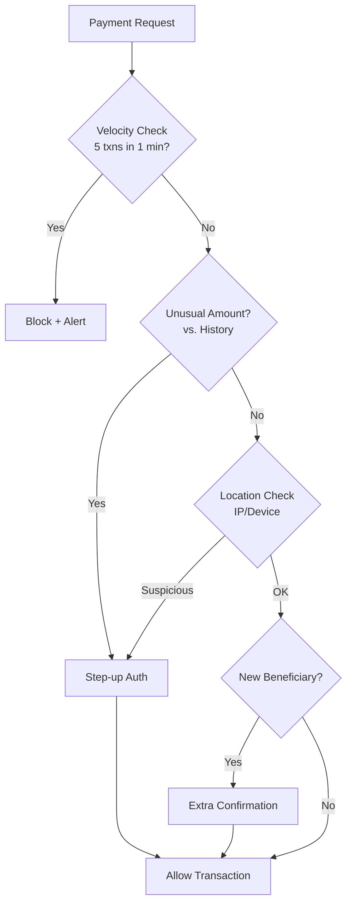

## Compliance Checklist

- [ ] JWS signature bắt buộc cho tất cả payment requests
- [ ] Idempotency key support
- [ ] Two-step consent flow (setup → authorize → execute)
- [ ] Transaction limits enforcement
- [ ] NFC CCCD verification cho giao dịch ≥ 10M VND
- [ ] Beneficiary name lookup (Napas)
- [ ] Audit logging đầy đủ
- [ ] Fraud detection rules
- [ ] Timeout handling (30s max)
- [ ] Retry mechanism với exponential backoff
- [ ] ISO 20022 message format
- [ ] Real-time status updates

## Tài Liệu Tham Khảo
- Thông tư 64/2024/TT-NHNN - Phụ lục 02
- Open Banking UK - Payment Initiation API v4.0
- ISO 20022 - Payment Messages (pacs.008, pain.001)
- Napas 24/7 Technical Specifications
- Quyết định 2345/QĐ-NHNN - Authentication Requirements
