# Dịch Vụ Thẻ & Tokenization

## Tổng Quan

Nhóm API quản lý vòng đời thẻ (Card Lifecycle) và tích hợp với các ví điện tử (Apple Pay, Google Pay, Samsung Pay) thông qua Push Provisioning.

## Kiến Trúc Card Services

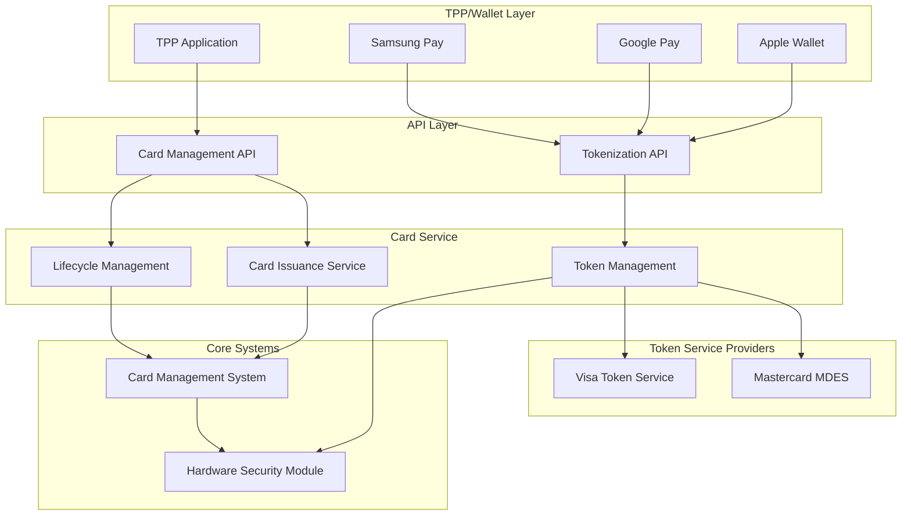

## Card Issuance Flow

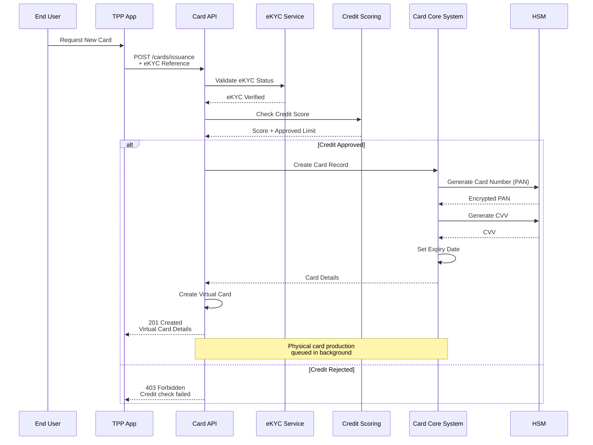

## Card Lifecycle Management

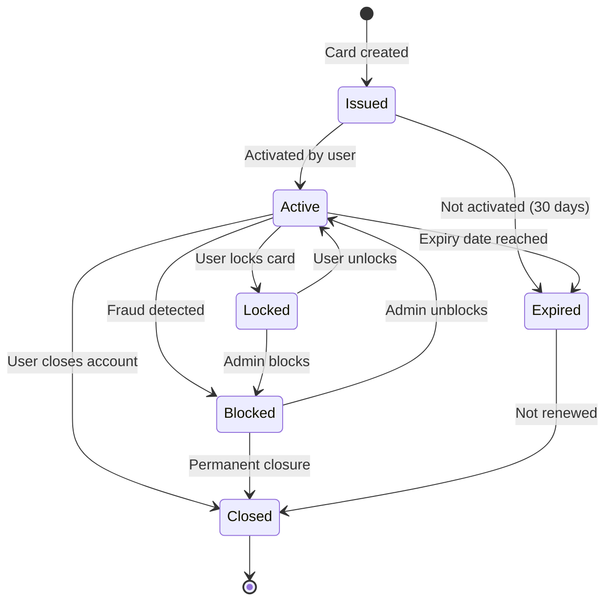

## API Endpoints

### 1. Card Issuance

#### POST /v1/cards/issuance

**Request:**
```json
{
  "Data": {
    "ProductType": "VISA_PLATINUM",
    "DeliveryAddress": {
      "AddressLine": "123 Nguyen Hue",
      "City": "Ho Chi Minh",
      "PostCode": "700000",
      "Country": "VN"
    },
    "eKYCReferenceId": "ekyc-ref-12345",
    "LinkedAccount": "1234567890"
  }
}
```

**Response:**
```json
{
  "Data": {
    "CardId": "card-abc123",
    "CardType": "Virtual",
    "ProductType": "VISA_PLATINUM",
    "Status": "Active",
    "MaskedPAN": "4532********1234",
    "ExpiryDate": "12/27",
    "CardholderName": "NGUYEN VAN A",
    "IssuedDate": "2024-12-10T18:00:00+07:00",
    "VirtualCardDetails": {
      "PAN": "4532123456781234",
      "CVV": "123",
      "ExpiryMonth": "12",
      "ExpiryYear": "2027"
    }
  },
  "Links": {
    "Self": "https://api.bank.vn/v1/cards/card-abc123"
  }
}
```

### 2. Card Lock/Unlock

#### PUT /v1/cards/{CardId}/lock

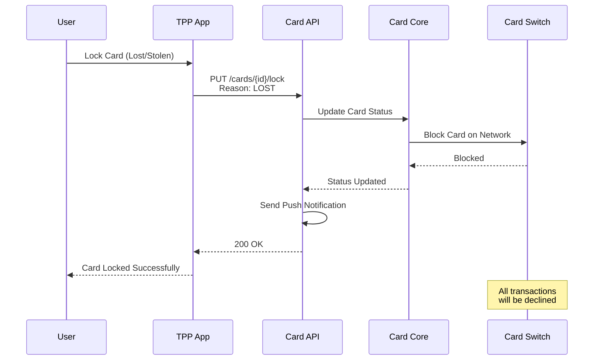

**Request:**
```json
{
  "Reason": "LOST",
  "Comment": "Card lost at shopping mall"
}
```

**Response:**
```json
{
  "Data": {
    "CardId": "card-abc123",
    "Status": "Locked",
    "LockReason": "LOST",
    "StatusUpdateDateTime": "2024-12-10T18:30:00+07:00"
  }
}
```

### 3. PIN Management

#### PUT /v1/cards/{CardId}/pin

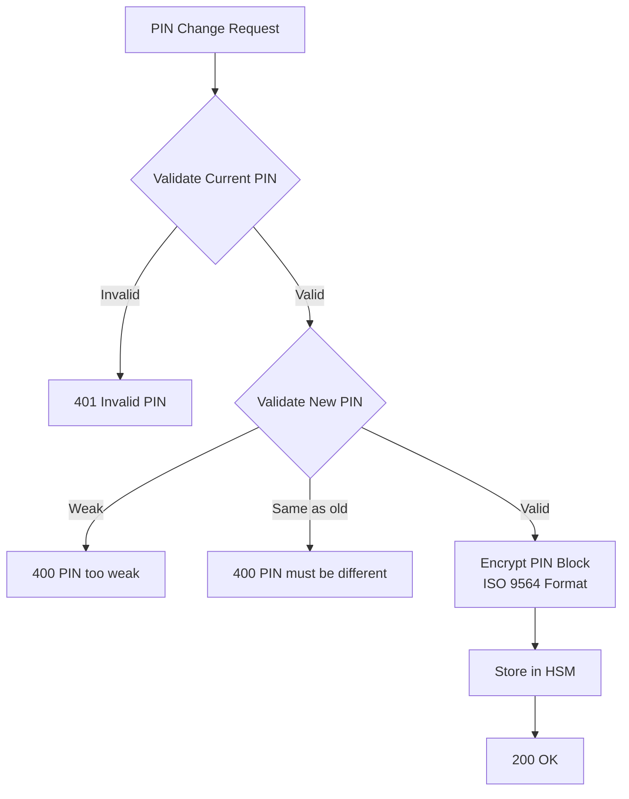

**PIN Block Format (ISO 9564-1):**
```
Format 0: PIN + PAN
Clear PIN: 1234
PAN: 4532123456781234
PIN Block: 0412FFFFFFFF (XOR with PAN)
Encrypted with HSM key
```

**Request:**
```json
{
  "CurrentPIN": "encrypted_current_pin",
  "NewPIN": "encrypted_new_pin",
  "EncryptionMethod": "RSA_OAEP"
}
```

## Push Provisioning (Tokenization)

### Architecture

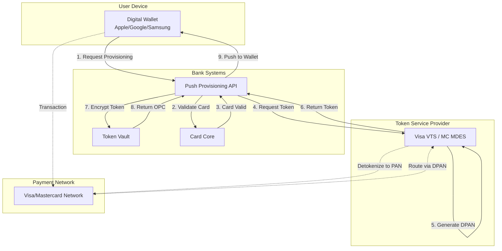

### Push Provisioning Flow

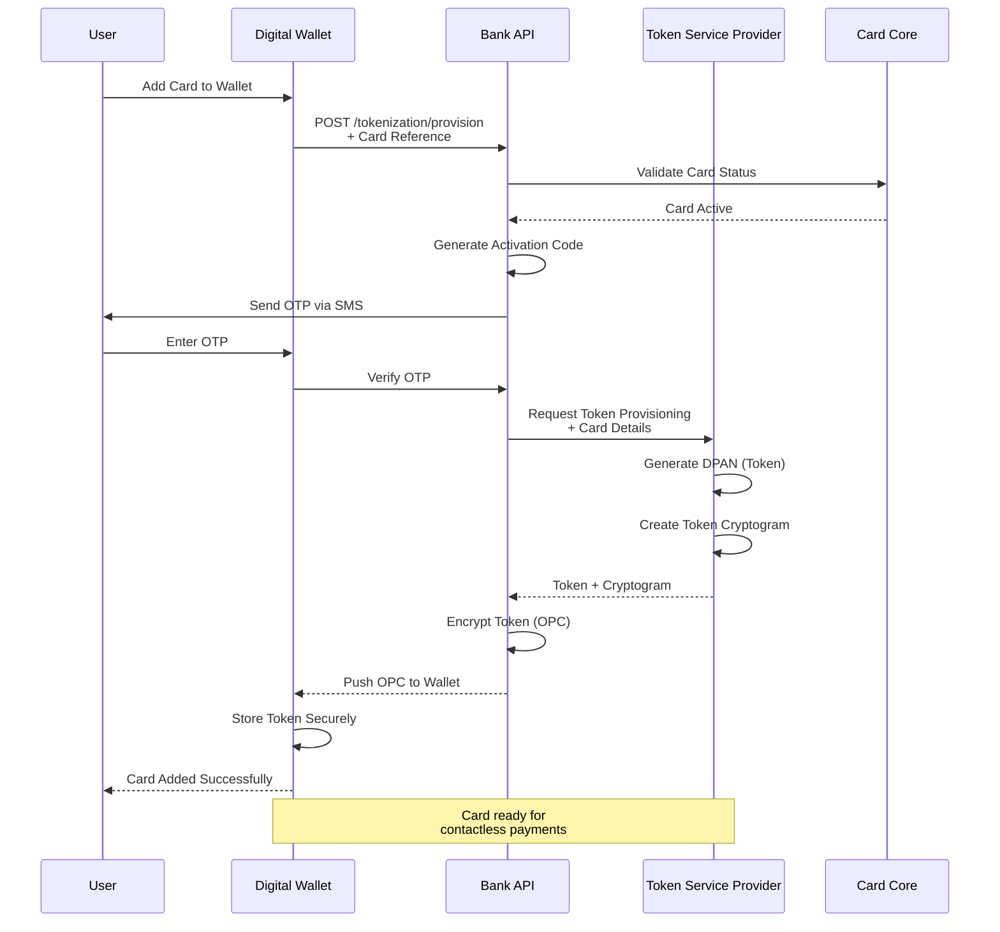

### API Endpoint: Push Provisioning

#### POST /v1/tokenization/provision

**Request:**
```json
{
  "CardId": "card-abc123",
  "WalletProvider": "APPLE_PAY",
  "DeviceInfo": {
    "DeviceId": "device-xyz789",
    "DeviceName": "iPhone 15 Pro",
    "OSVersion": "iOS 17.2",
    "WalletAccountId": "wallet-acc-456"
  },
  "Certificates": {
    "LeafCertificate": "-----BEGIN CERTIFICATE-----...",
    "SubCACertificate": "-----BEGIN CERTIFICATE-----..."
  },
  "Nonce": "random-nonce-12345",
  "NonceSignature": "signature-of-nonce"
}
```

**Response:**
```json
{
  "Data": {
    "TokenReferenceId": "token-ref-12345",
    "ActivationData": {
      "EncryptedPassData": "encrypted_opaque_payment_card",
      "EphemeralPublicKey": "BFz...public_key",
      "ActivationMethod": "SMS_OTP"
    },
    "TokenStatus": "ACTIVE",
    "DPAN": "4900********5678",
    "ExpiryDate": "12/27"
  }
}
```

## Token Lifecycle Management

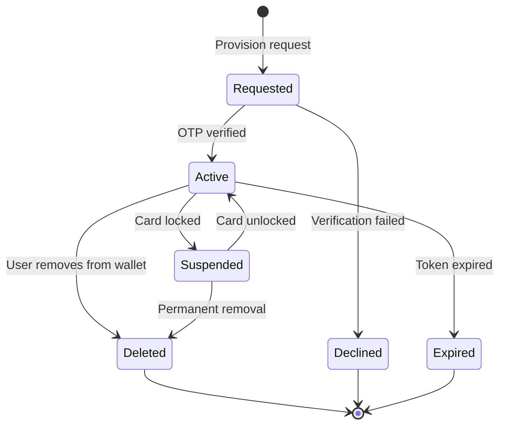

## Token Transaction Flow

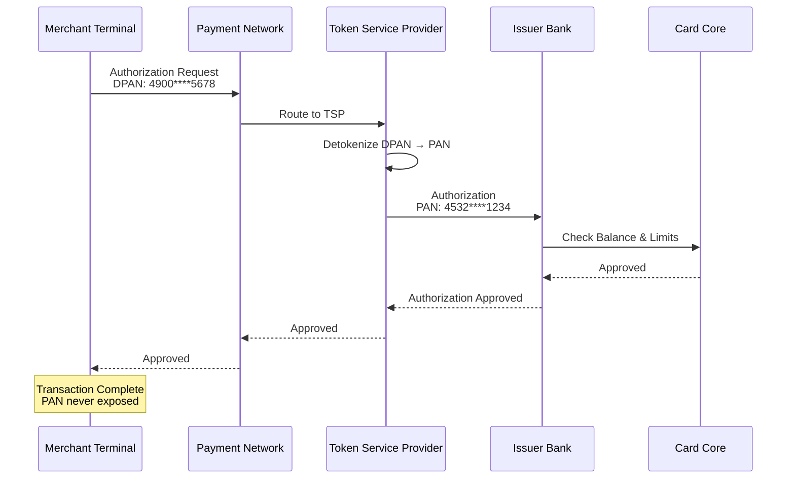

## Card Controls & Limits

### Spending Controls

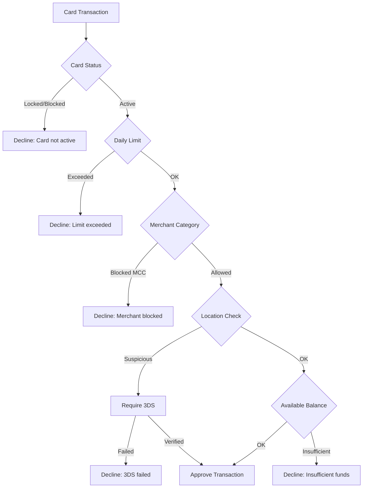

### Control Settings API

#### PUT /v1/cards/{CardId}/controls

```json
{
  "SpendingLimits": {
    "DailyLimit": {
      "Amount": "10000000",
      "Currency": "VND"
    },
    "MonthlyLimit": {
      "Amount": "50000000",
      "Currency": "VND"
    },
    "PerTransactionLimit": {
      "Amount": "5000000",
      "Currency": "VND"
    }
  },
  "AllowedMerchantCategories": [
    "5411",
    "5812",
    "5999"
  ],
  "BlockedMerchantCategories": [
    "7995",
    "9754"
  ],
  "AllowedCountries": ["VN", "TH", "SG"],
  "OnlineTransactions": true,
  "ContactlessTransactions": true,
  "ATMWithdrawals": true
}
```

## 3D Secure Integration

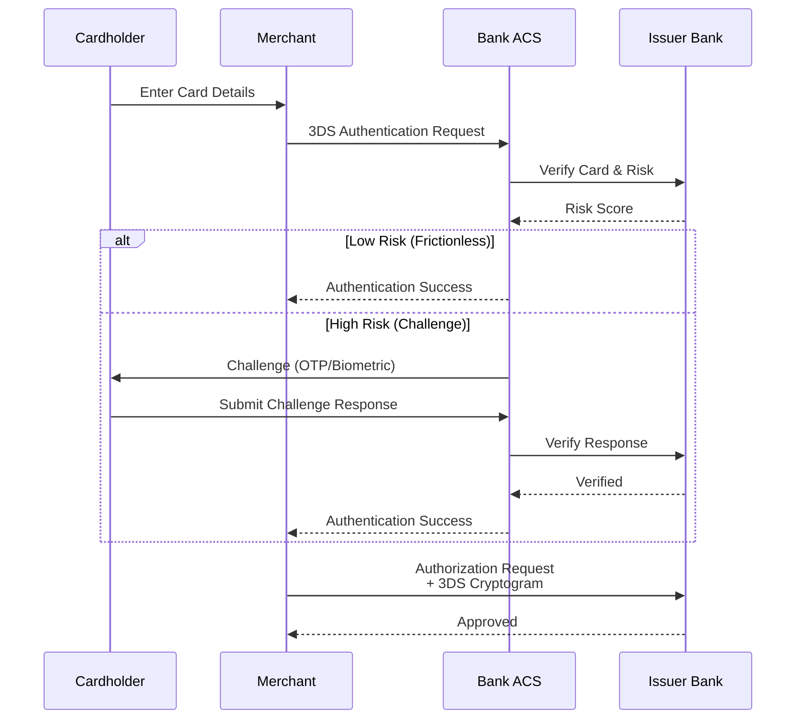

## Virtual Card Management

### Instant Virtual Card

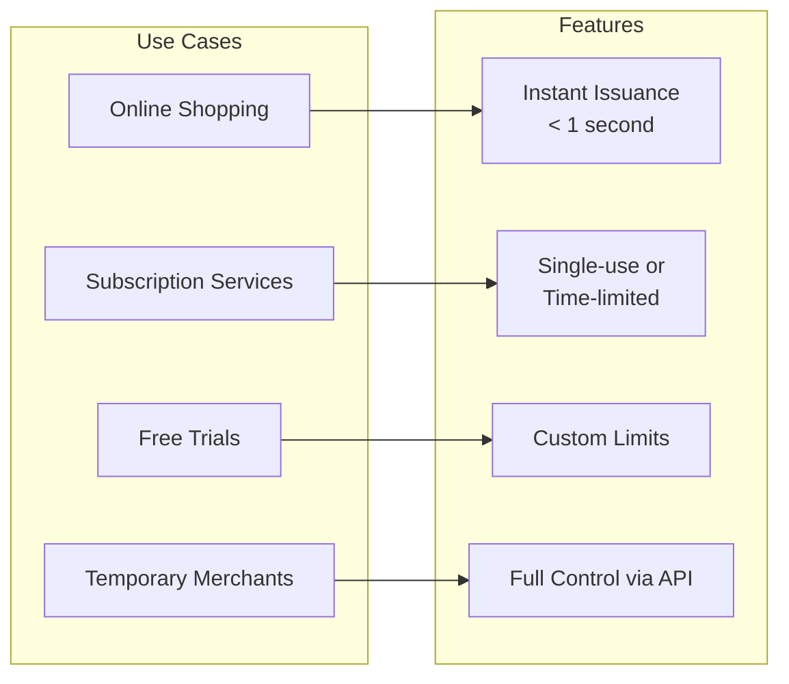

#### POST /v1/cards/virtual

**Request:**
```json
{
  "CardType": "SINGLE_USE",
  "LinkedAccount": "1234567890",
  "SpendingLimit": {
    "Amount": "1000000",
    "Currency": "VND"
  },
  "ValidUntil": "2024-12-31T23:59:59+07:00",
  "Purpose": "Online shopping at Shopee"
}
```

**Response:**
```json
{
  "Data": {
    "CardId": "vcard-temp-123",
    "PAN": "4532123456789999",
    "CVV": "999",
    "ExpiryDate": "12/24",
    "Status": "Active",
    "CardType": "SINGLE_USE",
    "RemainingLimit": {
      "Amount": "1000000",
      "Currency": "VND"
    }
  }
}
```

## Security Best Practices

### PCI DSS Compliance

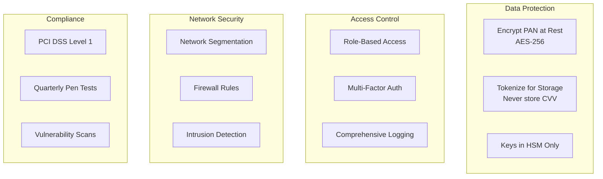

### Sensitive Data Handling

**Never Log:**
- Full PAN (Primary Account Number)
- CVV/CVC
- PIN or PIN Block (unencrypted)
- Magnetic stripe data
- CAV/CID/CVV2

**Always Mask:**
```javascript
function maskPAN(pan) {
  return pan.substring(0, 6) + '*'.repeat(pan.length - 10) + pan.substring(pan.length - 4);
}
// 4532123456781234 → 453212******1234
```

## Monitoring & Alerts

### Real-time Fraud Detection

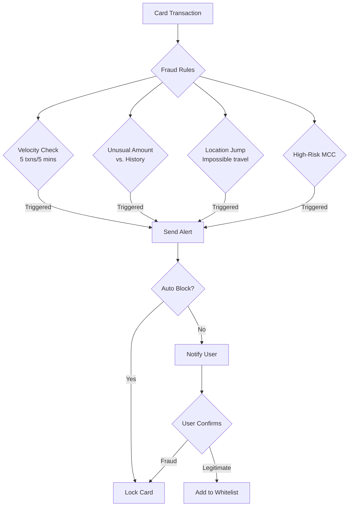

## Compliance Checklist

- [ ] PCI DSS Level 1 certification
- [ ] HSM for key management
- [ ] PAN encryption at rest (AES-256)
- [ ] TLS 1.3 for data in transit
- [ ] No CVV storage (ever)
- [ ] 3D Secure 2.0 implementation
- [ ] Token lifecycle management
- [ ] Fraud detection rules
- [ ] Real-time transaction monitoring
- [ ] Audit logging (all card operations)
- [ ] Quarterly penetration testing
- [ ] Vulnerability scanning
- [ ] Incident response plan
- [ ] Data breach notification procedures

## Tài Liệu Tham Khảo
- PCI DSS v4.0 Requirements
- EMV 3D Secure 2.0 Specification
- Visa Token Service (VTS) Integration Guide
- Mastercard MDES API Reference
- Apple Pay Push Provisioning Guide
- Google Pay API Documentation
- ISO 9564 - PIN Management
- ISO 8583 - Card Transaction Messages
