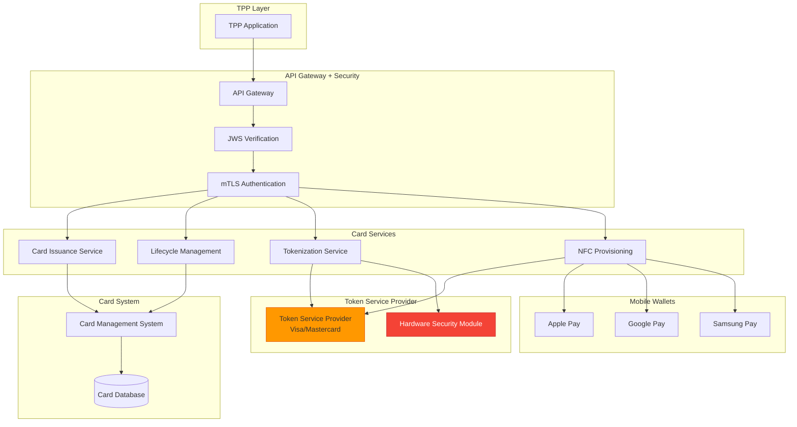
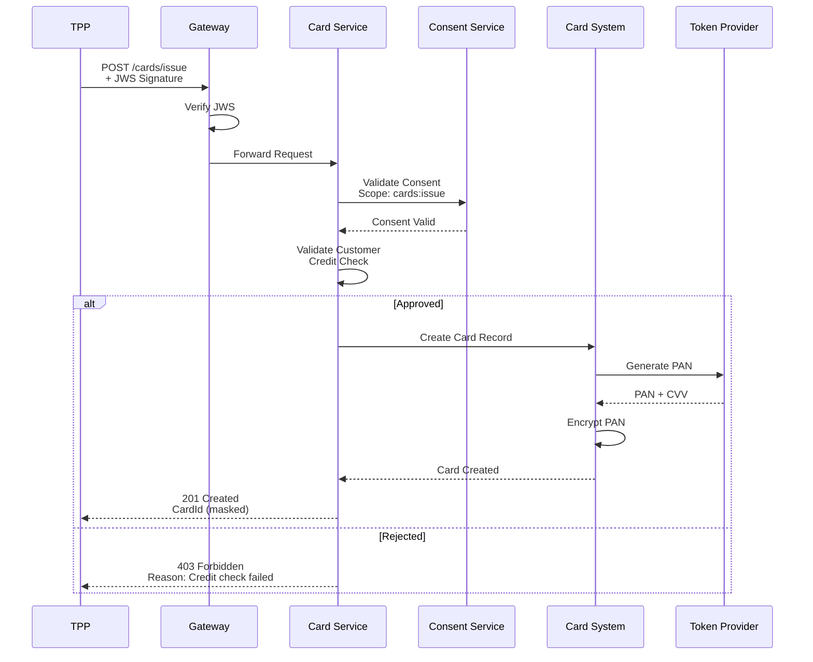
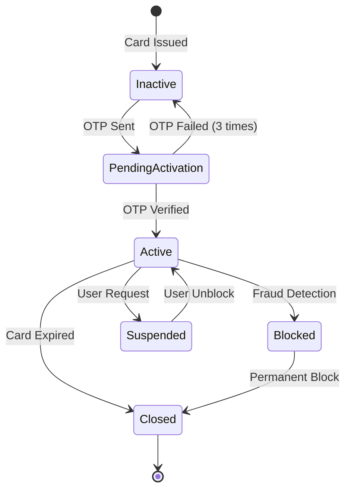
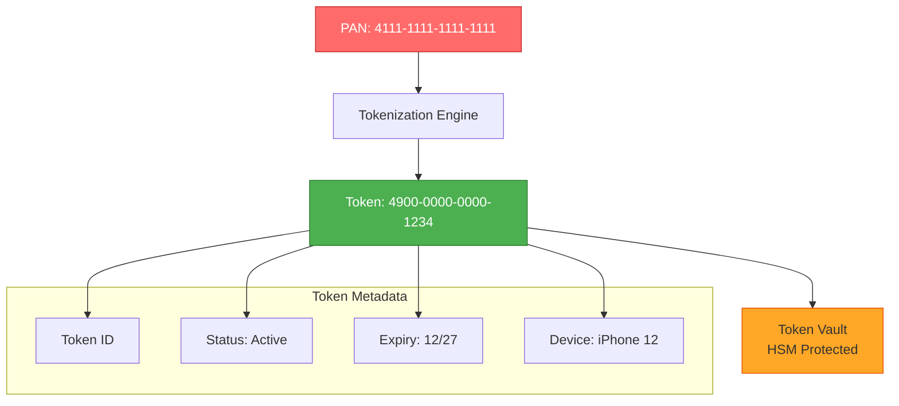
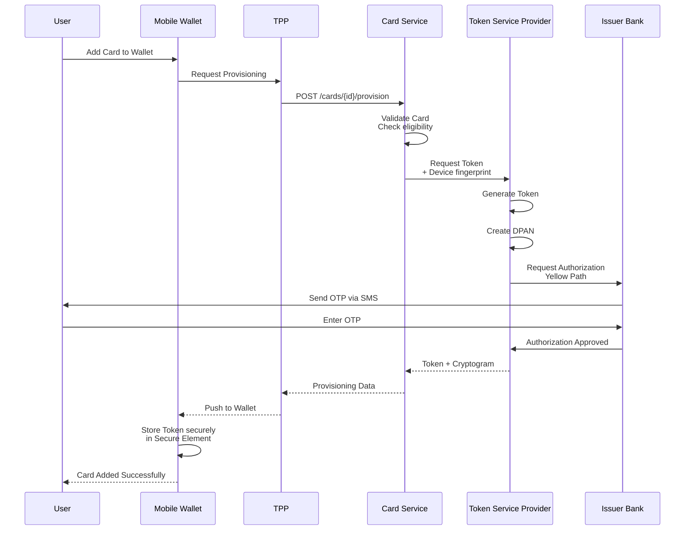
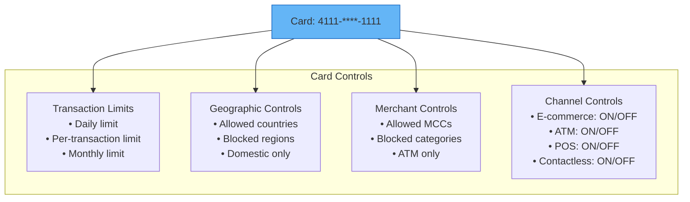
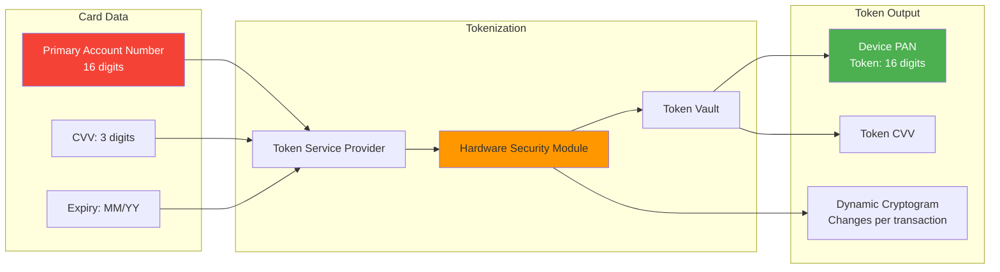
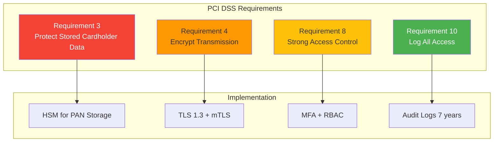
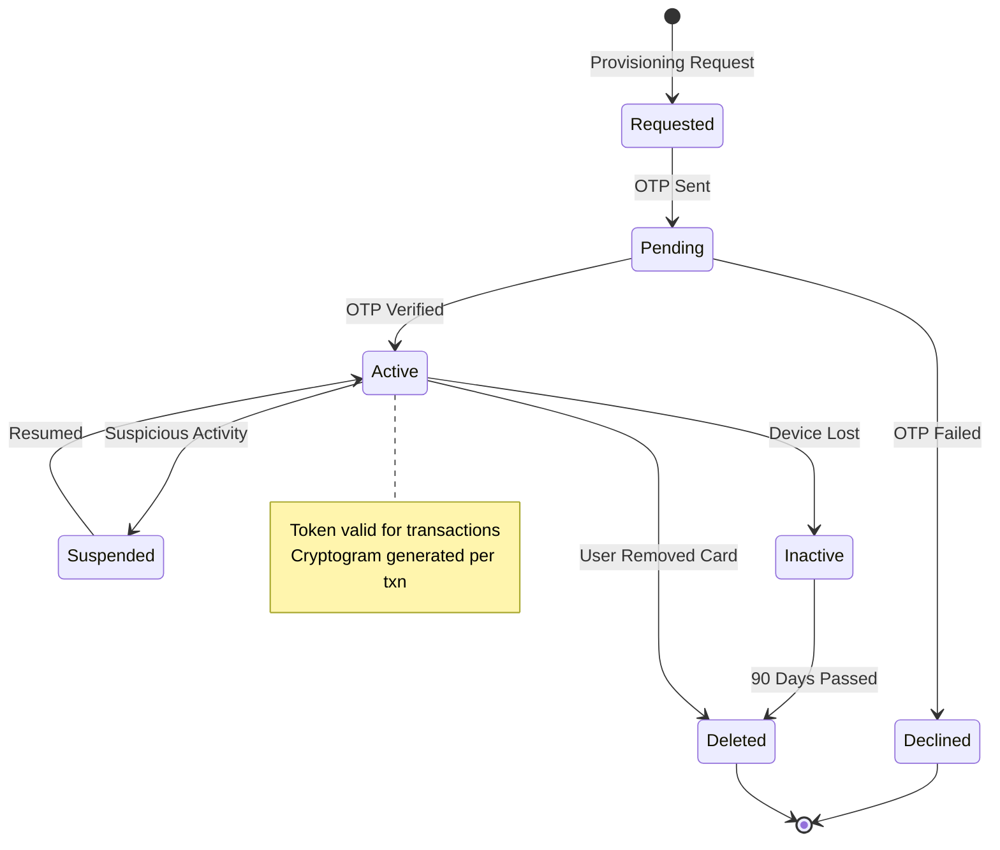
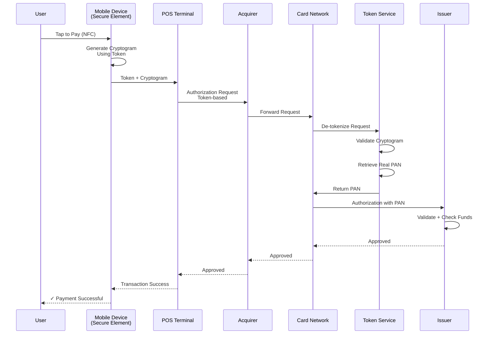

# Dịch Vụ Thẻ & Tokenization (Card Services & Token Provisioning)

> **Tuân thủ:** Thông tư 64/2024/TT-NHNN | ISO/IEC 11568 | EMV Payment Tokenization | PCI DSS 4.0

## Tổng Quan

Nhóm API cho phép TPP phát hành thẻ, quản lý vòng đời thẻ và tokenization cho thanh toán không tiếp xúc (NFC/Mobile Wallet).

### Phạm Vi Dịch Vụ

1. **Card Issuance**: Phát hành thẻ tín dụng/ghi nợ
2. **Card Lifecycle**: Kích hoạt, khóa, mở khóa, hủy thẻ
3. **Card Tokenization**: Chuyển đổi PAN sang Token
4. **NFC Push Provisioning**: Đẩy thẻ lên Apple Pay, Google Pay, Samsung Pay
5. **Card Controls**: Giới hạn giao dịch, khu vực địa lý

## Kiến Trúc Card Services



## API Endpoints

### 1. Card Issuance

#### POST /v1/cards/issue

Phát hành thẻ mới cho khách hàng.



**Request:**
```json
{
  "CustomerId": "cust-12345",
  "ProductCode": "VISA_CREDIT_PLATINUM",
  "CardType": "Virtual",
  "EmbossName": "NGUYEN VAN A",
  "DeliveryAddress": {
    "AddressLine": "123 Nguyen Hue",
    "City": "Ho Chi Minh",
    "PostalCode": "700000"
  },
  "CreditLimit": {
    "Amount": "50000000",
    "Currency": "VND"
  }
}
```

**Response:**
```json
{
  "CardId": "card-abc123",
  "MaskedPAN": "4111********1111",
  "CardType": "Virtual",
  "Status": "Inactive",
  "ExpiryDate": "12/27",
  "CardProduct": "VISA_CREDIT_PLATINUM",
  "CreditLimit": {
    "Amount": "50000000",
    "Currency": "VND"
  },
  "IssuedDate": "2025-12-15T10:30:00+07:00"
}
```

### 2. Card Activation

#### POST /v1/cards/{CardId}/activate

Kích hoạt thẻ sau khi khách hàng nhận được.



**Request:**
```json
{
  "ActivationCode": "123456",
  "CVV": "123",
  "PIN": "encrypted_pin_data"
}
```

### 3. Card Tokenization

#### POST /v1/cards/{CardId}/tokens

Tạo token cho thẻ để sử dụng trong giao dịch không tiếp xúc.



**Key Properties:**

| Property | PAN (Original) | Token (Substitute) |
|----------|----------------|---------------------|
| **Format** | 16 digits | 16 digits (same format) |
| **Validity** | Card lifetime | Per-device, time-limited |
| **Storage** | HSM only | Can be stored |
| **Reversible** | N/A | Yes (with TSP key) |
| **Domain** | Universal | Device/merchant specific |

**Response:**
```json
{
  "TokenId": "token-xyz789",
  "TokenizedPAN": "4900000000001234",
  "TokenExpiry": "12/27",
  "TokenType": "DEVICE",
  "DeviceId": "device-iphone12-001",
  "TokenStatus": "Active",
  "TokenRequestorId": "40010030273"
}
```

### 4. NFC Push Provisioning

#### POST /v1/cards/{CardId}/provision

Đẩy thẻ lên ví điện tử (Apple Pay, Google Pay).



**Request:**
```json
{
  "WalletProvider": "APPLE_PAY",
  "DeviceId": "A1B2C3D4E5F6",
  "DeviceType": "iPhone",
  "DeviceName": "iPhone của Tôi",
  "OSVersion": "iOS 17.2",
  "WalletAccountId": "wallet-acc-123"
}
```

**Response:**
```json
{
  "ProvisioningId": "prov-abc123",
  "Status": "Pending",
  "OTPRequired": true,
  "OTPDelivery": "SMS",
  "ActivationData": "encrypted_activation_data",
  "OpaquePaymentCard": "encrypted_token_data"
}
```

### 5. Card Lifecycle Management

#### PATCH /v1/cards/{CardId}/status

Quản lý trạng thái thẻ (khóa, mở khóa, hủy).

**Request:**
```json
{
  "Action": "BLOCK",
  "Reason": "LOST",
  "TemporaryBlock": false,
  "ReasonCode": "01"
}
```

**Actions:**
- `ACTIVATE`: Kích hoạt thẻ
- `BLOCK`: Khóa thẻ (tạm thời hoặc vĩnh viễn)
- `UNBLOCK`: Mở khóa thẻ
- `CLOSE`: Đóng thẻ (không thể hoàn tác)

### 6. Card Controls

#### PUT /v1/cards/{CardId}/controls

Thiết lập giới hạn và kiểm soát sử dụng thẻ.



**Request:**
```json
{
  "DailyLimit": {
    "Amount": "10000000",
    "Currency": "VND"
  },
  "PerTransactionLimit": {
    "Amount": "5000000",
    "Currency": "VND"
  },
  "AllowedCountries": ["VN"],
  "AllowedMCC": ["5411", "5812", "5999"],
  "ChannelControls": {
    "Ecommerce": true,
    "ATM": true,
    "POS": true,
    "Contactless": true
  }
}
```

## Security Architecture

### EMV Tokenization



### Key Management

**Encryption Keys:**

| Key Type | Purpose | Storage | Rotation |
|----------|---------|---------|----------|
| **KEK** (Key Encryption Key) | Encrypt other keys | HSM | 1 year |
| **DEK** (Data Encryption Key) | Encrypt PAN | HSM | 90 days |
| **TMK** (Token Master Key) | Generate tokens | HSM | 2 years |
| **CVK** (Card Verification Key) | Generate CVV | HSM | Never (fixed) |

### PCI DSS Compliance



**Key Controls:**

1. ✅ PAN never stored in clear text
2. ✅ PAN truncated in logs (first 6 + last 4)
3. ✅ CVV never stored after authorization
4. ✅ Strong cryptography (AES-256)
5. ✅ Regular penetration testing
6. ✅ Network segmentation (card data isolated)

## Token Lifecycle



## Transaction Flow with Token



## Error Handling

| Error Code | Mô Tả | Hành Động |
|------------|-------|-----------|
| `CARD_NOT_ELIGIBLE` | Thẻ không đủ điều kiện tokenization | Kiểm tra loại thẻ |
| `DEVICE_NOT_SUPPORTED` | Thiết bị không hỗ trợ | Nâng cấp OS |
| `OTP_EXPIRED` | OTP hết hạn | Gửi OTP mới |
| `PROVISIONING_LIMIT_EXCEEDED` | Vượt quá số lượng thiết bị | Xóa thiết bị cũ |
| `TOKEN_SUSPENDED` | Token bị tạm ngưng | Liên hệ ngân hàng |
| `CRYPTOGRAM_INVALID` | Cryptogram không hợp lệ | Reprovision token |

## Performance & Scalability

**SLA Targets:**

| Operation | Response Time | Throughput |
|-----------|---------------|------------|
| Card Issuance | < 3s | 100 TPS |
| Tokenization | < 500ms | 500 TPS |
| Provisioning | < 2s | 200 TPS |
| Transaction Auth | < 200ms | 5000 TPS |

## Compliance Checklist

- [ ] PCI DSS 4.0 certified
- [ ] EMV tokenization compliant
- [ ] HSM for all PAN operations
- [ ] No PAN in logs (truncated only)
- [ ] TLS 1.3 + mTLS for all communications
- [ ] Strong Customer Authentication (SCA)
- [ ] Fraud detection system integrated
- [ ] Audit logs retained 7 years
- [ ] Regular security assessments
- [ ] Incident response plan documented

## Tài Liệu Tham Khảo

- **Thông tư 64/2024/TT-NHNN** - Open API Regulations
- **PCI DSS 4.0** - Payment Card Industry Data Security Standard
- **EMV Payment Tokenisation Specification** - EMVCo
- **ISO/IEC 11568** - Key Management
- **Apple Pay Integration Guide** - Apple Developer
- **Google Pay Integration Guide** - Google Developer
- **Samsung Pay Integration Guide** - Samsung Developer

---

**Phiên bản:** 1.0  
**Ngày cập nhật:** 15/12/2025  
**Trạng thái:** Production Ready
