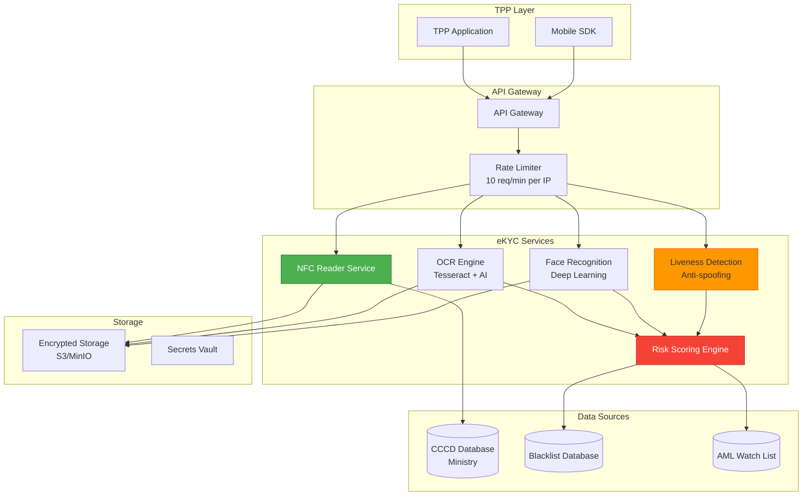
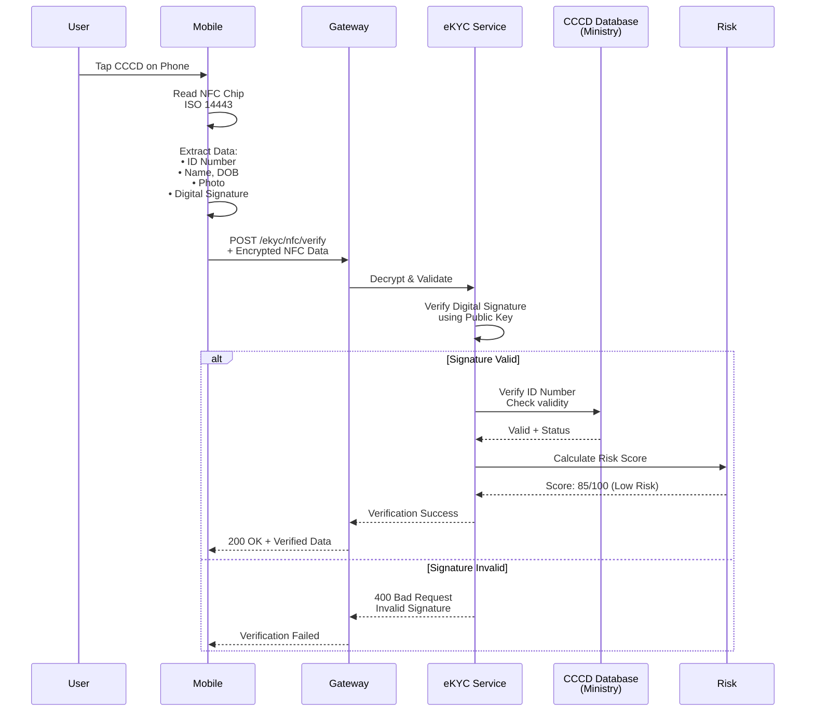
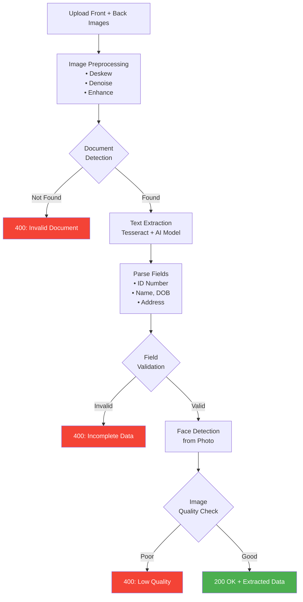
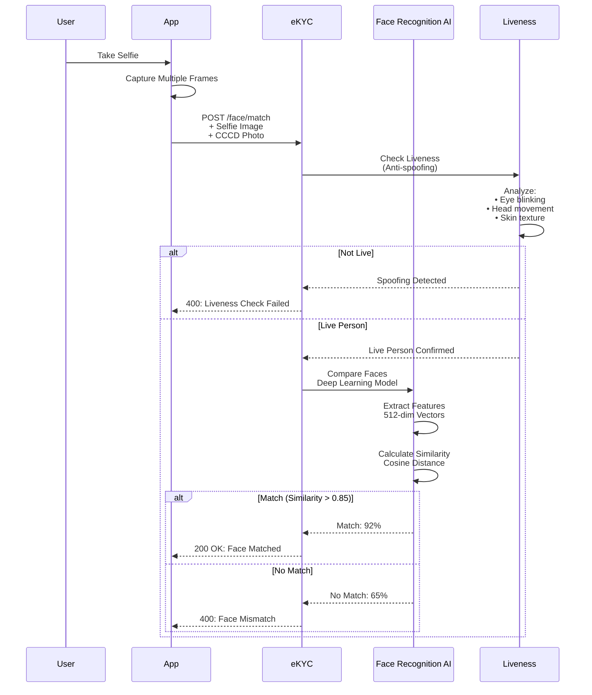
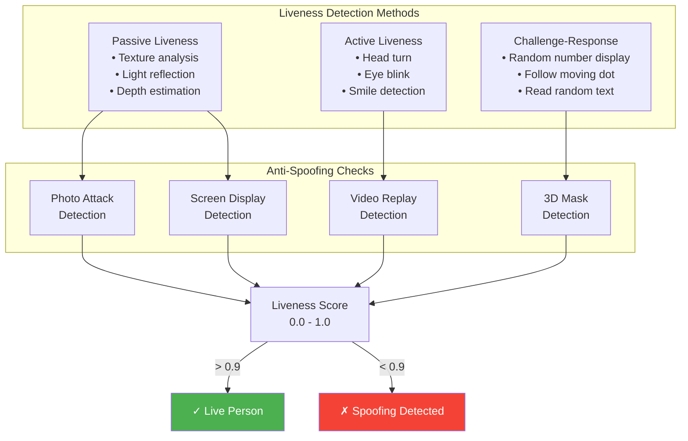
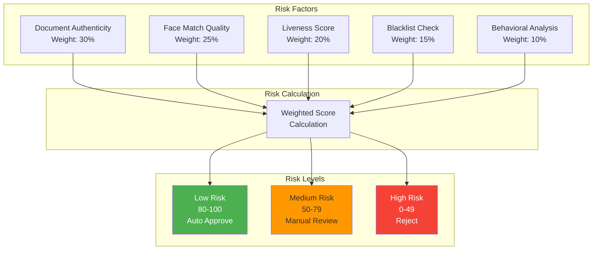
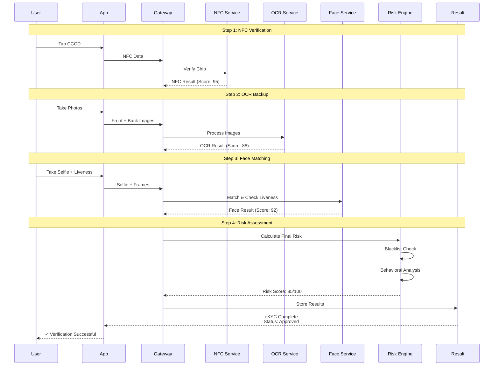
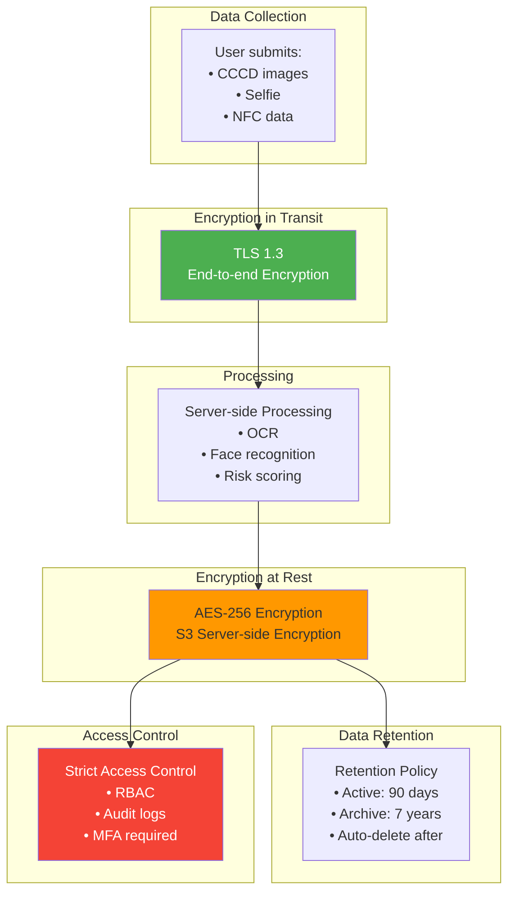

# Dịch Vụ Định Danh Điện Tử (eKYC - Electronic Know Your Customer)

> **Tuân thủ:** Thông tư 64/2024/TT-NHNN | Circular 45/2025 | Quyết định 2345/QĐ-NHNN | ISO 30107 (Liveness Detection)

## Tổng Quan

Dịch vụ eKYC cho phép TPP xác thực danh tính khách hàng từ xa thông qua CCCD gắn chip, sinh trắc học và OCR, tuân thủ Circular 45/2025.

### Phạm Vi Dịch Vụ

1. **NFC Verification**: Đọc thông tin từ CCCD gắn chip qua NFC
2. **OCR Document**: Nhận diện thông tin từ ảnh CCCD
3. **Face Matching**: So khớp khuôn mặt với ảnh CCCD
4. **Liveness Detection**: Phát hiện khuôn mặt thật (chống ảnh, video)
5. **Risk Scoring**: Đánh giá rủi ro gian lận

## Kiến Trúc eKYC



## API Endpoints

### 1. NFC Verification

#### POST /v1/ekyc/nfc/verify

Đọc và xác thực thông tin từ CCCD gắn chip qua NFC.



**Request:**
```json
{
  "NFCData": "base64_encrypted_data_from_chip",
  "DeviceInfo": {
    "DeviceId": "device-abc123",
    "OSVersion": "iOS 17.2",
    "AppVersion": "2.1.0"
  },
  "Location": {
    "Latitude": 10.7769,
    "Longitude": 106.7009
  }
}
```

**Response:**
```json
{
  "VerificationId": "verify-nfc-123456",
  "Status": "Verified",
  "PersonalInfo": {
    "IdNumber": "001099001234",
    "FullName": "NGUYEN VAN A",
    "DateOfBirth": "01/01/1990",
    "Gender": "Male",
    "Nationality": "Vietnam",
    "PlaceOfOrigin": "Hanoi",
    "PlaceOfResidence": "123 Nguyen Hue, District 1, HCMC",
    "IssueDate": "01/01/2020",
    "ExpiryDate": "01/01/2035"
  },
  "Photo": "base64_encoded_photo",
  "RiskScore": 85,
  "RiskLevel": "Low",
  "VerifiedAt": "2025-12-15T10:30:00+07:00"
}
```

### 2. OCR Document Recognition

#### POST /v1/ekyc/ocr/document

Nhận diện thông tin từ ảnh chụp CCCD.



**Request:**
```json
{
  "FrontImage": "base64_encoded_image",
  "BackImage": "base64_encoded_image",
  "DocumentType": "CCCD"
}
```

**Response:**
```json
{
  "OCRId": "ocr-789012",
  "ExtractedData": {
    "IdNumber": "001099001234",
    "FullName": "NGUYEN VAN A",
    "DateOfBirth": "01/01/1990",
    "Gender": "Male",
    "Nationality": "Vietnam",
    "PlaceOfOrigin": "Hanoi",
    "PlaceOfResidence": "123 Nguyen Hue, District 1, HCMC",
    "IssueDate": "01/01/2020",
    "ExpiryDate": "01/01/2035"
  },
  "Confidence": {
    "Overall": 0.95,
    "IdNumber": 0.98,
    "FullName": 0.93,
    "DateOfBirth": 0.96
  },
  "FaceDetected": true,
  "FaceBoundingBox": {
    "x": 120,
    "y": 80,
    "width": 150,
    "height": 180
  },
  "QualityScore": 88,
  "ProcessedAt": "2025-12-15T10:31:00+07:00"
}
```

### 3. Face Matching

#### POST /v1/ekyc/face/match

So khớp khuôn mặt selfie với ảnh trên CCCD.



**Request:**
```json
{
  "SelfieImage": "base64_encoded_selfie",
  "ReferenceImage": "base64_encoded_cccd_photo",
  "LivenessCheck": true,
  "LivenessFrames": [
    "base64_frame1",
    "base64_frame2",
    "base64_frame3"
  ]
}
```

**Response:**
```json
{
  "MatchId": "match-345678",
  "IsMatch": true,
  "Similarity": 0.92,
  "Threshold": 0.85,
  "LivenessScore": 0.96,
  "LivenessPassed": true,
  "Confidence": "High",
  "MatchedAt": "2025-12-15T10:32:00+07:00"
}
```

### 4. Liveness Detection

#### POST /v1/ekyc/liveness/check

Phát hiện khuôn mặt thật (chống giả mạo bằng ảnh/video).



**Liveness Techniques:**

| Technique | Description | Spoofing Prevention |
|-----------|-------------|---------------------|
| **Texture Analysis** | Analyze skin texture, pores | Photo attacks |
| **Light Reflection** | Detect screen reflection | Screen display |
| **Depth Estimation** | 3D face structure | 2D photos |
| **Eye Blinking** | Detect natural blinks | Static photos |
| **Head Movement** | Track head rotation | Photo/Video |
| **Moiré Pattern** | Screen pixel pattern | Screen attacks |

### 5. Risk Scoring

#### POST /v1/ekyc/risk/score

Đánh giá tổng hợp rủi ro dựa trên nhiều yếu tố.



**Risk Score Breakdown:**

```json
{
  "RiskId": "risk-901234",
  "OverallScore": 85,
  "RiskLevel": "Low",
  "Factors": {
    "DocumentAuthenticity": {
      "Score": 95,
      "Weight": 0.30,
      "Checks": {
        "NFCSignature": "Valid",
        "HologramPresent": true,
        "MicroPrint": "Verified"
      }
    },
    "FaceMatchQuality": {
      "Score": 92,
      "Weight": 0.25,
      "Similarity": 0.92
    },
    "LivenessScore": {
      "Score": 96,
      "Weight": 0.20,
      "Method": "Passive + Active"
    },
    "BlacklistCheck": {
      "Score": 100,
      "Weight": 0.15,
      "Found": false
    },
    "BehavioralAnalysis": {
      "Score": 70,
      "Weight": 0.10,
      "Factors": {
        "DeviceReputation": "Good",
        "LocationConsistency": "High",
        "TimePattern": "Normal"
      }
    }
  },
  "Recommendation": "Approve",
  "ReviewRequired": false,
  "ComputedAt": "2025-12-15T10:33:00+07:00"
}
```

## Data Flow

### Complete eKYC Journey



## Security & Privacy

### Data Protection



**Privacy Compliance:**

- ✅ Nghị định 13/2023 (PDPA Vietnam)
- ✅ GDPR principles applied
- ✅ Explicit consent required
- ✅ Right to erasure supported
- ✅ Data minimization practiced
- ✅ Purpose limitation enforced

### Audit Logging

```json
{
  "EventId": "ekyc-evt-123456",
  "EventType": "eKYC.Verification",
  "Timestamp": "2025-12-15T10:30:00+07:00",
  "UserId": "user-abc123",
  "TPPId": "tpp-xyz789",
  "Actions": [
    {
      "Action": "NFC.Verify",
      "Status": "Success",
      "Duration": 1250,
      "RiskScore": 95
    },
    {
      "Action": "OCR.Process",
      "Status": "Success",
      "Duration": 2100,
      "Confidence": 88
    },
    {
      "Action": "Face.Match",
      "Status": "Success",
      "Duration": 850,
      "Similarity": 92
    },
    {
      "Action": "Risk.Calculate",
      "Status": "Success",
      "FinalScore": 85,
      "Decision": "Approved"
    }
  ],
  "DeviceInfo": {
    "DeviceId": "device-001",
    "Platform": "iOS",
    "Location": "10.7769,106.7009"
  },
  "DataRetention": {
    "ImagesStored": true,
    "RetentionPeriod": "90 days",
    "AutoDeleteDate": "2026-03-15"
  }
}
```

## Performance & SLA

**Target Metrics:**

| Service | Response Time (P95) | Accuracy | Uptime |
|---------|---------------------|----------|--------|
| NFC Verification | < 2s | 99.5% | 99.9% |
| OCR Document | < 3s | 95%+ | 99.9% |
| Face Matching | < 1s | 98%+ | 99.9% |
| Liveness Detection | < 1.5s | 97%+ | 99.9% |
| Risk Scoring | < 500ms | N/A | 99.9% |

## Error Handling

| Error Code | Mô Tả | Action |
|------------|-------|--------|
| `NFC_READ_FAILED` | Không đọc được chip | Thử lại hoặc dùng OCR |
| `DOCUMENT_INVALID` | CCCD không hợp lệ | Kiểm tra ảnh chụp |
| `FACE_NOT_DETECTED` | Không phát hiện khuôn mặt | Chụp lại trong điều kiện sáng tốt |
| `LIVENESS_FAILED` | Phát hiện giả mạo | Yêu cầu xác thực trực tiếp |
| `SIMILARITY_LOW` | Khuôn mặt không khớp | Kiểm tra lại danh tính |
| `BLACKLIST_FOUND` | Tìm thấy trong blacklist | Từ chối giao dịch |
| `RATE_LIMIT_EXCEEDED` | Vượt giới hạn yêu cầu | Chờ và thử lại |

## Compliance Checklist

- [ ] Circular 45/2025 compliance (biometric auth)
- [ ] Quyết định 2345/QĐ-NHNN (CCCD chip standards)
- [ ] ISO 30107 liveness detection
- [ ] Nghị định 13/2023 data protection
- [ ] AES-256 encryption at rest
- [ ] TLS 1.3 for data in transit
- [ ] Audit logs retained 7 years
- [ ] Consent management implemented
- [ ] Right to erasure supported
- [ ] Regular security audits conducted

## Tài Liệu Tham Khảo

- **Thông tư 64/2024/TT-NHNN** - Open API
- **Circular 45/2025/TT-NHNN** - Biometric Authentication
- **Quyết định 2345/QĐ-NHNN** - CCCD Standards
- **Nghị định 13/2023/NĐ-CP** - Data Protection
- **ISO 30107** - Liveness Detection Standards
- **ISO 19794** - Biometric Data Formats

---

**Phiên bản:** 1.0  
**Ngày cập nhật:** 15/12/2025  
**Trạng thái:** Production Ready
