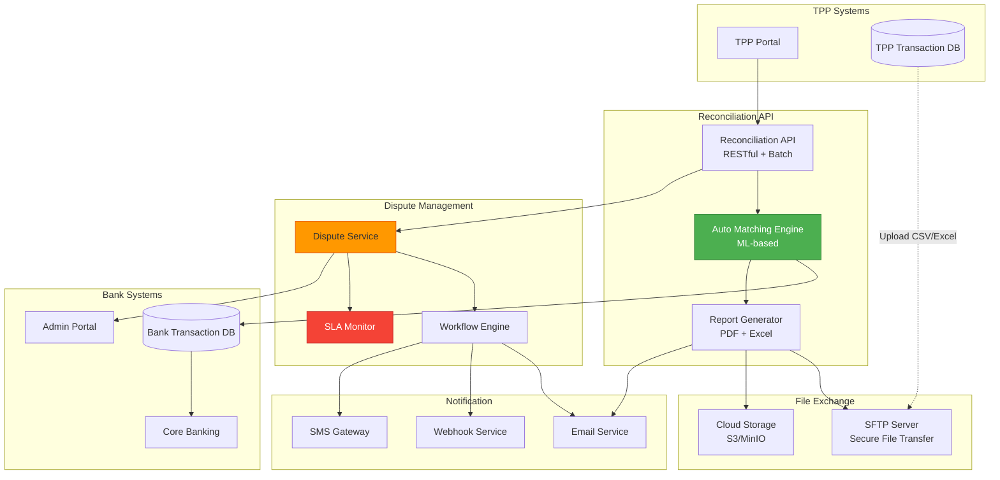
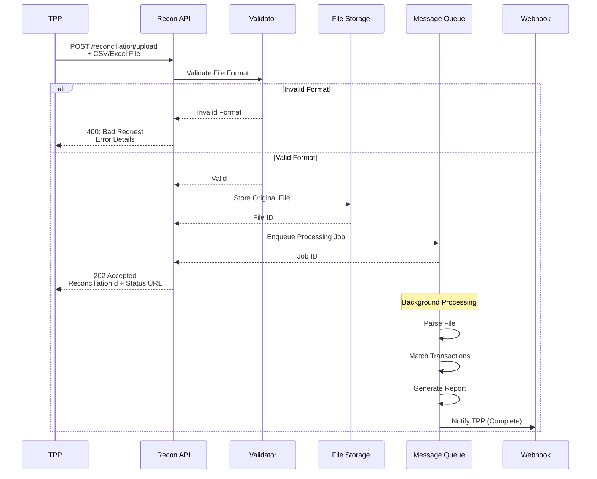
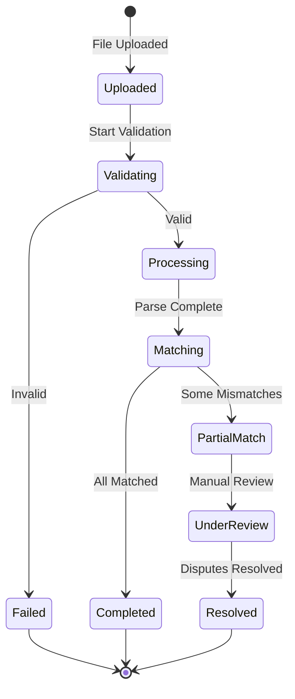
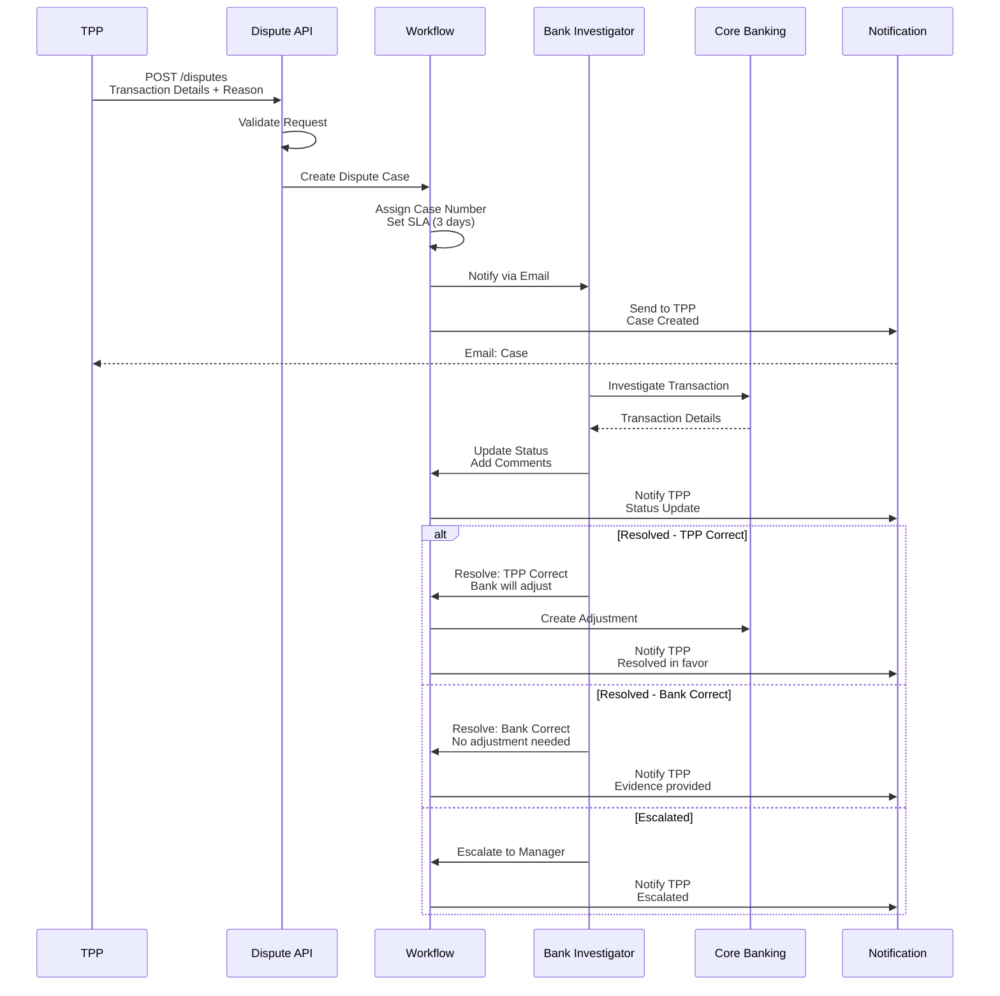
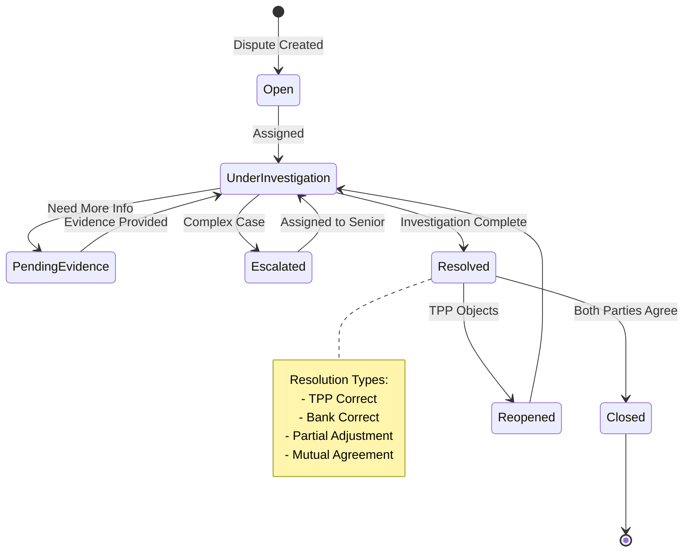
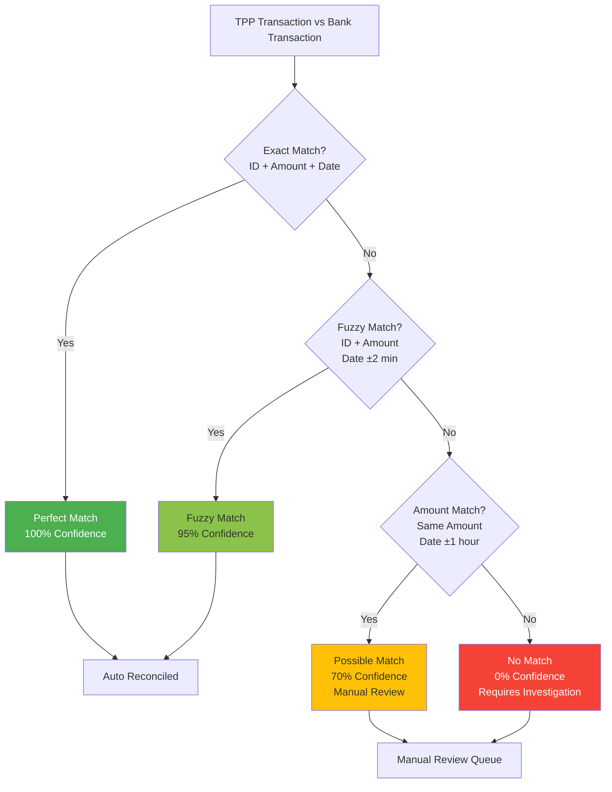
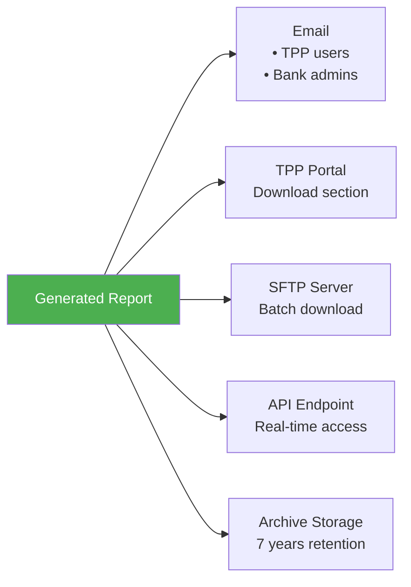
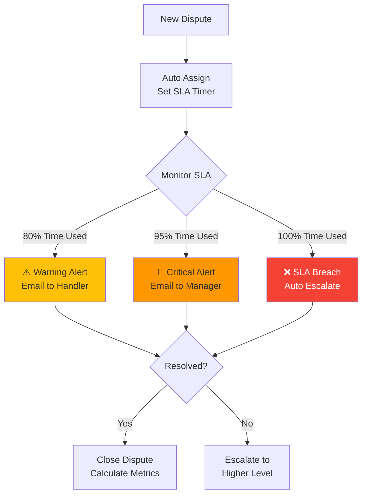
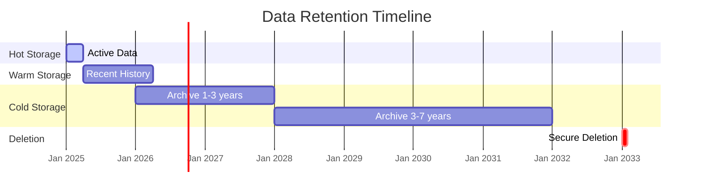

# Đối Soát & Tra Soát (Reconciliation & Dispute Management)

> **Tuân thủ:** Thông tư 64/2024/TT-NHNN | ISO 20022 | PCI DSS 4.0

## Tổng Quan

Hệ thống đối soát và tra soát đảm bảo tính chính xác, minh bạch của dữ liệu giao dịch giữa TPP và Ngân hàng, hỗ trợ giải quyết tranh chấp và compliance.

### Mục Tiêu

1. **Đối soát tự động**: So khớp giao dịch giữa TPP và Bank
2. **Báo cáo nhanh**: Báo cáo hàng ngày, hàng tháng
3. **Phát hiện lỗi**: Tự động phát hiện giao dịch sai lệch
4. **Giải quyết tranh chấp**: Quy trình tra soát rõ ràng
5. **Audit trail**: Lưu vết đầy đủ cho kiểm toán

## Kiến Trúc Hệ Thống



## API Endpoints

### 1. Upload Reconciliation File

#### POST /v1/reconciliation/upload

TPP upload file giao dịch để đối soát.



**Request:**
```http
POST /v1/reconciliation/upload
Content-Type: multipart/form-data

file: transactions.csv
reconciliationDate: 2025-12-14
```

**Response:**
```json
{
  "ReconciliationId": "recon-20251214-001",
  "Status": "Processing",
  "UploadedAt": "2025-12-15T10:00:00+07:00",
  "RecordCount": 1250,
  "StatusUrl": "/v1/reconciliation/recon-20251214-001/status",
  "EstimatedCompletionTime": "2025-12-15T10:15:00+07:00"
}
```

### 2. Get Reconciliation Status

#### GET /v1/reconciliation/{ReconciliationId}/status

Kiểm tra trạng thái đối soát.



**Response:**
```json
{
  "ReconciliationId": "recon-20251214-001",
  "Status": "Completed",
  "Summary": {
    "TotalRecords": 1250,
    "Matched": 1245,
    "Unmatched": 5,
    "Amount": {
      "Total": "5250000000",
      "Matched": "5248500000",
      "Variance": "1500000",
      "Currency": "VND"
    }
  },
  "ProcessedAt": "2025-12-15T10:12:35+07:00",
  "ReportUrl": "/v1/reconciliation/recon-20251214-001/report",
  "MismatchDetailsUrl": "/v1/reconciliation/recon-20251214-001/mismatches"
}
```

### 3. Get Reconciliation Report

#### GET /v1/reconciliation/{ReconciliationId}/report

Tải báo cáo đối soát chi tiết.

**Response Formats:**
- `application/json` - JSON data
- `application/pdf` - PDF report
- `application/vnd.ms-excel` - Excel file
- `text/csv` - CSV file

**JSON Response Example:**
```json
{
  "ReconciliationId": "recon-20251214-001",
  "ReconciliationDate": "2025-12-14",
  "GeneratedAt": "2025-12-15T10:12:35+07:00",
  "TPP": {
    "TPPId": "tpp-12345",
    "TPPName": "FinTech Solutions Ltd"
  },
  "Summary": {
    "TotalTransactions": 1250,
    "MatchedTransactions": 1245,
    "UnmatchedTransactions": 5,
    "TotalAmount": "5250000000 VND",
    "MatchedAmount": "5248500000 VND",
    "VarianceAmount": "1500000 VND",
    "VariancePercentage": 0.03
  },
  "MatchBreakdown": {
    "PerfectMatch": 1200,
    "FuzzyMatch": 45,
    "NoMatch": 5
  },
  "Mismatches": [
    {
      "TransactionId": "txn-001",
      "TPPAmount": "500000",
      "BankAmount": "500000",
      "TPPDate": "2025-12-14T14:30:00",
      "BankDate": "2025-12-14T14:31:00",
      "Issue": "Timestamp Mismatch",
      "Severity": "Low"
    }
  ]
}
```

### 4. Create Dispute

#### POST /v1/disputes

Tạo yêu cầu tra soát cho giao dịch có vấn đề.



**Request:**
```json
{
  "TransactionId": "txn-12345",
  "DisputeType": "AmountMismatch",
  "Description": "Transaction amount in our system is 500,000 VND but bank record shows 450,000 VND",
  "ExpectedAmount": {
    "Amount": "500000",
    "Currency": "VND"
  },
  "ActualAmount": {
    "Amount": "450000",
    "Currency": "VND"
  },
  "Evidence": [
    {
      "Type": "Screenshot",
      "Url": "https://storage.com/evidence1.png"
    },
    {
      "Type": "Receipt",
      "Url": "https://storage.com/receipt.pdf"
    }
  ],
  "ContactPerson": {
    "Name": "Nguyen Van A",
    "Email": "nguyenvana@fintech.com",
    "Phone": "+84901234567"
  }
}
```

**Response:**
```json
{
  "DisputeId": "dispute-12345",
  "Status": "Open",
  "Priority": "Normal",
  "SLA": {
    "ResolutionDeadline": "2025-12-18T17:00:00+07:00",
    "BusinessDaysRemaining": 3
  },
  "AssignedTo": "Bank Investigation Team",
  "CreatedAt": "2025-12-15T10:30:00+07:00",
  "TrackingUrl": "/v1/disputes/dispute-12345"
}
```

### 5. Get Dispute Status

#### GET /v1/disputes/{DisputeId}

Theo dõi tiến độ giải quyết tranh chấp.



**Response:**
```json
{
  "DisputeId": "dispute-12345",
  "Status": "UnderInvestigation",
  "TransactionId": "txn-12345",
  "DisputeType": "AmountMismatch",
  "Priority": "Normal",
  "Timeline": [
    {
      "Status": "Open",
      "Timestamp": "2025-12-15T10:30:00+07:00",
      "Actor": "TPP User",
      "Comment": "Dispute created"
    },
    {
      "Status": "UnderInvestigation",
      "Timestamp": "2025-12-15T11:00:00+07:00",
      "Actor": "Bank Investigator",
      "Comment": "Case assigned to John Doe"
    },
    {
      "Status": "UnderInvestigation",
      "Timestamp": "2025-12-15T14:30:00+07:00",
      "Actor": "Bank Investigator",
      "Comment": "Transaction logs reviewed. Discrepancy confirmed."
    }
  ],
  "SLA": {
    "ResolutionDeadline": "2025-12-18T17:00:00+07:00",
    "ElapsedHours": 4,
    "RemainingHours": 68,
    "Status": "OnTrack"
  },
  "Resolution": null,
  "UpdatedAt": "2025-12-15T14:30:00+07:00"
}
```

## Matching Algorithm

### Auto-Matching Rules



**Matching Criteria:**

| Match Type | ID | Amount | Timestamp | Confidence | Action |
|------------|-----|--------|-----------|------------|--------|
| **Perfect** | Exact | Exact | ±10s | 100% | Auto reconcile |
| **Fuzzy** | Exact | Exact | ±2min | 95% | Auto reconcile |
| **Possible** | Exact | Exact | ±1hr | 70% | Manual review |
| **Amount Only** | Different | Exact | ±1hr | 50% | Manual review |
| **No Match** | - | - | - | 0% | Investigation |

## Reporting

### Daily Reconciliation Report

```mermaid
gantt
    title Daily Reconciliation Timeline
    dateFormat HH:mm
    axisFormat %H:%M
    
    section Data Collection
    TPP Upload Files :done, upload, 00:00, 1h
    Bank Extract Transactions :done, extract, 01:00, 1h
    
    section Processing
    Auto Matching :active, match, 02:00, 2h
    Manual Review :crit, review, 04:00, 3h
    
    section Reporting
    Generate Reports :report, 07:00, 1h
    Distribute Reports :distribute, 08:00, 30m
    
    section Follow-up
    Investigate Mismatches :investigate, 08:30, 4h
```



**Report Types:**

1. **Summary Report**: Tổng quan đối soát
2. **Detailed Report**: Chi tiết từng giao dịch
3. **Exception Report**: Chỉ giao dịch sai lệch
4. **Trend Report**: Xu hướng theo thời gian
5. **SLA Report**: Đánh giá thời gian xử lý

### Report Distribution



## SLA Management

### Dispute Resolution SLA

| Priority | Initial Response | Resolution Time | Escalation |
|----------|------------------|-----------------|------------|
| **Critical** | 1 hour | 24 hours | After 12 hours |
| **High** | 4 hours | 3 days | After 2 days |
| **Normal** | 8 hours | 5 days | After 4 days |
| **Low** | 24 hours | 10 days | After 8 days |

### SLA Monitoring



## Data Retention



**Retention Policy:**

| Data Type | Hot | Warm | Cold | Total | Deletion |
|-----------|-----|------|------|-------|----------|
| **Transaction Records** | 90 days | 1 year | 7 years | 7 years | Secure erase |
| **Reconciliation Reports** | 90 days | 1 year | 7 years | 7 years | Secure erase |
| **Dispute Cases** | 90 days | 2 years | 7 years | 7 years | Secure erase |
| **Evidence Files** | 90 days | 2 years | 7 years | 7 years | Secure erase |
| **Audit Logs** | 90 days | 1 year | 7 years | 7 years | Permanent |

## Security & Compliance

### Audit Trail

```json
{
  "EventId": "recon-evt-123456",
  "EventType": "Reconciliation.Completed",
  "Timestamp": "2025-12-15T10:12:35+07:00",
  "Actor": {
    "TPPId": "tpp-12345",
    "UserId": "user-abc123",
    "IP": "203.162.4.190"
  },
  "Action": {
    "Type": "ReconciliationUpload",
    "ReconciliationId": "recon-20251214-001",
    "RecordCount": 1250,
    "FileHash": "sha256:a1b2c3d4e5f6...",
    "Status": "Completed"
  },
  "Result": {
    "Matched": 1245,
    "Unmatched": 5,
    "VarianceAmount": "1500000 VND"
  },
  "Compliance": {
    "DataRetention": "7 years",
    "EncryptionUsed": "AES-256",
    "AuditLogRetained": true
  }
}
```

## Performance Metrics

**Target KPIs:**

| Metric | Target | Current | Status |
|--------|--------|---------|--------|
| **Auto Match Rate** | ≥ 95% | 97.2% | ✅ |
| **Report Generation** | < 15 min | 12 min | ✅ |
| **Dispute Response** | < 4 hours | 3.5 hours | ✅ |
| **Dispute Resolution** | < 3 days | 2.8 days | ✅ |
| **SLA Compliance** | ≥ 98% | 98.5% | ✅ |
| **API Availability** | ≥ 99.9% | 99.95% | ✅ |

## Tài Liệu Tham Khảo

- **Thông tư 64/2024/TT-NHNN** - Open API Regulations
- **ISO 20022** - Financial Message Standards
- **PCI DSS 4.0** - Requirement 10 (Audit Logging)
- **NIST SP 800-92** - Guide to Computer Security Log Management

---

**Phiên bản:** 1.0  
**Ngày cập nhật:** 15/12/2025  
**Trạng thái:** Production Ready
