# Dịch Vụ Định Danh & Bảo Mật (eKYC & Identity Services)

## Tổng Quan

Nhóm API cung cấp dịch vụ định danh điện tử (eKYC), xác thực sinh trắc học và xác thực NFC CCCD theo Quyết định 2345/QĐ-NHNN.

## Kiến Trúc eKYC

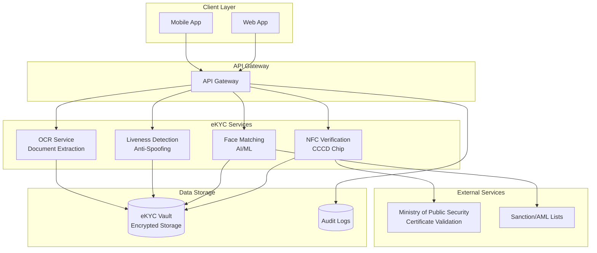

## eKYC Flow - Standard Process

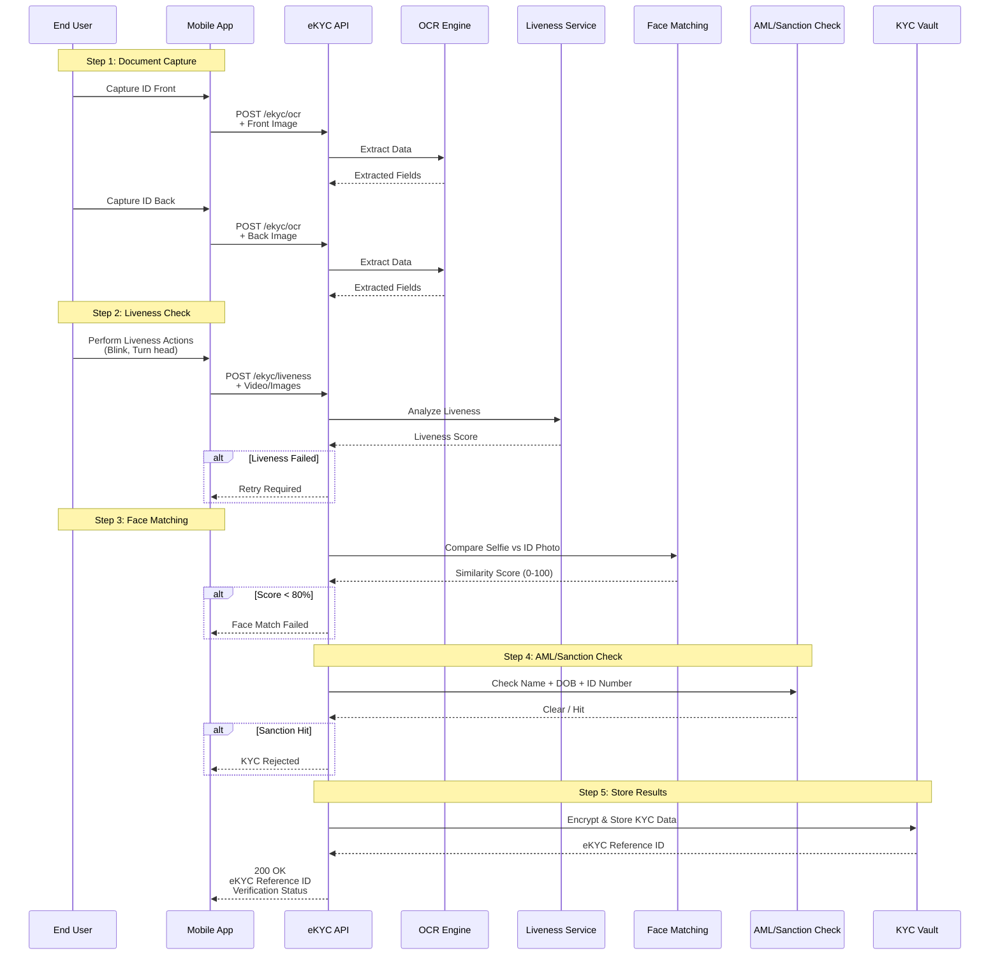

## API Endpoints

### 1. OCR - Document Extraction

#### POST /v1/ekyc/ocr

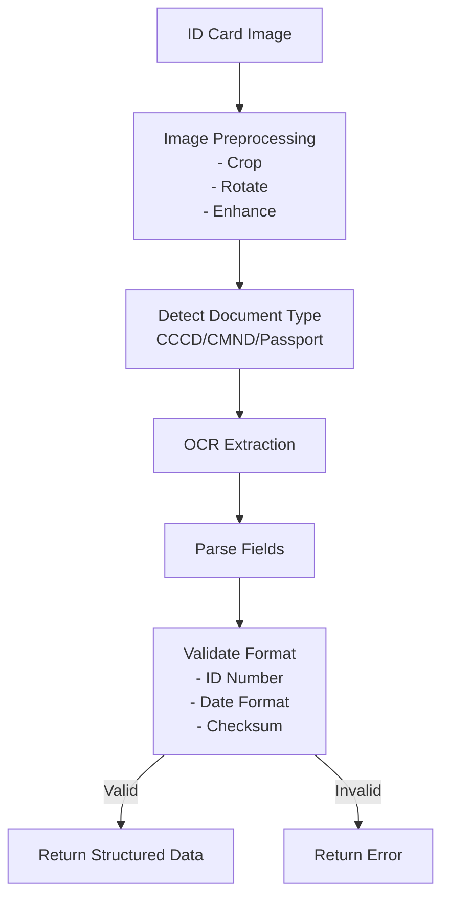

**Request:**
```json
{
  "DocumentType": "CCCD",
  "Side": "FRONT",
  "Image": "base64_encoded_image_data",
  "ImageFormat": "JPEG"
}
```

**Response:**
```json
{
  "Data": {
    "DocumentType": "CCCD",
    "IDNumber": "001234567890",
    "FullName": "NGUYEN VAN A",
    "DateOfBirth": "01/01/1990",
    "Gender": "Nam",
    "Nationality": "Việt Nam",
    "PlaceOfOrigin": "Hà Nội",
    "PlaceOfResidence": "123 Nguyễn Huệ, Q.1, TP.HCM",
    "ExpiryDate": "01/01/2035",
    "Confidence": {
      "Overall": 0.95,
      "IDNumber": 0.98,
      "FullName": 0.96,
      "DateOfBirth": 0.97
    },
    "FaceImage": "base64_encoded_face_crop"
  }
}
```

### 2. Liveness Detection

#### POST /v1/ekyc/liveness

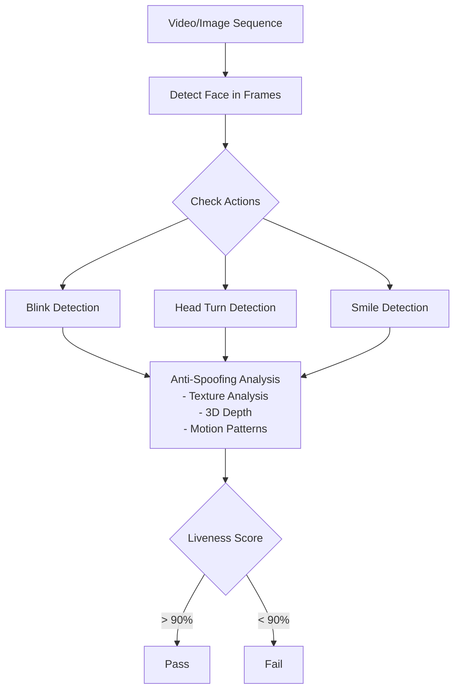

**Liveness Methods:**

| Method | Mô Tả | Độ An Toàn | Trải Nghiệm |
|--------|-------|------------|-------------|
| **Passive** | Phân tích ảnh tĩnh | Thấp | Tốt nhất |
| **Active** | Yêu cầu hành động (chớp mắt, quay đầu) | Trung bình | Tốt |
| **Hybrid** | Kết hợp Passive + Active | Cao | Chấp nhận được |

**Request:**
```json
{
  "LivenessMethod": "ACTIVE",
  "VideoData": "base64_encoded_video",
  "VideoFormat": "MP4",
  "RequiredActions": ["BLINK", "TURN_LEFT", "TURN_RIGHT"]
}
```

**Response:**
```json
{
  "Data": {
    "LivenessScore": 0.95,
    "Status": "PASS",
    "DetectedActions": {
      "BLINK": true,
      "TURN_LEFT": true,
      "TURN_RIGHT": true
    },
    "SpoofingIndicators": {
      "PrintedPhoto": 0.02,
      "DigitalScreen": 0.01,
      "Mask": 0.00
    },
    "BestFrameImage": "base64_encoded_best_frame"
  }
}
```

### 3. Face Matching

#### POST /v1/ekyc/face-match

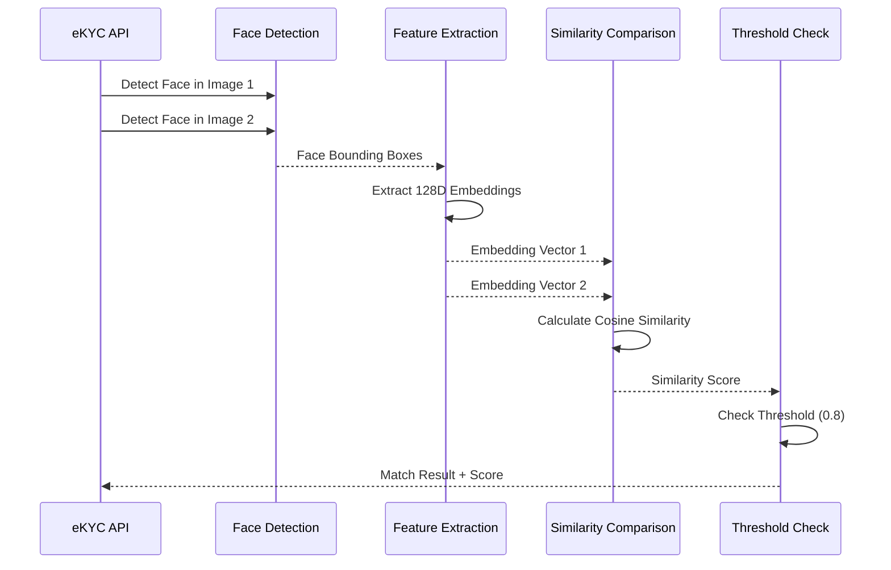

**Request:**
```json
{
  "SourceImage": "base64_encoded_id_photo",
  "TargetImage": "base64_encoded_selfie",
  "Threshold": 0.80
}
```

**Response:**
```json
{
  "Data": {
    "SimilarityScore": 0.92,
    "IsMatch": true,
    "Confidence": "HIGH",
    "FaceQuality": {
      "SourceImage": {
        "Brightness": 0.85,
        "Sharpness": 0.90,
        "FaceSize": "ADEQUATE"
      },
      "TargetImage": {
        "Brightness": 0.88,
        "Sharpness": 0.92,
        "FaceSize": "ADEQUATE"
      }
    }
  }
}
```

## NFC CCCD Verification (QĐ 2345)

### NFC Chip Reading Flow

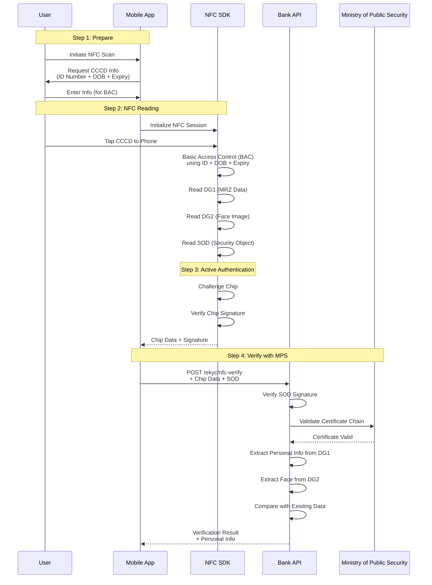

### NFC Data Groups

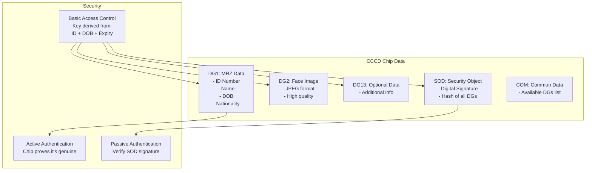

### API Endpoint: NFC Verification

#### POST /v1/ekyc/nfc-verify

**Request:**
```json
{
  "ChipData": {
    "DG1": "base64_encoded_mrz_data",
    "DG2": "base64_encoded_face_image",
    "SOD": "base64_encoded_security_object",
    "ActiveAuthSignature": "base64_encoded_aa_signature"
  },
  "DeviceInfo": {
    "DeviceModel": "iPhone 15 Pro",
    "OSVersion": "iOS 17.2",
    "NFCCapability": true
  }
}
```

**Response:**
```json
{
  "Data": {
    "VerificationStatus": "VERIFIED",
    "ChipAuthenticity": "GENUINE",
    "CertificateValidation": {
      "Status": "VALID",
      "IssuerCountry": "VN",
      "IssuerOrganization": "Ministry of Public Security"
    },
    "PersonalInfo": {
      "IDNumber": "001234567890",
      "FullName": "NGUYEN VAN A",
      "DateOfBirth": "01/01/1990",
      "Gender": "M",
      "Nationality": "VNM",
      "DocumentNumber": "A12345678",
      "ExpiryDate": "01/01/2035"
    },
    "BiometricData": {
      "FaceImage": "base64_encoded_face_from_chip",
      "FaceQuality": 0.95
    },
    "VerificationTimestamp": "2024-12-10T18:45:00+07:00",
    "eKYCReferenceId": "ekyc-nfc-12345"
  }
}
```

## Complete eKYC Journey

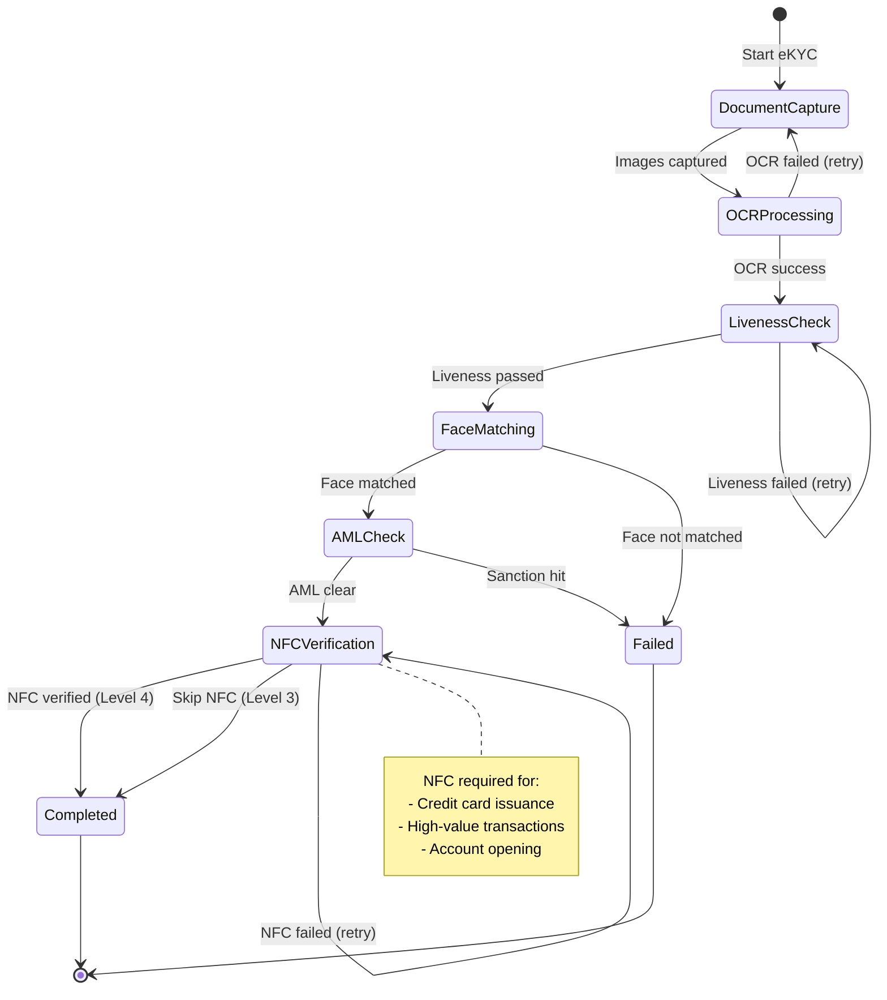

## Authentication Levels (QĐ 2345)

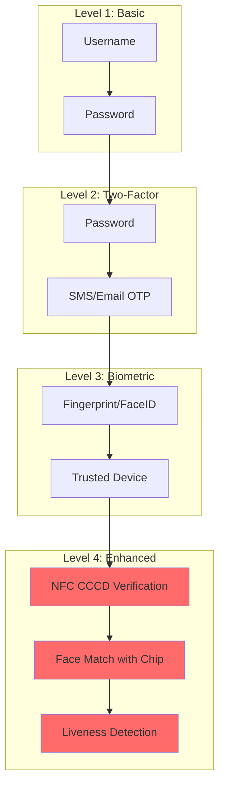

### Use Cases by Level

| Giao Dịch | Giá Trị | Level Yêu Cầu |
|-----------|---------|---------------|
| Tra cứu số dư | N/A | Level 2 |
| Chuyển tiền nội bộ | < 2M VND | Level 2 |
| Chuyển tiền nội bộ | 2M - 10M VND | Level 3 |
| Chuyển tiền liên ngân hàng | < 10M VND | Level 3 |
| Chuyển tiền liên ngân hàng | ≥ 10M VND | Level 4 |
| Mở tài khoản | N/A | Level 4 |
| Phát hành thẻ tín dụng | N/A | Level 4 |
| Thay đổi hạn mức thẻ | N/A | Level 4 |

## OTP Service

### OTP Generation & Validation

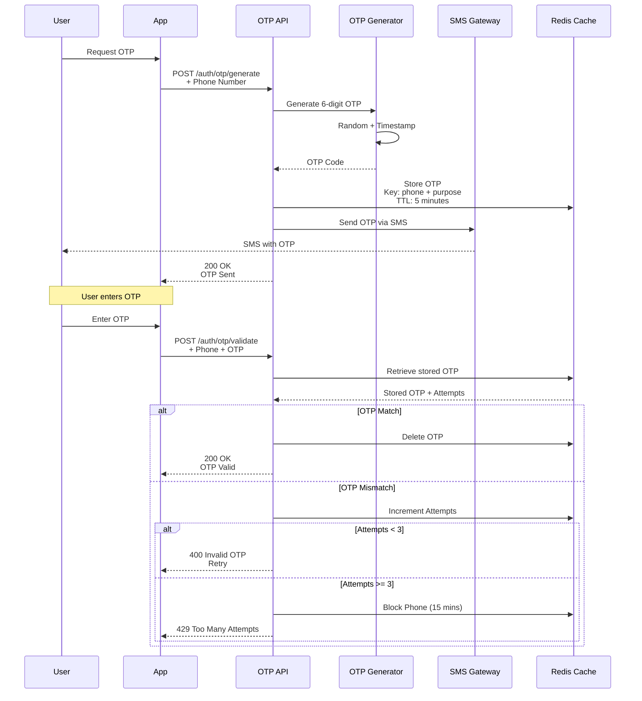

### Smart OTP (Push Notification)

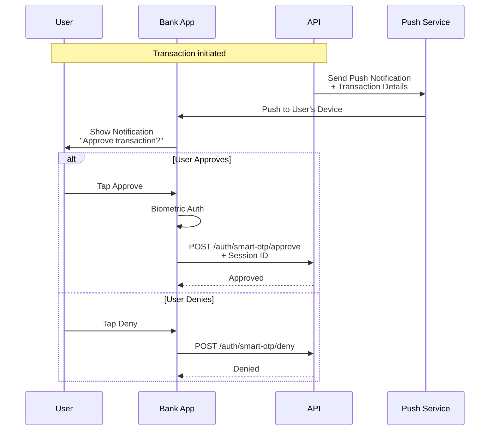

## Data Security & Privacy

### PII Encryption

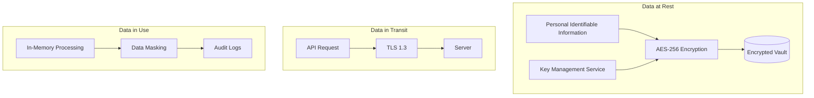

### Data Retention

| Data Type | Retention Period | Storage |
|-----------|------------------|---------|
| ID Card Images | 5 years | Encrypted vault |
| Face Images | 5 years | Encrypted vault |
| eKYC Results | 5 years | Database (encrypted) |
| Audit Logs | 3 months (hot) + 1 year (cold) | Log storage |
| Biometric Templates | Until account closure | HSM |
| NFC Chip Data | 5 years | Encrypted vault |

## Compliance & Standards

### GDPR/Nghị định 13/2023 Compliance

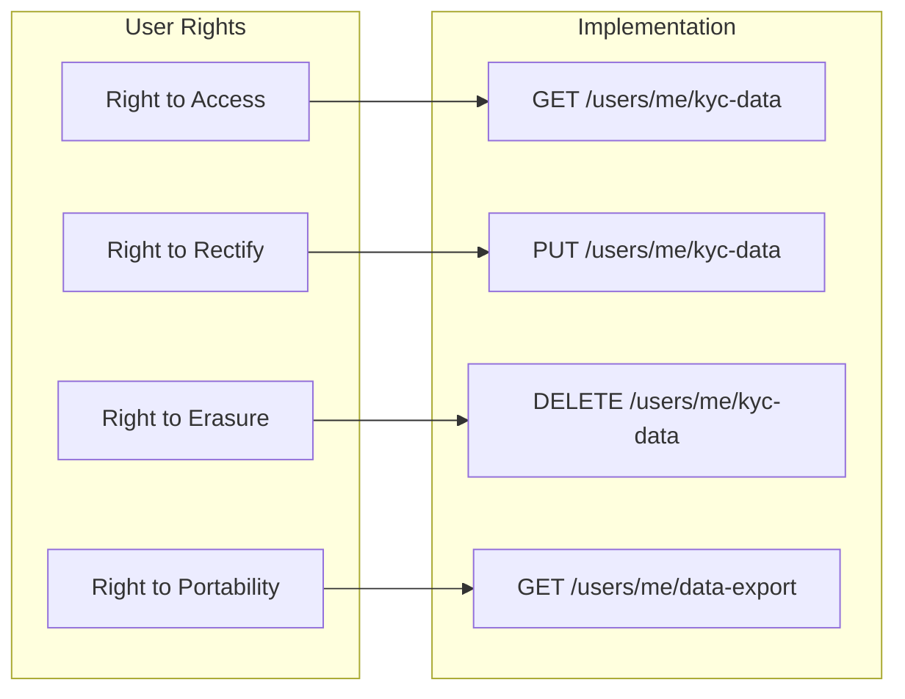

### ISO 30107 (Liveness Detection)

- **Part 1**: Framework
- **Part 2**: Data formats
- **Part 3**: Testing and reporting

### ISO 19794 (Biometric Data)

- **Part 5**: Face image data
- **Part 6**: Iris image data

## Error Handling

| Error Code | Mô Tả | HTTP Code | Retry? |
|------------|-------|-----------|--------|
| `OCR_FAILED` | Không đọc được thông tin | 422 | Yes |
| `LIVENESS_FAILED` | Phát hiện giả mạo | 422 | Yes (max 3) |
| `FACE_NOT_MATCHED` | Khuôn mặt không khớp | 422 | No |
| `NFC_READ_ERROR` | Lỗi đọc chip NFC | 422 | Yes |
| `CERTIFICATE_INVALID` | Chứng thư không hợp lệ | 422 | No |
| `SANCTION_HIT` | Trong danh sách đen | 403 | No |
| `DOCUMENT_EXPIRED` | Giấy tờ hết hạn | 422 | No |
| `POOR_IMAGE_QUALITY` | Chất lượng ảnh kém | 400 | Yes |

## Best Practices

### Image Quality Requirements

```json
{
  "MinimumResolution": "1280x720",
  "MaxFileSize": "5MB",
  "AcceptedFormats": ["JPEG", "PNG"],
  "MinBrightness": 0.3,
  "MaxBrightness": 0.9,
  "MinSharpness": 0.5,
  "FaceMinSize": "200x200 pixels"
}
```

### Anti-Fraud Measures

- Device fingerprinting
- IP geolocation check
- Velocity checks (max 3 attempts/hour)
- Behavioral biometrics
- Document forensics (detect photoshop)

## Tài Liệu Tham Khảo
- Quyết định 2345/QĐ-NHNN
- Nghị định 13/2023/NĐ-CP (Data Protection)
- ISO 30107 (Liveness Detection)
- ISO 19794 (Biometric Data Formats)
- ICAO Doc 9303 (Machine Readable Travel Documents)
- NIST SP 800-63B (Digital Identity Guidelines)
