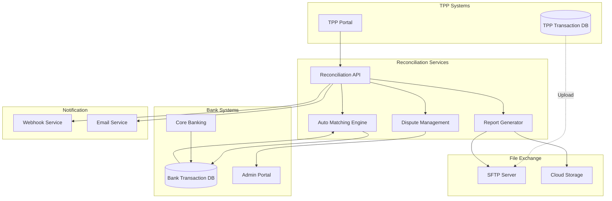
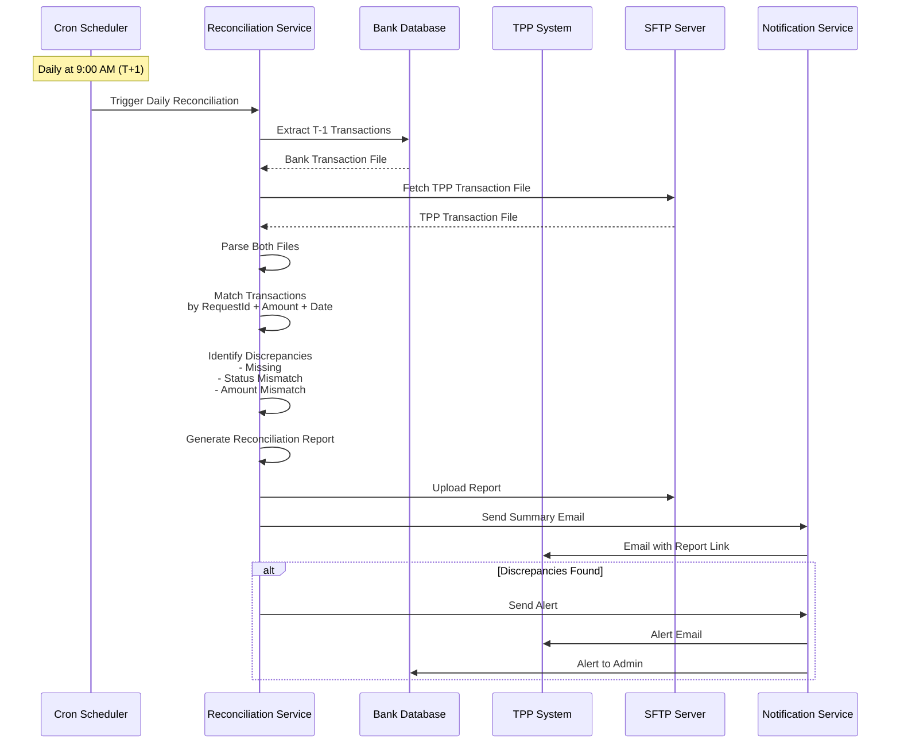
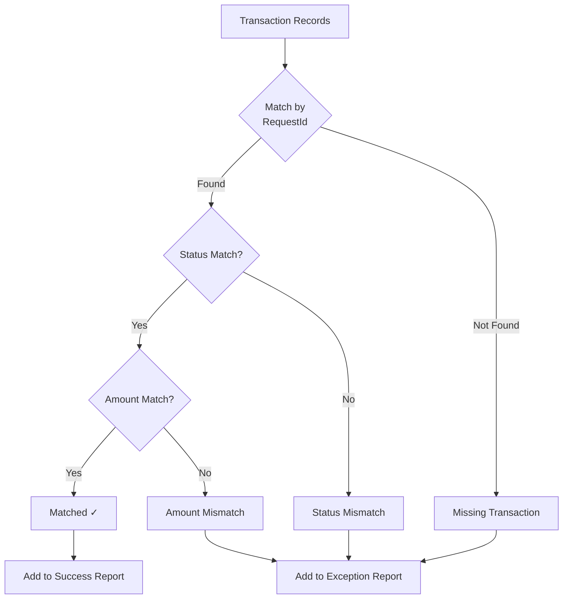
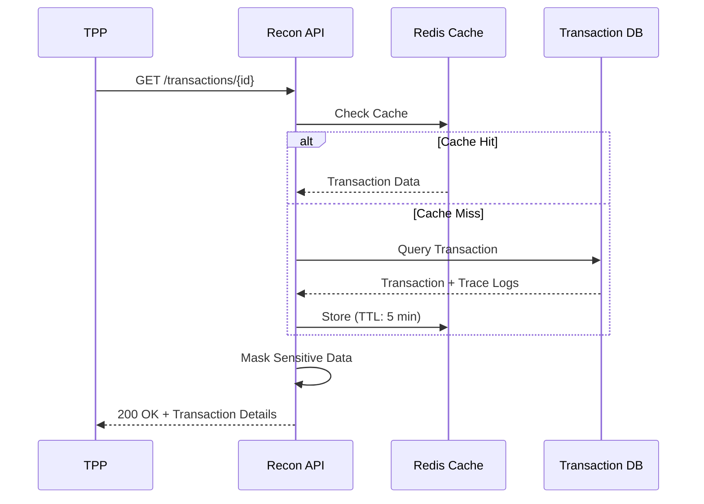
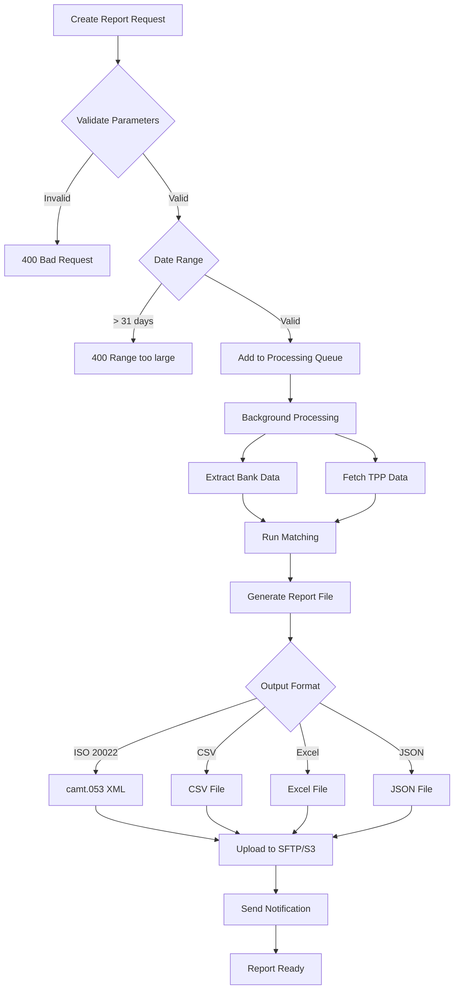
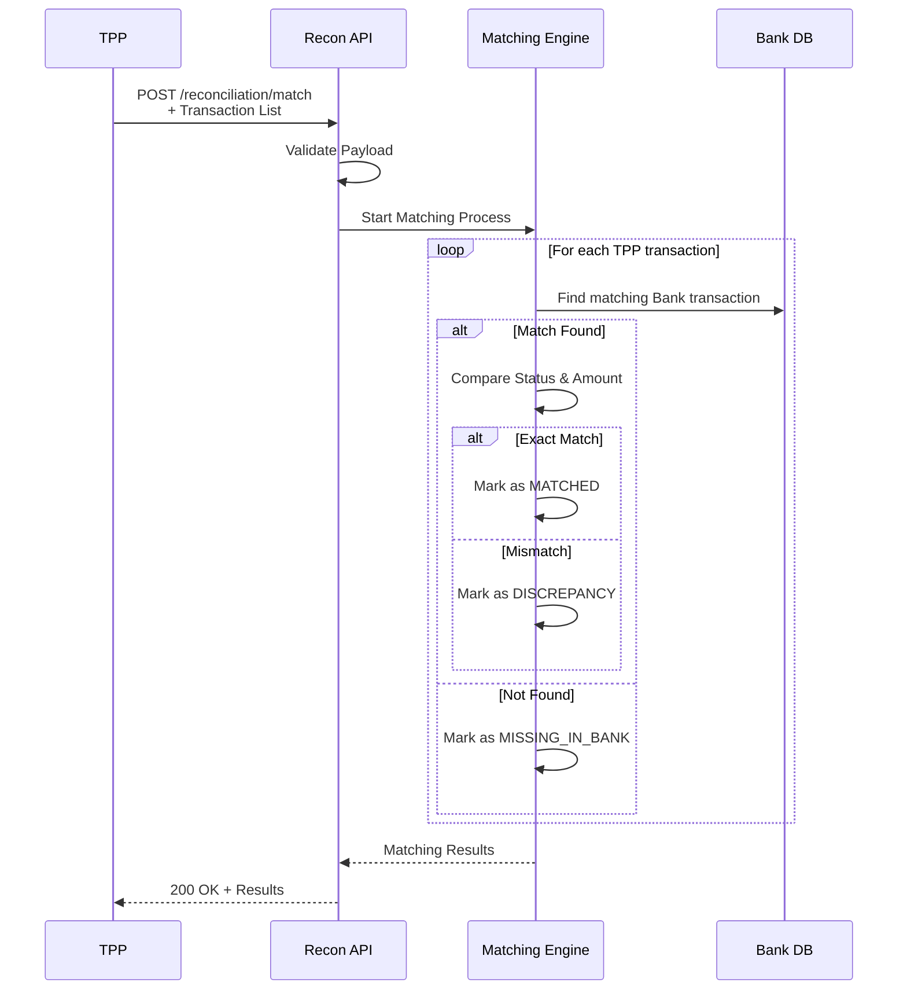
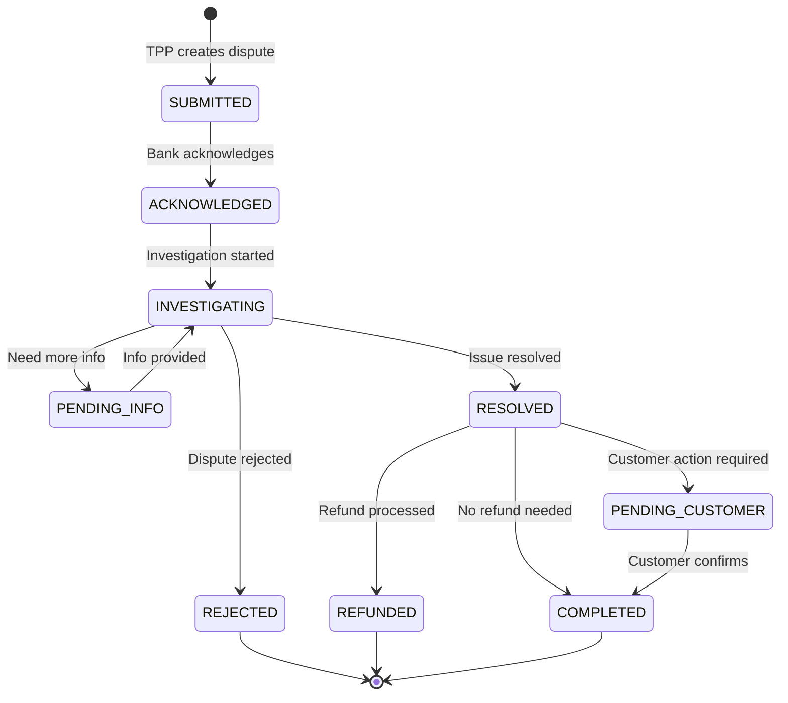
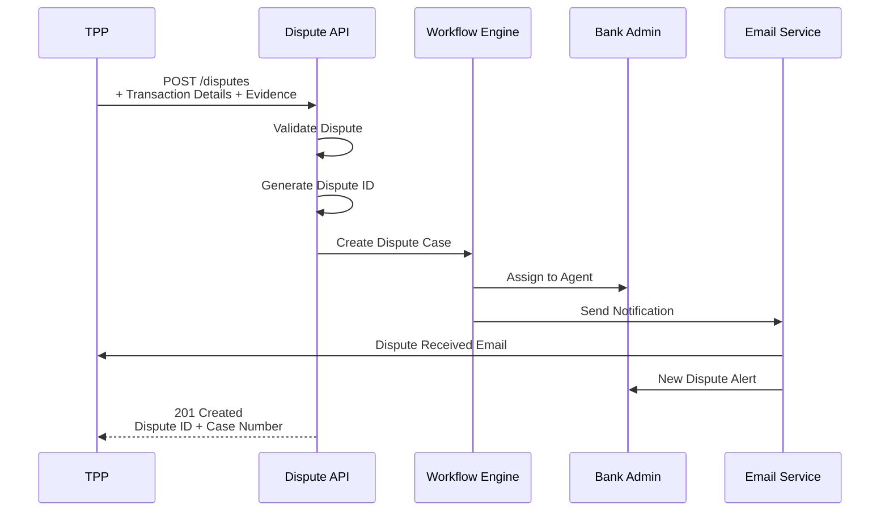
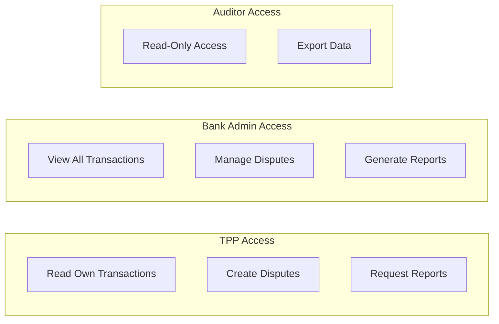

# Đối Soát & Tra Soát (Reconciliation & Dispute Management)

## Tổng Quan

Hệ thống đối soát và tra soát đảm bảo tính chính xác của dữ liệu giao dịch giữa TPP và Ngân hàng, hỗ trợ giải quyết khiếu nại và tranh chấp.

## Kiến Trúc Hệ Thống



## Quy Trình Đối Soát Tự Động



## Matching Logic



### Matching Rules

| Priority | Matching Key | Description |
|----------|--------------|-------------|
| 1 | `RequestId` | Unique transaction identifier from TPP |
| 2 | `TransactionDate` | Transaction date (YYYY-MM-DD) |
| 3 | `Amount` | Transaction amount (exact match) |
| 4 | `DebtorAccount` | Source account number |
| 5 | `CreditorAccount` | Destination account number |

## API Endpoints

### 1. Transaction Inquiry

#### GET /v1/reconciliation/transactions/{TransactionId}



**Response:**
```json
{
  "Data": {
    "TransactionId": "txn-12345",
    "RequestId": "req-tpp-67890",
    "TransactionType": "FUND_TRANSFER",
    "Status": "COMPLETED",
    "Amount": {
      "Amount": "1000000.00",
      "Currency": "VND"
    },
    "DebtorAccount": "1234****7890",
    "CreditorAccount": "0987****4321",
    "TransactionDate": "2024-12-10",
    "CompletionTime": "2024-12-10T10:30:45+07:00",
    "Channel": "NAPAS_247",
    "BankReference": "BANK-REF-001",
    "TraceLog": [
      {
        "Timestamp": "2024-12-10T10:30:00+07:00",
        "Stage": "RECEIVED",
        "Status": "SUCCESS"
      },
      {
        "Timestamp": "2024-12-10T10:30:30+07:00",
        "Stage": "VALIDATED",
        "Status": "SUCCESS"
      },
      {
        "Timestamp": "2024-12-10T10:30:45+07:00",
        "Stage": "COMPLETED",
        "Status": "SUCCESS"
      }
    ]
  }
}
```

#### GET /v1/reconciliation/transactions

Query transactions with filters.

**Query Parameters:**
- `fromDate`: Start date (YYYY-MM-DD)
- `toDate`: End date (YYYY-MM-DD)
- `status`: Transaction status
- `type`: Transaction type
- `page`: Page number
- `limit`: Items per page (max 100)

### 2. Reconciliation Reports

#### POST /v1/reconciliation/reports



**Request:**
```json
{
  "ReportType": "DAILY_RECONCILIATION",
  "FromDate": "2024-12-09",
  "ToDate": "2024-12-09",
  "OutputFormat": "ISO20022_CAMT053",
  "DeliveryMethod": "SFTP",
  "IncludeDetails": true
}
```

**Response:**
```json
{
  "Data": {
    "ReportId": "report-20241210-001",
    "Status": "PROCESSING",
    "EstimatedCompletionTime": "2024-12-10T11:00:00+07:00",
    "CreatedAt": "2024-12-10T10:45:00+07:00"
  },
  "Links": {
    "Self": "https://api.bank.vn/v1/reconciliation/reports/report-20241210-001",
    "Status": "https://api.bank.vn/v1/reconciliation/reports/report-20241210-001/status"
  }
}
```

#### GET /v1/reconciliation/reports/{ReportId}

Check report status and download.

**Response:**
```json
{
  "Data": {
    "ReportId": "report-20241210-001",
    "Status": "COMPLETED",
    "ReportType": "DAILY_RECONCILIATION",
    "Period": {
      "FromDate": "2024-12-09",
      "ToDate": "2024-12-09"
    },
    "Summary": {
      "TotalTransactions": 1250,
      "MatchedTransactions": 1245,
      "MissingInBank": 2,
      "MissingInTPP": 1,
      "StatusMismatch": 2,
      "AmountMismatch": 0
    },
    "FileInfo": {
      "FileName": "reconciliation_20241209.xml",
      "FileSize": 2048576,
      "Format": "ISO20022_CAMT053",
      "GeneratedAt": "2024-12-10T10:55:00+07:00"
    }
  },
  "Links": {
    "Download": "https://api.bank.vn/v1/reconciliation/reports/report-20241210-001/download"
  }
}
```

### 3. Auto Matching

#### POST /v1/reconciliation/match

TPP gửi danh sách giao dịch để hệ thống tự động so khớp.



**Request:**
```json
{
  "Transactions": [
    {
      "RequestId": "req-tpp-001",
      "TransactionDate": "2024-12-09",
      "Amount": "1000000.00",
      "Currency": "VND",
      "Status": "SUCCESS",
      "DebtorAccount": "1234567890",
      "CreditorAccount": "0987654321"
    },
    {
      "RequestId": "req-tpp-002",
      "TransactionDate": "2024-12-09",
      "Amount": "500000.00",
      "Currency": "VND",
      "Status": "SUCCESS",
      "DebtorAccount": "1234567890",
      "CreditorAccount": "1111222233"
    }
  ]
}
```

**Response:**
```json
{
  "Data": {
    "MatchingResults": [
      {
        "RequestId": "req-tpp-001",
        "MatchStatus": "MATCHED",
        "BankTransactionId": "txn-bank-12345",
        "BankStatus": "COMPLETED",
        "MatchConfidence": 1.0
      },
      {
        "RequestId": "req-tpp-002",
        "MatchStatus": "STATUS_MISMATCH",
        "BankTransactionId": "txn-bank-12346",
        "BankStatus": "PENDING",
        "TPPStatus": "SUCCESS",
        "MatchConfidence": 0.8,
        "Discrepancy": "Status mismatch: TPP=SUCCESS, Bank=PENDING"
      }
    ],
    "Summary": {
      "Total": 2,
      "Matched": 1,
      "Discrepancies": 1,
      "Missing": 0
    }
  }
}
```

## Dispute Management

### Dispute Lifecycle



### Create Dispute

#### POST /v1/reconciliation/disputes



**Request:**
```json
{
  "TransactionId": "txn-12345",
  "DisputeType": "TRANSACTION_NOT_COMPLETED",
  "DisputeReason": "Transaction shows success on TPP side but customer did not receive funds",
  "Evidence": {
    "Screenshots": [
      "base64_encoded_screenshot_1",
      "base64_encoded_screenshot_2"
    ],
    "CustomerStatement": "I initiated a transfer of 1,000,000 VND on 2024-12-09 but the beneficiary has not received the money.",
    "TPPTransactionLog": {
      "RequestId": "req-tpp-001",
      "Status": "SUCCESS",
      "Timestamp": "2024-12-09T15:30:00+07:00"
    }
  },
  "CustomerInfo": {
    "Name": "NGUYEN VAN A",
    "Phone": "0901234567",
    "Email": "nguyenvana@example.com"
  },
  "Priority": "HIGH"
}
```

**Response:**
```json
{
  "Data": {
    "DisputeId": "dispute-12345",
    "CaseNumber": "CASE-2024-001234",
    "Status": "SUBMITTED",
    "CreatedAt": "2024-12-10T11:00:00+07:00",
    "EstimatedResolutionTime": "2024-12-15T11:00:00+07:00",
    "SLA": {
      "ResponseTime": "24 hours",
      "ResolutionTime": "5 business days"
    }
  },
  "Links": {
    "Self": "https://api.bank.vn/v1/reconciliation/disputes/dispute-12345",
    "Updates": "https://api.bank.vn/v1/reconciliation/disputes/dispute-12345/updates"
  }
}
```

### Dispute Types

| Type | Mô Tả | SLA |
|------|-------|-----|
| `TRANSACTION_NOT_COMPLETED` | Giao dịch không hoàn thành | 5 ngày |
| `WRONG_AMOUNT` | Số tiền sai | 3 ngày |
| `DUPLICATE_CHARGE` | Trừ tiền trùng lặp | 5 ngày |
| `UNAUTHORIZED_TRANSACTION` | Giao dịch không được ủy quyền | 7 ngày |
| `BENEFICIARY_NOT_RECEIVED` | Người nhận chưa nhận tiền | 7 ngày |
| `TECHNICAL_ERROR` | Lỗi kỹ thuật | 3 ngày |

### Track Dispute

#### GET /v1/reconciliation/disputes/{DisputeId}

**Response:**
```json
{
  "Data": {
    "DisputeId": "dispute-12345",
    "CaseNumber": "CASE-2024-001234",
    "Status": "INVESTIGATING",
    "TransactionId": "txn-12345",
    "DisputeType": "TRANSACTION_NOT_COMPLETED",
    "CreatedAt": "2024-12-10T11:00:00+07:00",
    "UpdatedAt": "2024-12-10T14:30:00+07:00",
    "Timeline": [
      {
        "Timestamp": "2024-12-10T11:00:00+07:00",
        "Status": "SUBMITTED",
        "Actor": "TPP",
        "Note": "Dispute created"
      },
      {
        "Timestamp": "2024-12-10T11:15:00+07:00",
        "Status": "ACKNOWLEDGED",
        "Actor": "Bank Admin",
        "Note": "Case assigned to Agent #123"
      },
      {
        "Timestamp": "2024-12-10T14:30:00+07:00",
        "Status": "INVESTIGATING",
        "Actor": "Bank Agent",
        "Note": "Checking with Napas for transaction status"
      }
    ],
    "AssignedAgent": {
      "Name": "Tran Van B",
      "Email": "tranvanb@bank.vn",
      "Phone": "0281234567"
    }
  }
}
```

### Dispute Resolution

#### GET /v1/reconciliation/disputes/{DisputeId}/resolution

**Response:**
```json
{
  "Data": {
    "DisputeId": "dispute-12345",
    "ResolutionStatus": "RESOLVED",
    "ResolutionType": "REFUND",
    "ResolutionDetails": {
      "Finding": "Transaction was sent to Napas but failed at beneficiary bank. Funds were not debited from customer account.",
      "Action": "No refund needed. Transaction already reversed.",
      "RefundAmount": null,
      "RefundTransactionId": null
    },
    "ResolvedAt": "2024-12-12T10:00:00+07:00",
    "ResolvedBy": {
      "Name": "Tran Van B",
      "Role": "Dispute Resolution Agent"
    },
    "CustomerNotified": true
  }
}
```

## Webhook Notifications

### Subscribe to Events

#### POST /v1/reconciliation/webhooks

```json
{
  "CallbackUrl": "https://tpp.example.com/webhooks/reconciliation",
  "Events": [
    "DISPUTE_STATUS_CHANGED",
    "REPORT_COMPLETED",
    "MATCHING_DISCREPANCY_FOUND",
    "TRANSACTION_REVERSED"
  ],
  "Secret": "webhook_secret_key_12345"
}
```

### Webhook Payload

```json
{
  "EventId": "evt-12345",
  "EventType": "DISPUTE_STATUS_CHANGED",
  "Timestamp": "2024-12-10T15:00:00+07:00",
  "Data": {
    "DisputeId": "dispute-12345",
    "OldStatus": "INVESTIGATING",
    "NewStatus": "RESOLVED",
    "ResolutionType": "REFUND"
  }
}
```

**Signature Verification:**
```javascript
const crypto = require('crypto');

function verifyWebhookSignature(payload, signature, secret) {
  const hmac = crypto.createHmac('sha256', secret);
  hmac.update(JSON.stringify(payload));
  const expectedSignature = hmac.digest('hex');
  return crypto.timingSafeEqual(
    Buffer.from(signature),
    Buffer.from(expectedSignature)
  );
}
```

## File Formats

### ISO 20022 camt.053 (Bank Statement)

```xml
<?xml version="1.0" encoding="UTF-8"?>
<Document xmlns="urn:iso:std:iso:20022:tech:xsd:camt.053.001.08">
  <BkToCstmrStmt>
    <GrpHdr>
      <MsgId>STMT-20241209-001</MsgId>
      <CreDtTm>2024-12-10T09:00:00+07:00</CreDtTm>
    </GrpHdr>
    <Stmt>
      <Id>20241209</Id>
      <CreDtTm>2024-12-10T09:00:00+07:00</CreDtTm>
      <FrToDt>
        <FrDtTm>2024-12-09T00:00:00+07:00</FrDtTm>
        <ToDtTm>2024-12-09T23:59:59+07:00</ToDtTm>
      </FrToDt>
      <Acct>
        <Id>
          <Othr>
            <Id>1234567890</Id>
          </Othr>
        </Id>
        <Ccy>VND</Ccy>
      </Acct>
      <Bal>
        <Tp>
          <CdOrPrtry>
            <Cd>OPBD</Cd>
          </CdOrPrtry>
        </Tp>
        <Amt Ccy="VND">10000000.00</Amt>
        <CdtDbtInd>CRDT</CdtDbtInd>
        <Dt>
          <Dt>2024-12-09</Dt>
        </Dt>
      </Bal>
      <Ntry>
        <Amt Ccy="VND">1000000.00</Amt>
        <CdtDbtInd>DBIT</CdtDbtInd>
        <Sts>BOOK</Sts>
        <BookgDt>
          <Dt>2024-12-09</Dt>
        </BookgDt>
        <ValDt>
          <Dt>2024-12-09</Dt>
        </ValDt>
        <BkTxCd>
          <Domn>
            <Cd>PMNT</Cd>
            <Fmly>
              <Cd>ICDT</Cd>
              <SubFmlyCd>ESCT</SubFmlyCd>
            </Fmly>
          </Domn>
        </BkTxCd>
        <NtryDtls>
          <TxDtls>
            <Refs>
              <EndToEndId>req-tpp-001</EndToEndId>
              <TxId>txn-bank-12345</TxId>
            </Refs>
            <AmtDtls>
              <TxAmt>
                <Amt Ccy="VND">1000000.00</Amt>
              </TxAmt>
            </AmtDtls>
          </TxDtls>
        </NtryDtls>
      </Ntry>
    </Stmt>
  </BkToCstmrStmt>
</Document>
```

### CSV Format

```csv
TransactionDate,RequestId,BankTransactionId,Type,Status,Amount,Currency,DebtorAccount,CreditorAccount,Channel,CompletionTime
2024-12-09,req-tpp-001,txn-bank-12345,FUND_TRANSFER,COMPLETED,1000000.00,VND,1234567890,0987654321,NAPAS_247,2024-12-09T15:30:45+07:00
2024-12-09,req-tpp-002,txn-bank-12346,FUND_TRANSFER,PENDING,500000.00,VND,1234567890,1111222233,NAPAS_247,
```

## Performance & SLA

### Processing Time

| Operation | Target | Max |
|-----------|--------|-----|
| Transaction Inquiry | < 200ms | 500ms |
| Report Generation (1 day) | < 5 min | 10 min |
| Report Generation (1 month) | < 30 min | 1 hour |
| Dispute Creation | < 1s | 2s |
| Webhook Delivery | < 5s | 10s |

### SLA Commitments

| Service | Availability | Response Time |
|---------|--------------|---------------|
| Inquiry APIs | 99.9% | < 500ms |
| Report Generation | 99.5% | As per schedule |
| Dispute Resolution | N/A | 5-7 business days |
| Webhook Delivery | 99% | 3 retries |

## Security & Compliance

### Access Control



### Data Retention

- **Transaction Data**: 5 years
- **Reconciliation Reports**: 5 years
- **Dispute Records**: 7 years
- **Audit Logs**: 3 months (hot) + 1 year (cold)

## Tài Liệu Tham Khảo
- Thông tư 64/2024/TT-NHNN - Điều 12 (Đối soát)
- ISO 20022 - camt.053 (Bank to Customer Statement)
- ISO 20022 - camt.054 (Bank to Customer Debit/Credit Notification)
- PCI DSS - Dispute Management Requirements
