# Vận Hành & Yêu Cầu Phi Chức Năng (NFR)

> **Tuân thủ:** ISO/IEC 25010 (Quality Model) | ITIL v4 | ISO 22301 (Business Continuity)

## Tổng Quan

Tài liệu này định nghĩa các yêu cầu phi chức năng (Non-Functional Requirements) và quy trình vận hành để đảm bảo hệ thống Open Banking hoạt động ổn định, bảo mật, và đáp ứng SLA cam kết.

## SLA (Service Level Agreement)

### Availability Targets

| Service | Target Uptime | Max Downtime/Year | Max Downtime/Month |
|---------|---------------|-------------------|---------------------|
| **Core APIs** | 99.95% | 4.38 hours | 21.6 minutes |
| **Payment APIs** | 99.99% | 52.56 minutes | 4.32 minutes |
| **Developer Portal** | 99.9% | 8.76 hours | 43.2 minutes |
| **Monitoring** | 99.5% | 43.8 hours | 3.6 hours |

**Measurement:**
```
Uptime % = (Total Time - Downtime) / Total Time × 100

Planned Maintenance: Excluded (with 72h notice)
Force Majeure: Excluded
```

### Response Time Targets

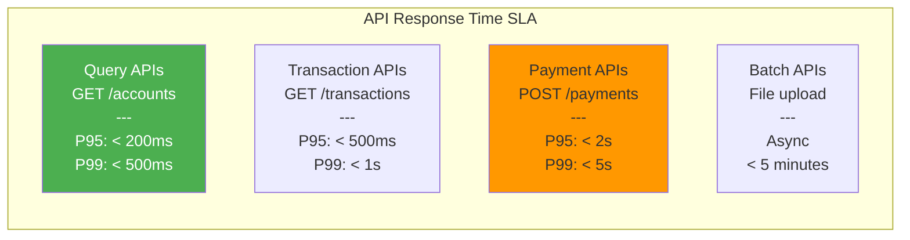

**Performance Metrics:**
- **P50 (Median)**: 50% of requests faster than X
- **P95**: 95% of requests faster than X
- **P99**: 99% of requests faster than X
- **P99.9**: 99.9% of requests faster than X

### Throughput Capacity

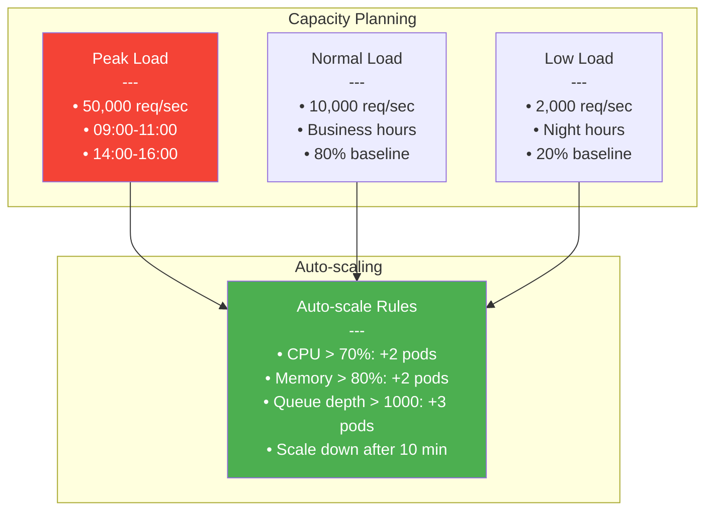

## Architecture for High Availability

### Multi-Region Deployment

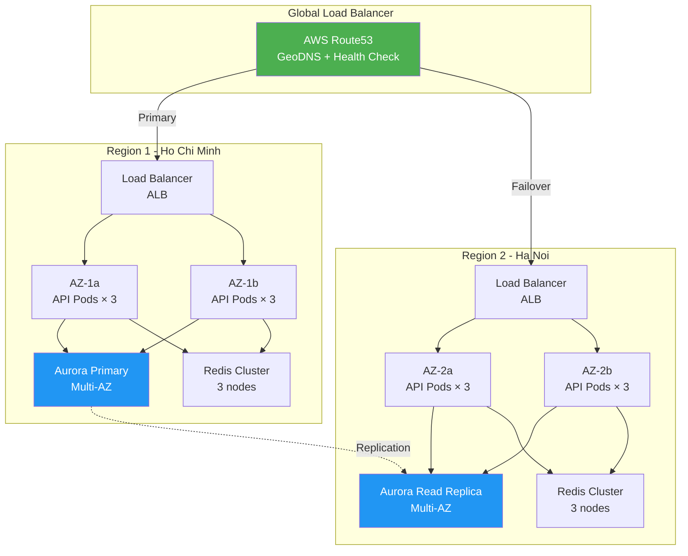

### Database Architecture

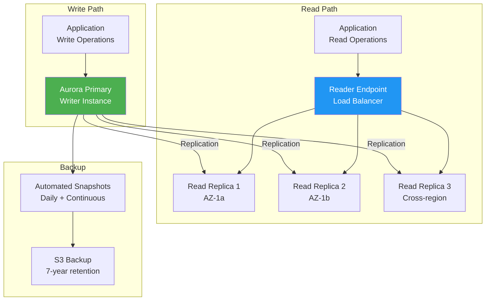

## Disaster Recovery

### RPO & RTO Targets

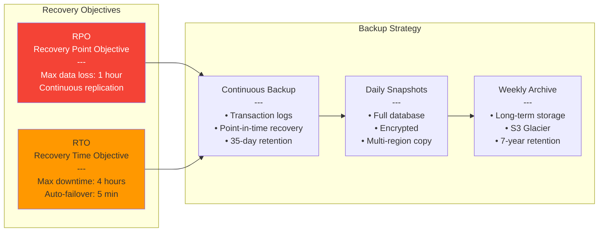

### DR Procedures

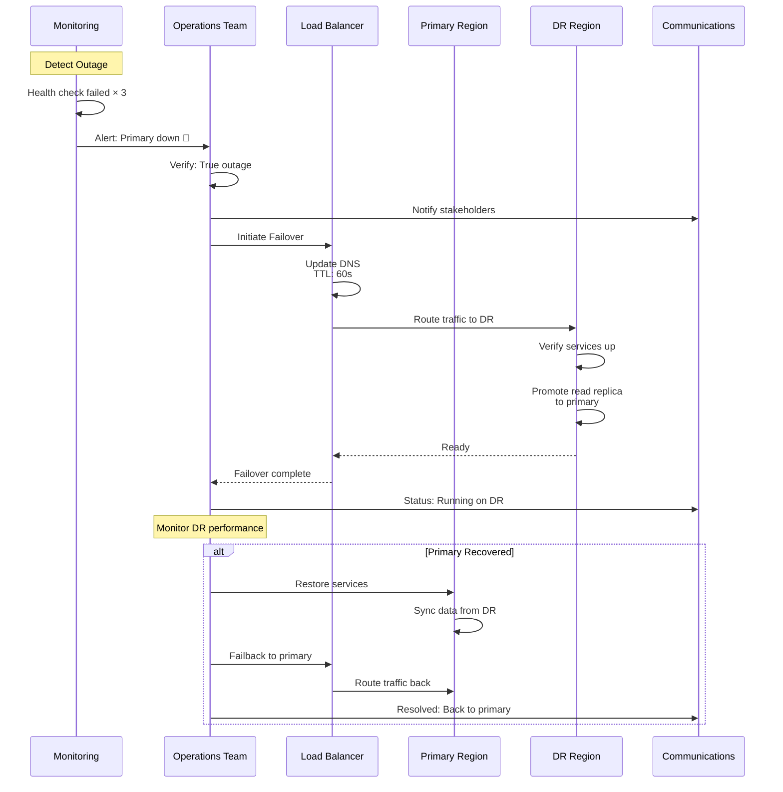

## Monitoring & Observability

### Monitoring Architecture

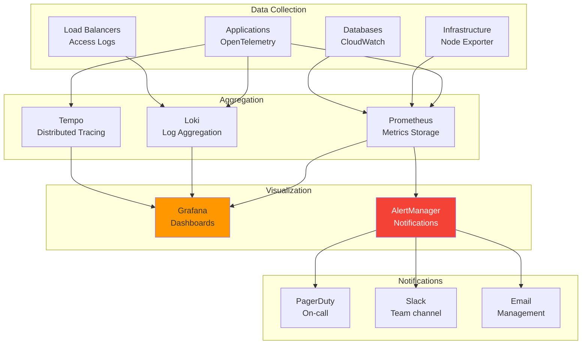

### Key Metrics (Golden Signals)

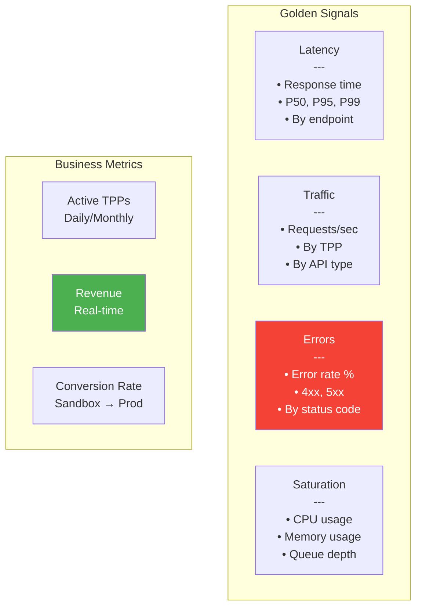

### Alerting Rules

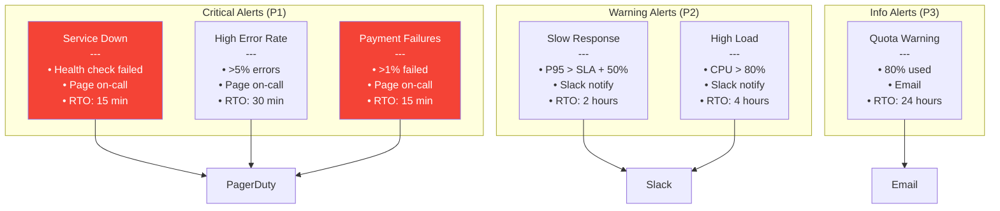

## Security Operations

### Security Monitoring

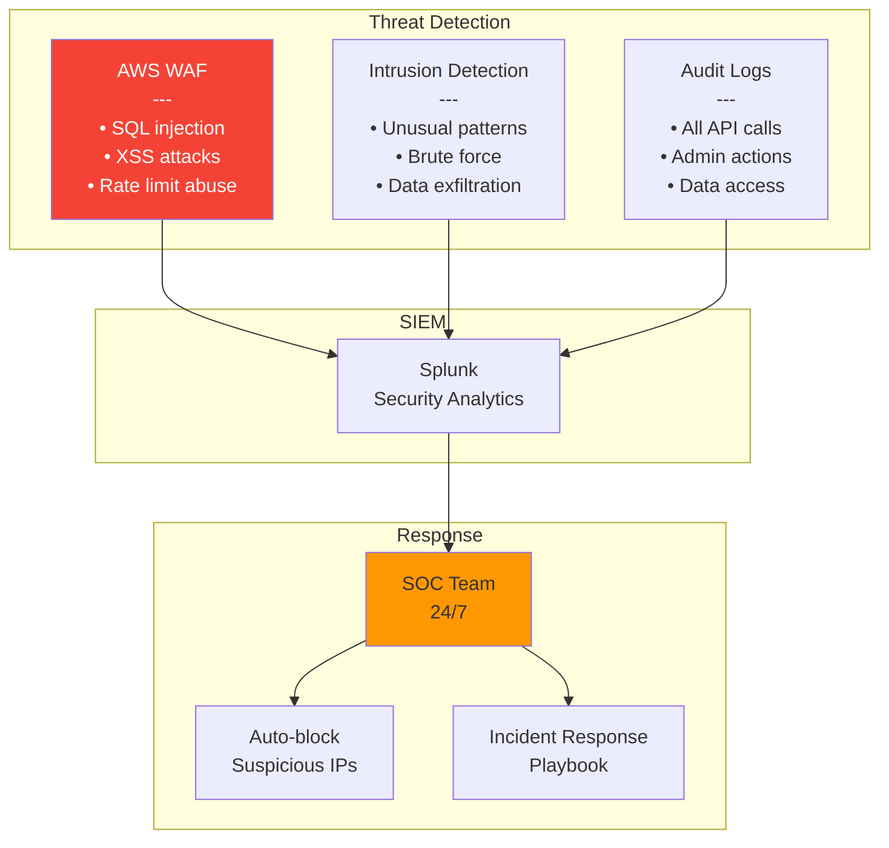

### Incident Response

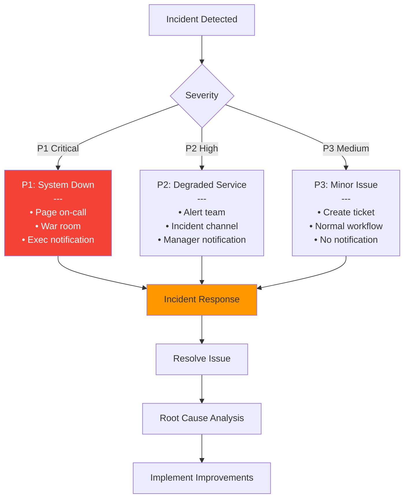

## Capacity Planning

### Growth Projection

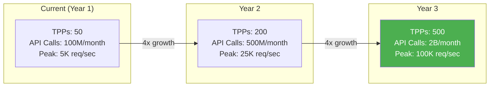

### Infrastructure Scaling

| Component | Current | Year 2 | Year 3 |
|-----------|---------|--------|--------|
| **API Pods** | 20 | 80 | 320 |
| **Database** | 1 × db.r6g.2xlarge | 2 × db.r6g.8xlarge | 4 × db.r6g.16xlarge |
| **Redis** | 3-node (8GB) | 6-node (32GB) | 12-node (128GB) |
| **Storage** | 500GB | 5TB | 50TB |
| **Monthly Cost** | $10,000 | $50,000 | $250,000 |

## Performance Optimization

### Caching Strategy

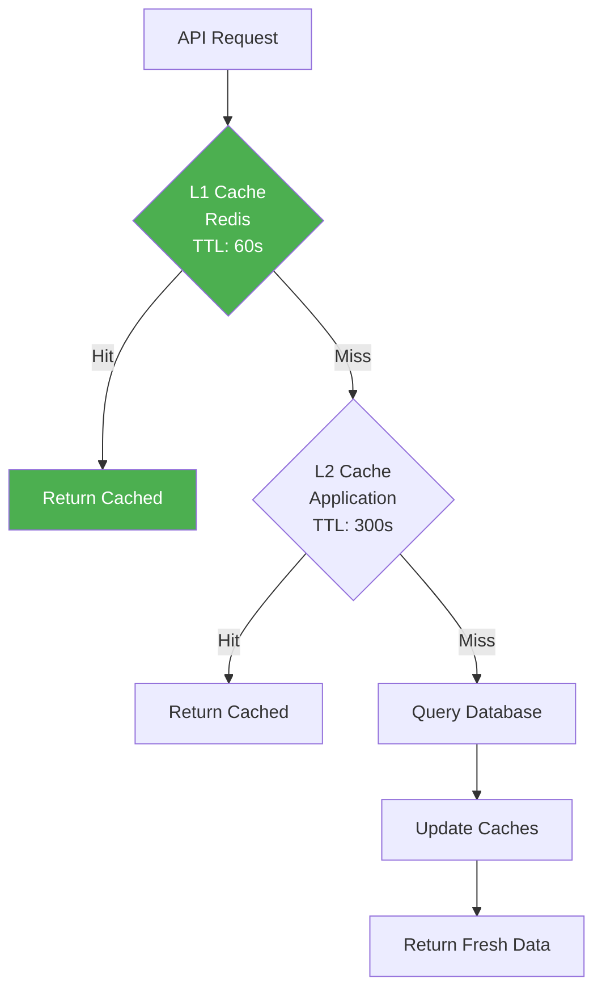

**Cache Hit Ratio Target:** >95%

### Database Optimization

```mermaid
graph TB
    subgraph "Query Optimization"
        Index[Indexing Strategy<br/>---<br/>• Primary keys<br/>• Foreign keys<br/>• Query patterns]
        
        Partition[Table Partitioning<br/>---<br/>• By date (monthly)<br/>• By TPP ID<br/>• Archive old data]
        
        Pool[Connection Pooling<br/>---<br/>• Min: 10<br/>• Max: 100<br/>• Timeout: 30s]
    end
    
    subgraph "Read/Write Split"
        Write[Write Operations<br/>→ Primary]
        Read[Read Operations<br/>→ Read Replicas]
    end
    
    Index --> Performance[Query Performance<br/>< 100ms]
    Partition --> Performance
    Pool --> Performance
    
    style Performance fill:#4caf50,color:#fff
```

## Change Management

### Deployment Pipeline

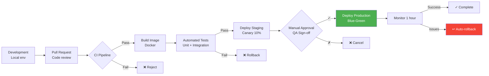

### Deployment Schedule

**Production Deployments:**
- **Preferred Window**: Tuesday & Thursday, 10:00-12:00
- **Freeze Period**: Friday, Holidays, Month-end
- **Change Advisory Board**: Weekly review
- **Emergency Hotfix**: Anytime with approval

## Compliance & Audit

### Audit Requirements

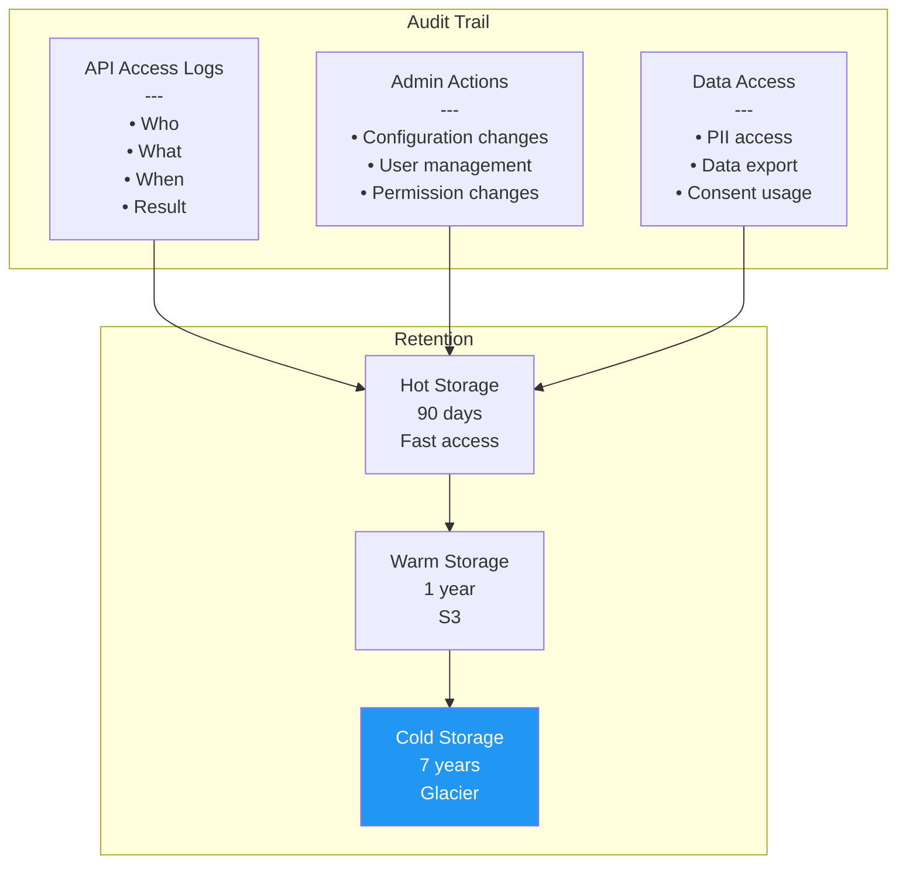

### Compliance Checklist

**Regular Audits:**
- ✅ **ISO 27001** - Annual certification
- ✅ **PCI DSS 4.0** - Quarterly scan
- ✅ **SOC 2 Type II** - Annual audit
- ✅ **Penetration Testing** - Quarterly
- ✅ **Vulnerability Scanning** - Weekly
- ✅ **Access Review** - Monthly
- ✅ **Backup Testing** - Monthly
- ✅ **DR Drill** - Quarterly

## Cost Management

### Cost Optimization

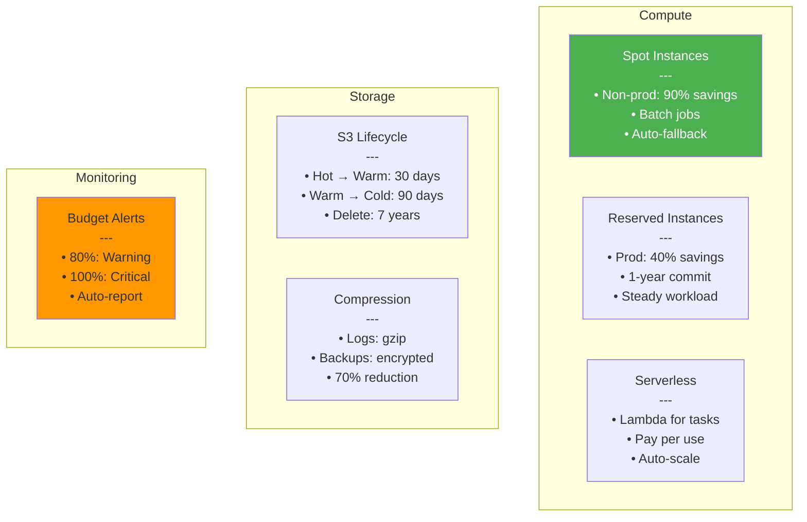

### Cost Breakdown (Monthly)

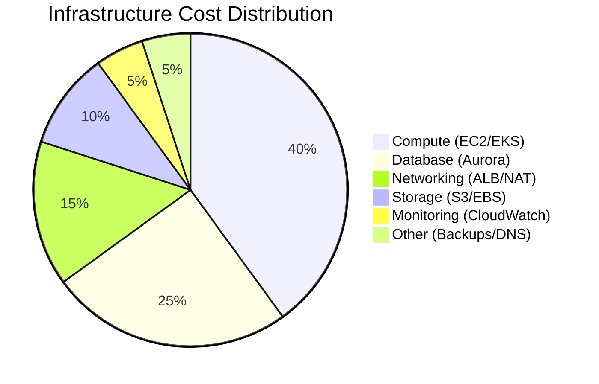

## Tài Liệu Tham Khảo

- **ISO/IEC 25010:2011** - Systems and Software Quality Models
- **ITIL v4** - IT Service Management
- **ISO 22301:2019** - Business Continuity Management
- **AWS Well-Architected Framework** - Best Practices
- **Google SRE Book** - Site Reliability Engineering

---

**Phiên bản:** 1.0  
**Ngày cập nhật:** 15/12/2025  
**Trạng thái:** Production Ready
