# Báo Cáo Kinh Doanh (Business Intelligence & Reporting)

> **Tuân thủ:** Thông tư 64/2024/TT-NHNN (Điều 15) | ISO 20022 | GDPR

## Tổng Quan

Hệ thống Business Intelligence (BI) và báo cáo cung cấp thông tin chi tiết, real-time insights và phân tích dự báo về hoạt động Open Banking Platform, hỗ trợ ra quyết định kinh doanh dựa trên dữ liệu.

### Mục Tiêu

1. **Data-Driven Decision**: Ra quyết định dựa trên dữ liệu thực tế
2. **Real-time Insights**: Theo dõi KPI theo thời gian thực
3. **Regulatory Compliance**: Báo cáo tuân thủ NHNN
4. **Revenue Optimization**: Tối ưu hóa doanh thu
5. **Risk Management**: Phát hiện sớm rủi ro và gian lận

## Kiến Trúc Hệ Thống Báo Cáo

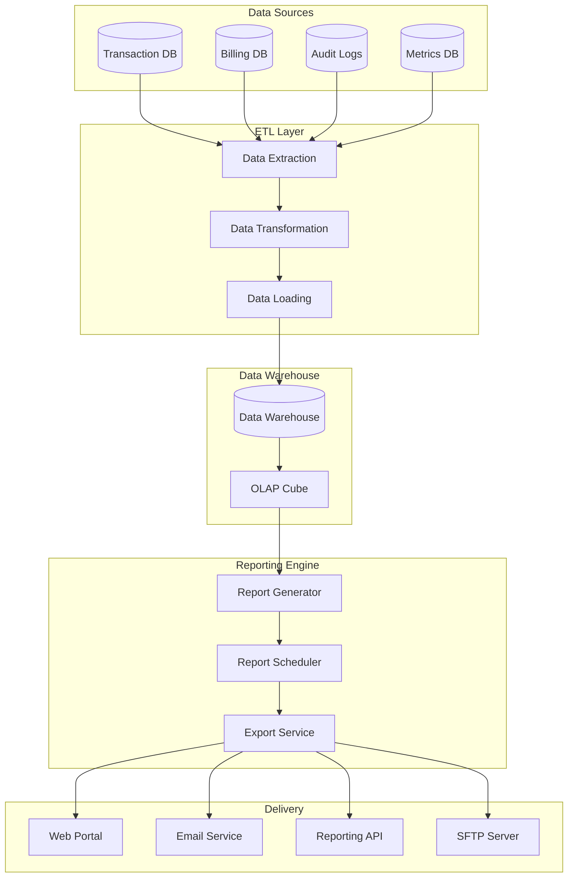
```mermaid
graph TB
    subgraph "Data Sources"
        TxnDB[(Transaction DB)]
        BillingDB[(Billing DB)]
        AuditDB[(Audit Logs)]
        MetricsDB[(Metrics DB)]
    end
    
    subgraph "ETL Layer"
        Extract[Data Extraction]
        Transform[Data Transformation]
        Load[Data Loading]
    end
    
    subgraph "Data Warehouse"
        DWH[(Data Warehouse)]
        OLAP[OLAP Cube]
    end
    
    subgraph "Reporting Engine"
        ReportGen[Report Generator]
        Scheduler[Report Scheduler]
        Export[Export Service]
    end
    
    subgraph "Delivery"
        Portal[Web Portal]
        Email[Email Service]
        API[Reporting API]
        SFTP[SFTP Server]
    end
    
    TxnDB --> Extract
    BillingDB --> Extract
    AuditDB --> Extract
    MetricsDB --> Extract
    
    Extract --> Transform
    Transform --> Load
    Load --> DWH
    DWH --> OLAP
    
    OLAP --> ReportGen
    ReportGen --> Scheduler
    Scheduler --> Export
    
    Export --> Portal
    Export --> Email
    Export --> API
    Export --> SFTP
```

## Các Loại Báo Cáo Chính

### 1. Báo Cáo Giao Dịch (Transaction Reports)

#### 1.1. Báo Cáo Tổng Hợp Giao Dịch Hàng Ngày

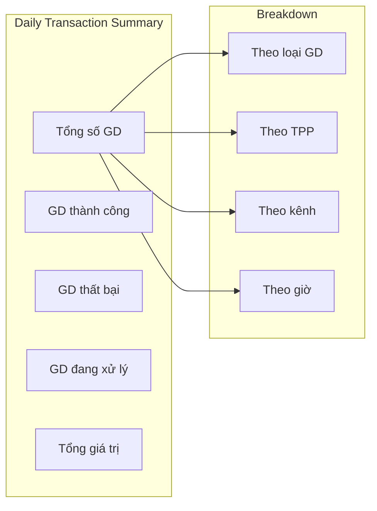
```mermaid
graph LR
    subgraph "Daily Transaction Summary"
        Total[Tổng số GD]
        Success[GD thành công]
        Failed[GD thất bại]
        Pending[GD đang xử lý]
        Value[Tổng giá trị]
    end
    
    subgraph "Breakdown"
        ByType[Theo loại GD]
        ByTPP[Theo TPP]
        ByChannel[Theo kênh]
        ByTime[Theo giờ]
    end
    
    Total --> ByType
    Total --> ByTPP
    Total --> ByChannel
    Total --> ByTime
```

**Nội dung báo cáo:**
- Tổng số giao dịch theo từng loại (AIS, PIS, Card, eKYC)
- Tỷ lệ thành công/thất bại (%)
- Tổng giá trị giao dịch (VND)
- Phân tích theo TPP
- Phân tích theo khung giờ (peak hours)
- So sánh với ngày hôm trước

**Tần suất:** Hàng ngày (T+1, 9:00 AM)

**Định dạng:** PDF, Excel, CSV, Power BI

**Distribution:**
- Email tự động tới management team
- Developer Portal dashboard
- API endpoint for custom consumption

**Mẫu dữ liệu:**
```json
{
  "ReportDate": "2024-12-10",
  "Summary": {
    "TotalTransactions": 125000,
    "SuccessfulTransactions": 122500,
    "FailedTransactions": 2000,
    "PendingTransactions": 500,
    "SuccessRate": 98.0,
    "TotalValue": {
      "Amount": "250000000000",
      "Currency": "VND"
    }
  },
  "ByType": {
    "AIS": {
      "Count": 50000,
      "SuccessRate": 99.5,
      "Value": "0"
    },
    "PIS": {
      "Count": 60000,
      "SuccessRate": 97.8,
      "Value": "240000000000"
    },
    "eKYC": {
      "Count": 10000,
      "SuccessRate": 96.5,
      "Value": "0"
    },
    "Card": {
      "Count": 5000,
      "SuccessRate": 98.2,
      "Value": "10000000000"
    }
  },
  "TopTPPs": [
    {
      "TPPId": "tpp-001",
      "TPPName": "Fintech ABC",
      "Transactions": 45000,
      "Value": "120000000000",
      "SuccessRate": 98.5
    }
  ],
  "PeakHours": [
    {
      "Hour": "09:00-10:00",
      "Transactions": 15000
    },
    {
      "Hour": "19:00-20:00",
      "Transactions": 18000
    }
  ]
}
```

#### 1.2. Báo Cáo Chi Tiết Giao Dịch Lỗi

**Mục đích:** Phân tích nguyên nhân lỗi để cải thiện chất lượng dịch vụ

**Nội dung:**
- Danh sách giao dịch lỗi
- Mã lỗi và mô tả
- Tần suất xuất hiện từng loại lỗi
- TPP bị ảnh hưởng
- Thời gian xảy ra lỗi
- Hành động khắc phục đề xuất

**Tần suất:** Hàng ngày

**Phân loại lỗi:**
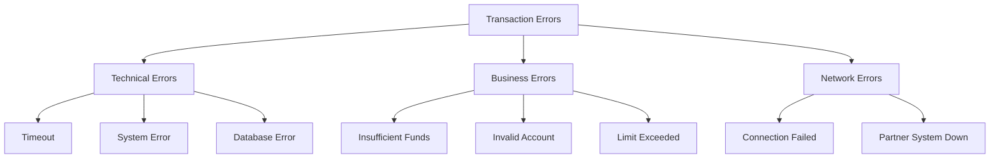
```mermaid
graph TB
    Errors[Transaction Errors]
    
    Errors --> Technical[Technical Errors]
    Errors --> Business[Business Errors]
    Errors --> Network[Network Errors]
    
    Technical --> Timeout[Timeout]
    Technical --> SystemError[System Error]
    Technical --> DatabaseError[Database Error]
    
    Business --> InsufficientFunds[Insufficient Funds]
    Business --> InvalidAccount[Invalid Account]
    Business --> LimitExceeded[Limit Exceeded]
    
    Network --> ConnectionFailed[Connection Failed]
    Network --> PartnerDown[Partner System Down]
```

#### 1.3. Báo Cáo Giao Dịch Theo TPP

**Mục đích:** Đánh giá hiệu suất từng đối tác TPP

**Nội dung:**
- Tổng số giao dịch của từng TPP
- Tỷ lệ thành công
- Giá trị giao dịch trung bình
- Xu hướng tăng/giảm
- API được sử dụng nhiều nhất
- Thời gian phản hồi trung bình

**Tần suất:** Tuần, Tháng

### 2. Báo Cáo Doanh Thu (Revenue Reports)

#### 2.1. Báo Cáo Doanh Thu Tổng Hợp

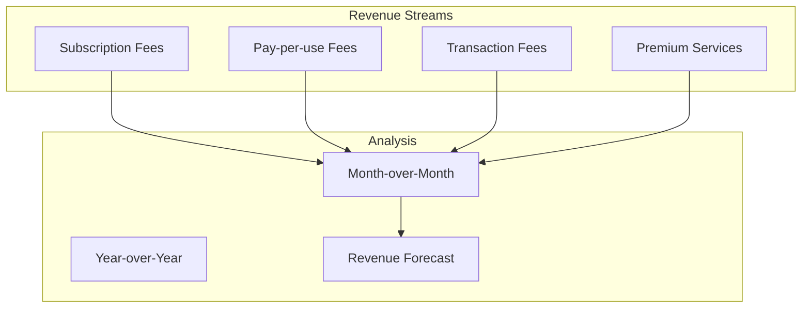
```mermaid
graph TB
    subgraph "Revenue Streams"
        Subscription[Subscription Fees]
        PayPerUse[Pay-per-use Fees]
        Transaction[Transaction Fees]
        Premium[Premium Services]
    end
    
    subgraph "Analysis"
        MoM[Month-over-Month]
        YoY[Year-over-Year]
        Forecast[Revenue Forecast]
    end
    
    Subscription --> MoM
    PayPerUse --> MoM
    Transaction --> MoM
    Premium --> MoM
    
    MoM --> Forecast
```

**Nội dung:**
- Tổng doanh thu theo tháng/quý/năm
- Phân tích theo nguồn doanh thu:
  - Phí thuê bao (Subscription)
  - Phí theo lượt sử dụng (Pay-per-use)
  - Phí giao dịch (Transaction fees)
  - Dịch vụ giá trị gia tăng (Premium services)
- So sánh với kỳ trước
- Dự báo doanh thu
- Top 10 TPP đóng góp doanh thu cao nhất

**Tần suất:** Hàng tháng

**Mẫu báo cáo:**
```json
{
  "Period": "2025-12",
  "TotalRevenue": {
    "Amount": "5000000000",
    "Currency": "VND"
  },
  "RevenueBreakdown": {
    "Subscription": {
      "Amount": "2000000000",
      "Percentage": 40,
      "Growth": 15.5
    },
    "PayPerUse": {
      "Amount": "1800000000",
      "Percentage": 36,
      "Growth": 22.3
    },
    "TransactionFees": {
      "Amount": "800000000",
      "Percentage": 16,
      "Growth": 10.2
    },
    "PremiumServices": {
      "Amount": "400000000",
      "Percentage": 8,
      "Growth": 35.7
    }
  },
  "TopRevenueTPPs": [
    {
      "TPPId": "tpp-001",
      "TPPName": "Fintech ABC",
      "Revenue": "450000000",
      "Growth": 18.5
    }
  ],
  "Forecast": {
    "NextMonth": "5500000000",
    "NextQuarter": "16500000000",
    "Confidence": 85
  }
}
```

#### 2.2. Báo Cáo Phí Dịch Vụ Chi Tiết (Fee Report)

**Mục đích:** Đối chiếu công nợ với TPP

**Nội dung:**
- Chi tiết phí từng API
- Số lượng gọi API
- Đơn giá
- Thành tiền
- Chiết khấu (nếu có)
- VAT
- Tổng cộng phải thanh toán

**Tần suất:** Hàng tháng (cuối tháng)

#### 2.3. Báo Cáo Công Nợ (Accounts Receivable)

**Nội dung:**
- Danh sách TPP chưa thanh toán
- Số tiền nợ
- Thời gian quá hạn
- Lịch sử thanh toán
- Cảnh báo rủi ro

**Tần suất:** Hàng tuần

### 3. Báo Cáo Hiệu Suất Hệ Thống (Performance Reports)

#### 3.1. Báo Cáo API Performance

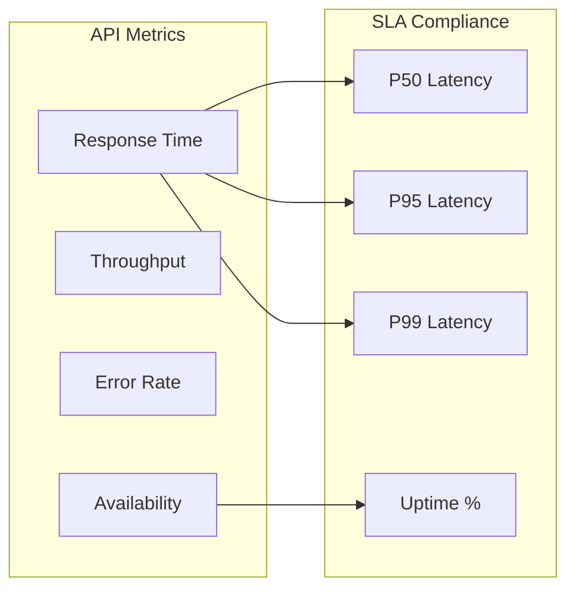
```mermaid
graph LR
    subgraph "API Metrics"
        Latency[Response Time]
        Throughput[Throughput]
        ErrorRate[Error Rate]
        Availability[Availability]
    end
    
    subgraph "SLA Compliance"
        P50[P50 Latency]
        P95[P95 Latency]
        P99[P99 Latency]
        Uptime[Uptime %]
    end
    
    Latency --> P50
    Latency --> P95
    Latency --> P99
    Availability --> Uptime
```

**Nội dung:**
- Thời gian phản hồi trung bình (P50, P95, P99)
- Throughput (requests/second)
- Tỷ lệ lỗi (%)
- Uptime (%)
- So sánh với SLA cam kết
- Phân tích theo từng API endpoint

**Tần suất:** Hàng ngày, Hàng tuần

**Mẫu dữ liệu:**
```json
{
  "ReportDate": "2025-12-15",
  "OverallMetrics": {
    "Uptime": 99.98,
    "TotalRequests": 10000000,
    "SuccessRate": 98.5,
    "AvgLatency": 125
  },
  "APIEndpoints": [
    {
      "Endpoint": "/v1/accounts",
      "Method": "GET",
      "Requests": 2500000,
      "P50Latency": 50,
      "P95Latency": 150,
      "P99Latency": 300,
      "ErrorRate": 0.5,
      "SLATarget": 500,
      "SLACompliance": 99.9
    },
    {
      "Endpoint": "/v1/payments",
      "Method": "POST",
      "Requests": 1500000,
      "P50Latency": 200,
      "P95Latency": 800,
      "P99Latency": 1500,
      "ErrorRate": 2.1,
      "SLATarget": 2000,
      "SLACompliance": 98.5
    }
  ]
}
```

#### 3.2. Báo Cáo Capacity Planning

**Mục đích:** Dự báo nhu cầu tài nguyên

**Nội dung:**
- Xu hướng tăng trưởng traffic
- Sử dụng tài nguyên hiện tại (CPU, Memory, Disk)
- Dự báo nhu cầu 3-6 tháng tới
- Đề xuất mở rộng hạ tầng
- Chi phí ước tính

**Tần suất:** Hàng tháng

### 4. Báo Cáo Tuân Thủ (Compliance Reports)

#### 4.1. Báo Cáo Tuân Thủ NHNN

**Căn cứ:** Thông tư 64/2024/TT-NHNN - Điều 15

**Nội dung bắt buộc:**
- Tổng số TPP đang hoạt động
- Tổng số API được cung cấp
- Tổng số giao dịch trong kỳ
- Tổng giá trị giao dịch
- Số lượng sự cố bảo mật (nếu có)
- Thời gian downtime
- Các vi phạm SLA
- Hành động khắc phục

**Tần suất:** Hàng quý, Hàng năm

**Định dạng:** Theo mẫu NHNN quy định

#### 4.2. Báo Cáo Audit Log

**Mục đích:** Đáp ứng yêu cầu kiểm toán

**Nội dung:**
- Lịch sử truy cập hệ thống
- Thay đổi cấu hình
- Thay đổi quyền truy cập
- Giao dịch bất thường
- Cảnh báo bảo mật

**Tần suất:** Theo yêu cầu, Hàng tháng

#### 4.3. Báo Cáo Bảo Mật (Security Report)

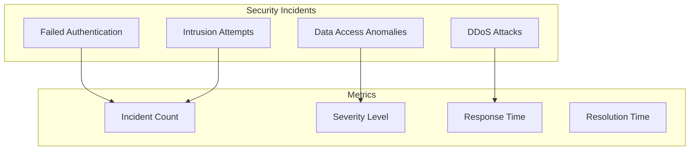
```mermaid
graph TB
    subgraph "Security Incidents"
        Auth[Failed Authentication]
        Intrusion[Intrusion Attempts]
        DataBreach[Data Access Anomalies]
        DDoS[DDoS Attacks]
    end
    
    subgraph "Metrics"
        Count[Incident Count]
        Severity[Severity Level]
        Response[Response Time]
        Resolution[Resolution Time]
    end
    
    Auth --> Count
    Intrusion --> Count
    DataBreach --> Severity
    DDoS --> Response
```

**Nội dung:**
- Số lượng sự cố bảo mật
- Phân loại theo mức độ nghiêm trọng
- Thời gian phát hiện và xử lý
- Hành động khắc phục
- Bài học kinh nghiệm

**Tần suất:** Hàng tháng

### 5. Báo Cáo Đối Soát (Reconciliation Reports)

#### 5.1. Báo Cáo Đối Soát Hàng Ngày

**Nội dung:**
- Tổng số giao dịch khớp
- Giao dịch chưa khớp
- Giao dịch sai lệch
- Chi tiết từng trường hợp sai lệch
- Hành động xử lý

**Tần suất:** Hàng ngày (T+1)

**Định dạng:** ISO 20022 camt.053, CSV, Excel

#### 5.2. Báo Cáo Sai Lệch (Exception Report)

**Mục đích:** Theo dõi và xử lý giao dịch bất thường

**Nội dung:**
- Danh sách giao dịch sai lệch
- Loại sai lệch (missing, amount mismatch, status mismatch)
- Thời gian phát hiện
- Trạng thái xử lý
- Người chịu trách nhiệm

**Tần suất:** Hàng ngày

### 6. Báo Cáo Phân Tích Kinh Doanh (Business Analytics)

#### 6.1. Báo Cáo Phân Tích TPP

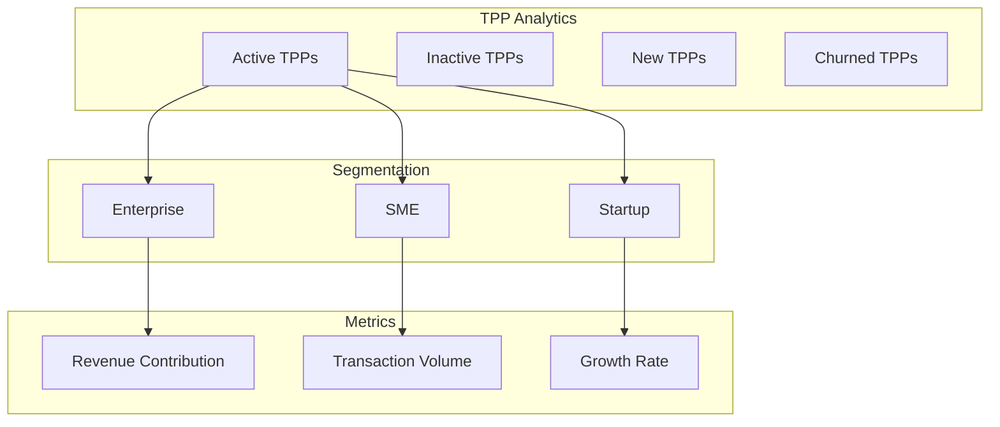
```mermaid
graph TB
    subgraph "TPP Analytics"
        Active[Active TPPs]
        Inactive[Inactive TPPs]
        New[New TPPs]
        Churned[Churned TPPs]
    end
    
    subgraph "Segmentation"
        Enterprise[Enterprise]
        SME[SME]
        Startup[Startup]
    end
    
    subgraph "Metrics"
        Revenue[Revenue Contribution]
        Volume[Transaction Volume]
        Growth[Growth Rate]
    end
    
    Active --> Enterprise
    Active --> SME
    Active --> Startup
    
    Enterprise --> Revenue
    SME --> Volume
    Startup --> Growth
```

**Nội dung:**
- Số lượng TPP đang hoạt động
- TPP mới trong kỳ
- TPP ngừng hoạt động
- Phân khúc TPP (Enterprise, SME, Startup)
- Đóng góp doanh thu của từng phân khúc
- Tỷ lệ giữ chân khách hàng (Retention rate)
- Tỷ lệ rời bỏ (Churn rate)

**Tần suất:** Hàng tháng, Hàng quý

#### 6.2. Báo Cáo Phân Tích Sản Phẩm

**Mục đích:** Đánh giá hiệu quả từng dịch vụ API

**Nội dung:**
- API được sử dụng nhiều nhất
- Doanh thu theo từng API
- Tỷ lệ tăng trưởng
- Tỷ lệ chuyển đổi (Conversion rate)
- Đề xuất cải tiến sản phẩm

**Tần suất:** Hàng tháng

#### 6.3. Báo Cáo Market Intelligence

**Nội dung:**
- Xu hướng thị trường Open Banking
- Phân tích đối thủ cạnh tranh
- Cơ hội kinh doanh mới
- Rủi ro tiềm ẩn
- Đề xuất chiến lược

**Tần suất:** Hàng quý

### 7. Báo Cáo Vận Hành (Operational Reports)

#### 7.1. Báo Cáo SLA

**Nội dung:**
- Uptime thực tế vs cam kết
- Response time thực tế vs cam kết
- Số lượng vi phạm SLA
- Bồi thường SLA (nếu có)
- Hành động cải thiện

**Tần suất:** Hàng tháng

#### 7.2. Báo Cáo Incident

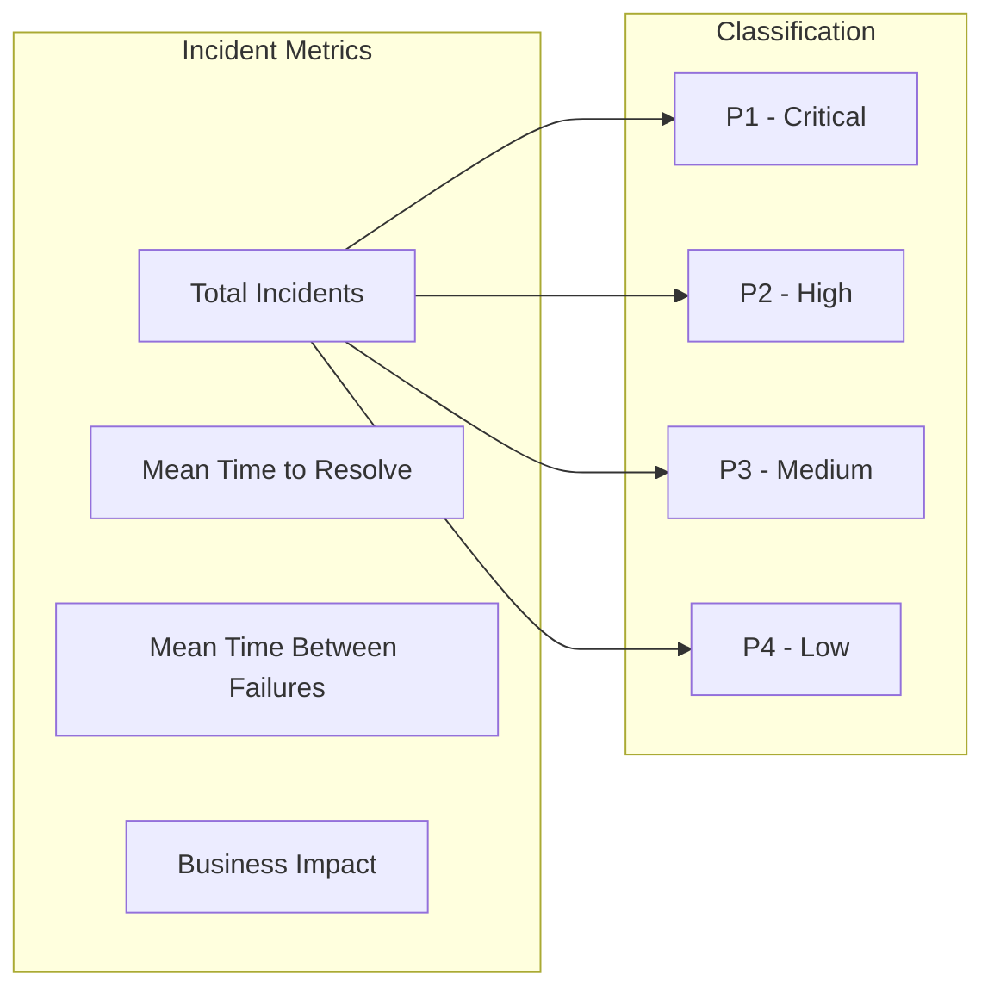
```mermaid
graph LR
    subgraph "Incident Metrics"
        Count[Total Incidents]
        MTTR[Mean Time to Resolve]
        MTBF[Mean Time Between Failures]
        Impact[Business Impact]
    end
    
    subgraph "Classification"
        P1[P1 - Critical]
        P2[P2 - High]
        P3[P3 - Medium]
        P4[P4 - Low]
    end
    
    Count --> P1
    Count --> P2
    Count --> P3
    Count --> P4
```

**Nội dung:**
- Tổng số sự cố
- Phân loại theo mức độ nghiêm trọng
- Thời gian xử lý trung bình (MTTR)
- Thời gian giữa các sự cố (MTBF)
- Nguyên nhân gốc rễ
- Hành động phòng ngừa

**Tần suất:** Hàng tuần, Hàng tháng

#### 7.3. Báo Cáo Change Management

**Nội dung:**
- Số lượng thay đổi trong kỳ
- Tỷ lệ thành công
- Thay đổi bị rollback
- Downtime do thay đổi
- Tuân thủ quy trình

**Tần suất:** Hàng tháng

### 8. Báo Cáo Khách Hàng (Customer Reports)

#### 8.1. Báo Cáo Hành Vi Người Dùng Cuối

**Nội dung:**
- Số lượng người dùng đồng ý (consent)
- Tỷ lệ từ chối
- Thời gian sử dụng trung bình
- Dịch vụ được sử dụng nhiều nhất
- Tỷ lệ hủy đồng ý

**Tần suất:** Hàng tháng

#### 8.2. Báo Cáo Khiếu Nại & Tranh Chấp

**Nội dung:**
- Số lượng khiếu nại
- Phân loại khiếu nại
- Thời gian xử lý trung bình
- Tỷ lệ giải quyết thành công
- Bồi thường (nếu có)
- Bài học kinh nghiệm

**Tần suất:** Hàng tháng

## API Endpoints cho Báo Cáo

### 1. Lấy Danh Sách Báo Cáo

#### GET /v1/reports

**Query Parameters:**
- `category`: Loại báo cáo (transaction, revenue, performance, compliance)
- `fromDate`: Từ ngày
- `toDate`: Đến ngày
- `status`: Trạng thái (COMPLETED, PROCESSING, FAILED)
- `page`: Trang
- `limit`: Số lượng/trang

**Response:**
```json
{
  "Data": {
    "Reports": [
      {
        "ReportId": "rpt-20251215-001",
        "ReportName": "Daily Transaction Summary",
        "Category": "TRANSACTION",
        "Period": {
          "FromDate": "2025-12-14",
          "ToDate": "2025-12-14"
        },
        "Status": "COMPLETED",
        "GeneratedAt": "2025-12-15T09:00:00+07:00",
        "FileSize": 2048576,
        "Format": "PDF"
      }
    ],
    "Pagination": {
      "Page": 1,
      "Limit": 20,
      "Total": 150
    }
  }
}
```

### 2. Tạo Báo Cáo

#### POST /v1/reports

**Request:**
```json
{
  "ReportType": "TRANSACTION_SUMMARY",
  "Period": {
    "FromDate": "2025-12-01",
    "ToDate": "2025-12-31"
  },
  "Format": "PDF",
  "Filters": {
    "TPPIds": ["tpp-001", "tpp-002"],
    "TransactionTypes": ["PIS", "AIS"]
  },
  "DeliveryMethod": "EMAIL",
  "Recipients": ["manager@bank.vn"]
}
```

**Response:**
```json
{
  "Data": {
    "ReportId": "rpt-20251215-002",
    "Status": "PROCESSING",
    "EstimatedCompletionTime": "2025-12-15T10:00:00+07:00",
    "ProgressPercentage": 0,
    "StatusUrl": "/v1/reports/rpt-20251215-002/status"
  }
}
```

### 3. Tải Báo Cáo

#### GET /v1/reports/{ReportId}/download

**Response:** File download (PDF, Excel, CSV)

### 4. Lên Lịch Báo Cáo Tự Động

#### POST /v1/reports/schedules

**Request:**
```json
{
  "ReportType": "DAILY_TRANSACTION_SUMMARY",
  "Schedule": {
    "Frequency": "DAILY",
    "Time": "09:00",
    "Timezone": "Asia/Ho_Chi_Minh"
  },
  "Format": "PDF",
  "DeliveryMethod": "EMAIL",
  "Recipients": ["manager@bank.vn", "cfo@bank.vn"]
}
```

## Dashboard Trực Quan

### Executive Dashboard

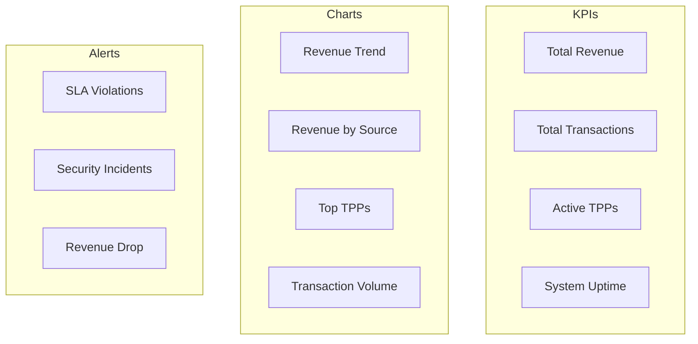
```mermaid
graph TB
    subgraph "KPIs"
        Revenue[Total Revenue]
        Transactions[Total Transactions]
        TPPs[Active TPPs]
        Uptime[System Uptime]
    end
    
    subgraph "Charts"
        TrendChart[Revenue Trend]
        PieChart[Revenue by Source]
        BarChart[Top TPPs]
        LineChart[Transaction Volume]
    end
    
    subgraph "Alerts"
        SLAAlert[SLA Violations]
        SecurityAlert[Security Incidents]
        RevenueAlert[Revenue Drop]
    end
```

**Thành phần:**
- KPIs chính (Revenue, Transactions, Active TPPs, Uptime)
- Biểu đồ xu hướng doanh thu
- Top 10 TPPs
- Cảnh báo real-time
- So sánh với mục tiêu

### TPP Dashboard

**Thành phần:**
- Số lượng giao dịch hôm nay
- Chi phí dự kiến tháng này
- API usage breakdown
- Tỷ lệ thành công
- Quota còn lại
- Hóa đơn chưa thanh toán

## Tự Động Hóa Báo Cáo

### Scheduled Reports

```mermaid
gantt
    title Lịch Báo Cáo Tự Động
    dateFormat HH:mm
    section Daily
    Transaction Summary           :09:00, 30m
    Error Report                  :10:00, 30m
    Performance Report            :11:00, 30m
    section Weekly
    TPP Analysis                  :mon 14:00, 1h
    Revenue Summary               :fri 16:00, 1h
    section Monthly
    Compliance Report             :01 09:00, 2h
    Executive Summary             :01 14:00, 2h
```

### Notification Rules

| Sự kiện              | Điều kiện                | Người nhận    | Kênh          |
| -------------------- | ------------------------ | ------------- | ------------- |
| Báo cáo hoàn thành   | Luôn luôn                | Người yêu cầu | Email         |
| Doanh thu giảm       | > 10% so với tháng trước | CFO, CEO      | Email + SMS   |
| SLA vi phạm          | Uptime < 99.9%           | CTO, Ops Team | Email + Slack |
| Giao dịch bất thường | Spike > 200%             | Risk Team     | Email + SMS   |

## Bảo Mật Báo Cáo

### Access Control

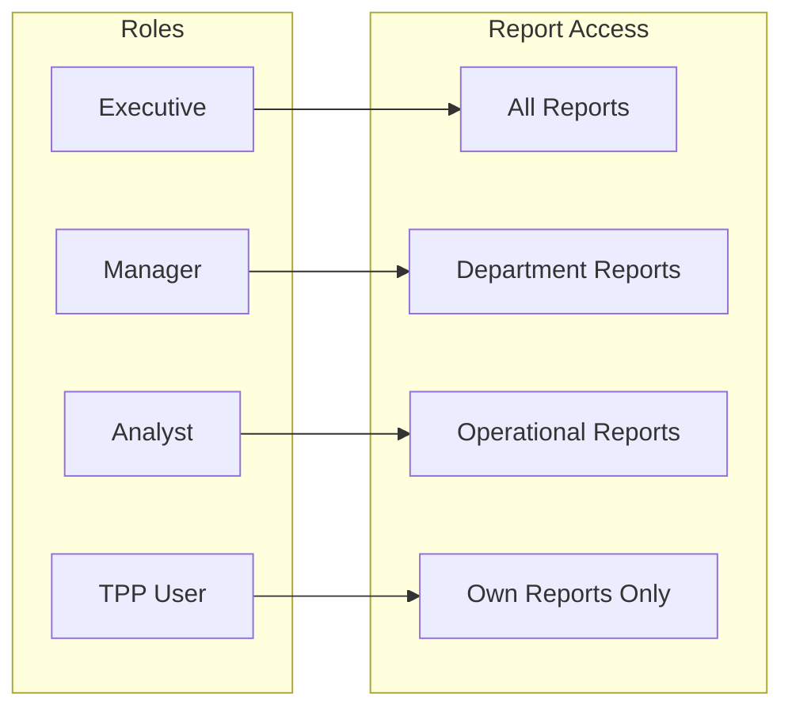
```mermaid
graph LR
    subgraph "Roles"
        Executive[Executive]
        Manager[Manager]
        Analyst[Analyst]
        TPP[TPP User]
    end
    
    subgraph "Report Access"
        All[All Reports]
        Department[Department Reports]
        Operational[Operational Reports]
        Own[Own Reports Only]
    end
    
    Executive --> All
    Manager --> Department
    Analyst --> Operational
    TPP --> Own
```

### Data Masking

- **Thông tin nhạy cảm:** Số tài khoản, CMND/CCCD được mask
- **Dữ liệu tài chính:** Chỉ hiển thị tổng hợp, không chi tiết cá nhân
- **Thông tin TPP:** Chỉ TPP được xem báo cáo của chính mình

## Lưu Trữ Báo Cáo

### Retention Policy

| Loại Báo Cáo        | Hot Storage | Cold Storage | Archive |
| ------------------- | ----------- | ------------ | ------- |
| Transaction Reports | 3 tháng     | 1 năm        | 5 năm   |
| Revenue Reports     | 1 năm       | 3 năm        | 7 năm   |
| Compliance Reports  | 1 năm       | 5 năm        | 10 năm  |
| Performance Reports | 6 tháng     | 1 năm        | 3 năm   |

## Tích Hợp BI Tools

### Supported Tools

- **Power BI**: Kết nối trực tiếp đến Data Warehouse
- **Tableau**: ODBC/JDBC connector
- **Google Data Studio**: API integration
- **Excel**: Export to Excel với pivot tables

## Best Practices

### 1. Thiết Kế Báo Cáo

- **Rõ ràng:** Tiêu đề, mục đích, kỳ báo cáo
- **Trực quan:** Sử dụng biểu đồ, màu sắc hợp lý
- **Hành động:** Đưa ra insights và đề xuất
- **Nhất quán:** Định dạng thống nhất

### 2. Hiệu Năng

- **Caching:** Cache báo cáo thường xuyên
- **Pre-aggregation:** Tính toán trước dữ liệu tổng hợp
- **Async processing:** Xử lý báo cáo lớn bất đồng bộ
- **Pagination:** Phân trang cho báo cáo dài

### 3. Chất Lượng Dữ Liệu

- **Validation:** Kiểm tra tính hợp lệ của dữ liệu
- **Reconciliation:** Đối chiếu với nguồn gốc
- **Audit trail:** Ghi nhận lịch sử thay đổi
- *Machine Learning & Predictive Analytics

### Dự Báo Doanh Thu (Revenue Forecasting)

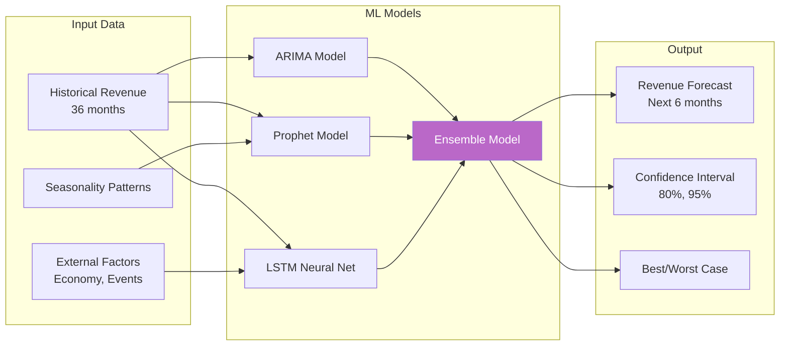
```mermaid
graph LR
    subgraph "Input Data"
        Historical[Historical Revenue<br/>36 months]
        Seasonality[Seasonality Patterns]
        External[External Factors<br/>Economy, Events]
    end
    
    subgraph "ML Models"
        ARIMA[ARIMA Model]
        Prophet[Prophet Model]
        LSTM[LSTM Neural Net]
        Ensemble[Ensemble Model]
    end
    
    subgraph "Output"
        Forecast[Revenue Forecast<br/>Next 6 months]
        Confidence[Confidence Interval<br/>80%, 95%]
        Scenarios[Best/Worst Case]
    end
    
    Historical --> ARIMA
    Historical --> Prophet
    Historical --> LSTM
    Seasonality --> Prophet
    External --> LSTM
    
    ARIMA --> Ensemble
    Prophet --> Ensemble
    LSTM --> Ensemble
    
    Ensemble --> Forecast
    Ensemble --> Confidence
    Ensemble --> Scenarios
    
    style Ensemble fill:#ba68c8,color:#fff
```

**Features:**
- Dự báo doanh thu với độ tin cậy 85-95%
- Phát hiện xu hướng và seasonality
- Scenario planning (best/worst/expected case)
- Alert khi doanh thu dự kiến giảm >10%

### Anomaly Detection (Phát Hiện Bất Thường)

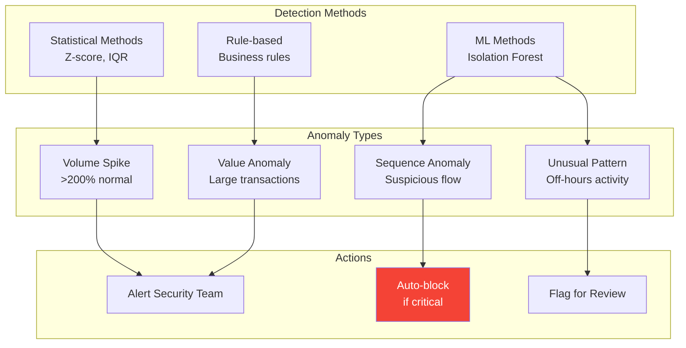
```mermaid
graph TB
    subgraph "Detection Methods"
        Statistical[Statistical Methods<br/>Z-score, IQR]
        ML[ML Methods<br/>Isolation Forest]
        Rule[Rule-based<br/>Business rules]
    end
    
    subgraph "Anomaly Types"
        Volume[Volume Spike<br/>>200% normal]
        Pattern[Unusual Pattern<br/>Off-hours activity]
        Value[Value Anomaly<br/>Large transactions]
        Sequence[Sequence Anomaly<br/>Suspicious flow]
    end
    
    subgraph "Actions"
        Alert[Alert Security Team]
        Block[Auto-block<br/>if critical]
        Investigate[Flag for Review]
    end
    
    Statistical --> Volume
    ML --> Pattern
    Rule --> Value
    ML --> Sequence
    
    Volume --> Alert
    Pattern --> Investigate
    Value --> Alert
    Sequence --> Block
    
    style Block fill:#f44336,color:#fff
```

**Use Cases:**
- Phát hiện giao dịch gian lận real-time
- Phát hiện tấn công DDoS
- Phát hiện TPP sử dụng bất thường
- Phát hiện API abuse

### Customer Lifetime Value (CLV)

```python
# CLV Calculation Formula
CLV = (Average Transaction Value) × 
      (Number of Transactions per Period) × 
      (Customer Lifetime) × 
      (Profit Margin)

# Example
TPP_CLV = {
    "ARPU": 30_000_000,  # VND/month
    "AverageLifetime": 36,  # months
    "ChurnRate": 0.05,  # 5%/year
    "CLV": 30_000_000 * 36 * (1 - 0.05) = 1_026_000_000  # VND
}
```

## Real-time Analytics Dashboard

### Executive Dashboard Components

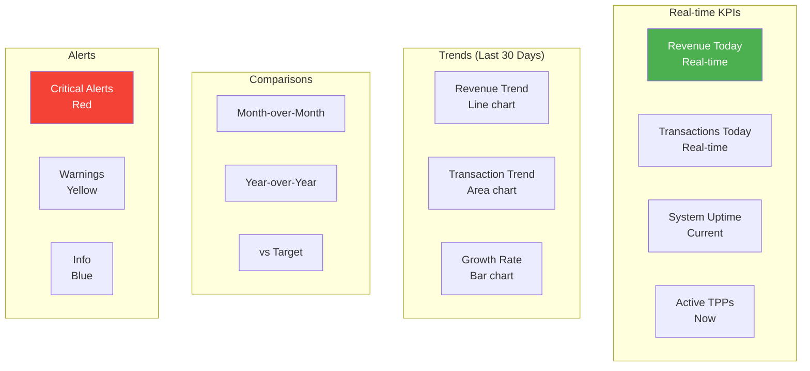
```mermaid
graph TB
    subgraph "Real-time KPIs"
        Revenue_RT[Revenue Today<br/>Real-time]
        Txn_RT[Transactions Today<br/>Real-time]
        Uptime_RT[System Uptime<br/>Current]
        Active_RT[Active TPPs<br/>Now]
    end
    
    subgraph "Trends (Last 30 Days)"
        Revenue_Trend[Revenue Trend<br/>Line chart]
        Txn_Trend[Transaction Trend<br/>Area chart]
        Growth_Trend[Growth Rate<br/>Bar chart]
    end
    
    subgraph "Comparisons"
        MoM[Month-over-Month]
        YoY[Year-over-Year]
        Target[vs Target]
    end
    
    subgraph "Alerts"
        Critical[Critical Alerts<br/>Red]
        Warning[Warnings<br/>Yellow]
        Info[Info<br/>Blue]
    end
    
    style Revenue_RT fill:#4caf50,color:#fff
    style Critical fill:#f44336,color:#fff
```

**Auto-refresh:** Every 30 seconds

**Access Control:**
- CEO/CFO: Full dashboard
- Department heads: Department-specific views
- Analysts: Operational dashboards
- TPPs: Self-service dashboard (own data only)

## Data Privacy & Compliance

### GDPR Compliance in Reporting

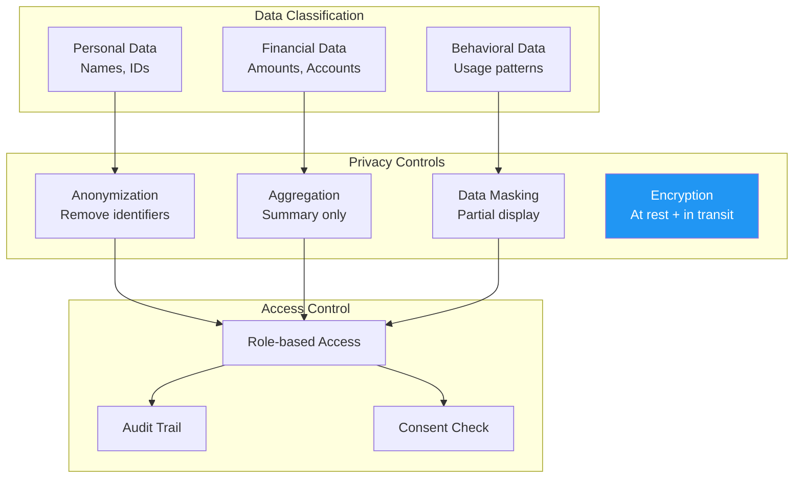
```mermaid
graph TB
    subgraph "Data Classification"
        PII[Personal Data<br/>Names, IDs]
        Financial[Financial Data<br/>Amounts, Accounts]
        Behavioral[Behavioral Data<br/>Usage patterns]
    end
    
    subgraph "Privacy Controls"
        Anonymize[Anonymization<br/>Remove identifiers]
        Aggregate[Aggregation<br/>Summary only]
        Mask[Data Masking<br/>Partial display]
        Encrypt[Encryption<br/>At rest + in transit]
    end
    
    subgraph "Access Control"
        RBAC[Role-based Access]
        Audit[Audit Trail]
        Consent[Consent Check]
    end
    
    PII --> Anonymize
    Financial --> Aggregate
    Behavioral --> Mask
    
    Anonymize --> RBAC
    Aggregate --> RBAC
    Mask --> RBAC
    
    RBAC --> Audit
    RBAC --> Consent
    
    style Encrypt fill:#2196f3,color:#fff
```

**Principles:**
- **Data Minimization**: Chỉ thu thập dữ liệu cần thiết
- **Purpose Limitation**: Chỉ sử dụng cho mục đích đã khai báo
- **Storage Limitation**: Xóa dữ liệu khi hết mục đích
- **Right to be Forgotten**: Xóa dữ liệu khi khách hàng yêu cầu

### Audit Trail for Reports

```json
{
  "AuditId": "audit-20251215-001",
  "EventType": "REPORT_ACCESSED",
  "Timestamp": "2025-12-15T10:30:45+07:00",
  "User": {
    "UserId": "user-12345",
    "UserName": "nguyen.van.a@bank.vn",
    "Role": "MANAGER",
    "Department": "Business Analytics"
  },
  "Report": {
    "ReportId": "rpt-20251215-001",
    "ReportType": "REVENUE_DETAILED",
    "Period": "2025-12",
    "Sensitivity": "CONFIDENTIAL"
  },
  "Action": "DOWNLOAD",
  "IPAddress": "192.168.1.100",
  "DeviceInfo": "Mozilla/5.0 (Macintosh)",
  "DataAccessed": {
    "RowsAccessed": 1500,
    "ContainsPII": false,
    "ContainsFinancialData": true
  }
}
```

## Advanced Reporting Features

### Interactive Reports (Drill-down)

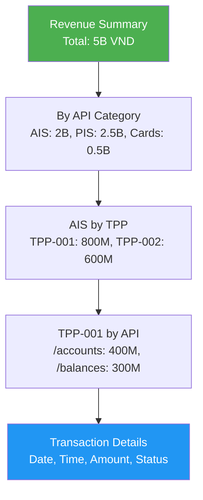
```mermaid
graph TB
    Top[Revenue Summary<br/>Total: 5B VND]
    
    Top --> Level2A[By API Category<br/>AIS: 2B, PIS: 2.5B, Cards: 0.5B]
    
    Level2A --> Level3A[AIS by TPP<br/>TPP-001: 800M, TPP-002: 600M]
    
    Level3A --> Level4A[TPP-001 by API<br/>/accounts: 400M, /balances: 300M]
    
    Level4A --> Detail[Transaction Details<br/>Date, Time, Amount, Status]
    
    style Top fill:#4caf50,color:#fff
    style Detail fill:#2196f3,color:#fff
```

**Features:**
- Click vào số liệu → drill down chi tiết
- Filter động theo nhiều tiêu chí
- Export at any level
- Bookmark favorite views

### Comparative Analysis

**Year-over-Year Comparison:**
```
2025 vs 2024:
├── Revenue: +45% (3.5B → 5B VND)
├── Transactions: +60% (2M → 3.2M)
├── Active TPPs: +120% (50 → 110)
└── ARPU: -18% (70M → 57M) ⚠️
```

**Cohort Analysis:**
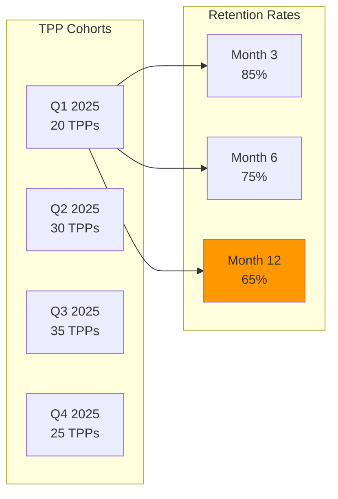
```mermaid
graph LR
    subgraph "TPP Cohorts"
        Q1_2025[Q1 2025<br/>20 TPPs]
        Q2_2025[Q2 2025<br/>30 TPPs]
        Q3_2025[Q3 2025<br/>35 TPPs]
        Q4_2025[Q4 2025<br/>25 TPPs]
    end
    
    subgraph "Retention Rates"
        M3[Month 3<br/>85%]
        M6[Month 6<br/>75%]
        M12[Month 12<br/>65%]
    end
    
    Q1_2025 --> M3
    Q1_2025 --> M6
    Q1_2025 --> M12
    
    style M12 fill:#ff9800
```

### What-If Analysis

**Scenario Planning Tool:**

```json
{
  "ScenarioName": "Price Increase Impact",
  "Parameters": {
    "CurrentPricing": {
      "BasicTier": 5000000,
      "ProTier": 30000000
    },
    "NewPricing": {
      "BasicTier": 6000000,
      "ProTier": 35000000
    },
    "EstimatedChurnRate": 0.15
  },
  "Projection": {
    "CurrentRevenue": "5000000000",
    "ProjectedRevenue": "5200000000",
    "RevenueIncrease": "200000000",
    "ProjectedChurn": {
      "TPPsLost": 16,
      "RevenueLost": "450000000"
    },
    "NetImpact": "-250000000",
    "Recommendation": "DO_NOT_INCREASE"
  }
}
```

## Report Distribution & Notifications

### Automated Distribution

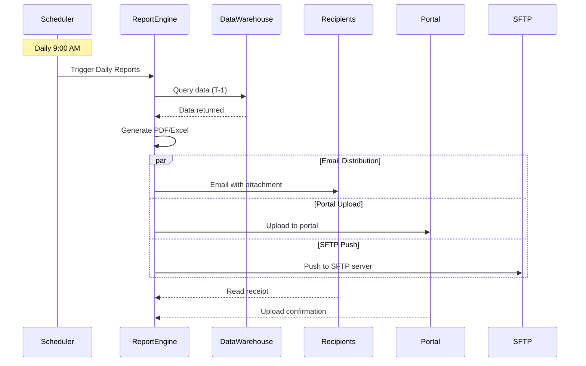
```mermaid
sequenceDiagram
    participant Scheduler
    participant ReportEngine
    participant DataWarehouse
    participant Recipients
    participant Portal
    
    Note over Scheduler: Daily 9:00 AM
    Scheduler->>ReportEngine: Trigger Daily Reports
    
    ReportEngine->>DataWarehouse: Query data (T-1)
    DataWarehouse-->>ReportEngine: Data returned
    
    ReportEngine->>ReportEngine: Generate PDF/Excel
    
    par Email Distribution
        ReportEngine->>Recipients: Email with attachment
    and Portal Upload
        ReportEngine->>Portal: Upload to portal
    and SFTP Push
        ReportEngine->>SFTP: Push to SFTP server
    end
    
    Recipients-->>ReportEngine: Read receipt
    Portal-->>ReportEngine: Upload confirmation
```

### Smart Notifications

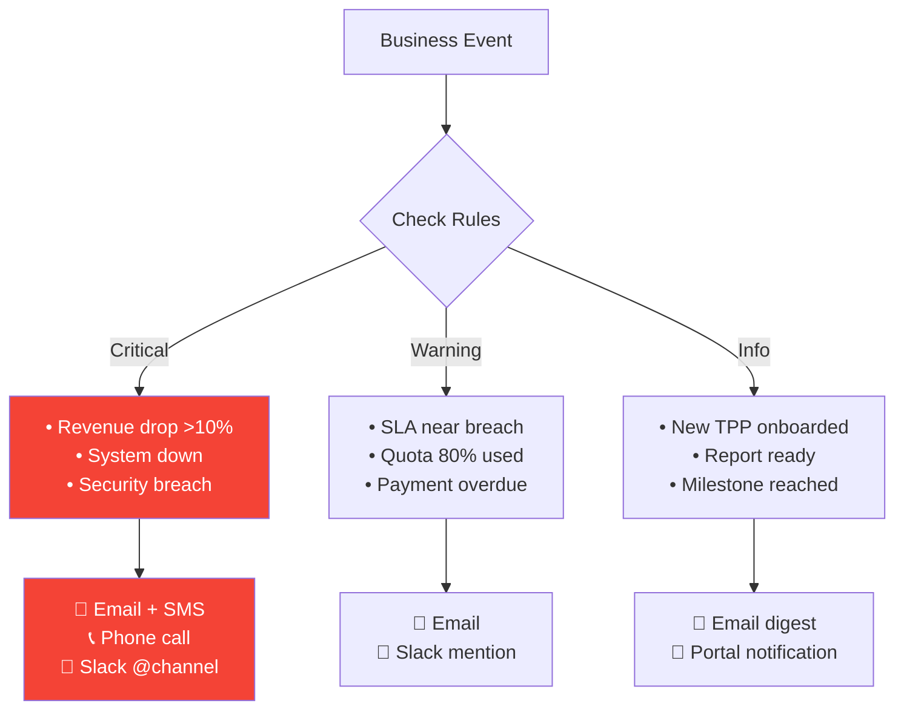
```mermaid
graph TB
    Event[Business Event]
    
    Event --> Check{Check Rules}
    
    Check -->|Critical| Critical[• Revenue drop >10%<br/>• System down<br/>• Security breach]
    Check -->|Warning| Warning[• SLA near breach<br/>• Quota 80% used<br/>• Payment overdue]
    Check -->|Info| Info[• New TPP onboarded<br/>• Report ready<br/>• Milestone reached]
    
    Critical --> Urgent[📧 Email + SMS<br/>📞 Phone call<br/>💬 Slack @channel]
    Warning --> Normal[📧 Email<br/>💬 Slack mention]
    Info --> Low[📧 Email digest<br/>📱 Portal notification]
    
    style Critical fill:#f44336,color:#fff
    style Urgent fill:#f44336,color:#fff
```

## Performance Optimization

### Report Generation Performance

**Optimization Techniques:**

1. **Pre-aggregation**: Tính toán trước dữ liệu tổng hợp hàng đêm
2. **Materialized Views**: Cache các query phức tạp
3. **Columnar Storage**: Parquet format cho analytical queries
4. **Partitioning**: Partition theo date và TPP_ID
5. **Incremental Updates**: Chỉ update dữ liệu mới

**Performance Targets:**
- Simple report (<1000 rows): <5 seconds
- Complex report (>10K rows): <30 seconds
- Large export (>100K rows): <3 minutes (async)

### Caching Strategy

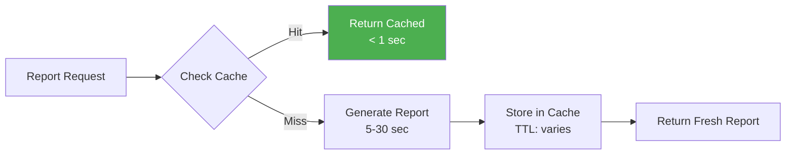
```mermaid
graph LR
    Request[Report Request]
    
    Request --> Cache{Check Cache}
    
    Cache -->|Hit| Return[Return Cached<br/>< 1 sec]
    Cache -->|Miss| Generate[Generate Report<br/>5-30 sec]
    
    Generate --> Store[Store in Cache<br/>TTL: varies]
    Store --> Return2[Return Fresh Report]
    
    style Return fill:#4caf50,color:#fff
```

**Cache TTL by Report Type:**
- Real-time dashboards: 30 seconds
- Daily reports: 24 hours
- Monthly reports: 7 days
- Annual reports: 30 days

## Integration with External Systems

### Data Export Formats

| Format | Use Case | Features |
|--------|----------|----------|
| **PDF** | Executive reports | Formatted, read-only, printable |
| **Excel** | Analyst reports | Editable, pivot tables, charts |
| **CSV** | Data integration | Simple, universal, lightweight |
| **JSON** | API consumption | Structured, programmable |
| **Parquet** | Big data | Columnar, compressed, efficient |
| **Power BI** | Interactive BI | Live connection, drill-down |

### SFTP Integration

```mermaid
sequenceDiagram
    participant ReportEngine
    participant SFTP as SFTP Server
    participant TPP
    
    Note over ReportEngine: Report generated
    ReportEngine->>ReportEngine: Encrypt file (PGP)
    ReportEngine->>SFTP: Upload to /reports/{TPP_ID}/
    
    Note over TPP: Automated polling (every hour)
    TPP->>SFTP: List new files
    SFTP-->>TPP: report_20251215.csv.pgp
    
    TPP->>SFTP: Download file
    SFTP-->>TPP: File transferred
    
    TPP->>TPP: Decrypt with private key
    TPP->>TPP: Process report
    
    TPP->>SFTP: Upload receipt_20251215.txt
```

## Cost Management

### Reporting Cost Optimization

**Current Costs (Monthly):**
- Data warehouse: $5,000
- Compute (report generation): $2,000
- Storage (report archive): $1,000
- Data transfer: $500
- **Total: $8,500/month**

**Optimization Actions:**
- Use S3 Glacier for old reports → Save $400/month
- Pre-aggregate common queries → Save $800/month
- Compress report files → Save $200/month
- **Potential savings: $1,400/month (16%)**

## Best Practices Summary

### ✅ Do's

- ✅ Automate repetitive reports
- ✅ Use visualization for complex data
- ✅ Provide drill-down capabilities
- ✅ Enable self-service for TPPs
- ✅ Version control reports
- ✅ Audit all access
- ✅ Encrypt sensitive data
- ✅ Test reports before distribution

### ❌ Don'ts

- ❌ Expose PII without masking
- ❌ Generate reports without caching
- ❌ Send reports to wrong recipients
- ❌ Use inconsistent formats
- ❌ Ignore data quality issues
- ❌ Overload email with large files
- ❌ Skip audit trail
- ❌ Forget to backup reports

## Tài Liệu Tham Khảo

- **Thông tư 64/2024/TT-NHNN** - Điều 15 (Báo cáo định kỳ cho NHNN)
- **ISO 20022** - Financial Reporting & Messaging Standards
- **GDPR** - Data Privacy in Reporting
- **Kimball Method** - Data Warehouse Design
- **Google SRE Book** - Monitoring & Alerting Best Practices
- **Power BI Best Practices** - Interactive Reporting

---

**Phiên bản:** 1.0  
**Ngày cập nhật:** 15/12/2025  
**Trạng thái:** Production Readyices
- Data Warehouse Design Patterns
- GDPR - Data Privacy in Reporting
