# Thương Mại Hóa API (Monetization & Billing)

## Tổng Quan

Hệ thống tính phí và thương mại hóa API, biến Open Banking API thành nguồn doanh thu mới cho ngân hàng.

## Kiến Trúc Billing System

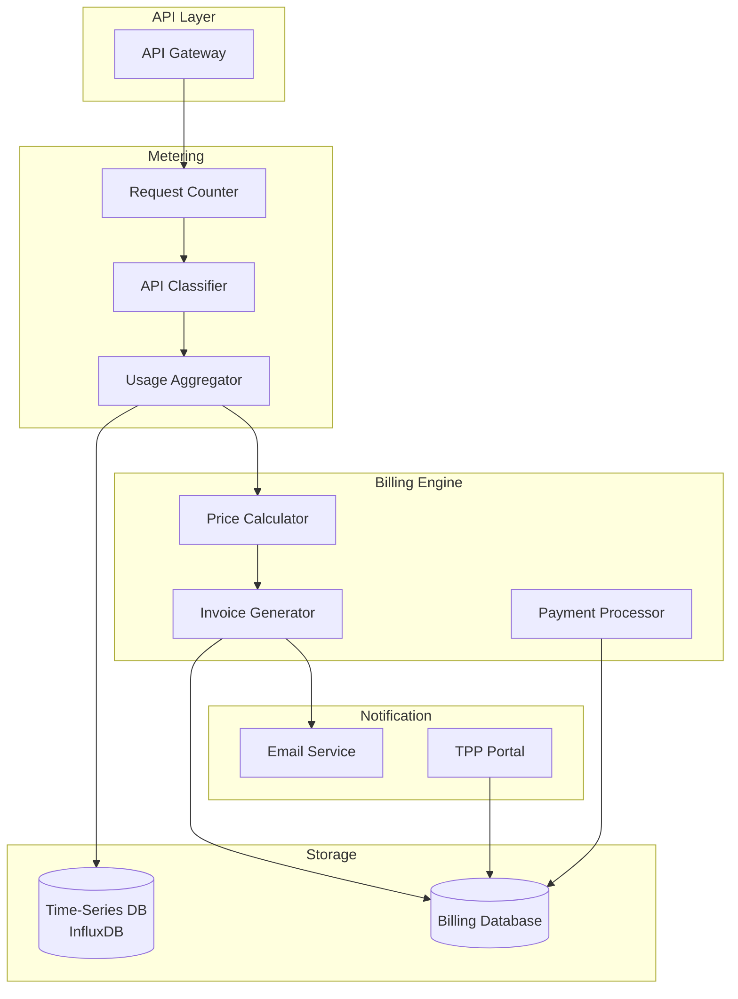

## Pricing Models

### 1. Pay-As-You-Go

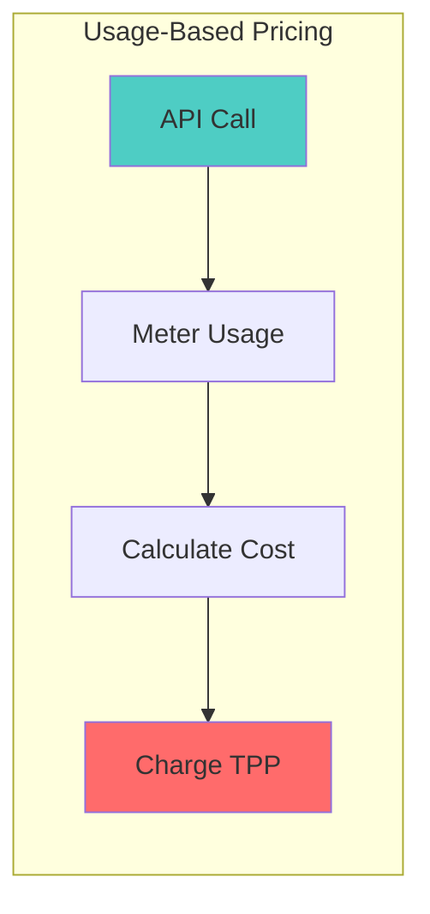

**Ví dụ:**
- eKYC API: 5,000 VND/request
- Face Matching: 3,000 VND/request
- NFC Verification: 10,000 VND/request

### 2. Subscription (Thuê Bao)

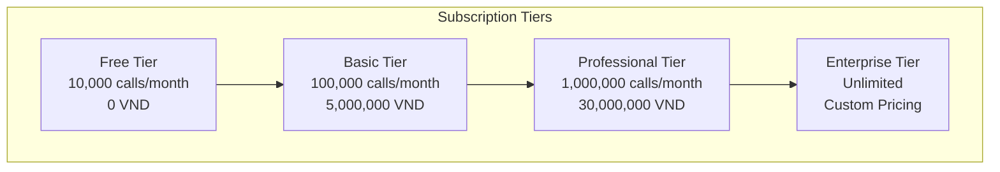

### 3. Revenue Share

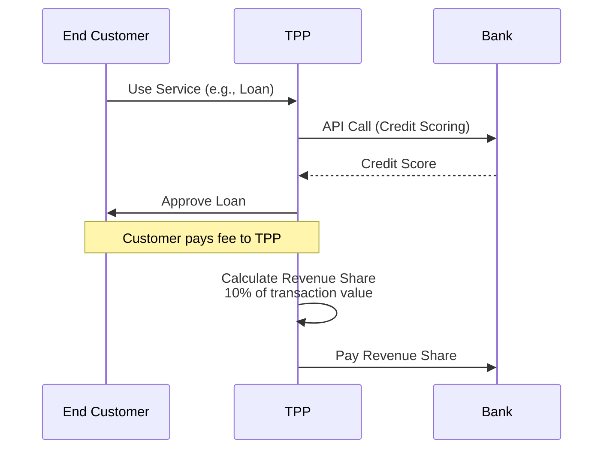

**Ví dụ:**
- Loan Origination: 10% của phí giao dịch
- Bill Payment: 0.5% của giá trị thanh toán
- Card Issuance: 50,000 VND/thẻ phát hành

### 4. Tiered Pricing

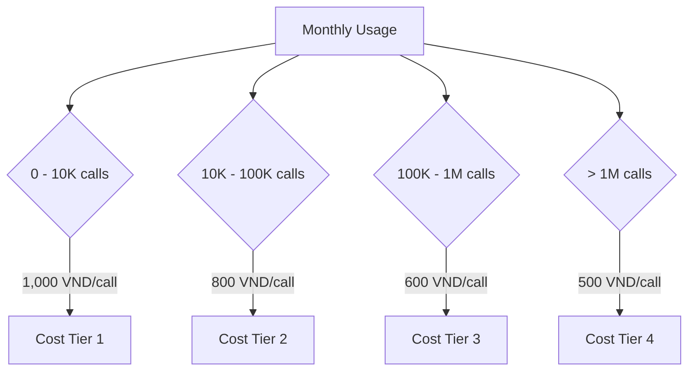

## Fee Schedule

### API Pricing Matrix

| API Category | API Endpoint | Pricing Model | Price |
|--------------|--------------|---------------|-------|
| **Basic APIs** | | | |
| Account Info | GET /accounts | Free | 0 VND |
| Balance Inquiry | GET /accounts/{id}/balances | Free | 0 VND |
| Transaction History | GET /accounts/{id}/transactions | Subscription | Included |
| **Premium APIs** | | | |
| eKYC | POST /ekyc/ocr | Pay-per-use | 5,000 VND |
| Face Matching | POST /ekyc/face-match | Pay-per-use | 3,000 VND |
| Liveness Detection | POST /ekyc/liveness | Pay-per-use | 4,000 VND |
| NFC Verification | POST /ekyc/nfc-verify | Pay-per-use | 10,000 VND |
| **Transaction APIs** | | | |
| Fund Transfer | POST /payments | Transaction fee | 1,100 - 5,500 VND |
| Bill Payment | POST /bill-payments | Revenue share | 0.5% of amount |
| **Card APIs** | | | |
| Card Issuance | POST /cards/issuance | Per card | 50,000 VND |
| Tokenization | POST /tokenization/provision | Per token | 10,000 VND |
| **Value-Added** | | | |
| Credit Scoring | POST /credit-score | Pay-per-use | 20,000 VND |
| Fraud Check | POST /fraud-check | Pay-per-use | 15,000 VND |

## Metering & Usage Tracking

### Real-time Metering

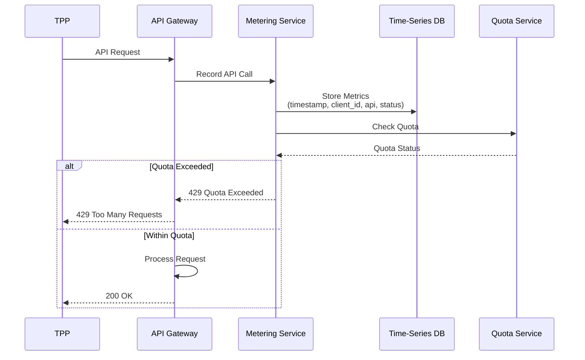

### Metrics Collected

```json
{
  "timestamp": "2024-12-10T18:00:00+07:00",
  "client_id": "tpp-12345",
  "api_endpoint": "/v1/ekyc/ocr",
  "http_method": "POST",
  "response_code": 200,
  "response_time_ms": 250,
  "request_size_bytes": 1024,
  "response_size_bytes": 512,
  "pricing_tier": "PREMIUM",
  "unit_price": 5000,
  "currency": "VND"
}
```

## Billing Cycle

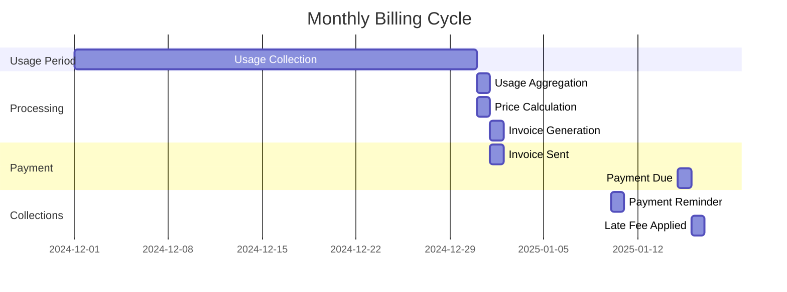

### Billing Process

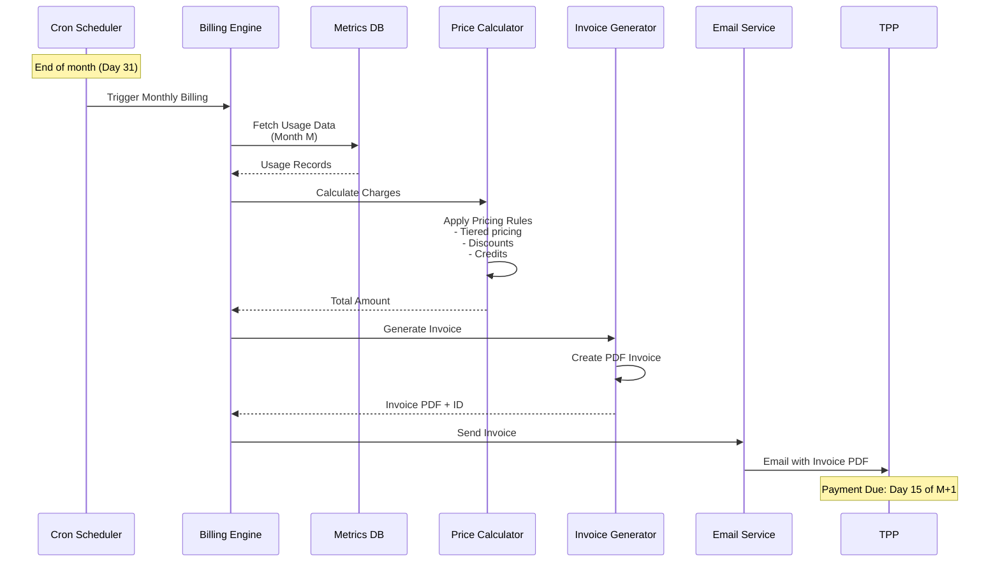

## Invoice Structure

### Invoice Example

```json
{
  "InvoiceId": "INV-2024-12-001",
  "InvoiceDate": "2025-01-01",
  "DueDate": "2025-01-15",
  "BillingPeriod": {
    "From": "2024-12-01",
    "To": "2024-12-31"
  },
  "BillTo": {
    "ClientId": "tpp-12345",
    "CompanyName": "Example Fintech Co., Ltd",
    "TaxId": "0123456789",
    "Address": "123 Nguyen Hue, Q.1, TP.HCM",
    "Email": "billing@example.com"
  },
  "LineItems": [
    {
      "Description": "eKYC OCR Service",
      "Quantity": 1250,
      "UnitPrice": 5000,
      "Amount": 6250000,
      "Currency": "VND"
    },
    {
      "Description": "Face Matching Service",
      "Quantity": 1250,
      "UnitPrice": 3000,
      "Amount": 3750000,
      "Currency": "VND"
    },
    {
      "Description": "NFC Verification Service",
      "Quantity": 500,
      "UnitPrice": 10000,
      "Amount": 5000000,
      "Currency": "VND"
    },
    {
      "Description": "Professional Subscription",
      "Quantity": 1,
      "UnitPrice": 30000000,
      "Amount": 30000000,
      "Currency": "VND"
    }
  ],
  "Subtotal": 45000000,
  "Discount": 2250000,
  "DiscountReason": "Volume discount (5%)",
  "Tax": 4275000,
  "TaxRate": 0.10,
  "Total": 47025000,
  "Currency": "VND",
  "PaymentTerms": "Net 15",
  "PaymentMethods": ["Bank Transfer", "Credit Card"]
}
```

## Payment Processing

### Payment Flow

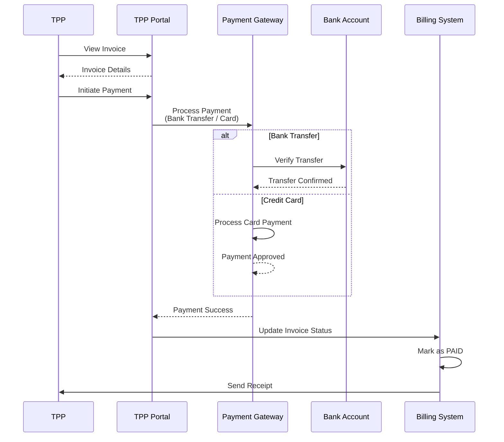

### Payment Methods

| Method | Processing Time | Fee | Auto-reconciliation |
|--------|-----------------|-----|---------------------|
| Bank Transfer | 1-2 business days | Free | Manual |
| Credit Card | Instant | 2.5% | Automatic |
| E-Wallet | Instant | 1.5% | Automatic |
| Direct Debit | 1 business day | Free | Automatic |

## Quota Management

### Quota Enforcement

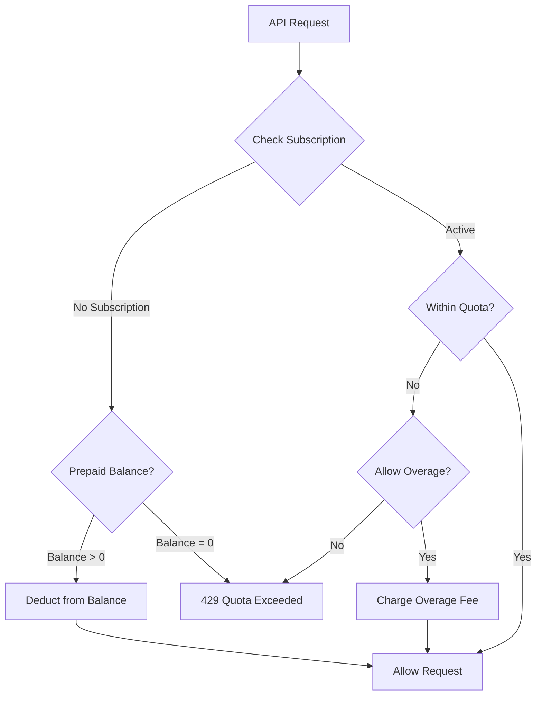

### Quota Types

| Quota Type | Description | Enforcement |
|------------|-------------|-------------|
| **Hard Quota** | Strict limit, requests blocked when exceeded | Immediate |
| **Soft Quota** | Warning issued, overage charges apply | Billing cycle end |
| **Burst Quota** | Short-term spike allowance | 1-minute window |
| **Daily Quota** | Resets every 24 hours | Daily |
| **Monthly Quota** | Resets every month | Monthly |

## Discounts & Promotions

### Discount Types

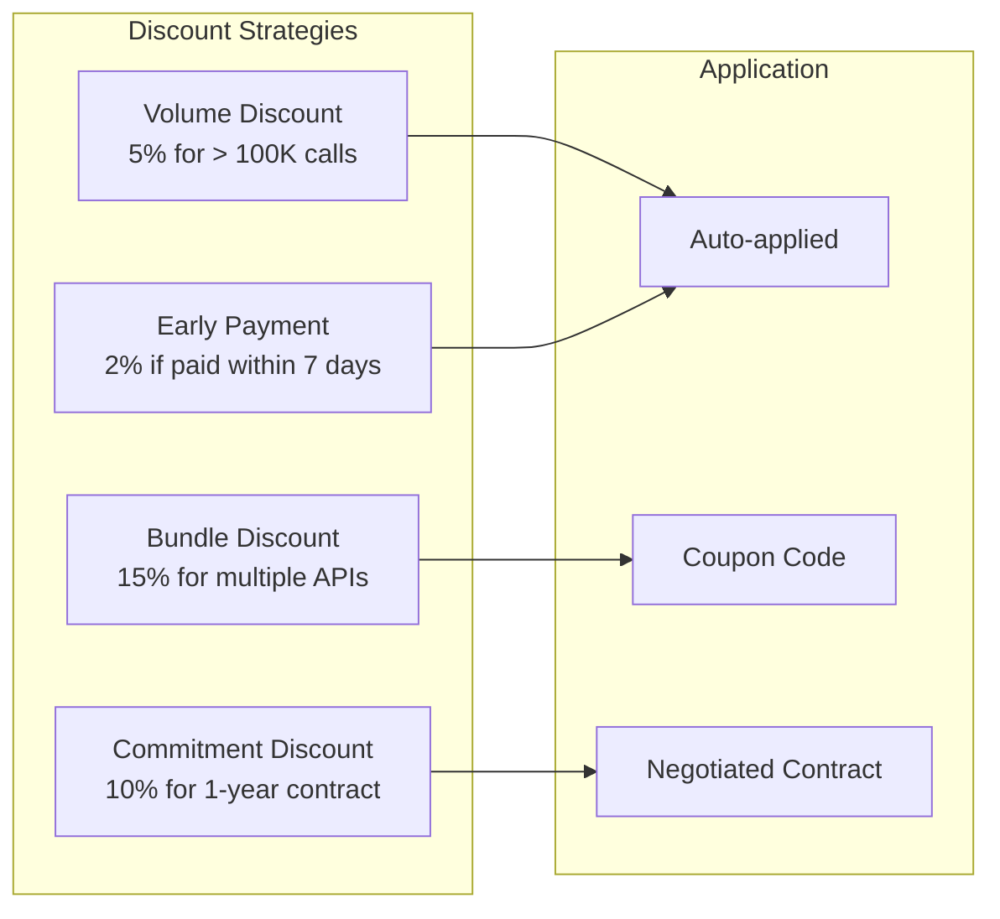

### Promotional Campaigns

```json
{
  "CampaignId": "PROMO-2024-Q4",
  "Name": "Year-End Promotion",
  "Description": "50% off eKYC services",
  "ValidFrom": "2024-12-01",
  "ValidTo": "2024-12-31",
  "DiscountType": "PERCENTAGE",
  "DiscountValue": 50,
  "ApplicableAPIs": [
    "/v1/ekyc/ocr",
    "/v1/ekyc/face-match",
    "/v1/ekyc/liveness"
  ],
  "EligibleClients": ["tpp-12345", "tpp-67890"],
  "MaxDiscount": 10000000,
  "Currency": "VND"
}
```

## TPP Portal - Billing Dashboard

### Dashboard Features

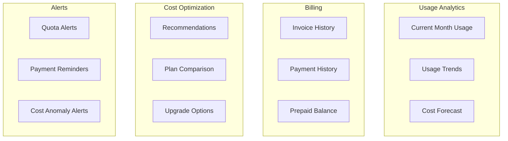

### Usage Dashboard API

#### GET /v1/billing/usage/current-month

**Response:**
```json
{
  "Data": {
    "BillingPeriod": {
      "From": "2024-12-01",
      "To": "2024-12-31"
    },
    "UsageSummary": {
      "TotalAPICalls": 125000,
      "ByCategory": {
        "eKYC": 50000,
        "Payments": 60000,
        "Cards": 10000,
        "Accounts": 5000
      }
    },
    "CostSummary": {
      "Subtotal": 45000000,
      "Discounts": -2250000,
      "Tax": 4275000,
      "EstimatedTotal": 47025000,
      "Currency": "VND"
    },
    "QuotaStatus": {
      "MonthlyQuota": 1000000,
      "Used": 125000,
      "Remaining": 875000,
      "PercentageUsed": 12.5
    },
    "TopAPIs": [
      {
        "Endpoint": "/v1/payments",
        "Calls": 60000,
        "Cost": 15000000
      },
      {
        "Endpoint": "/v1/ekyc/ocr",
        "Calls": 30000,
        "Cost": 15000000
      }
    ]
  }
}
```

## Cost Optimization Recommendations

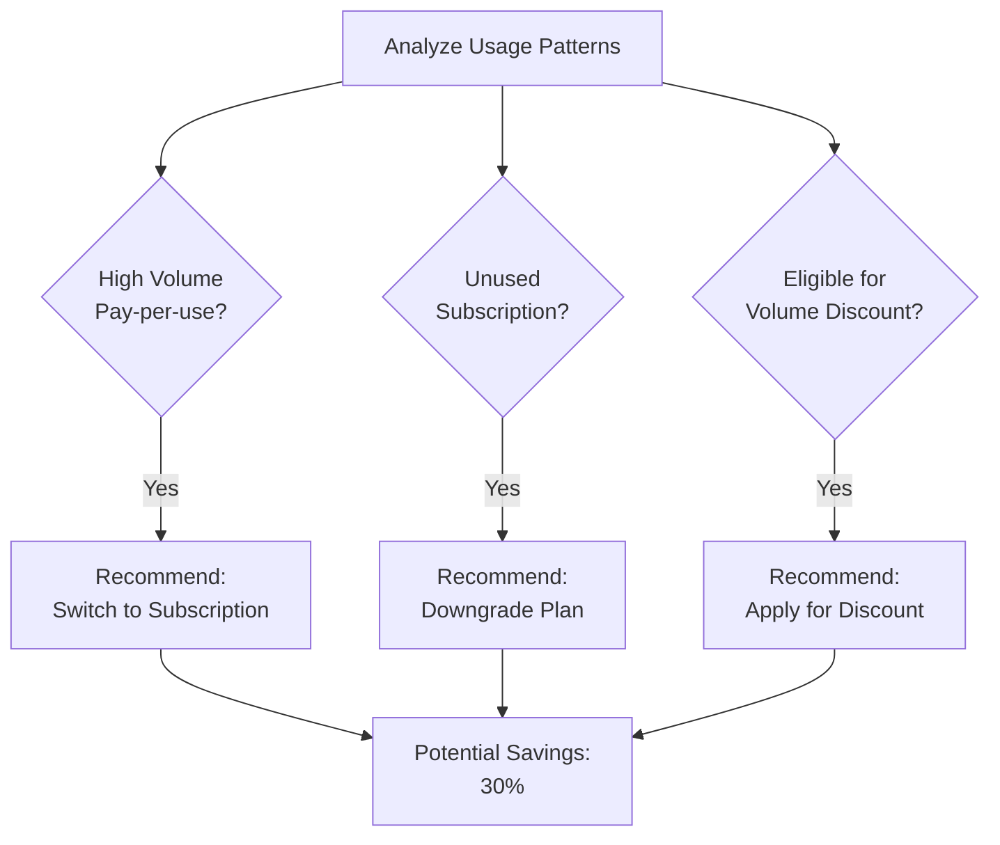

## Compliance & Taxation

### Tax Handling

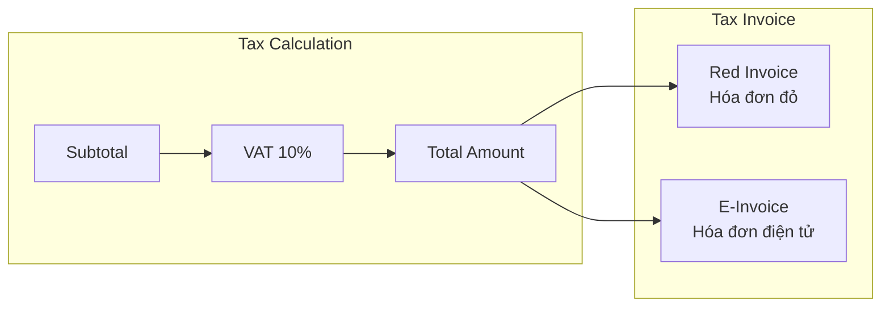

### Regulatory Compliance

- **Thông tư 64/2024**: Phí dịch vụ phải minh bạch và công khai
- **Luật Thuế GTGT**: VAT 10% áp dụng cho dịch vụ tài chính
- **Nghị định 123/2020**: Hóa đơn điện tử bắt buộc

## API Endpoints

### Billing APIs

| Endpoint | Method | Description |
|----------|--------|-------------|
| `/v1/billing/usage/current-month` | GET | Current month usage |
| `/v1/billing/usage/history` | GET | Historical usage data |
| `/v1/billing/invoices` | GET | List invoices |
| `/v1/billing/invoices/{id}` | GET | Invoice details |
| `/v1/billing/invoices/{id}/download` | GET | Download invoice PDF |
| `/v1/billing/payments` | POST | Submit payment |
| `/v1/billing/payments/{id}` | GET | Payment status |
| `/v1/billing/balance` | GET | Prepaid balance |
| `/v1/billing/balance/topup` | POST | Top-up prepaid balance |
| `/v1/billing/subscriptions` | GET | Current subscription |
| `/v1/billing/subscriptions/upgrade` | POST | Upgrade subscription |

## Tài Liệu Tham Khảo
- Thông tư 64/2024/TT-NHNN - Điều 14 (Phí dịch vụ)
- Stripe Billing Documentation
- AWS Pricing Models
- OpenAI API Pricing
- Azure API Management - Monetization
