# Thương Mại Hóa API (API Monetization & Billing)

> **Tuân thủ:** Thông tư 64/2024/TT-NHNN | ISO 20022 | Revenue Recognition Standards

## Tổng Quan

Hệ thống thương mại hóa API biến Open Banking API thành nguồn doanh thu bền vững cho ngân hàng thông qua các mô hình tính phí linh hoạt và minh bạch.

### Mục Tiêu

1. **Monetization**: Tạo doanh thu từ API
2. **Flexible Pricing**: Nhiều mô hình giá linh hoạt
3. **Usage Metering**: Đo lường chính xác việc sử dụng
4. **Billing Automation**: Tự động hóa thanh toán
5. **Revenue Analytics**: Phân tích doanh thu chi tiết

## Kiến Trúc Billing System

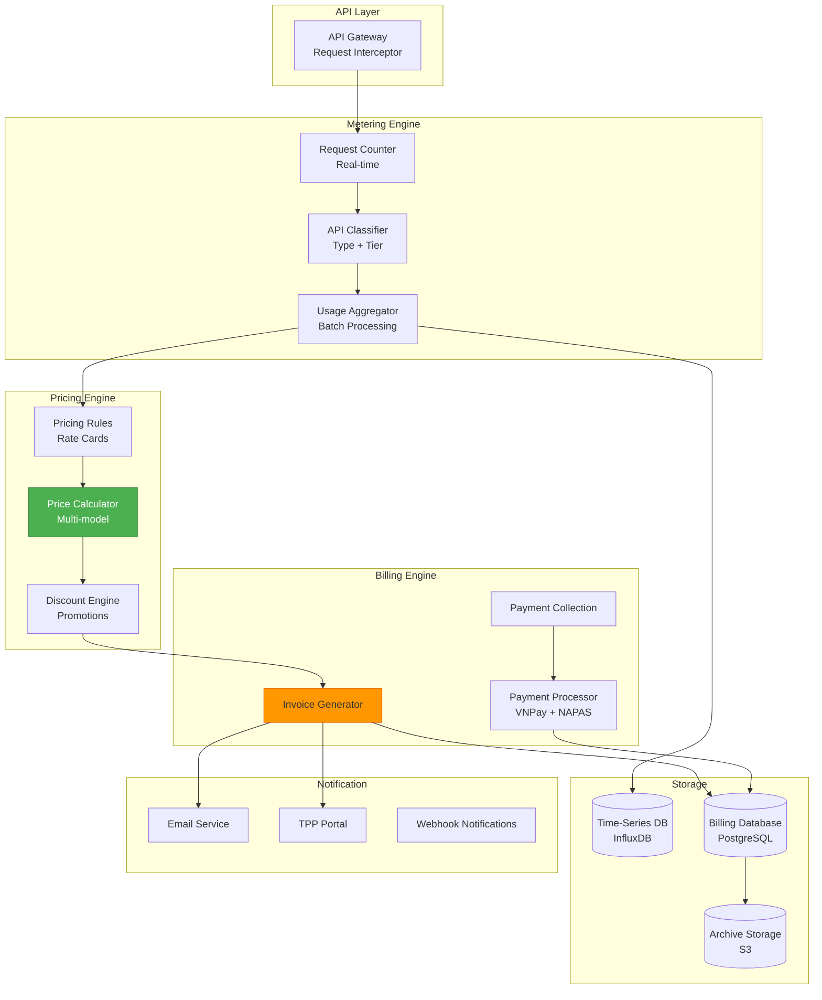

## Pricing Models

### 1. Subscription-Based (Gói Cước)

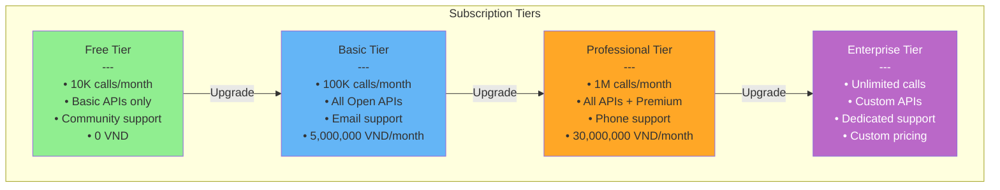

### 2. Pay-Per-Use (Trả Theo Lượt)

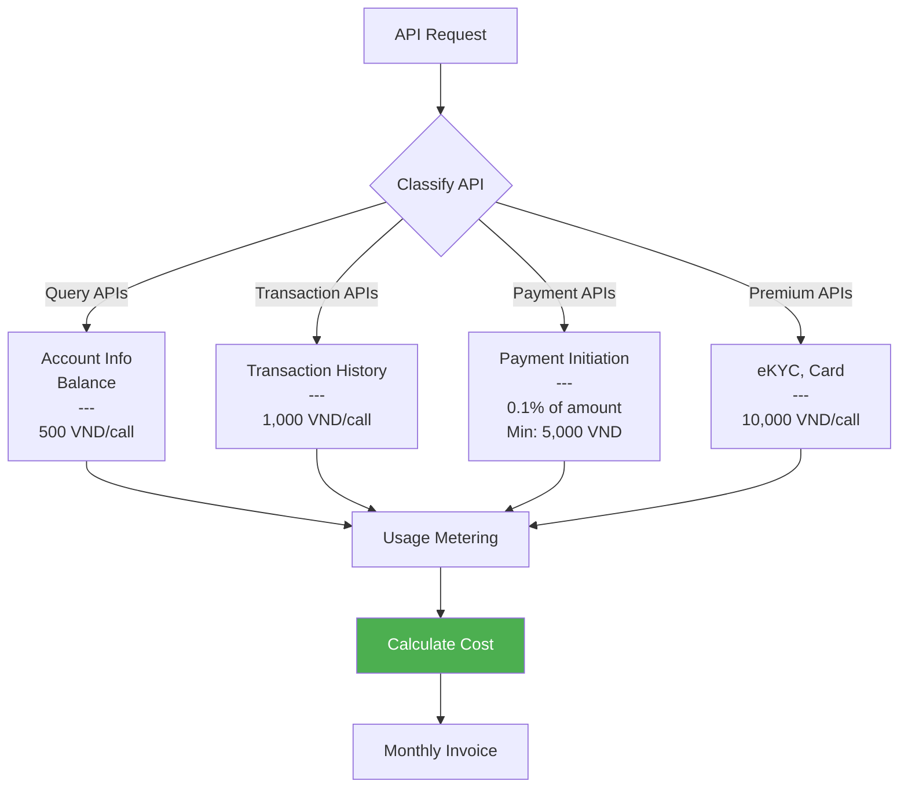

**Rate Card:**

| API Category | Pricing | Example |
|--------------|---------|---------|
| **Account Information** | 500 VND/call | GET /accounts |
| **Balance Inquiry** | 800 VND/call | GET /balances |
| **Transaction History** | 1,000 VND/call | GET /transactions |
| **Payment Initiation** | 0.1% of amount (min 5,000 VND) | POST /payments |
| **Card Issuance** | 50,000 VND/card | POST /cards/issue |
| **eKYC Verification** | 10,000 VND/verification | POST /ekyc/verify |
| **Face Matching** | 5,000 VND/match | POST /face/match |

### 3. Revenue Share (Chia Sẻ Doanh Thu)

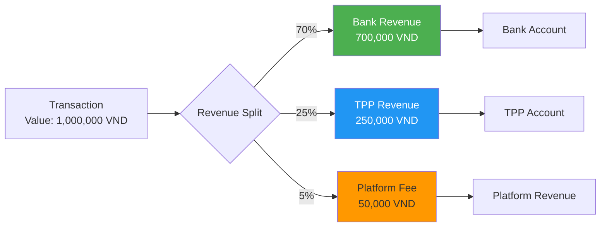

### 4. Hybrid Model (Kết Hợp)

**Base Subscription + Overage:**
- Base: 5,000,000 VND/month (100K calls included)
- Overage: 60 VND/call above quota

**Example Calculation:**
```
Monthly Usage: 150,000 calls
Base Fee: 5,000,000 VND (covers 100,000 calls)
Overage: 50,000 calls × 60 VND = 3,000,000 VND
Total: 8,000,000 VND
```

## Usage Metering

### Real-time Metering

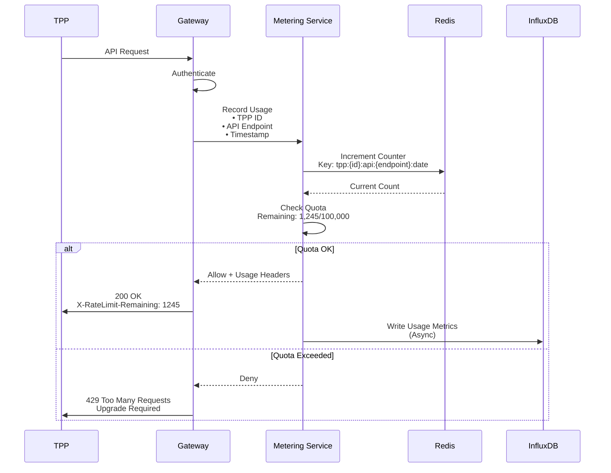

### Usage Analytics

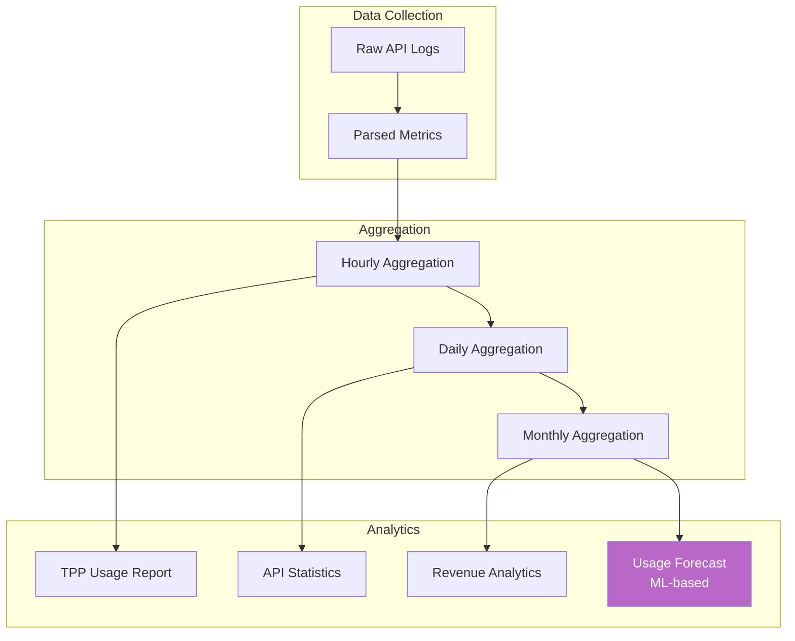

## Billing Cycle

### Monthly Billing Process

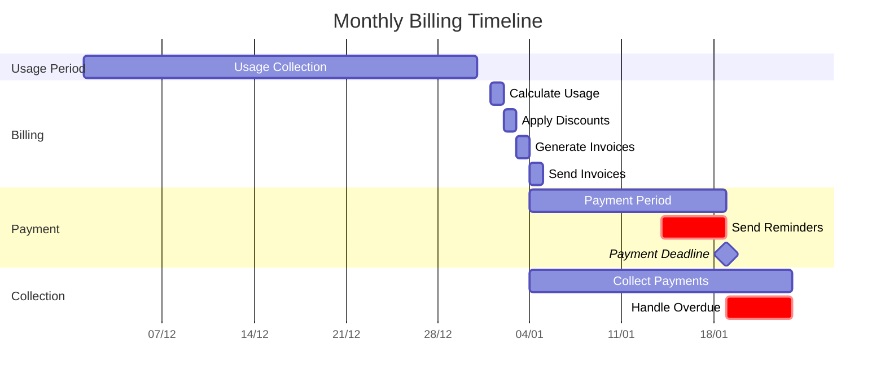

### Invoice Generation

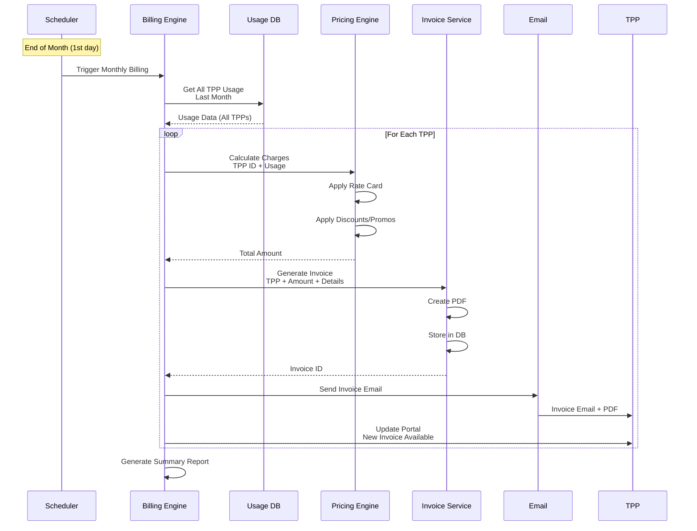

## Invoice Structure

**Invoice Example:**

```json
{
  "InvoiceId": "INV-202512-12345",
  "InvoiceNumber": "OB-2025-12-001",
  "TPP": {
    "TPPId": "tpp-12345",
    "TPPName": "FinTech Solutions Ltd",
    "TaxId": "0123456789",
    "BillingAddress": {
      "Street": "123 Nguyen Hue",
      "City": "Ho Chi Minh",
      "Country": "Vietnam"
    }
  },
  "BillingPeriod": {
    "Start": "2025-12-01",
    "End": "2025-12-31"
  },
  "IssuedDate": "2026-01-03",
  "DueDate": "2026-01-19",
  "Currency": "VND",
  "LineItems": [
    {
      "Description": "Professional Subscription",
      "Category": "Subscription",
      "Quantity": 1,
      "UnitPrice": "30000000",
      "Amount": "30000000"
    },
    {
      "Description": "API Calls - Account Information",
      "Category": "Usage",
      "Quantity": 125000,
      "UnitPrice": "500",
      "Amount": "62500000"
    },
    {
      "Description": "API Calls - Payment Initiation",
      "Category": "Usage",
      "Quantity": 5000,
      "TransactionValue": "5000000000",
      "Rate": "0.1%",
      "Amount": "5000000"
    },
    {
      "Description": "Volume Discount (>100K calls)",
      "Category": "Discount",
      "Amount": "-9750000"
    }
  ],
  "Summary": {
    "Subtotal": "97500000",
    "Discount": "-9750000",
    "TaxableAmount": "87750000",
    "VAT": "8775000",
    "Total": "96525000"
  },
  "PaymentInfo": {
    "BankName": "ABC Bank",
    "AccountNumber": "1234567890",
    "AccountName": "Open Banking Platform",
    "SwiftCode": "ABCVVNVX"
  },
  "Status": "Pending",
  "PdfUrl": "/invoices/INV-202512-12345.pdf"
}
```

## Payment Processing

### Payment Methods

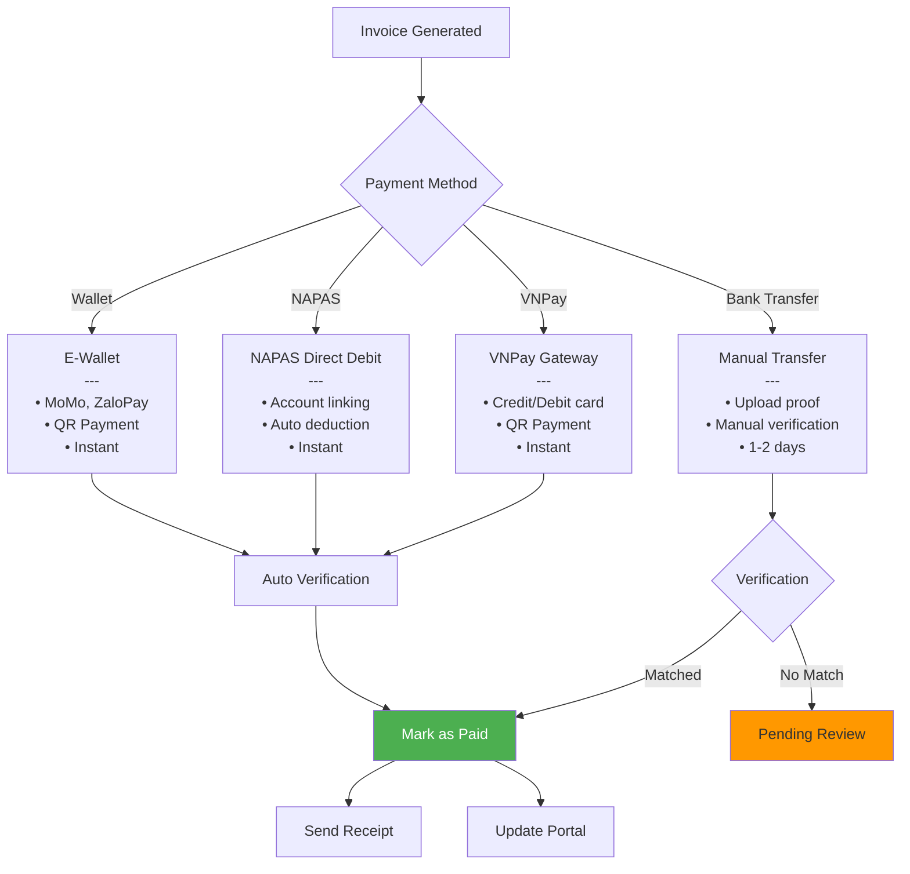

### Auto-Debit Flow

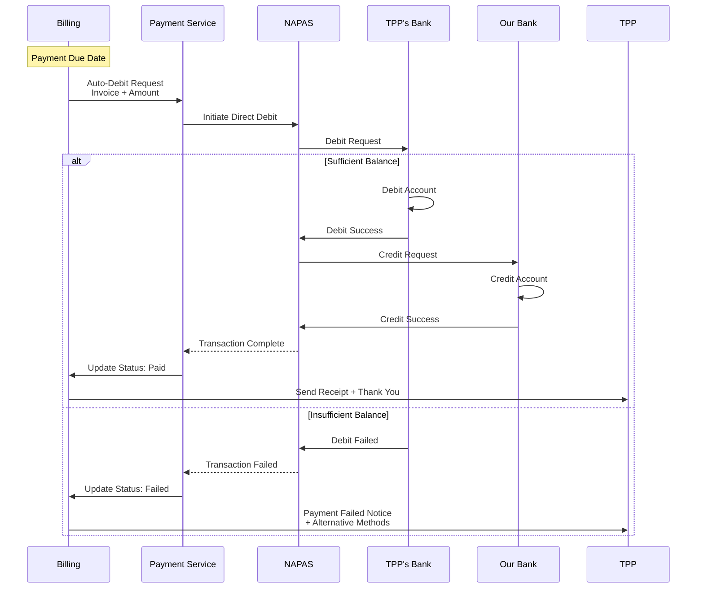

## Discount & Promotion Engine

### Discount Types

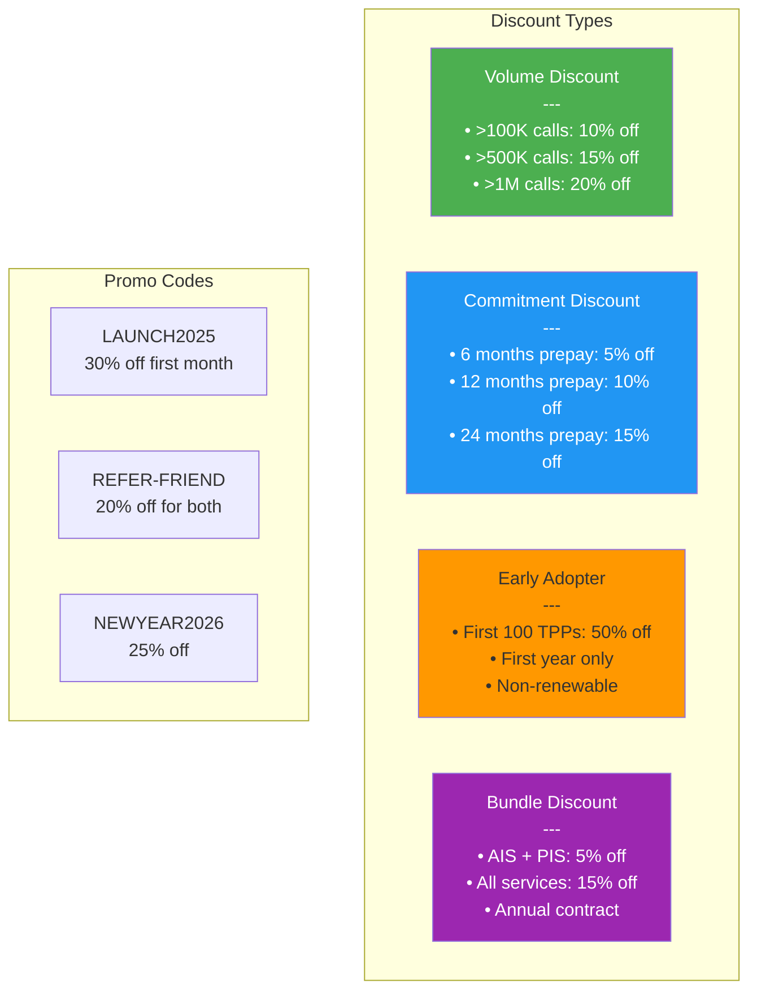

### Promo Code Application

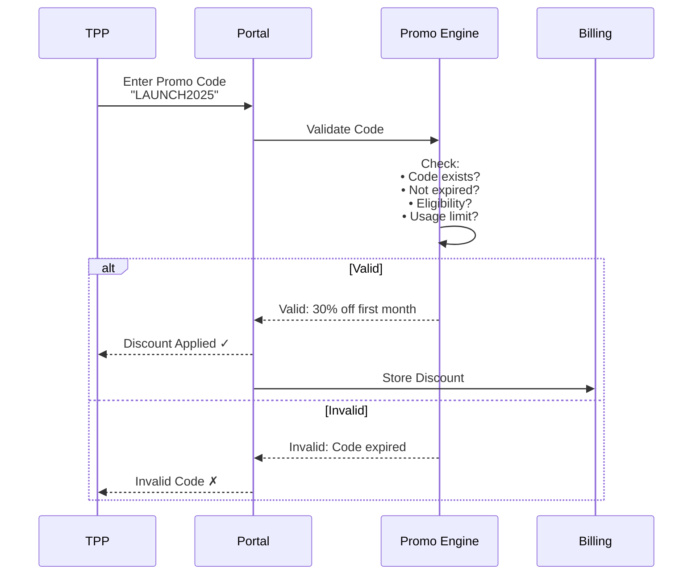

## Revenue Analytics

### Revenue Dashboard

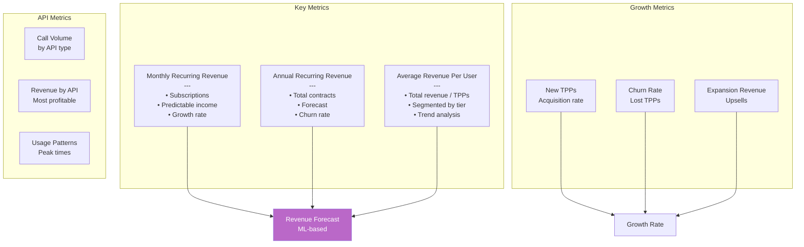

### Revenue Breakdown

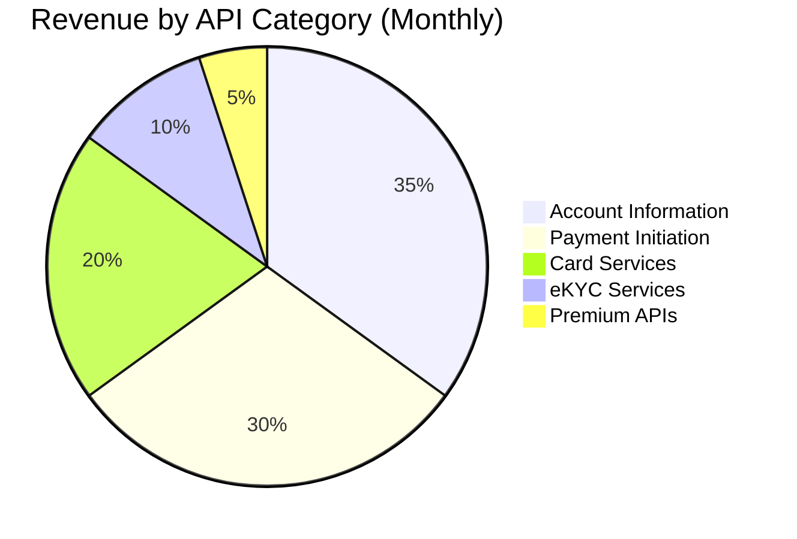

## Compliance & Tax

### VAT Handling

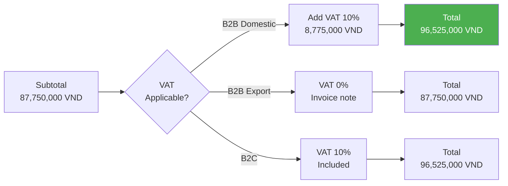

### Invoice Requirements (Vietnam)

**Red Invoice (Hóa Đơn Đỏ):**
- ✅ Tax code (Mã số thuế)
- ✅ Invoice number (Số hóa đơn)
- ✅ Invoice form (Ký hiệu mẫu số)
- ✅ Seller info (Thông tin người bán)
- ✅ Buyer info (Thông tin người mua)
- ✅ Item details (Chi tiết hàng hóa/dịch vụ)
- ✅ VAT breakdown (Thuế GTGT chi tiết)
- ✅ Digital signature (Chữ ký số)

## API Endpoints

### 1. Get Current Usage

#### GET /v1/billing/usage/current

```json
{
  "TPPId": "tpp-12345",
  "BillingPeriod": {
    "Start": "2025-12-01",
    "End": "2025-12-31"
  },
  "Subscription": {
    "Tier": "Professional",
    "IncludedCalls": 1000000,
    "Price": "30000000 VND"
  },
  "Usage": {
    "TotalCalls": 125000,
    "RemainingCalls": 875000,
    "OverageCallsUsage": 0,
    "PercentageUsed": 12.5
  },
  "EstimatedCost": {
    "Subscription": "30000000",
    "Usage": "0",
    "Discount": "0",
    "EstimatedTotal": "30000000",
    "Currency": "VND"
  }
}
```

### 2. Get Invoice List

#### GET /v1/billing/invoices

### 3. Download Invoice

#### GET /v1/billing/invoices/{InvoiceId}/pdf

### 4. Submit Payment Proof

#### POST /v1/billing/invoices/{InvoiceId}/payment

## Tài Liệu Tham Khảo

- **Thông tư 64/2024/TT-NHNN** - Open API Regulations
- **Luật Thuế GTGT 2008** - VAT Law
- **Nghị định 123/2020/NĐ-CP** - E-Invoice Regulations
- **ISO 20022** - Payment Messages

---

**Phiên bản:** 1.0  
**Ngày cập nhật:** 15/12/2025  
**Trạng thái:** Production Ready
