# Vận Hành & Yêu Cầu Phi Chức Năng (Operations & NFR)

## Tổng Quan

Tài liệu này mô tả các yêu cầu phi chức năng (Non-Functional Requirements) và quy trình vận hành hệ thống Open Banking.

## Yêu Cầu Hiệu Năng (Performance Requirements)

### Response Time Targets

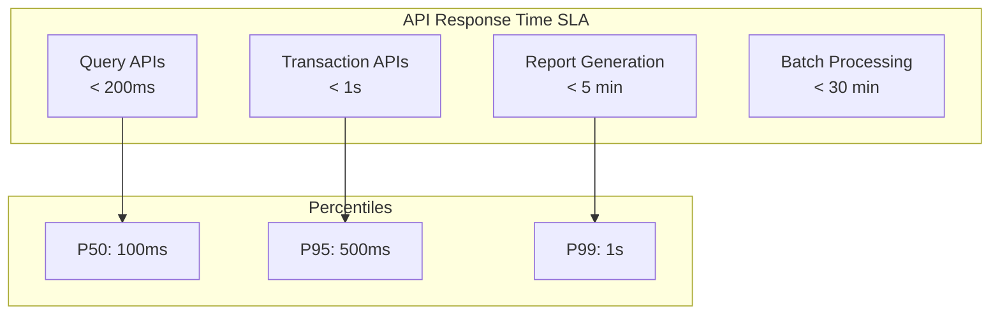
```mermaid
graph TB
    subgraph "API Response Time SLA"
        Query[Query APIs<br/>< 200ms]
        Transaction[Transaction APIs<br/>< 1s]
        Report[Report Generation<br/>< 5 min]
        Batch[Batch Processing<br/>< 30 min]
    end
    
    subgraph "Percentiles"
        P50[P50: 100ms]
        P95[P95: 500ms]
        P99[P99: 1s]
    end
    
    Query --> P50
    Transaction --> P95
    Report --> P99
```

### Performance Benchmarks

| API Category | P50 | P95 | P99 | Max |
|--------------|-----|-----|-----|-----|
| Account Info | 50ms | 150ms | 300ms | 500ms |
| Balance Inquiry | 80ms | 200ms | 400ms | 500ms |
| Transaction History | 100ms | 300ms | 600ms | 1s |
| Payment Initiation | 200ms | 800ms | 1.5s | 2s |
| eKYC OCR | 500ms | 1s | 2s | 3s |
| Face Matching | 300ms | 800ms | 1.5s | 2s |
| NFC Verification | 1s | 2s | 3s | 5s |

### Throughput Requirements

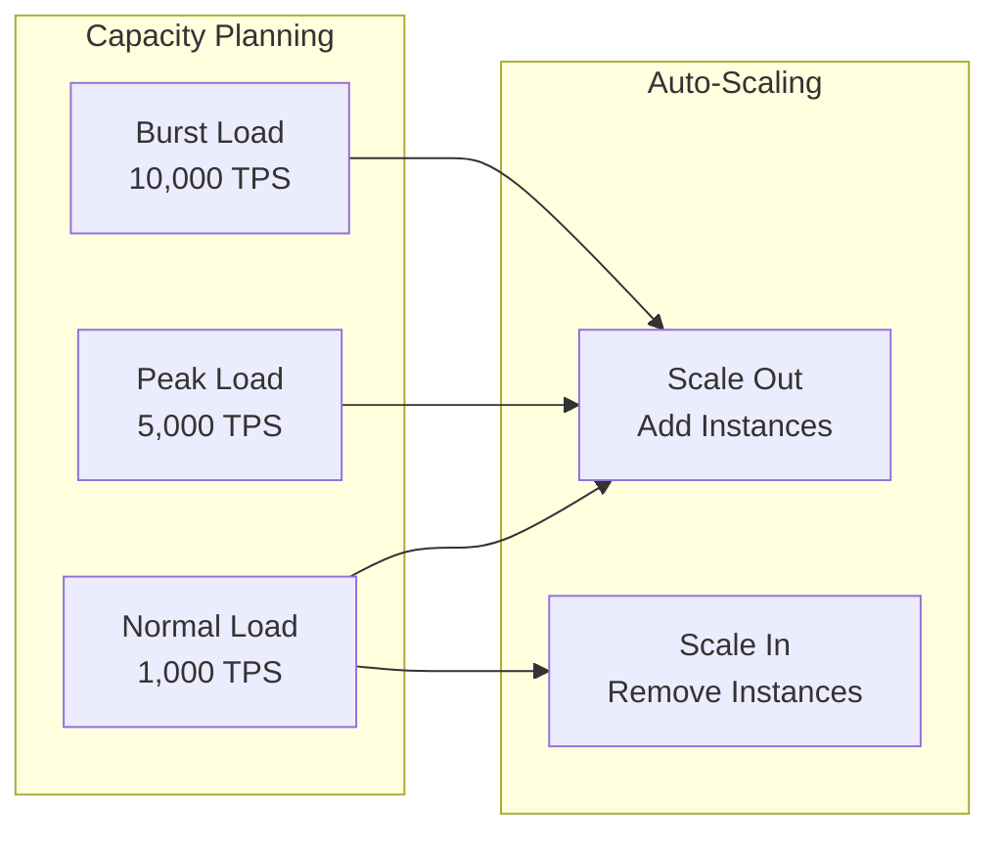
```mermaid
graph LR
    subgraph "Capacity Planning"
        Normal[Normal Load<br/>1,000 TPS]
        Peak[Peak Load<br/>5,000 TPS]
        Burst[Burst Load<br/>10,000 TPS]
    end
    
    subgraph "Auto-Scaling"
        Scale_Out[Scale Out<br/>Add Instances]
        Scale_In[Scale In<br/>Remove Instances]
    end
    
    Normal --> Scale_Out
    Peak --> Scale_Out
    Burst --> Scale_Out
    
    Normal --> Scale_In
```

**Capacity Targets:**
- Normal Operations: 1,000 TPS
- Peak Hours (9-11 AM, 7-9 PM): 5,000 TPS
- Flash Sales / Campaigns: 10,000 TPS
- Sustained Load: 24/7 operation

## Tính Sẵn Sàng (Availability)

### High Availability Architecture

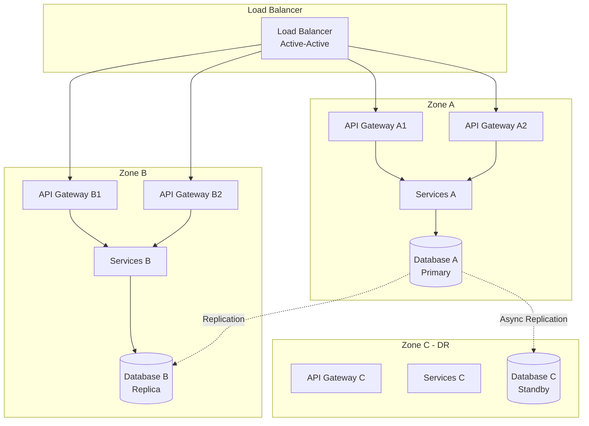
```mermaid
graph TB
    subgraph "Load Balancer"
        LB[Load Balancer<br/>Active-Active]
    end
    
    subgraph "Zone A"
        API_A1[API Gateway A1]
        API_A2[API Gateway A2]
        Service_A[Services A]
        DB_A[(Database A<br/>Primary)]
    end
    
    subgraph "Zone B"
        API_B1[API Gateway B1]
        API_B2[API Gateway B2]
        Service_B[Services B]
        DB_B[(Database B<br/>Replica)]
    end
    
    subgraph "Zone C - DR"
        API_C[API Gateway C]
        Service_C[Services C]
        DB_C[(Database C<br/>Standby)]
    end
    
    LB --> API_A1
    LB --> API_A2
    LB --> API_B1
    LB --> API_B2
    
    API_A1 --> Service_A
    API_A2 --> Service_A
    Service_A --> DB_A
    
    API_B1 --> Service_B
    API_B2 --> Service_B
    Service_B --> DB_B
    
    DB_A -.->|Replication| DB_B
    DB_A -.->|Async Replication| DB_C
```

### SLA Commitments

| Service Level | Uptime % | Downtime/Month | Downtime/Year |
|---------------|----------|----------------|---------------|
| **Gold** | 99.99% | 4.38 minutes | 52.6 minutes |
| **Silver** | 99.95% | 21.9 minutes | 4.38 hours |
| **Bronze** | 99.9% | 43.8 minutes | 8.77 hours |

**Target SLA: 99.99% (Gold)**

### Failover Strategy

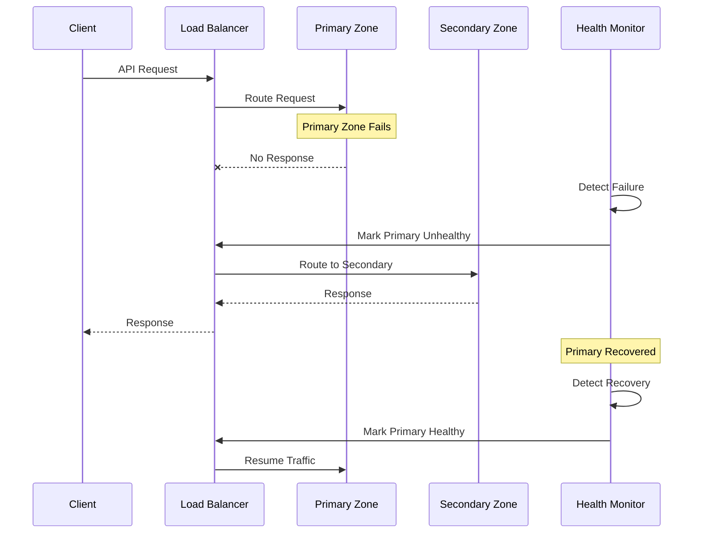
```mermaid
sequenceDiagram
    participant Client as Client
    participant LB as Load Balancer
    participant Primary as Primary Zone
    participant Secondary as Secondary Zone
    participant Monitor as Health Monitor
    
    Client->>LB: API Request
    LB->>Primary: Route Request
    
    Note over Primary: Primary Zone Fails
    
    Primary--xLB: No Response
    Monitor->>Monitor: Detect Failure
    Monitor->>LB: Mark Primary Unhealthy
    
    LB->>Secondary: Route to Secondary
    Secondary-->>LB: Response
    LB-->>Client: Response
    
    Note over Monitor: Primary Recovered
    
    Monitor->>Monitor: Detect Recovery
    Monitor->>LB: Mark Primary Healthy
    LB->>Primary: Resume Traffic
```

## Disaster Recovery (DR)

### RPO & RTO Targets

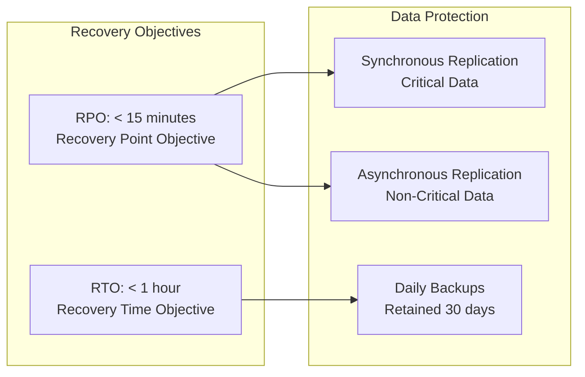
```mermaid
graph LR
    subgraph "Recovery Objectives"
        RPO[RPO: < 15 minutes<br/>Recovery Point Objective]
        RTO[RTO: < 1 hour<br/>Recovery Time Objective]
    end
    
    subgraph "Data Protection"
        Sync[Synchronous Replication<br/>Critical Data]
        Async[Asynchronous Replication<br/>Non-Critical Data]
        Backup[Daily Backups<br/>Retained 30 days]
    end
    
    RPO --> Sync
    RPO --> Async
    RTO --> Backup
```

### DR Procedures

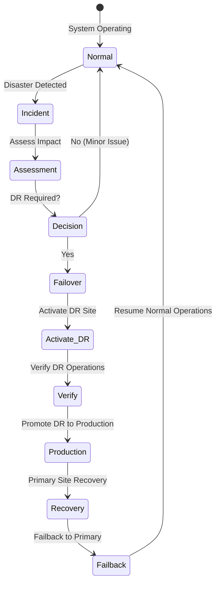
```mermaid
stateDiagram-v2
    [*] --> Normal: System Operating
    Normal --> Incident: Disaster Detected
    Incident --> Assessment: Assess Impact
    Assessment --> Decision: DR Required?
    
    Decision --> Failover: Yes
    Decision --> Normal: No (Minor Issue)
    
    Failover --> Activate_DR: Activate DR Site
    Activate_DR --> Verify: Verify DR Operations
    Verify --> Production: Promote DR to Production
    
    Production --> Recovery: Primary Site Recovery
    Recovery --> Failback: Failback to Primary
    Failback --> Normal: Resume Normal Operations
```

### Backup Strategy

| Data Type | Backup Frequency | Retention | Storage |
|-----------|------------------|-----------|---------|
| Transaction DB | Real-time replication | 30 days | Multi-region |
| Configuration | Daily | 90 days | S3 |
| Audit Logs | Hourly | 1 year | Glacier |
| Application Code | On commit | Indefinite | Git |
| Secrets/Keys | On change | 90 days | Vault |

## Scalability

### Horizontal Scaling

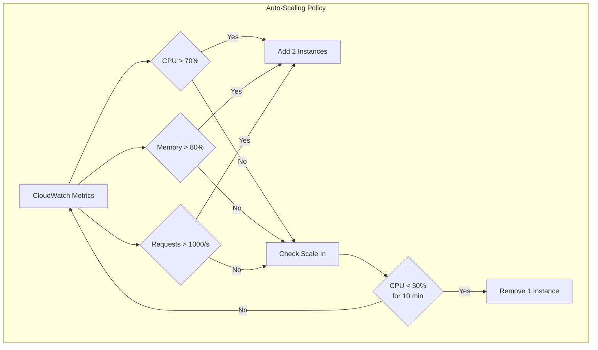
```mermaid
graph TB
    subgraph "Auto-Scaling Policy"
        Monitor[CloudWatch Metrics]
        
        Monitor --> CPU{CPU > 70%}
        Monitor --> Memory{Memory > 80%}
        Monitor --> Requests{Requests > 1000/s}
        
        CPU -->|Yes| ScaleOut[Add 2 Instances]
        Memory -->|Yes| ScaleOut
        Requests -->|Yes| ScaleOut
        
        CPU -->|No| Check[Check Scale In]
        Memory -->|No| Check
        Requests -->|No| Check
        
        Check --> Low{CPU < 30%<br/>for 10 min}
        Low -->|Yes| ScaleIn[Remove 1 Instance]
        Low -->|No| Monitor
    end
```

### Database Scaling

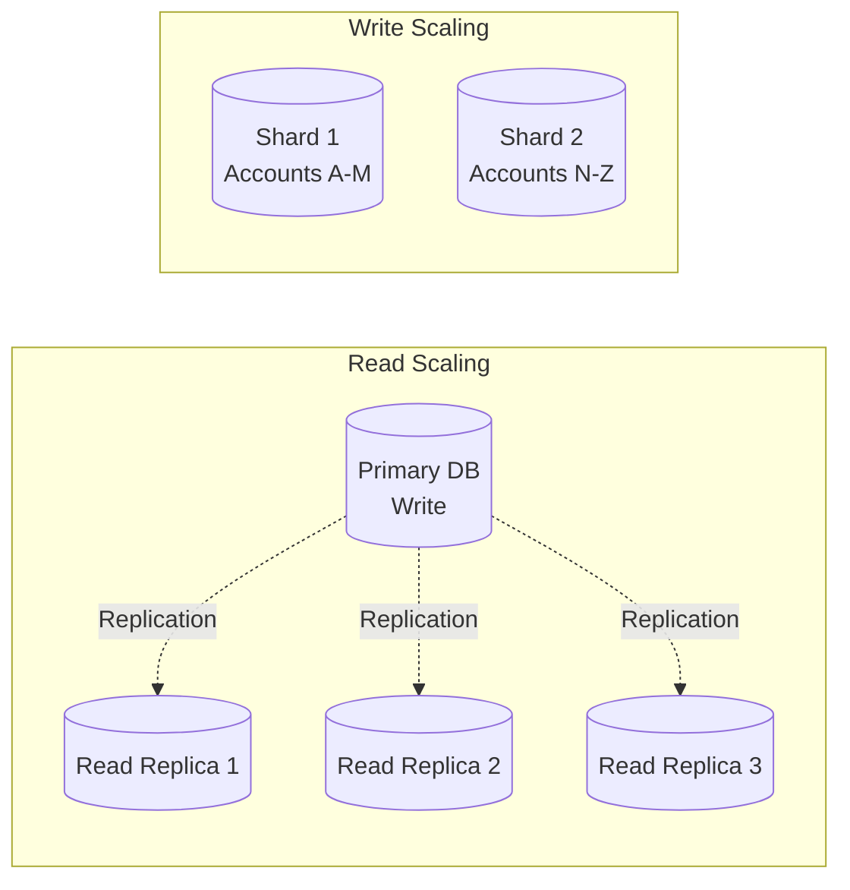
```mermaid
graph LR
    subgraph "Read Scaling"
        Primary[(Primary DB<br/>Write)]
        Replica1[(Read Replica 1)]
        Replica2[(Read Replica 2)]
        Replica3[(Read Replica 3)]
        
        Primary -.->|Replication| Replica1
        Primary -.->|Replication| Replica2
        Primary -.->|Replication| Replica3
    end
    
    subgraph "Write Scaling"
        Shard1[(Shard 1<br/>Accounts A-M)]
        Shard2[(Shard 2<br/>Accounts N-Z)]
    end
```

## Monitoring & Observability

### Monitoring Stack

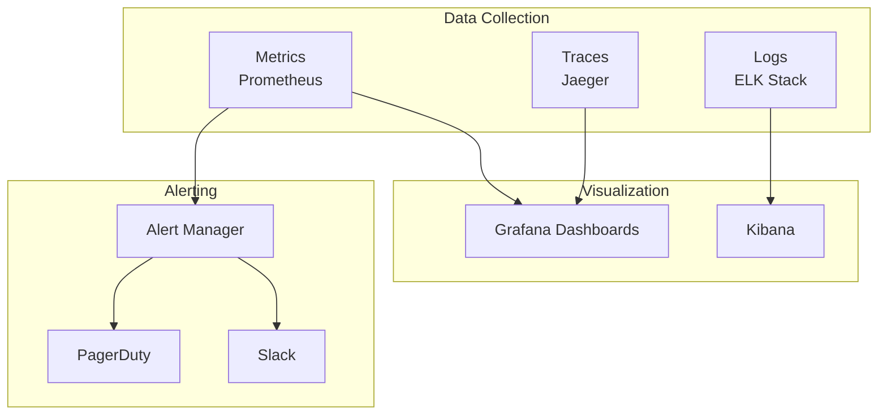
```mermaid
graph TB
    subgraph "Data Collection"
        Metrics[Metrics<br/>Prometheus]
        Logs[Logs<br/>ELK Stack]
        Traces[Traces<br/>Jaeger]
    end
    
    subgraph "Visualization"
        Grafana[Grafana Dashboards]
        Kibana[Kibana]
    end
    
    subgraph "Alerting"
        AlertManager[Alert Manager]
        PagerDuty[PagerDuty]
        Slack[Slack]
    end
    
    Metrics --> Grafana
    Logs --> Kibana
    Traces --> Grafana
    
    Metrics --> AlertManager
    AlertManager --> PagerDuty
    AlertManager --> Slack
```

### Key Metrics

#### Golden Signals

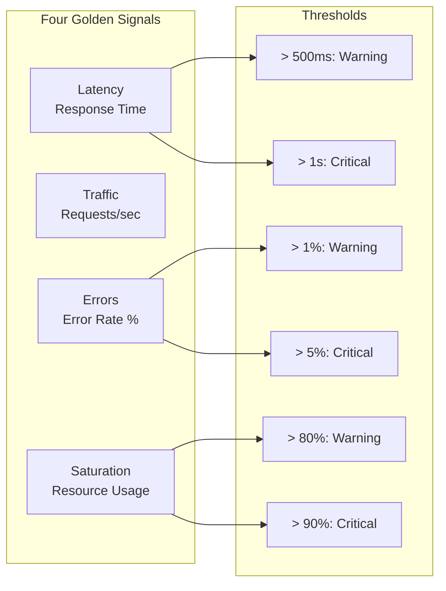
```mermaid
graph LR
    subgraph "Four Golden Signals"
        Latency[Latency<br/>Response Time]
        Traffic[Traffic<br/>Requests/sec]
        Errors[Errors<br/>Error Rate %]
        Saturation[Saturation<br/>Resource Usage]
    end
    
    subgraph "Thresholds"
        L_Warn[> 500ms: Warning]
        L_Crit[> 1s: Critical]
        
        E_Warn[> 1%: Warning]
        E_Crit[> 5%: Critical]
        
        S_Warn[> 80%: Warning]
        S_Crit[> 90%: Critical]
    end
    
    Latency --> L_Warn
    Latency --> L_Crit
    Errors --> E_Warn
    Errors --> E_Crit
    Saturation --> S_Warn
    Saturation --> S_Crit
```

#### Business Metrics

- **API Call Volume**: Calls per minute/hour/day
- **Success Rate**: % of successful API calls
- **Revenue**: Daily/Monthly revenue from APIs
- **Active TPPs**: Number of active TPP integrations
- **Transaction Value**: Total transaction value processed

### Alerting Rules

| Alert | Condition | Severity | Action |
|-------|-----------|----------|--------|
| High Error Rate | Error rate > 5% for 5 min | Critical | Page on-call engineer |
| Slow Response | P95 latency > 1s for 10 min | Warning | Investigate |
| Service Down | Health check fails 3 times | Critical | Immediate failover |
| High CPU | CPU > 90% for 5 min | Warning | Auto-scale |
| Disk Full | Disk usage > 85% | Warning | Clean up logs |
| Certificate Expiry | SSL cert expires in 7 days | Warning | Renew certificate |
| Quota Exceeded | TPP exceeds quota | Info | Notify TPP |
| Failed Payments | Payment failure > 10% | Critical | Investigate |

## Security Operations

### Security Monitoring

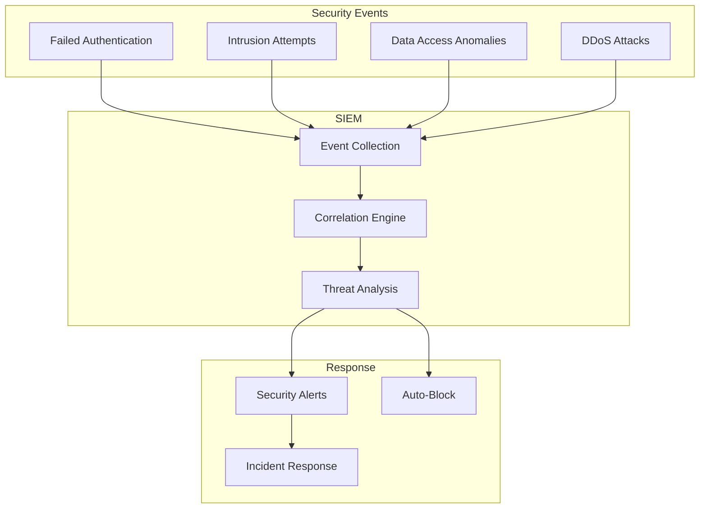
```mermaid
graph TB
    subgraph "Security Events"
        Auth[Failed Authentication]
        Intrusion[Intrusion Attempts]
        DataBreach[Data Access Anomalies]
        DDoS[DDoS Attacks]
    end
    
    subgraph "SIEM"
        Collect[Event Collection]
        Correlate[Correlation Engine]
        Analyze[Threat Analysis]
    end
    
    subgraph "Response"
        Alert[Security Alerts]
        Block[Auto-Block]
        Incident[Incident Response]
    end
    
    Auth --> Collect
    Intrusion --> Collect
    DataBreach --> Collect
    DDoS --> Collect
    
    Collect --> Correlate
    Correlate --> Analyze
    
    Analyze --> Alert
    Analyze --> Block
    Alert --> Incident
```

### Incident Response

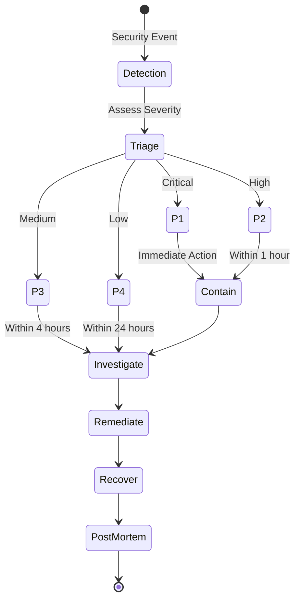
```mermaid
stateDiagram-v2
    [*] --> Detection: Security Event
    Detection --> Triage: Assess Severity
    
    Triage --> P1: Critical
    Triage --> P2: High
    Triage --> P3: Medium
    Triage --> P4: Low
    
    P1 --> Contain: Immediate Action
    P2 --> Contain: Within 1 hour
    P3 --> Investigate: Within 4 hours
    P4 --> Investigate: Within 24 hours
    
    Contain --> Investigate
    Investigate --> Remediate
    Remediate --> Recover
    Recover --> PostMortem
    PostMortem --> [*]
```

### Penetration Testing

- **Frequency**: Quarterly
- **Scope**: All public-facing APIs
- **Standards**: OWASP Top 10, SANS Top 25
- **Report**: Within 2 weeks of test completion

## Logging & Audit

### Log Levels

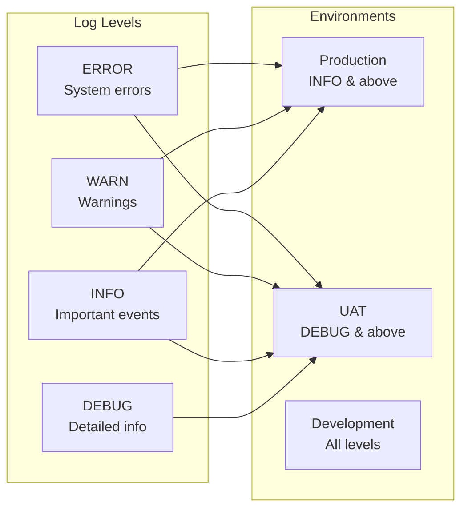
```mermaid
graph LR
    subgraph "Log Levels"
        ERROR[ERROR<br/>System errors]
        WARN[WARN<br/>Warnings]
        INFO[INFO<br/>Important events]
        DEBUG[DEBUG<br/>Detailed info]
    end
    
    subgraph "Environments"
        Prod[Production<br/>INFO & above]
        UAT[UAT<br/>DEBUG & above]
        Dev[Development<br/>All levels]
    end
    
    ERROR --> Prod
    WARN --> Prod
    INFO --> Prod
    
    ERROR --> UAT
    WARN --> UAT
    INFO --> UAT
    DEBUG --> UAT
```

### Audit Logging

**Required Fields:**
```json
{
  "timestamp": "2024-12-10T18:00:00+07:00",
  "event_type": "API_ACCESS",
  "user_id": "user-12345",
  "client_id": "tpp-67890",
  "ip_address": "203.162.xxx.xxx",
  "endpoint": "/v1/accounts/acc-123/balances",
  "method": "GET",
  "status_code": 200,
  "response_time_ms": 125,
  "request_id": "req-abc123",
  "session_id": "sess-xyz789"
}
```

**Retention:**
- Hot storage (Elasticsearch): 3 months
- Cold storage (S3): 1 year
- Archive (Glacier): 5 years

## Deployment Strategy

### CI/CD Pipeline

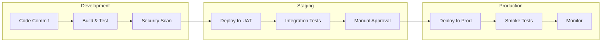
```mermaid
graph LR
    subgraph "Development"
        Code[Code Commit]
        Build[Build & Test]
        Scan[Security Scan]
    end
    
    subgraph "Staging"
        Deploy_UAT[Deploy to UAT]
        Test_UAT[Integration Tests]
        Approve[Manual Approval]
    end
    
    subgraph "Production"
        Deploy_Prod[Deploy to Prod]
        Smoke[Smoke Tests]
        Monitor[Monitor]
    end
    
    Code --> Build
    Build --> Scan
    Scan --> Deploy_UAT
    Deploy_UAT --> Test_UAT
    Test_UAT --> Approve
    Approve --> Deploy_Prod
    Deploy_Prod --> Smoke
    Smoke --> Monitor
```

### Blue-Green Deployment

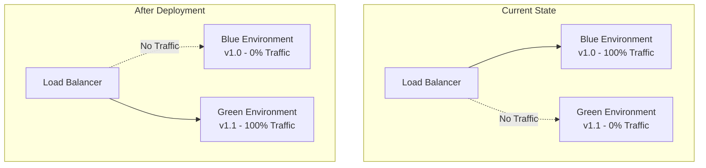
```mermaid
graph TB
    subgraph "Current State"
        LB1[Load Balancer]
        Blue[Blue Environment<br/>v1.0 - 100% Traffic]
        Green[Green Environment<br/>v1.1 - 0% Traffic]
    end
    
    LB1 --> Blue
    LB1 -.->|No Traffic| Green
    
    subgraph "After Deployment"
        LB2[Load Balancer]
        Blue2[Blue Environment<br/>v1.0 - 0% Traffic]
        Green2[Green Environment<br/>v1.1 - 100% Traffic]
    end
    
    LB2 -.->|No Traffic| Blue2
    LB2 --> Green2
```

### Canary Deployment

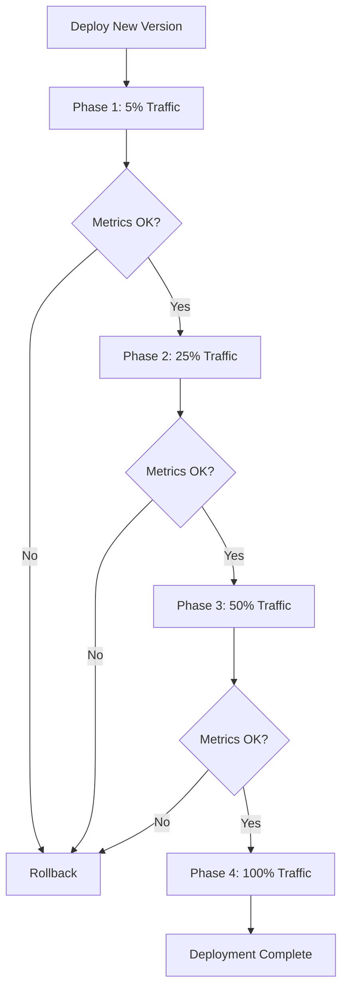
```mermaid
graph TB
    Start[Deploy New Version]
    
    Start --> Phase1[Phase 1: 5% Traffic]
    Phase1 --> Check1{Metrics OK?}
    Check1 -->|No| Rollback[Rollback]
    Check1 -->|Yes| Phase2[Phase 2: 25% Traffic]
    
    Phase2 --> Check2{Metrics OK?}
    Check2 -->|No| Rollback
    Check2 -->|Yes| Phase3[Phase 3: 50% Traffic]
    
    Phase3 --> Check3{Metrics OK?}
    Check3 -->|No| Rollback
    Check3 -->|Yes| Phase4[Phase 4: 100% Traffic]
    
    Phase4 --> Complete[Deployment Complete]
```

## Capacity Planning

### Resource Forecasting

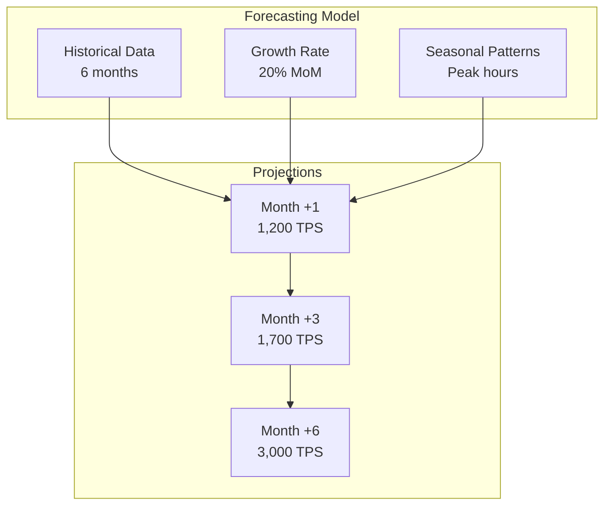
```mermaid
graph TB
    subgraph "Forecasting Model"
        Historical[Historical Data<br/>6 months]
        Growth[Growth Rate<br/>20% MoM]
        Seasonal[Seasonal Patterns<br/>Peak hours]
    end
    
    subgraph "Projections"
        Month1[Month +1<br/>1,200 TPS]
        Month3[Month +3<br/>1,700 TPS]
        Month6[Month +6<br/>3,000 TPS]
    end
    
    Historical --> Month1
    Growth --> Month1
    Seasonal --> Month1
    
    Month1 --> Month3
    Month3 --> Month6
```

### Cost Optimization

| Resource | Current | Optimized | Savings |
|----------|---------|-----------|---------|
| Compute | 50 instances | 40 instances (right-sizing) | 20% |
| Database | 10 TB | 8 TB (archiving old data) | 20% |
| Storage | 100 TB | 70 TB (compression) | 30% |
| Network | 50 TB/month | 40 TB/month (caching) | 20% |

## Compliance & Governance

### Compliance Framework

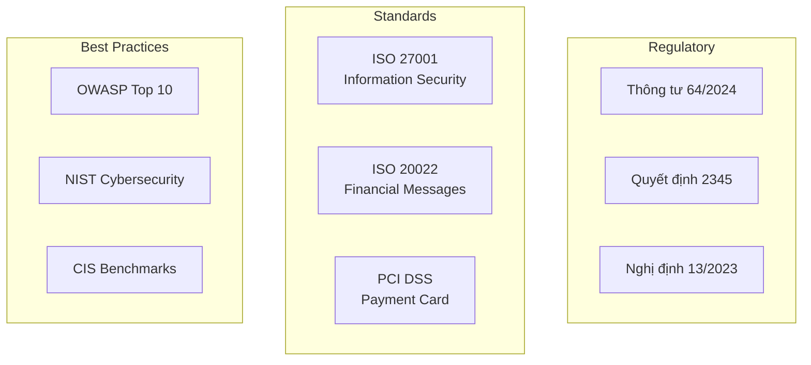
```mermaid
graph TB
    subgraph "Regulatory"
        TT64[Thông tư 64/2024]
        QD2345[Quyết định 2345]
        ND13[Nghị định 13/2023]
    end
    
    subgraph "Standards"
        ISO27001[ISO 27001<br/>Information Security]
        ISO20022[ISO 20022<br/>Financial Messages]
        PCI_DSS[PCI DSS<br/>Payment Card]
    end
    
    subgraph "Best Practices"
        OWASP[OWASP Top 10]
        NIST[NIST Cybersecurity]
        CIS[CIS Benchmarks]
    end
```

### Audit Schedule

| Audit Type | Frequency | Scope |
|------------|-----------|-------|
| Internal Security Audit | Monthly | All systems |
| External Security Audit | Quarterly | Public APIs |
| Compliance Audit | Annually | Full system |
| Penetration Testing | Quarterly | External-facing |
| Code Review | Per release | All code changes |
| Access Review | Monthly | User permissions |

## Documentation

### Documentation Types

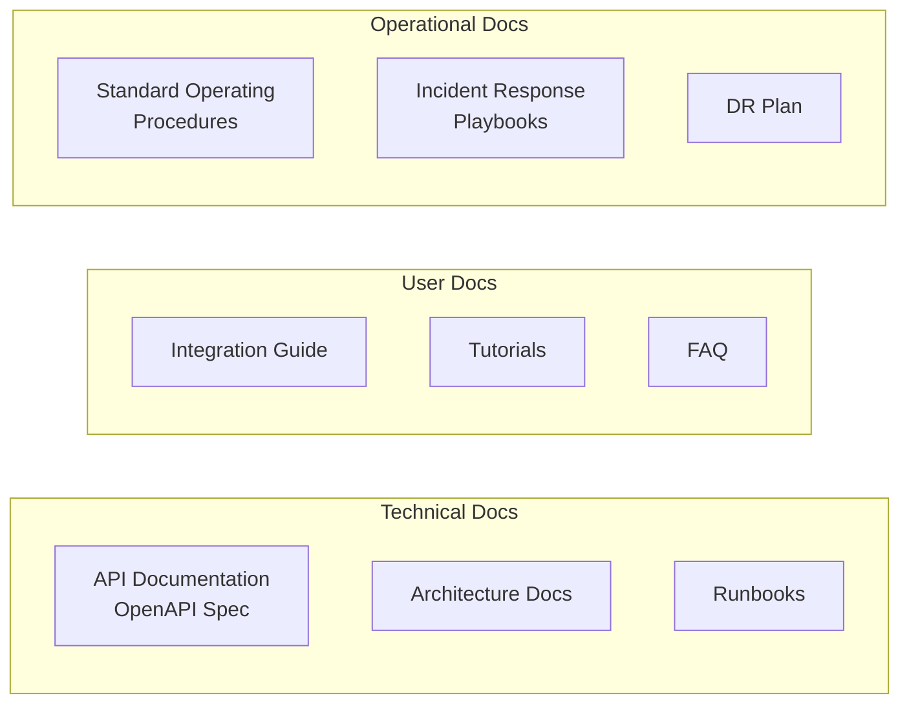
```mermaid
graph LR
    subgraph "Technical Docs"
        API[API Documentation<br/>OpenAPI Spec]
        Arch[Architecture Docs]
        Runbook[Runbooks]
    end
    
    subgraph "User Docs"
        Guide[Integration Guide]
        Tutorial[Tutorials]
        FAQ[FAQ]
    end
    
    subgraph "Operational Docs"
        SOP[Standard Operating<br/>Procedures]
        Incident[Incident Response<br/>Playbooks]
        DR_Plan[DR Plan]
    end
```

### Documentation Standards

- **Format**: Markdown for version control
- **Location**: Git repository
- **Review**: Quarterly review and update
- **Versioning**: Semantic versioning
- **Language**: Vietnamese & English

## Change Management

### Change Process

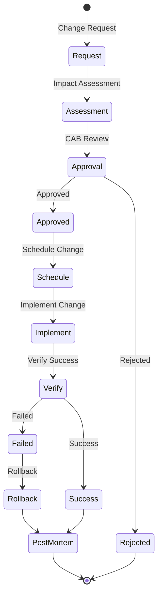
```mermaid
stateDiagram-v2
    [*] --> Request: Change Request
    Request --> Assessment: Impact Assessment
    Assessment --> Approval: CAB Review
    
    Approval --> Approved: Approved
    Approval --> Rejected: Rejected
    
    Approved --> Schedule: Schedule Change
    Schedule --> Implement: Implement Change
    Implement --> Verify: Verify Success
    
    Verify --> Success: Success
    Verify --> Failed: Failed
    
    Failed --> Rollback: Rollback
    Rollback --> PostMortem
    Success --> PostMortem
    
    PostMortem --> [*]
    Rejected --> [*]
```

### Change Categories

| Category | Approval | Testing | Rollback Plan |
|----------|----------|---------|---------------|
| **Emergency** | CTO | Minimal | Required |
| **Standard** | CAB | Full | Required |
| **Minor** | Team Lead | Automated | Optional |
| **Pre-approved** | None | Automated | Optional |

## SLA Reporting

### Monthly SLA Report

```mermaid
graph TB
    subgraph "Metrics"
        Uptime[Uptime %]
        Latency[Avg Latency]
        Errors[Error Rate]
        Incidents[Incident Count]
    end
    
    subgraph "Analysis"
        Trend[Trend Analysis]
        RootCause[Root Cause]
        Action[Action Items]
    end
    
    subgraph "Stakeholders"
        TPP[TPP Partners]
        Management[Management]
        Regulators[Regulators]
    end
    
    Uptime --> Trend
    Latency --> Trend
    Errors --> RootCause
    Incidents --> RootCause
    
    Trend --> Action
    RootCause --> Action
    
    Action --> TPP
    Action --> Management
    Action --> Regulators
```

## Tài Liệu Tham Khảo
- Thông tư 64/2024/TT-NHNN
- ISO/IEC 27001:2013 - Information Security Management
- NIST Cybersecurity Framework
- Site Reliability Engineering (Google)
- AWS Well-Architected Framework
- The Twelve-Factor App
- ITIL v4 - IT Service Management
