# ISO 27001:2022 Documentation Structure - Visual Guide

> **Cấu trúc mới:** Aligned với ISO 27001:2022 Annex A (93 controls)

## 📊 Structure Overview

```mermaid
graph TB
    Root[Open Banking Documentation]
    
    Root --> ISMS[00-ISMS-Management<br/>📋 ISMS Core]
    Root --> Org[01-Organizational-Controls<br/>🏢 A.5.x - 37 controls]
    Root --> People[02-People-Controls<br/>👥 A.6.x - 8 controls]
    Root --> Physical[03-Physical-Controls<br/>🏗️ A.7.x - 14 controls]
    Root --> Tech[04-Technological-Controls<br/>💻 A.8.x - 34 controls]
    Root --> Arch[05-Architecture-Design<br/>🏛️ Technical Architecture]
    Root --> API[06-API-Management<br/>🔌 API Governance]
    Root --> Services[07-Business-Services<br/>💼 Open Banking Services]
    Root --> Ops[08-Operations<br/>⚙️ Operations & NFR]
    Root --> BI[09-Business-Intelligence<br/>📊 Reporting & Analytics]
    Root --> Money[10-Monetization<br/>💰 API Monetization]
    Root --> Compliance[11-Compliance-Audit<br/>✅ Compliance & Audit]
    Root --> Training[12-Training-Awareness<br/>🎓 Training Materials]
    
    style ISMS fill:#e1f5ff
    style Org fill:#fff3e0
    style People fill:#f3e5f5
    style Physical fill:#e8f5e9
    style Tech fill:#fce4ec
    style Root fill:#4caf50,color:#fff
```



## 🗂️ Detailed Folder Structure

### 📁 00-ISMS-Management (ISO 27001 Core)

```
00-ISMS-Management/
├── ISMS-Policy.md                          # A.5.1 - Information Security Policy
├── ISMS-Scope.md                           # ISMS Scope Definition
├── Statement-of-Applicability.md           # SoA - 93 controls checklist
├── Risk-Assessment-Register.md             # Risk assessment & treatment
├── Risk-Treatment-Plan.md                  # Risk mitigation actions
├── ISO-27001-2022-Compliance-Assessment.md # Current: 73% compliance
└── Management-Review-Records.md            # Management review minutes
```

**Purpose:** Core ISMS documentation required for ISO 27001:2022 certification

**Owner:** Information Security Manager

**Review Frequency:** Quarterly

---

### 📁 01-Organizational-Controls (A.5.x - 37 controls)

```
01-Organizational-Controls/
├── 01-Information-Security-Policies.md     # A.5.1
├── 02-Roles-and-Responsibilities.md        # A.5.2, A.5.3, A.5.4
├── 03-Contact-with-Authorities.md          # A.5.5, A.5.6 🆕 CRITICAL GAP
├── 04-Threat-Intelligence.md               # A.5.7 🆕 NEW CONTROL
├── 05-Asset-Management.md                  # A.5.9, A.5.10
├── 06-Information-Classification.md        # A.5.12, A.5.13
├── 07-Access-Control-Policy.md             # A.5.15-18
├── 08-Supplier-Security.md                 # A.5.19-22 (TPP management)
├── 09-Cloud-Security-Policy.md             # A.5.23 🆕 NEW CONTROL
├── 10-Incident-Management.md               # A.5.24-28
├── 11-Business-Continuity.md               # A.5.29, A.5.30 🆕
├── 12-Compliance-Management.md             # A.5.31-36 (Thông tư 64/2024)
└── 13-Operating-Procedures.md              # A.5.37
```

**Coverage:** 78% (29/37 controls implemented)

**Critical Gaps:** 
- 🔴 A.5.5 - Contact with authorities
- 🟡 A.5.7 - Threat intelligence (partial)
- 🟡 A.5.23 - Cloud security (partial)

---

### 📁 02-People-Controls (A.6.x - 8 controls)

```
02-People-Controls/
├── 01-HR-Security-Policy.md                # A.6.1-6.5 🆕 CRITICAL GAP
├── 02-Security-Awareness-Training.md       # A.6.3 🆕 CRITICAL GAP
├── 03-Remote-Working-Policy.md             # A.6.7 🆕 GAP
└── 04-Incident-Reporting-Procedure.md      # A.6.8
```

**Coverage:** 62% (5/8 controls)

**Critical Gaps:**
- 🔴 A.6.3 - Security awareness training
- 🔴 A.6.4 - Disciplinary process
- 🟡 A.6.7 - Remote working policy

---

### 📁 03-Physical-Controls (A.7.x - 14 controls)

```
03-Physical-Controls/
├── 01-Physical-Security-Policy.md          # A.7.1-7.3 🆕 CRITICAL GAP
├── 02-Physical-Monitoring.md               # A.7.4 🆕 NEW CONTROL
├── 03-Environmental-Protection.md          # A.7.5
├── 04-Clear-Desk-Screen-Policy.md          # A.7.7 🆕 GAP
├── 05-Equipment-Security.md                # A.7.8-7.14 🆕 GAP
└── 06-Data-Center-Security.md              # Combined 🆕 CRITICAL GAP
```

**Coverage:** 43% (6/14 controls) ⚠️ **WEAKEST AREA**

**Critical Gaps:** Most physical security controls missing

---

### 📁 04-Technological-Controls (A.8.x - 34 controls)

```
04-Technological-Controls/
├── 01-Endpoint-Security.md                 # A.8.1
├── 02-Access-Control-Technical.md          # A.8.2-8.5 (OAuth 2.1, mTLS)
├── 03-Cryptography-Policy.md               # A.8.24 (TLS 1.3, AES-256)
├── 04-Network-Security.md                  # A.8.20-8.23 (WAF, Segmentation)
├── 05-Malware-Protection.md                # A.8.7 🆕 CRITICAL GAP
├── 06-Backup-Recovery.md                   # A.8.13, A.8.14
├── 07-Logging-Monitoring.md                # A.8.15, A.8.16 🆕
├── 08-Configuration-Management.md          # A.8.9 🆕 NEW CONTROL
├── 09-Data-Protection.md                   # A.8.10-8.12 🆕
├── 10-Vulnerability-Management.md          # A.8.8
├── 11-Secure-Development.md                # A.8.25-8.34 (SDLC, CI/CD)
└── 12-DLP-Policy.md                        # A.8.12 🆕 CRITICAL GAP
```

**Coverage:** 85% (29/34 controls) ⭐ **STRONGEST AREA**

**Critical Gaps:**
- 🔴 A.8.7 - Anti-malware/EDR
- 🔴 A.8.12 - Data Leakage Prevention

---

### 📁 05-Architecture-Design

```
05-Architecture-Design/
├── 01-System-Architecture.md               # From: 01-Kien-truc-he-thong.md
├── 02-Security-Architecture.md             # From: 02-Bao-mat-va-Xac-thuc-new.md
├── 03-API-Gateway-Design.md                # Extracted 🆕
├── 04-Microservices-Design.md              # Extracted 🆕
├── 05-Data-Architecture.md                 # 🆕
└── 06-Integration-Architecture.md          # 🆕
```

**Mapping:**
- A.5.9 - Asset inventory
- A.8.27 - Secure system architecture

---

### 📁 06-API-Management

```
06-API-Management/
├── 01-API-Governance.md                    # From: 03-Quan-tri-API-va-Onboarding-NEW.md
├── 02-TPP-Onboarding.md                    # Extracted 🆕
├── 03-API-Lifecycle.md                     # Extracted 🆕
├── 04-API-Security-Standards.md            # 🆕
└── 05-API-Versioning-Strategy.md           # 🆕
```

**Mapping:**
- A.5.19-22 - Supplier relationships (TPP management)

---

### 📁 07-Business-Services

```
07-Business-Services/
├── 01-Account-Information-Service.md       # From: 04-Dich-vu-Tai-khoan-AIS.md
├── 02-Payment-Initiation-Service.md        # From: 05-Dich-vu-Thanh-toan-PIS.md
├── 03-Card-Services.md                     # From: 06-Dich-vu-The-va-Tokenization.md
├── 04-eKYC-Services.md                     # From: 07-Dich-vu-Dinh-danh-eKYC.md
├── 05-Reconciliation-Services.md           # From: 08-Doi-soat-va-Tra-soat.md
└── 06-Value-Added-Services.md              # 🆕
```

**Mapping:**
- A.5.34 - Privacy and PII protection
- A.8.11 - Data masking

---

### 📁 08-Operations

```
08-Operations/
├── 01-Operations-NFR.md                    # From: 10-Van-hanh-va-NFR.md
├── 02-Monitoring-Alerting.md               # Extracted 🆕
├── 03-Incident-Response-Playbooks.md       # Extracted 🆕
├── 04-Change-Management.md                 # Extracted 🆕
├── 05-Capacity-Planning.md                 # Extracted 🆕
└── 06-SLA-Management.md                    # 🆕
```

**Mapping:**
- A.5.24-30 - Incident & BC management
- A.8.6-19 - Operational controls

---

### 📁 09-Business-Intelligence

```
09-Business-Intelligence/
├── 01-Business-Reports.md                  # From: 11-Bao-cao-Kinh-doanh.md
├── 02-Compliance-Reports.md                # Extracted 🆕
├── 03-Revenue-Analytics.md                 # Extracted 🆕
└── 04-Performance-Dashboards.md            # 🆕
```

**Mapping:**
- A.5.33 - Protection of records
- A.8.10 - Information deletion

---

### 📁 10-Monetization

```
10-Monetization/
├── 01-API-Monetization.md                  # From: 09-Thuong-mai-hoa-API.md
├── 02-Pricing-Models.md                    # Extracted 🆕
├── 03-Billing-System.md                    # Extracted 🆕
└── 04-Revenue-Optimization.md              # 🆕
```

**Mapping:**
- A.5.31 - Regulatory compliance (pricing transparency)

---

### 📁 11-Compliance-Audit

```
11-Compliance-Audit/
├── 01-Regulatory-Compliance.md             # Thông tư 64/2024 🆕
├── 02-Audit-Procedures.md                  # 🆕
├── 03-Internal-Audit-Reports/              # Folder
├── 04-External-Audit-Reports/              # Folder
└── 05-Corrective-Actions.md                # 🆕
```

**Mapping:**
- A.5.35 - Independent review
- A.5.36 - Compliance with policies

---

### 📁 12-Training-Awareness

```
12-Training-Awareness/
├── 01-Security-Training-Program.md         # 🆕 CRITICAL GAP
├── 02-Developer-Guidelines.md              # 🆕
├── 03-TPP-Integration-Guide.md             # 🆕
└── 04-End-User-Documentation.md            # 🆕
```

**Mapping:**
- A.6.3 - Information security awareness

---

## 📈 Compliance Improvement Roadmap

### Current State (Before Restructure)

```
┌────────────────────────────────────────────────────────────┐
│ Flat Structure - Hard to Navigate                          │
│ ISO 27001:2022 Compliance: 73%                             │
├────────────────────────────────────────────────────────────┤
│ ❌ No clear control mapping                                │
│ ❌ Missing critical documents                              │
│ ❌ Difficult to audit                                      │
│ ❌ Not certification-ready                                 │
└────────────────────────────────────────────────────────────┘
```

### Target State (After Restructure + Gap Remediation)

```
┌────────────────────────────────────────────────────────────┐
│ ISO 27001:2022 Aligned Structure                           │
│ ISO 27001:2022 Compliance: 95%+                            │
├────────────────────────────────────────────────────────────┤
│ ✅ Clear control mapping                                   │
│ ✅ All required documents present                          │
│ ✅ Audit-ready structure                                   │
│ ✅ Certification-ready by Q3 2026                          │
└────────────────────────────────────────────────────────────┘
```

## 🎯 Migration Benefits

### 1. **Better Organization**
```
Before: 23 files in root folder
After:  13 folders with logical grouping
```

### 2. **ISO 27001 Alignment**
```
Before: Hard to map to controls
After:  Direct mapping to 93 controls
```

### 3. **Easier Navigation**
```
Before: Scroll through flat list
After:  Navigate by category/control
```

### 4. **Audit Ready**
```
Before: Auditor needs to search
After:  Clear evidence location
```

### 5. **Gap Visibility**
```
Before: Gaps hidden in assessment
After:  Missing docs clearly visible
```

## 📋 File Mapping Summary

| Old Location                              | New Location                                                 | Status     |
| ----------------------------------------- | ------------------------------------------------------------ | ---------- |
| `01-Kien-truc-he-thong.md`                | `05-Architecture-Design/01-System-Architecture.md`           | ✅ Moved    |
| `02-Bao-mat-va-Xac-thuc-new.md`           | `05-Architecture-Design/02-Security-Architecture.md`         | ✅ Moved    |
| `03-Quan-tri-API-va-Onboarding-NEW.md`    | `06-API-Management/01-API-Governance.md`                     | ✅ Moved    |
| `04-Dich-vu-Tai-khoan-AIS.md`             | `07-Business-Services/01-Account-Information-Service.md`     | ✅ Moved    |
| `05-Dich-vu-Thanh-toan-PIS.md`            | `07-Business-Services/02-Payment-Initiation-Service.md`      | ✅ Moved    |
| `06-Dich-vu-The-va-Tokenization.md`       | `07-Business-Services/03-Card-Services.md`                   | ✅ Moved    |
| `07-Dich-vu-Dinh-danh-eKYC.md`            | `07-Business-Services/04-eKYC-Services.md`                   | ✅ Moved    |
| `08-Doi-soat-va-Tra-soat.md`              | `07-Business-Services/05-Reconciliation-Services.md`         | ✅ Moved    |
| `09-Thuong-mai-hoa-API.md`                | `10-Monetization/01-API-Monetization.md`                     | ✅ Moved    |
| `10-Van-hanh-va-NFR.md`                   | `08-Operations/01-Operations-NFR.md`                         | ✅ Moved    |
| `11-Bao-cao-Kinh-doanh.md`                | `09-Business-Intelligence/01-Business-Reports.md`            | ✅ Moved    |
| `ISO-27001-2022-Compliance-Assessment.md` | `00-ISMS-Management/ISO-27001-2022-Compliance-Assessment.md` | ✅ Moved    |
| `*-OLD.md`                                | `99-Archive/deprecated/`                                     | ✅ Archived |

## 🚀 Next Steps

### Immediate (Week 1)
1. ✅ Run migration script: `./migrate-to-iso27001.sh`
2. ✅ Review new structure
3. ✅ Test all links
4. ✅ Commit to git

### Short-term (Week 2-4)
5. 📝 Create critical gap documents (Physical Security, Contact with Authorities, etc.)
6. 📝 Create Statement of Applicability
7. 📝 Update Risk Assessment

### Medium-term (Month 2-3)
8. 📝 Create all remaining gap documents
9. 📝 Conduct internal audit
10. 📝 Prepare for external audit

### Long-term (Q3 2026)
11. 🎯 Achieve ISO 27001:2022 Certification

---

**Version:** 1.0  
**Date:** 15/12/2025  
**Status:** Ready for Migration
